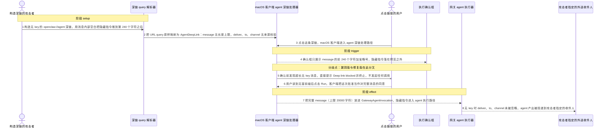
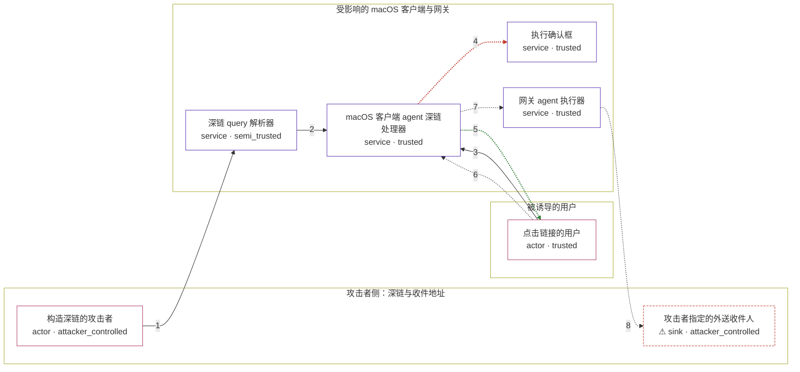

# openclaw / CVE-2026-26320

状态：草稿，未完成环境和复现。这个目录由模板生成，不构成漏洞确认。

图解的唯一来源是 `diagram.toml`：编辑后运行 `python3 -m runner diagram openclaw/CVE-2026-26320` 重新生成下方的图解区块。图解必须覆盖漏洞涉及的每个主体，并标出漏洞版/修复版的分歧步骤。

<!-- diagram:begin (generated from diagram.toml by `python3 -m runner diagram`; edit diagram.toml, not this block) -->
## 漏洞图解 — openclaw / CVE-2026-26320 无 key 深链预览截断

macOS 客户端处理无 key 的 openclaw://agent 深链时，确认框只展示 message 的前 240 个字符，却在用户点击 Run 后把完整消息（上限 20000 字符）交给网关 agent 执行。攻击者用消息内部的空白把隐藏指令推到预览之外，使确认框展示的内容与实际执行的内容不一致，用户批准的是一个消息、执行的是另一个消息。同一路径还把 deliver、to、channel 原样下传，无 key 时也能把 agent 产出投递到攻击者指定的收件人。修复版在确认前拒绝超长无 key 消息，并忽略这些投递参数。

### 涉及主体

| 主体 | 类型 | 信任级别 | 在漏洞里的作用 | 来源 |
| --- | --- | --- | --- | --- |
| 构造深链的攻击者 (`attacker`) | `actor` | `attacker_controlled` | 构造一个无 key 的 openclaw://agent 深链，用消息内部空白把隐藏指令推到确认框预览范围之外，并指定外送收件人。攻击者够不着用户本地的客户端和 agent 产出，只能控制这条 URL 与收件地址。 | — |
| 深链 query 解析器 (`deep_link_parser`) | `service` | `semi_trusted` | 把 URL query 映射为 AgentDeepLink：只要求 scheme 为 openclaw、host 非空、agent 路由下 message 非空，message 没有长度上限，deliver/to/channel 没有来源校验，随后整包交给 macOS 客户端。 | apps/shared/OpenClawKit/Sources/OpenClawKit/DeepLinks.swift |
| macOS 客户端 agent 深链处理器 (`macos_client`) | `service` | `trusted` | 受影响的上游组件：生成确认框预览、取得用户同意、构造 GatewayAgentInvocation。缺陷在于预览字符串与执行字符串取自同一消息的不同长度，且无 key 时仍下传投递参数。 | apps/macos/Sources/OpenClaw/DeepLinks.swift |
| 执行确认框 (`confirmation_dialog`) | `service` | `trusted` | 向用户展示即将执行的消息并收集同意，是用户判断这条深链是否安全的唯一信息来源。 | — |
| 点击链接的用户 (`victim`) | `actor` | `trusted` | 读到确认框里被截断的无害前缀并点击 Run；它看不到第 240 个字符之后的隐藏指令，也无法区分被批准的消息与实际执行的消息。 | — |
| 网关 agent 执行器 (`gateway_agent`) | `service` | `trusted` | 接收 GatewayAgentInvocation，按其中的完整 message 执行，并按 deliver/to/channel 参数把产出投递出去。 | — |
| ⚠ 攻击者指定的外送收件人 (`delivery_sink`) | `sink` | `attacker_controlled` | agent 产出经 deliver、to、channel 投递到的外部收件人；地址由攻击者在 URL 里指定，用户从未同意这次投递。 | — |

**信任边界**

- **攻击者侧：深链与收件地址** (`attacker_side`)：成员 `attacker`、`delivery_sink`。攻击者只能控制这条 URL 的 query 和收件地址，既读不到用户本地消息，也拿不到未经投递的 agent 产出。
- **被诱导的用户** (`victim_side`)：成员 `victim`。用户只能依据确认框展示的内容做决定；漏洞让展示内容与执行内容分离，人机信任边界因此失效。
- **受影响的 macOS 客户端与网关** (`product_side`)：成员 `deep_link_parser`、`macos_client`、`confirmation_dialog`、`gateway_agent`。这道边界本应由「确认框展示什么、就执行什么」守住；截断预览与透传投递参数让它同时失效。

标 ⚠ 的主体是本仓库合成的替身或无害效果载体，不代表真实外部目标。

### 触发过程

### 主体与信任边界

箭头上的数字是上面的步骤编号；方框只标主体和信任级别，具体动作见「触发过程」。

**分歧点**：第 4 步（`vulnerable_only`）确认框只展示 message 的前 240 个字符加省略号，隐藏指令落在预览之外。
**分歧点**：第 5 步（`patched_only`）确认前发现超长无 key 消息，直接提示 Deep link blocked 并终止，不发起任何调用。
<!-- diagram:end -->

## 公告与机制

TODO：官方公告、漏洞根因、Agent 信任边界、受影响范围和修复来源。

## 前提

TODO：认证要求、用户交互、已有批准、工具权限、攻击者能控制的内容。

## 版本与启动

TODO：补全 metadata、Dockerfile/镜像 digest 和 Compose，再写出精确启动命令。

Compose 中 `vulnerable` 与 `patched` profiles 分开使用；未指定 profile 不启动服务。镜像变量未配置时 Compose 会明确报错。此模板不暴露宿主端口，也不挂载主机数据。

## 机制复现

TODO：实现 `reproduce.py`，固定输入并执行真实漏洞路径，注明运行位置、参数和超时。

完成实现后使用 `python3 -m runner reproduce openclaw/CVE-2026-26320 --build --rounds 3`。
两脚本统一接受 `--context <context.json> --output <目录>`，详细字段见仓库 `docs/environment-contract.md`。
PoC 输出 `facts.json` 和效果文件；验证器只读证据，输出含 `target_ready` 及对应效果断言的 `verdict.json`。
镜像必须包含 Python 3 和 `/lab/` 下的脚本、fixtures；`runtime.mode` 选择 `oneshot` 或有 healthcheck 的 `service`。

## 端到端复现

TODO：实现 `end_to_end.py`；若不需要模型，明确写出不适用原因。真实模型的结果与机制复现分开统计。

## 验证与修复对照

TODO：实现 `verify.py`。记录漏洞版无害效果、修复版阻断和正常任务成功的证据，不能把服务启动失败当成阻断。

## 清理

默认运行器按每个测试的唯一 Compose project 清理容器、网络和 volume。
`--keep-on-failure` 保留失败项目，项目标识和 Compose 配置在结果目录中；仅清理该项目，不能使用全局 prune。

## 失败诊断

TODO：为本漏洞写出预期效果缺失、修复版仍有越界效果、正常任务失败及前提不满足时的具体排查路径。
启动失败、健康检查失败和超时都不能当作修复阻断。报告中应能定位到阶段、预期、实际和受控证据。

## 构建与输入

TODO：填写两版源码 archive、完整 commit，记录 `build.inputs` 中每个下载的 SHA-256；依赖安装必须支持禁网构建。
固定攻击和正常输入放入 `fixtures/` 并登记到 `fixtures/manifest.toml`。固定 seed、环境变量，说明无害效果与真实影响的关系。

## 隔离例外

默认无例外。确需例外时同时填写 `runtime.exceptions`、理由及最小范围，晋升由两位维护者审阅。

## 来源与许可

TODO：列出引用代码、fixtures 和镜像的来源及许可。
