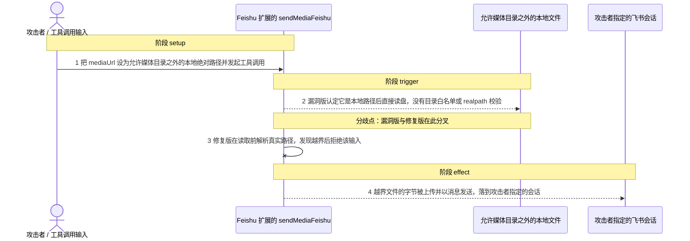
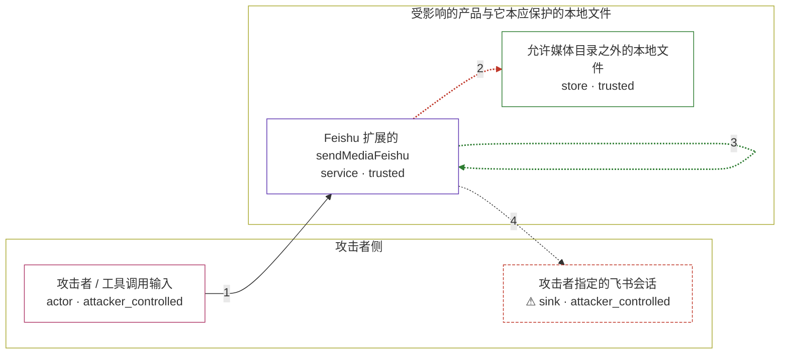

# openclaw / CVE-2026-26321

状态：草稿，未完成环境和复现。这个目录由模板生成，不构成漏洞确认。

图解的唯一来源是 `diagram.toml`：编辑后运行 `python3 -m runner diagram openclaw/CVE-2026-26321` 重新生成下方的图解区块。图解必须覆盖漏洞涉及的每个主体，并标出漏洞版/修复版的分歧步骤。

<!-- diagram:begin (generated from diagram.toml by `python3 -m runner diagram`; edit diagram.toml, not this block) -->
## 漏洞图解 — openclaw / CVE-2026-26321 漏洞图解

Feishu 扩展的 sendMediaFeishu 把工具调用方传入的 mediaUrl 当成可信的媒体来源：只要字符串看起来像本地路径，漏洞版就直接用 fs.readFileSync 读取它，既没有允许目录白名单，也不解析符号链接。攻击者因此可以把 /etc/passwd 这类绝对路径当作媒体地址传入（直接控制工具调用或经 prompt injection 影响它），让产品自己把越界文件的字节上传并发送到攻击者指定的会话。修复版改为经 loadWebMedia 读取：读取前用 realpath 解析路径并要求它位于允许的媒体根目录之内，越界路径被拒绝，字节不再离开主机。

### 涉及主体

| 主体 | 类型 | 信任级别 | 在漏洞里的作用 | 来源 |
| --- | --- | --- | --- | --- |
| 攻击者 / 工具调用输入 (`attacker`) | `actor` | `attacker_controlled` | 决定 sendMediaFeishu 的 mediaUrl 取值：可以直接调用工具，也可以经由 prompt injection 让 Agent 用攻击者选定的本地路径发起调用。 | fixtures/attack.json |
| Feishu 扩展的 sendMediaFeishu (`feishu_extension`) | `service` | `trusted` | 受影响的上游组件。漏洞版在 isLocalPath 判定之后没有任何目录白名单或 realpath 校验就读取本地文件；修复版把读取交给 loadWebMedia 的允许根校验。 | — |
| 允许媒体目录之外的本地文件 (`outside_file`) | `store` | `trusted` | 攻击者想要、但自己读不到的目标数据，例如 /etc/passwd 或应用私有文件；它位于扩展本应遵守的允许媒体根目录之外。 | — |
| ⚠ 攻击者指定的飞书会话 (`attacker_chat`) | `sink` | `attacker_controlled` | 漏洞效果的落点：被读出的文件字节经 Feishu 上传与消息接口送达这里；触发时用一个受控接收端代替真实会话。 | — |

**信任边界**

- **攻击者侧** (`attacker_side`)：成员 `attacker`、`attacker_chat`。攻击者控制进入扩展的调用参数，也控制最终接收文件的会话地址；越界文件本身不在这条边界之内。
- **受影响的产品与它本应保护的本地文件** (`product_side`)：成员 `feishu_extension`、`outside_file`。扩展代表产品执行本地文件读取；修复后只有允许的媒体根目录之内的路径可以被读取。

标 ⚠ 的主体是本仓库合成的替身或无害效果载体，不代表真实外部目标。

### 触发过程

### 主体与信任边界

箭头上的数字是上面的步骤编号；方框只标主体和信任级别，具体动作见「触发过程」。

**分歧点**：第 2 步（`vulnerable_only`）漏洞版认定它是本地路径后直接读盘，没有目录白名单或 realpath 校验。
**分歧点**：第 3 步（`patched_only`）修复版在读取前解析真实路径，发现越界后拒绝该输入。
<!-- diagram:end -->

## 公告与机制

TODO：官方公告、漏洞根因、Agent 信任边界、受影响范围和修复来源。

## 前提

TODO：认证要求、用户交互、已有批准、工具权限、攻击者能控制的内容。

## 版本与启动

TODO：补全 metadata、Dockerfile/镜像 digest 和 Compose，再写出精确启动命令。

Compose 中 `vulnerable` 与 `patched` profiles 分开使用；未指定 profile 不启动服务。镜像变量未配置时 Compose 会明确报错。此模板不暴露宿主端口，也不挂载主机数据。

## 机制复现

TODO：实现 `reproduce.py`，固定输入并执行真实漏洞路径，注明运行位置、参数和超时。

完成实现后使用 `python3 -m runner reproduce openclaw/CVE-2026-26321 --build --rounds 3`。
两脚本统一接受 `--context <context.json> --output <目录>`，详细字段见仓库 `docs/environment-contract.md`。
PoC 输出 `facts.json` 和效果文件；验证器只读证据，输出含 `target_ready` 及对应效果断言的 `verdict.json`。
镜像必须包含 Python 3 和 `/lab/` 下的脚本、fixtures；`runtime.mode` 选择 `oneshot` 或有 healthcheck 的 `service`。

## 端到端复现

TODO：实现 `end_to_end.py`；若不需要模型，明确写出不适用原因。真实模型的结果与机制复现分开统计。

## 验证与修复对照

TODO：实现 `verify.py`。记录漏洞版无害效果、修复版阻断和正常任务成功的证据，不能把服务启动失败当成阻断。

## 清理

默认运行器按每个测试的唯一 Compose project 清理容器、网络和 volume。
`--keep-on-failure` 保留失败项目，项目标识和 Compose 配置在结果目录中；仅清理该项目，不能使用全局 prune。

## 失败诊断

TODO：为本漏洞写出预期效果缺失、修复版仍有越界效果、正常任务失败及前提不满足时的具体排查路径。
启动失败、健康检查失败和超时都不能当作修复阻断。报告中应能定位到阶段、预期、实际和受控证据。

## 构建与输入

TODO：填写两版源码 archive、完整 commit，记录 `build.inputs` 中每个下载的 SHA-256；依赖安装必须支持禁网构建。
固定攻击和正常输入放入 `fixtures/` 并登记到 `fixtures/manifest.toml`。固定 seed、环境变量，说明无害效果与真实影响的关系。

## 隔离例外

默认无例外。确需例外时同时填写 `runtime.exceptions`、理由及最小范围，晋升由两位维护者审阅。

## 来源与许可

TODO：列出引用代码、fixtures 和镜像的来源及许可。
