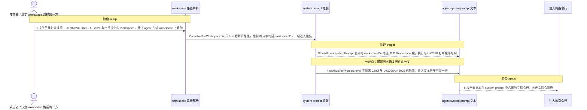

# openclaw / CVE-2026-27001

状态：草稿，未完成环境和复现。这个目录由模板生成，不构成漏洞确认。

图解的唯一来源是 `diagram.toml`：编辑后运行 `python3 -m runner diagram openclaw/CVE-2026-27001` 重新生成下方的图解区块。图解必须覆盖漏洞涉及的每个主体，并标出漏洞版/修复版的分歧步骤。

<!-- diagram:begin (generated from diagram.toml by `python3 -m runner diagram`; edit diagram.toml, not this block) -->
## 漏洞图解 — openclaw workspace 路径未净化导致 system prompt 注入

openclaw 组装 agent system prompt 时把 workspace 路径直接模板插值进 ## Workspace 段落，路径只经过 trim，控制类（Cc）与格式类（Cf）字符没有被剥离。攻击者影响的目录名或 agents.*.workspace 配置里只要带换行、U+2028/U+2029 或 U+202E，就能打断段落结构，让自己的文本与产品指令同级地进入模型指令通道。修复版在插值前调用 sanitizeForPromptLiteral 剥离这些字符，注入行不再成立。

### 涉及主体

| 主体 | 类型 | 信任级别 | 在漏洞里的作用 | 来源 |
| --- | --- | --- | --- | --- |
| 攻击者 / 决定 workspace 路径的一方 (`attacker`) | `actor` | `attacker_controlled` | 决定 agent 运行所用的 workspace 路径字符串（目录名或 agents.*.workspace 配置），在其中嵌入换行、U+2028/U+2029、U+202E 和一行自造指令。 | — |
| workspace 路径解析 (`workspace_resolver`) | `service` | `trusted` | 上游 src/agents/workspace-run.ts 的 resolveRunWorkspaceDir：对字符串入参只做 trim 与 resolveUserPath，不剥离控制/格式字符，随后把 workspaceDir 交给 prompt 组装。 | — |
| system prompt 组装 (`prompt_builder`) | `service` | `trusted` | 上游 src/agents/system-prompt.ts 的 buildAgentSystemPrompt：把 workspaceDir 直接插值进 ## Workspace 段落，段落结构决定其中哪些文本被模型当作顶层指令。 | — |
| agent system prompt 文本 (`system_prompt`) | `store` | `trusted` | 组装结果，作为模型的系统指令通道提交给模型后端。 | — |
| ⚠ 注入的指令行 (`injected_directive`) | `sink` | `attacker_controlled` | 漏洞版把攻击者文本抬升为与产品指令同级的独立行；这里承载的是攻击者自造的无害 canary 文本，不是真实外部目标，也不表示模型已经执行了它。 | — |

**信任边界**

- **攻击者侧** (`attacker_side`)：成员 `attacker`。攻击者只能影响 workspace 路径字符串；它不能改写上游源码，也不能直接决定模型最终行为。
- **路径解析与提示组装** (`prompt_pipeline`)：成员 `workspace_resolver`、`prompt_builder`、`system_prompt`、`injected_directive`。这条链路本应把 workspace 路径当作纯数据插入；漏洞版没有净化，路径里的控制/格式字符因此获得了结构意义。

标 ⚠ 的主体是本仓库合成的替身或无害效果载体，不代表真实外部目标。

### 触发过程

### 主体与信任边界

箭头上的数字是上面的步骤编号；方框只标主体和信任级别，具体动作见「触发过程」。

```mermaid
%% openclaw workspace 路径未净化导致 system prompt 注入 — generated from diagram.toml
flowchart LR
  subgraph attacker_side["攻击者侧"]
    attacker["攻击者 / 决定 workspace 路径的一方<br/>actor · attacker_controlled"]
  end
  subgraph prompt_pipeline["路径解析与提示组装"]
    workspace_resolver["workspace 路径解析<br/>service · trusted"]
    prompt_builder["system prompt 组装<br/>service · trusted"]
    system_prompt["agent system prompt 文本<br/>store · trusted"]
    injected_directive["注入的指令行<br/>⚠ sink · attacker_controlled"]
  end
  attacker -->|"1"| workspace_resolver
  workspace_resolver -->|"2"| prompt_builder
  prompt_builder -.->|"3"| system_prompt
  prompt_builder -.->|"4"| system_prompt
  system_prompt -.->|"5"| injected_directive
  classDef actor fill:transparent,stroke:#b03a6a
  classDef client fill:transparent,stroke:#1565c0
  classDef service fill:transparent,stroke:#5e35b1
  classDef tool fill:transparent,stroke:#ef6c00
  classDef sink fill:transparent,stroke:#c0392b
  classDef store fill:transparent,stroke:#2e7d32
  classDef synthetic stroke-dasharray: 4 2
  class attacker actor
  class workspace_resolver service
  class prompt_builder service
  class system_prompt store
  class injected_directive sink
  class injected_directive synthetic
  style attacker_side fill:transparent
  style prompt_pipeline fill:transparent
  linkStyle 2 stroke:#c0392b,stroke-width:2px
  linkStyle 3 stroke:#2e7d32,stroke-width:2px
```

**分歧点**：第 3 步（`vulnerable_only`）buildAgentSystemPrompt 直接把 workspaceDir 插进 ## Workspace 段，换行与 U+2028 打断段落结构。
**分歧点**：第 4 步（`patched_only`）sanitizeForPromptLiteral 先剥离 Cc/Cf 与 U+2028/U+2029 再插值，注入文本被压回同一行。
<!-- diagram:end -->

## 公告与机制

TODO：官方公告、漏洞根因、Agent 信任边界、受影响范围和修复来源。

## 前提

TODO：认证要求、用户交互、已有批准、工具权限、攻击者能控制的内容。

## 版本与启动

TODO：补全 metadata、Dockerfile/镜像 digest 和 Compose，再写出精确启动命令。

Compose 中 `vulnerable` 与 `patched` profiles 分开使用；未指定 profile 不启动服务。镜像变量未配置时 Compose 会明确报错。此模板不暴露宿主端口，也不挂载主机数据。

## 机制复现

TODO：实现 `reproduce.py`，固定输入并执行真实漏洞路径，注明运行位置、参数和超时。

完成实现后使用 `python3 -m runner reproduce openclaw/CVE-2026-27001 --build --rounds 3`。
两脚本统一接受 `--context <context.json> --output <目录>`，详细字段见仓库 `docs/environment-contract.md`。
PoC 输出 `facts.json` 和效果文件；验证器只读证据，输出含 `target_ready` 及对应效果断言的 `verdict.json`。
镜像必须包含 Python 3 和 `/lab/` 下的脚本、fixtures；`runtime.mode` 选择 `oneshot` 或有 healthcheck 的 `service`。

## 端到端复现

TODO：实现 `end_to_end.py`；若不需要模型，明确写出不适用原因。真实模型的结果与机制复现分开统计。

## 验证与修复对照

TODO：实现 `verify.py`。记录漏洞版无害效果、修复版阻断和正常任务成功的证据，不能把服务启动失败当成阻断。

## 清理

默认运行器按每个测试的唯一 Compose project 清理容器、网络和 volume。
`--keep-on-failure` 保留失败项目，项目标识和 Compose 配置在结果目录中；仅清理该项目，不能使用全局 prune。

## 失败诊断

TODO：为本漏洞写出预期效果缺失、修复版仍有越界效果、正常任务失败及前提不满足时的具体排查路径。
启动失败、健康检查失败和超时都不能当作修复阻断。报告中应能定位到阶段、预期、实际和受控证据。

## 构建与输入

TODO：填写两版源码 archive、完整 commit，记录 `build.inputs` 中每个下载的 SHA-256；依赖安装必须支持禁网构建。
固定攻击和正常输入放入 `fixtures/` 并登记到 `fixtures/manifest.toml`。固定 seed、环境变量，说明无害效果与真实影响的关系。

## 隔离例外

默认无例外。确需例外时同时填写 `runtime.exceptions`、理由及最小范围，晋升由两位维护者审阅。

## 来源与许可

TODO：列出引用代码、fixtures 和镜像的来源及许可。
