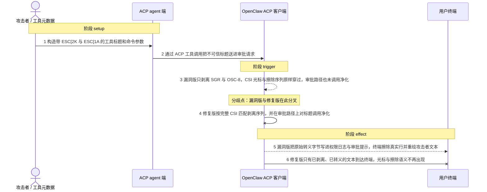
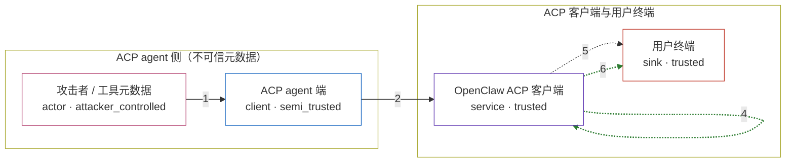

# openclaw / CVE-2026-35651

状态：草稿，未完成环境和复现。这个目录由模板生成，不构成漏洞确认。

图解的唯一来源是 `diagram.toml`：编辑后运行 `python3 -m runner diagram openclaw/CVE-2026-35651` 重新生成下方的图解区块。图解必须覆盖漏洞涉及的每个主体，并标出漏洞版/修复版的分歧步骤。

<!-- diagram:begin (generated from diagram.toml by `python3 -m runner diagram`; edit diagram.toml, not this block) -->
## 漏洞图解 — openclaw / CVE-2026-35651 ACP 审批提示 ANSI 转义序列注入

OpenClaw ACP 客户端把不可信的工具标题直接拼进权限日志与审批提示，而共享的 stripAnsi 只匹配 SGR 与 OSC-8，ESC[2K（擦除整行）和 ESC[1A（光标上移）等 CSI 序列原样穿过。于是 ACP agent 端提供的 toolCall.title 在用户终端里被当作控制指令执行，真实审批行被擦除并用攻击者文本重绘。这是显示完整性缺陷：用户可能对着伪造的提示行授权另一个工具，而不是代码执行。

### 涉及主体

| 主体 | 类型 | 信任级别 | 在漏洞里的作用 | 来源 |
| --- | --- | --- | --- | --- |
| 攻击者 / 工具元数据 (`attacker`) | `actor` | `attacker_controlled` | 决定 ACP agent 上报的工具标题与参数。它只能控制这一次工具调用里的标题文本，不能直接写用户终端。 | fixtures/attack_permission_request.json |
| ACP agent 端 (`acp_agent`) | `client` | `semi_trusted` | 把不可信的工具元数据（toolCall.title 与 rawInput）经 ACP 会话送进客户端的审批流程。 | — |
| OpenClaw ACP 客户端 (`acp_client`) | `service` | `trusted` | 上游受影响组件：formatToolTitle 直接拼接参数，stripAnsi 只认 SGR 与 OSC-8，审批路径也不对标题做净化，最终把原始字节写到 stderr。 | — |
| 用户终端 (`terminal`) | `sink` | `trusted` | 审批提示与权限日志的显示落点。CSI 序列在这里被解释，可以擦除行、移动光标并重绘真实提示。 | — |

**信任边界**

- **ACP agent 侧（不可信元数据）** (`agent_side`)：成员 `attacker`、`acp_agent`。工具标题与参数由 agent 侧决定，客户端无法假定其中只有可打印字符；这里的输入是攻击者唯一能控制的东西。
- **ACP 客户端与用户终端** (`client_side`)：成员 `acp_client`、`terminal`。这道边界本应保证只有可显示的文本到达终端；漏洞让控制序列穿过净化，终端的擦除与光标语义因此被攻击者借用。

### 触发过程

### 主体与信任边界

箭头上的数字是上面的步骤编号；方框只标主体和信任级别，具体动作见「触发过程」。

**分歧点**：第 3 步（`vulnerable_only`）漏洞版只剥离 SGR 与 OSC-8，CSI 光标与擦除序列原样穿过，审批路径也未调用净化。
**分歧点**：第 4 步（`patched_only`）修复版按完整 CSI 匹配剥离序列，并在审批路径上对标题调用净化。
<!-- diagram:end -->

## 公告与机制

TODO：官方公告、漏洞根因、Agent 信任边界、受影响范围和修复来源。

## 前提

TODO：认证要求、用户交互、已有批准、工具权限、攻击者能控制的内容。

## 版本与启动

TODO：补全 metadata、Dockerfile/镜像 digest 和 Compose，再写出精确启动命令。

Compose 中 `vulnerable` 与 `patched` profiles 分开使用；未指定 profile 不启动服务。镜像变量未配置时 Compose 会明确报错。此模板不暴露宿主端口，也不挂载主机数据。

## 机制复现

TODO：实现 `reproduce.py`，固定输入并执行真实漏洞路径，注明运行位置、参数和超时。

完成实现后使用 `python3 -m runner reproduce openclaw/CVE-2026-35651 --build --rounds 3`。
两脚本统一接受 `--context <context.json> --output <目录>`，详细字段见仓库 `docs/environment-contract.md`。
PoC 输出 `facts.json` 和效果文件；验证器只读证据，输出含 `target_ready` 及对应效果断言的 `verdict.json`。
镜像必须包含 Python 3 和 `/lab/` 下的脚本、fixtures；`runtime.mode` 选择 `oneshot` 或有 healthcheck 的 `service`。

## 端到端复现

TODO：实现 `end_to_end.py`；若不需要模型，明确写出不适用原因。真实模型的结果与机制复现分开统计。

## 验证与修复对照

TODO：实现 `verify.py`。记录漏洞版无害效果、修复版阻断和正常任务成功的证据，不能把服务启动失败当成阻断。

## 清理

默认运行器按每个测试的唯一 Compose project 清理容器、网络和 volume。
`--keep-on-failure` 保留失败项目，项目标识和 Compose 配置在结果目录中；仅清理该项目，不能使用全局 prune。

## 失败诊断

TODO：为本漏洞写出预期效果缺失、修复版仍有越界效果、正常任务失败及前提不满足时的具体排查路径。
启动失败、健康检查失败和超时都不能当作修复阻断。报告中应能定位到阶段、预期、实际和受控证据。

## 构建与输入

TODO：填写两版源码 archive、完整 commit，记录 `build.inputs` 中每个下载的 SHA-256；依赖安装必须支持禁网构建。
固定攻击和正常输入放入 `fixtures/` 并登记到 `fixtures/manifest.toml`。固定 seed、环境变量，说明无害效果与真实影响的关系。

## 隔离例外

默认无例外。确需例外时同时填写 `runtime.exceptions`、理由及最小范围，晋升由两位维护者审阅。

## 来源与许可

TODO：列出引用代码、fixtures 和镜像的来源及许可。
