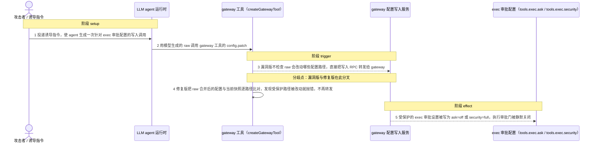
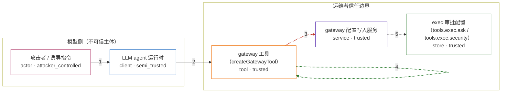

# openclaw / CVE-2026-41349

状态：草稿，未完成环境和复现。这个目录由模板生成，不构成漏洞确认。

图解的唯一来源是 `diagram.toml`：编辑后运行 `python3 -m runner diagram openclaw/CVE-2026-41349` 重新生成下方的图解区块。图解必须覆盖漏洞涉及的每个主体，并标出漏洞版/修复版的分歧步骤。

<!-- diagram:begin (generated from diagram.toml by `python3 -m runner diagram`; edit diagram.toml, not this block) -->
## 漏洞图解 — openclaw / CVE-2026-41349 漏洞图解

OpenClaw 的 gateway 工具把模型生成的 raw 配置写请求直接转发给 gateway 的 config.apply / config.patch，转发前不校验这次写入会改动哪些配置路径。于是 agent 可以用 config.patch 或 config.apply 改写受保护的 tools.exec.ask 与 tools.exec.security，跨过模型到运维者之间的审批边界，把面向主机命令执行的审批门静默关闭。修复版在转发前把 raw 合并后的配置与当前快照逐路径比对，只要受保护路径发生变化就抛错并拒绝转发。

### 涉及主体

| 主体 | 类型 | 信任级别 | 在漏洞里的作用 | 来源 |
| --- | --- | --- | --- | --- |
| 攻击者 / 诱导指令 (`attacker`) | `actor` | `attacker_controlled` | 构造让模型调用 gateway 工具的指令。它自己拿不到 gateway 的配置写权限，只能决定模型输出的 tool call 内容（例如把 raw 指向 tools.exec.ask）。 | — |
| LLM agent 运行时 (`agent`) | `client` | `semi_trusted` | 把模型输出变成 gateway 工具的调用参数。它持有 agent 会话，但按上游威胁模型不是可信主体，因此它转发的 raw 不能被当作运维者的意图。 | — |
| gateway 工具（createGatewayTool） (`gateway_tool`) | `tool` | `trusted` | 受影响的上游组件。漏洞版在这里解析 raw 并直接转发写 RPC，缺少「哪些配置路径允许被模型改写」的授权校验；修复版在这里比对受保护路径并拒绝改动。 | fixtures/upstream/gateway-tool-v2026.3.24.ts |
| gateway 配置写入服务 (`gateway_config`) | `service` | `trusted` | 接收 config.apply / config.patch 并把结果落到配置存储。它本身按 RPC 语义执行写入，授权判断本应在 gateway 工具转发之前完成。 | — |
| exec 审批配置（tools.exec.ask / tools.exec.security） (`exec_approval`) | `store` | `trusted` | 面向主机命令执行的人工审批策略与安全模式，是模型到运维者这道边界上的开关。攻击者想改它却够不着，漏洞让它被模型驱动的写入改掉。 | fixtures/requests/gateway-config-get-response.json |

**信任边界**

- **模型侧（不可信主体）** (`model_side`)：成员 `attacker`、`agent`。模型输出及其诱导来源都在这一侧：攻击者只能影响模型给出什么 tool call，agent 只能转达它，二者都无权决定运维者的执行审批策略。
- **运维者信任边界** (`operator_side`)：成员 `gateway_tool`、`gateway_config`、`exec_approval`。这道边界本来要保证只有运维者能改 tools.exec.ask / tools.exec.security。漏洞版让模型生成的 raw 穿过 gateway 工具直达配置写入，边界因此失效。

### 触发过程

### 主体与信任边界

箭头上的数字是上面的步骤编号；方框只标主体和信任级别，具体动作见「触发过程」。

**分歧点**：第 3 步（`vulnerable_only`）漏洞版不检查 raw 会改动哪些配置路径，直接把写入 RPC 转发给 gateway。
**分歧点**：第 4 步（`patched_only`）修复版把 raw 合并后的配置与当前快照逐路径比对，发现受保护路径被改动就抛错，不再转发。
<!-- diagram:end -->

## 公告与机制

TODO：官方公告、漏洞根因、Agent 信任边界、受影响范围和修复来源。

## 前提

TODO：认证要求、用户交互、已有批准、工具权限、攻击者能控制的内容。

## 版本与启动

TODO：补全 metadata、Dockerfile/镜像 digest 和 Compose，再写出精确启动命令。

Compose 中 `vulnerable` 与 `patched` profiles 分开使用；未指定 profile 不启动服务。镜像变量未配置时 Compose 会明确报错。此模板不暴露宿主端口，也不挂载主机数据。

## 机制复现

TODO：实现 `reproduce.py`，固定输入并执行真实漏洞路径，注明运行位置、参数和超时。

完成实现后使用 `python3 -m runner reproduce openclaw/CVE-2026-41349 --build --rounds 3`。
两脚本统一接受 `--context <context.json> --output <目录>`，详细字段见仓库 `docs/environment-contract.md`。
PoC 输出 `facts.json` 和效果文件；验证器只读证据，输出含 `target_ready` 及对应效果断言的 `verdict.json`。
镜像必须包含 Python 3 和 `/lab/` 下的脚本、fixtures；`runtime.mode` 选择 `oneshot` 或有 healthcheck 的 `service`。

## 端到端复现

TODO：实现 `end_to_end.py`；若不需要模型，明确写出不适用原因。真实模型的结果与机制复现分开统计。

## 验证与修复对照

TODO：实现 `verify.py`。记录漏洞版无害效果、修复版阻断和正常任务成功的证据，不能把服务启动失败当成阻断。

## 清理

默认运行器按每个测试的唯一 Compose project 清理容器、网络和 volume。
`--keep-on-failure` 保留失败项目，项目标识和 Compose 配置在结果目录中；仅清理该项目，不能使用全局 prune。

## 失败诊断

TODO：为本漏洞写出预期效果缺失、修复版仍有越界效果、正常任务失败及前提不满足时的具体排查路径。
启动失败、健康检查失败和超时都不能当作修复阻断。报告中应能定位到阶段、预期、实际和受控证据。

## 构建与输入

TODO：填写两版源码 archive、完整 commit，记录 `build.inputs` 中每个下载的 SHA-256；依赖安装必须支持禁网构建。
固定攻击和正常输入放入 `fixtures/` 并登记到 `fixtures/manifest.toml`。固定 seed、环境变量，说明无害效果与真实影响的关系。

## 隔离例外

默认无例外。确需例外时同时填写 `runtime.exceptions`、理由及最小范围，晋升由两位维护者审阅。

## 来源与许可

TODO：列出引用代码、fixtures 和镜像的来源及许可。
