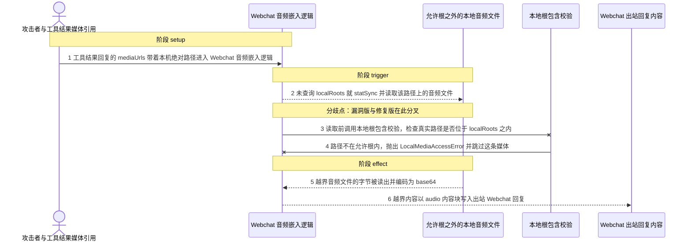
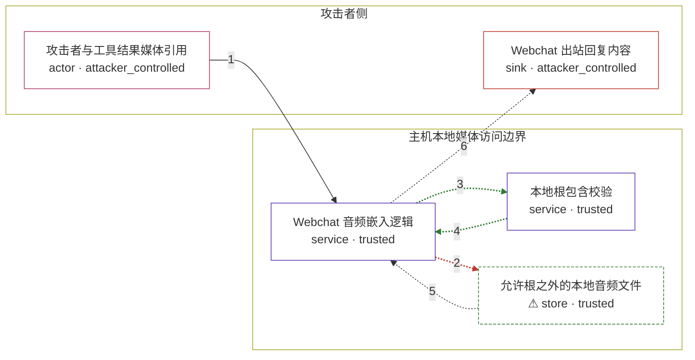

# openclaw / CVE-2026-41389

状态：草稿，未完成环境和复现。这个目录由模板生成，不构成漏洞确认。

图解的唯一来源是 `diagram.toml`：编辑后运行 `python3 -m runner diagram openclaw/CVE-2026-41389` 重新生成下方的图解区块。图解必须覆盖漏洞涉及的每个主体，并标出漏洞版/修复版的分歧步骤。

<!-- diagram:begin (generated from diagram.toml by `python3 -m runner diagram`; edit diagram.toml, not this block) -->
## 漏洞图解 — openclaw / CVE-2026-41389 Webchat 媒体嵌入绕过本地根限制

Webchat 的音频嵌入逻辑把回复负载里的 mediaUrls 直接当作本地可读路径：漏洞版只按音频扩展名筛选，随后 statSync 与 readFileSync 读取该文件，完全跳过了配置的 localRoots 本地根包含校验。修复版在读取前调用包含校验，路径不在允许根内时抛出 LocalMediaAccessError 并跳过该媒体。同一条越界路径因此只在漏洞版被读出，并以 base64 音频块回显到出站回复。

### 涉及主体

| 主体 | 类型 | 信任级别 | 在漏洞里的作用 | 来源 |
| --- | --- | --- | --- | --- |
| 攻击者与工具结果媒体引用 (`attacker`) | `actor` | `attacker_controlled` | 在工具结果回复的 mediaUrls 里放入目标主机的绝对路径，并挑选扩展名为音频、位于允许根之外的文件作为读取目标。攻击者只能决定这个路径字符串，读不到路径背后的内容。 | fixtures/attack/reply-payload.json |
| Webchat 音频嵌入逻辑 (`webchat_embedder`) | `service` | `trusted` | 把回复负载里的 mediaUrls 解析成本地路径、按音频扩展名筛选、再读取文件内容并编码为内容块。漏洞版在这里跳过了本地根包含校验。 | src/gateway/server-methods/chat-webchat-media.ts |
| 本地根包含校验 (`local_roots_guard`) | `service` | `trusted` | 读取前按配置的 localRoots 校验目标真实路径是否位于允许根之内，越界时抛出 LocalMediaAccessError。修复版在读取前调用它。 | — |
| ⚠ 允许根之外的本地音频文件 (`protected_audio`) | `store` | `trusted` | 攻击者想读取却无法直接访问的主机文件；扩展名是音频，因此能通过音频筛选。此处以合成 marker 文件代表该读取目标。 | fixtures/protected/out-of-root-voice.mp3 |
| Webchat 出站回复内容 (`webchat_reply`) | `sink` | `attacker_controlled` | 越界读到的文件字节以 base64 音频块出现在出站回复里，随 webchat 会话返回给发起该负载的一方。 | — |

**信任边界**

- **攻击者侧** (`attacker_side`)：成员 `attacker`、`webchat_reply`。攻击者控制回复负载的 mediaUrls 取值，也在这里收到出站回复；它并不拥有允许根之外文件系统的读权限。
- **主机本地媒体访问边界** (`local_host`)：成员 `webchat_embedder`、`local_roots_guard`、`protected_audio`。配置的 localRoots 之外的本地文件不应被媒体嵌入路径读取，这道边界由包含校验维持；漏洞版在读取前没有调用它。

标 ⚠ 的主体是本仓库合成的替身或无害效果载体，不代表真实外部目标。

### 触发过程

### 主体与信任边界

箭头上的数字是上面的步骤编号；方框只标主体和信任级别，具体动作见「触发过程」。

**分歧点**：第 2 步（`vulnerable_only`）未查询 localRoots 就 statSync 并读取该路径上的音频文件。
**分歧点**：第 3 步（`patched_only`）读取前调用本地根包含校验，检查真实路径是否位于 localRoots 之内。
<!-- diagram:end -->

## 公告与机制

TODO：官方公告、漏洞根因、Agent 信任边界、受影响范围和修复来源。

## 前提

TODO：认证要求、用户交互、已有批准、工具权限、攻击者能控制的内容。

## 版本与启动

TODO：补全 metadata、Dockerfile/镜像 digest 和 Compose，再写出精确启动命令。

Compose 中 `vulnerable` 与 `patched` profiles 分开使用；未指定 profile 不启动服务。镜像变量未配置时 Compose 会明确报错。此模板不暴露宿主端口，也不挂载主机数据。

## 机制复现

TODO：实现 `reproduce.py`，固定输入并执行真实漏洞路径，注明运行位置、参数和超时。

完成实现后使用 `python3 -m runner reproduce openclaw/CVE-2026-41389 --build --rounds 3`。
两脚本统一接受 `--context <context.json> --output <目录>`，详细字段见仓库 `docs/environment-contract.md`。
PoC 输出 `facts.json` 和效果文件；验证器只读证据，输出含 `target_ready` 及对应效果断言的 `verdict.json`。
镜像必须包含 Python 3 和 `/lab/` 下的脚本、fixtures；`runtime.mode` 选择 `oneshot` 或有 healthcheck 的 `service`。

## 端到端复现

TODO：实现 `end_to_end.py`；若不需要模型，明确写出不适用原因。真实模型的结果与机制复现分开统计。

## 验证与修复对照

TODO：实现 `verify.py`。记录漏洞版无害效果、修复版阻断和正常任务成功的证据，不能把服务启动失败当成阻断。

## 清理

默认运行器按每个测试的唯一 Compose project 清理容器、网络和 volume。
`--keep-on-failure` 保留失败项目，项目标识和 Compose 配置在结果目录中；仅清理该项目，不能使用全局 prune。

## 失败诊断

TODO：为本漏洞写出预期效果缺失、修复版仍有越界效果、正常任务失败及前提不满足时的具体排查路径。
启动失败、健康检查失败和超时都不能当作修复阻断。报告中应能定位到阶段、预期、实际和受控证据。

## 构建与输入

TODO：填写两版源码 archive、完整 commit，记录 `build.inputs` 中每个下载的 SHA-256；依赖安装必须支持禁网构建。
固定攻击和正常输入放入 `fixtures/` 并登记到 `fixtures/manifest.toml`。固定 seed、环境变量，说明无害效果与真实影响的关系。

## 隔离例外

默认无例外。确需例外时同时填写 `runtime.exceptions`、理由及最小范围，晋升由两位维护者审阅。

## 来源与许可

TODO：列出引用代码、fixtures 和镜像的来源及许可。
