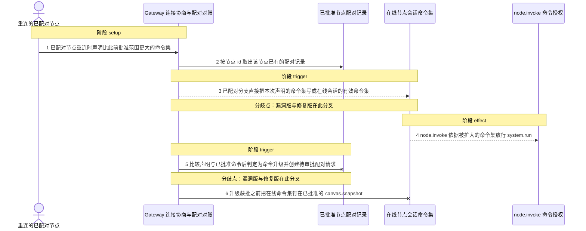
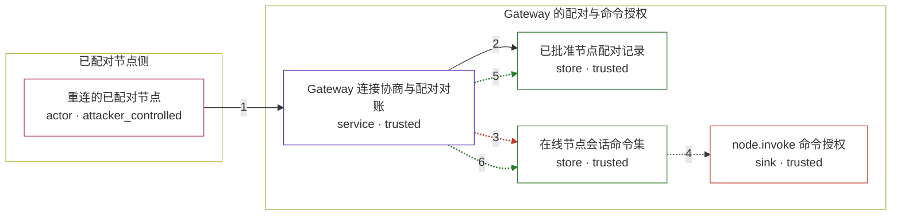

# openclaw / CVE-2026-42432

状态：草稿，未完成环境和复现。这个目录由模板生成，不构成漏洞确认。

图解的唯一来源是 `diagram.toml`：编辑后运行 `python3 -m runner diagram openclaw/CVE-2026-42432` 重新生成下方的图解区块。图解必须覆盖漏洞涉及的每个主体，并标出漏洞版/修复版的分歧步骤。

<!-- diagram:begin (generated from diagram.toml by `python3 -m runner diagram`; edit diagram.toml, not this block) -->
## 漏洞图解 — openclaw / CVE-2026-42432 漏洞图解

已配对的 node 重连时，Gateway 只把本次连接声明的命令按平台 allowlist 归一化，漏洞版在“已有配对记录”的分支里直接采用这份声明，完全不与会话中此前获批的命令集比较：一个只获批 canvas.snapshot 的 node 重连声明 system.run 后，exec-capable 命令被静默写进在线会话的有效命令集，node.invoke 随之放行，本应触发的 operator.admin 重新审批从未发生。修复版改为用配对记录中已批准的命令做归一化并检测命令升级，命中后创建需要 operator.admin 的待审批配对请求，并在获批之前把在线会话钉在旧的已批准命令集上。

### 涉及主体

| 主体 | 类型 | 信任级别 | 在漏洞里的作用 | 来源 |
| --- | --- | --- | --- | --- |
| 重连的已配对节点 (`attacker`) | `actor` | `attacker_controlled` | 曾经获批的 node 重新连接，并在 connect 帧里声明比先前批准范围更大的命令集（含 system.run）。它只能控制这次连接声明的内容，不能改写配对记录、allowlist 或审批流程。 | fixtures/attack.json |
| Gateway 连接协商与配对对账 (`gateway`) | `service` | `trusted` | 受影响的上游组件：connect 处理链先按平台 allowlist 归一化声明命令，再依据是否存在配对记录决定在线会话的有效命令集，以及是否需要重新走配对审批。 | src/gateway/node-connect-reconcile.ts |
| 已批准节点配对记录 (`pairing_record`) | `store` | `trusted` | Gateway 持久化的节点配对记录，保存该节点此前获批的命令集。漏洞版在已配对分支从不读取其中的命令，修复版用它判断本次声明是否发生命令升级。 | src/infra/node-pairing.ts |
| 在线节点会话命令集 (`node_session`) | `store` | `trusted` | 在线会话的有效命令集，由连接协商的返回值写入，node.invoke 的命令授权直接读取它。 | src/gateway/server/ws-connection/message-handler.ts |
| node.invoke 命令授权 (`invoke_authz`) | `sink` | `trusted` | node.invoke 对 system.run 这类 exec-capable 命令的授权结果：在线会话命令集被静默扩大后，对 host exec 的调用会被放行。 | src/gateway/server-methods/nodes.ts |

**信任边界**

- **已配对节点侧** (`node_side`)：成员 `attacker`。攻击者只能控制自己这次重连连接声明的内容；配对记录、命令 allowlist 与审批 scope 都在边界另一侧，它无法修改。
- **Gateway 的配对与命令授权** (`gateway_side`)：成员 `gateway`、`pairing_record`、`node_session`、`invoke_authz`。这道边界要求已配对节点的能力不得超出此前获批的命令集：扩大命令集必须重新生成配对请求，并由持有 operator.admin 的操作者批准。漏洞版在重连路径上没有执行这项比较。

### 触发过程

### 主体与信任边界

箭头上的数字是上面的步骤编号；方框只标主体和信任级别，具体动作见「触发过程」。

**分歧点**：第 3 步（`vulnerable_only`）已配对分支直接把本次声明的命令集写成在线会话的有效命令集。
**分歧点**：第 5 步（`patched_only`）比较声明与已批准命令后判定为命令升级并创建待审批配对请求。
<!-- diagram:end -->

## 公告与机制

TODO：官方公告、漏洞根因、Agent 信任边界、受影响范围和修复来源。

## 前提

TODO：认证要求、用户交互、已有批准、工具权限、攻击者能控制的内容。

## 版本与启动

TODO：补全 metadata、Dockerfile/镜像 digest 和 Compose，再写出精确启动命令。

Compose 中 `vulnerable` 与 `patched` profiles 分开使用；未指定 profile 不启动服务。镜像变量未配置时 Compose 会明确报错。此模板不暴露宿主端口，也不挂载主机数据。

## 机制复现

TODO：实现 `reproduce.py`，固定输入并执行真实漏洞路径，注明运行位置、参数和超时。

完成实现后使用 `python3 -m runner reproduce openclaw/CVE-2026-42432 --build --rounds 3`。
两脚本统一接受 `--context <context.json> --output <目录>`，详细字段见仓库 `docs/environment-contract.md`。
PoC 输出 `facts.json` 和效果文件；验证器只读证据，输出含 `target_ready` 及对应效果断言的 `verdict.json`。
镜像必须包含 Python 3 和 `/lab/` 下的脚本、fixtures；`runtime.mode` 选择 `oneshot` 或有 healthcheck 的 `service`。

## 端到端复现

TODO：实现 `end_to_end.py`；若不需要模型，明确写出不适用原因。真实模型的结果与机制复现分开统计。

## 验证与修复对照

TODO：实现 `verify.py`。记录漏洞版无害效果、修复版阻断和正常任务成功的证据，不能把服务启动失败当成阻断。

## 清理

默认运行器按每个测试的唯一 Compose project 清理容器、网络和 volume。
`--keep-on-failure` 保留失败项目，项目标识和 Compose 配置在结果目录中；仅清理该项目，不能使用全局 prune。

## 失败诊断

TODO：为本漏洞写出预期效果缺失、修复版仍有越界效果、正常任务失败及前提不满足时的具体排查路径。
启动失败、健康检查失败和超时都不能当作修复阻断。报告中应能定位到阶段、预期、实际和受控证据。

## 构建与输入

TODO：填写两版源码 archive、完整 commit，记录 `build.inputs` 中每个下载的 SHA-256；依赖安装必须支持禁网构建。
固定攻击和正常输入放入 `fixtures/` 并登记到 `fixtures/manifest.toml`。固定 seed、环境变量，说明无害效果与真实影响的关系。

## 隔离例外

默认无例外。确需例外时同时填写 `runtime.exceptions`、理由及最小范围，晋升由两位维护者审阅。

## 来源与许可

TODO：列出引用代码、fixtures 和镜像的来源及许可。
