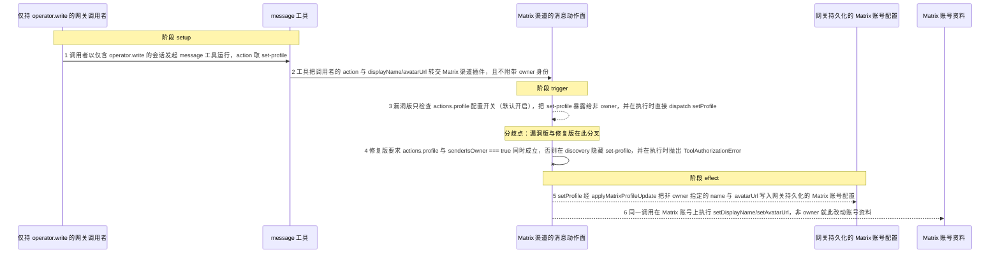
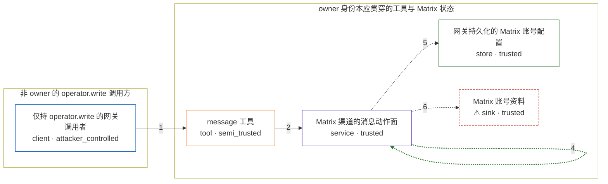

# openclaw / CVE-2026-42433

状态：草稿，未完成环境和复现。这个目录由模板生成，不构成漏洞确认。

图解的唯一来源是 `diagram.toml`：编辑后运行 `python3 -m runner diagram openclaw/CVE-2026-42433` 重新生成下方的图解区块。图解必须覆盖漏洞涉及的每个主体，并标出漏洞版/修复版的分歧步骤。

<!-- diagram:begin (generated from diagram.toml by `python3 -m runner diagram`; edit diagram.toml, not this block) -->
## 漏洞图解 — openclaw / CVE-2026-42433 — Matrix set-profile 非 owner 授权绕过

Matrix 渠道插件的 set-profile 动作只由 actions.profile 配置开关准入，而工具创建时又没有把调用者的 owner 身份带进插件，因此仅持有 operator.write 的网关调用者能借 message 工具触发一次非 owner 的 setProfile。该调用越过「Matrix 账号配置与资料只应由 owner（operator.admin）变更」这道边界，把调用者指定的 display name 与 avatar URL 写进网关持久化的 Matrix 账号配置，并同步到 Matrix 账号资料。修复提交 fe0f686c 把认证层的 senderIsOwner 一路透传到 channel action 的发现与执行：非 owner 在 discovery 期不再看到 set-profile，执行期则直接抛出 ToolAuthorizationError。

### 涉及主体

| 主体 | 类型 | 信任级别 | 在漏洞里的作用 | 来源 |
| --- | --- | --- | --- | --- |
| 仅持 operator.write 的网关调用者 (`write_operator`) | `client` | `attacker_controlled` | 以 operator.write 通过 agent 方法或 /tools/invoke 调用 message 工具，控制 action 与 displayName/avatarUrl 参数；它不持有 operator.admin，因此不是 owner。 | src/gateway/method-scopes.ts |
| message 工具 (`message_tool`) | `tool` | `semi_trusted` | operator.write 即可调用的工具，把调用者提供的 action 与参数转交给 Matrix 渠道插件；它不是 owner-only 工具，所以创建与执行时都不携带 owner 身份。 | src/agents/tools/message-tool.ts |
| Matrix 渠道的消息动作面 (`matrix_channel`) | `service` | `trusted` | createMatrixExposedActions 只用 actions.profile 配置开关决定是否暴露 set-profile，handleAction 对 set-profile 不做 owner 断言，直接 dispatch setProfile。 | extensions/matrix/src/actions.ts |
| 网关持久化的 Matrix 账号配置 (`account_config`) | `store` | `trusted` | applyMatrixProfileUpdate 改写后的账号配置（name / avatarUrl）经 runtime.config.writeConfigFile 落盘；这份状态本应只由 owner 变更。 | extensions/matrix/src/profile-update.ts |
| ⚠ Matrix 账号资料 (`matrix_profile`) | `sink` | `trusted` | setDisplayName/setAvatarUrl 作用在 Matrix 账号资料上，是越权写入的最终落点；这里的资料载体是无害效果载体，不是真实 homeserver。 | extensions/matrix/src/matrix/profile.ts |

**信任边界**

- **非 owner 的 operator.write 调用方** (`write_scope_side`)：成员 `write_operator`。调用者只持有 operator.read 与 operator.write：这足以调用 agent 方法与 message 工具，但不满足 owner 所需的 operator.admin。
- **owner 身份本应贯穿的工具与 Matrix 状态** (`owner_authority`)：成员 `message_tool`、`matrix_channel`、`account_config`、`matrix_profile`。owner 身份从认证层到 channel action 的传递在这条链上断开：message 工具不携带 owner 上下文，Matrix 渠道只用 actions.profile 配置开关准入 set-profile，账号配置与账号资料因此能被非 owner 改写。

标 ⚠ 的主体是本仓库合成的替身或无害效果载体，不代表真实外部目标。

### 触发过程

### 主体与信任边界

箭头上的数字是上面的步骤编号；方框只标主体和信任级别，具体动作见「触发过程」。

**分歧点**：第 3 步（`vulnerable_only`）漏洞版只检查 actions.profile 配置开关（默认开启），把 set-profile 暴露给非 owner，并在执行时直接 dispatch setProfile。
**分歧点**：第 4 步（`patched_only`）修复版要求 actions.profile 与 senderIsOwner === true 同时成立，否则在 discovery 隐藏 set-profile，并在执行时抛出 ToolAuthorizationError。
<!-- diagram:end -->

## 公告与机制

TODO：官方公告、漏洞根因、Agent 信任边界、受影响范围和修复来源。

## 前提

TODO：认证要求、用户交互、已有批准、工具权限、攻击者能控制的内容。

## 版本与启动

TODO：补全 metadata、Dockerfile/镜像 digest 和 Compose，再写出精确启动命令。

Compose 中 `vulnerable` 与 `patched` profiles 分开使用；未指定 profile 不启动服务。镜像变量未配置时 Compose 会明确报错。此模板不暴露宿主端口，也不挂载主机数据。

## 机制复现

TODO：实现 `reproduce.py`，固定输入并执行真实漏洞路径，注明运行位置、参数和超时。

完成实现后使用 `python3 -m runner reproduce openclaw/CVE-2026-42433 --build --rounds 3`。
两脚本统一接受 `--context <context.json> --output <目录>`，详细字段见仓库 `docs/environment-contract.md`。
PoC 输出 `facts.json` 和效果文件；验证器只读证据，输出含 `target_ready` 及对应效果断言的 `verdict.json`。
镜像必须包含 Python 3 和 `/lab/` 下的脚本、fixtures；`runtime.mode` 选择 `oneshot` 或有 healthcheck 的 `service`。

## 端到端复现

TODO：实现 `end_to_end.py`；若不需要模型，明确写出不适用原因。真实模型的结果与机制复现分开统计。

## 验证与修复对照

TODO：实现 `verify.py`。记录漏洞版无害效果、修复版阻断和正常任务成功的证据，不能把服务启动失败当成阻断。

## 清理

默认运行器按每个测试的唯一 Compose project 清理容器、网络和 volume。
`--keep-on-failure` 保留失败项目，项目标识和 Compose 配置在结果目录中；仅清理该项目，不能使用全局 prune。

## 失败诊断

TODO：为本漏洞写出预期效果缺失、修复版仍有越界效果、正常任务失败及前提不满足时的具体排查路径。
启动失败、健康检查失败和超时都不能当作修复阻断。报告中应能定位到阶段、预期、实际和受控证据。

## 构建与输入

TODO：填写两版源码 archive、完整 commit，记录 `build.inputs` 中每个下载的 SHA-256；依赖安装必须支持禁网构建。
固定攻击和正常输入放入 `fixtures/` 并登记到 `fixtures/manifest.toml`。固定 seed、环境变量，说明无害效果与真实影响的关系。

## 隔离例外

默认无例外。确需例外时同时填写 `runtime.exceptions`、理由及最小范围，晋升由两位维护者审阅。

## 来源与许可

TODO：列出引用代码、fixtures 和镜像的来源及许可。
