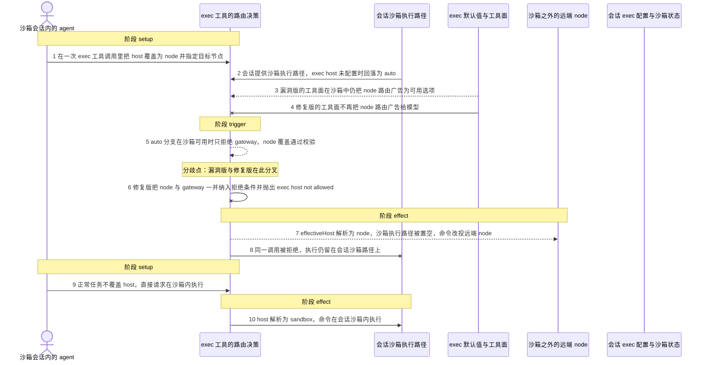
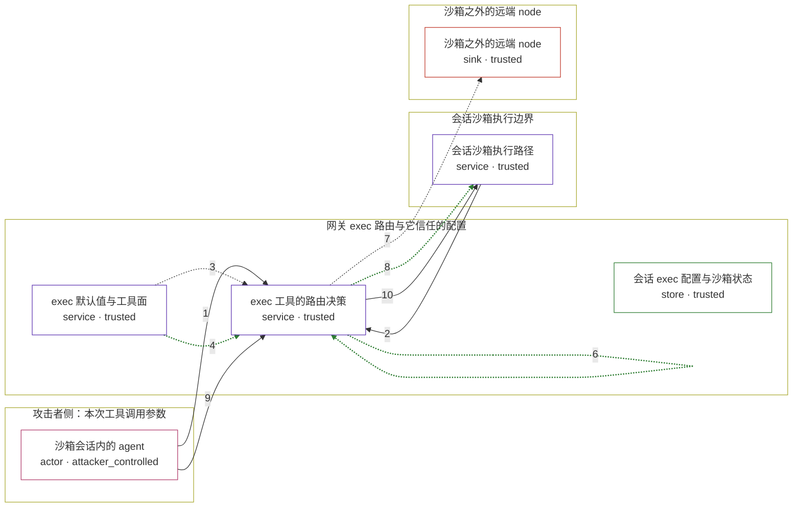

# openclaw / CVE-2026-42434

状态：草稿，未完成环境和复现。这个目录由模板生成，不构成漏洞确认。

图解的唯一来源是 `diagram.toml`：编辑后运行 `python3 -m runner diagram openclaw/CVE-2026-42434` 重新生成下方的图解区块。图解必须覆盖漏洞涉及的每个主体，并标出漏洞版/修复版的分歧步骤。

<!-- diagram:begin (generated from diagram.toml by `python3 -m runner diagram`; edit diagram.toml, not this block) -->
## 漏洞图解 — OpenClaw 沙箱 agent 用 host=node 覆盖逃逸 exec 路由

exec 工具允许每次调用覆盖执行 host。当会话配置的 exec host 是默认的 auto 且当前会话带有 sandbox 运行时，权限校验只拒绝 gateway，node 覆盖被判为允许，resolveExecTarget() 于是把 effectiveHost 解析成 node；调用点随后把 sandbox 置空，命令不再走容器内路径，而是改投沙箱之外的远端 node。修复把 node 与 gateway 一起纳入拒绝条件，并让工具面在沙箱中不再向模型广告 node 路由。正常任务不覆盖 host，两版都解析为 sandbox。

### 涉及主体

| 主体 | 类型 | 信任级别 | 在漏洞里的作用 | 来源 |
| --- | --- | --- | --- | --- |
| 沙箱会话内的 agent (`agent`) | `actor` | `attacker_controlled` | 在一次 exec 工具调用里自行决定 host 与 node 两个参数；这两个参数是它在本漏洞里唯一能控制的东西，其余取值由网关配置和会话状态决定。 | fixtures/attack.json |
| exec 工具的路由决策 (`exec_router`) | `service` | `trusted` | 根因所在：isRequestedExecTargetAllowed() 先比较 configuredTarget 与 requestedTarget，configuredTarget 为 auto 时只看 sandbox 是否可用且请求是否为 gateway，因此 sandbox 可用时会放行 node 覆盖。 | — |
| exec 默认值与工具面 (`exec_defaults`) | `service` | `trusted` | 计算暴露给模型的 exec 默认值；它调用同一校验时没有传入 sandbox 可用性，短路条件恒为假，于是即便会话在沙箱里也把 node 路由当作可用选项广告出去。 | — |
| 会话沙箱执行路径 (`sandbox_runtime`) | `service` | `trusted` | 会话本应在其中执行命令的沙箱；auto 在 sandbox 可用时解析为它，漏洞版把 effectiveHost 改成 node 后这条路径被整体跳过。 | — |
| 沙箱之外的远端 node (`remote_node`) | `sink` | `trusted` | 命令被改投到的已配对节点；它在沙箱边界之外，是攻击者想要但本不该被沙箱内 agent 够到的执行落点。 | fixtures/attack.json |
| 会话 exec 配置与沙箱状态 (`exec_config`) | `store` | `trusted` | tools.exec.host 未显式配置时回落为 auto，且当前会话带 sandbox 运行时；这组前提让漏洞成立，但它本身不参与任何消息步骤。 | — |

**信任边界**

- **攻击者侧：本次工具调用参数** (`attacker_side`)：成员 `agent`。攻击者只能决定这次 exec 调用的参数取值，例如 host 覆盖成 node、node 指向哪个目标；它不能直接改动网关配置或会话的沙箱状态。
- **网关 exec 路由与它信任的配置** (`gateway_side`)：成员 `exec_router`、`exec_defaults`、`exec_config`。路由决策本应让沙箱会话里的执行只落在沙箱路径上，它信任调用参数只会收窄而不会放宽路由；auto 分支漏掉 node 之后这道约束失效。
- **会话沙箱执行边界** (`sandbox_side`)：成员 `sandbox_runtime`。命令本应在这里执行并受容器工作目录与沙箱路径检查约束；漏洞版把 sandbox 置空，这道边界被整体绕过。
- **沙箱之外的远端 node** (`node_side`)：成员 `remote_node`。已配对的远端节点，沙箱内 agent 本不该把执行落到它上面；漏洞版把命令路由到这里，于是越过了沙箱边界。

### 触发过程

### 主体与信任边界

箭头上的数字是上面的步骤编号；方框只标主体和信任级别，具体动作见「触发过程」。

**分歧点**：第 5 步（`vulnerable_only`）auto 分支在沙箱可用时只拒绝 gateway，node 覆盖通过校验。
**分歧点**：第 6 步（`patched_only`）修复版把 node 与 gateway 一并纳入拒绝条件并抛出 exec host not allowed。
<!-- diagram:end -->

## 公告与机制

TODO：官方公告、漏洞根因、Agent 信任边界、受影响范围和修复来源。

## 前提

TODO：认证要求、用户交互、已有批准、工具权限、攻击者能控制的内容。

## 版本与启动

TODO：补全 metadata、Dockerfile/镜像 digest 和 Compose，再写出精确启动命令。

Compose 中 `vulnerable` 与 `patched` profiles 分开使用；未指定 profile 不启动服务。镜像变量未配置时 Compose 会明确报错。此模板不暴露宿主端口，也不挂载主机数据。

## 机制复现

TODO：实现 `reproduce.py`，固定输入并执行真实漏洞路径，注明运行位置、参数和超时。

完成实现后使用 `python3 -m runner reproduce openclaw/CVE-2026-42434 --build --rounds 3`。
两脚本统一接受 `--context <context.json> --output <目录>`，详细字段见仓库 `docs/environment-contract.md`。
PoC 输出 `facts.json` 和效果文件；验证器只读证据，输出含 `target_ready` 及对应效果断言的 `verdict.json`。
镜像必须包含 Python 3 和 `/lab/` 下的脚本、fixtures；`runtime.mode` 选择 `oneshot` 或有 healthcheck 的 `service`。

## 端到端复现

TODO：实现 `end_to_end.py`；若不需要模型，明确写出不适用原因。真实模型的结果与机制复现分开统计。

## 验证与修复对照

TODO：实现 `verify.py`。记录漏洞版无害效果、修复版阻断和正常任务成功的证据，不能把服务启动失败当成阻断。

## 清理

默认运行器按每个测试的唯一 Compose project 清理容器、网络和 volume。
`--keep-on-failure` 保留失败项目，项目标识和 Compose 配置在结果目录中；仅清理该项目，不能使用全局 prune。

## 失败诊断

TODO：为本漏洞写出预期效果缺失、修复版仍有越界效果、正常任务失败及前提不满足时的具体排查路径。
启动失败、健康检查失败和超时都不能当作修复阻断。报告中应能定位到阶段、预期、实际和受控证据。

## 构建与输入

TODO：填写两版源码 archive、完整 commit，记录 `build.inputs` 中每个下载的 SHA-256；依赖安装必须支持禁网构建。
固定攻击和正常输入放入 `fixtures/` 并登记到 `fixtures/manifest.toml`。固定 seed、环境变量，说明无害效果与真实影响的关系。

## 隔离例外

默认无例外。确需例外时同时填写 `runtime.exceptions`、理由及最小范围，晋升由两位维护者审阅。

## 来源与许可

TODO：列出引用代码、fixtures 和镜像的来源及许可。
