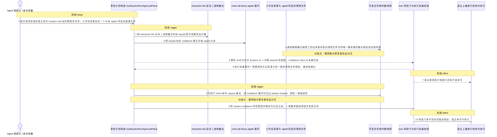
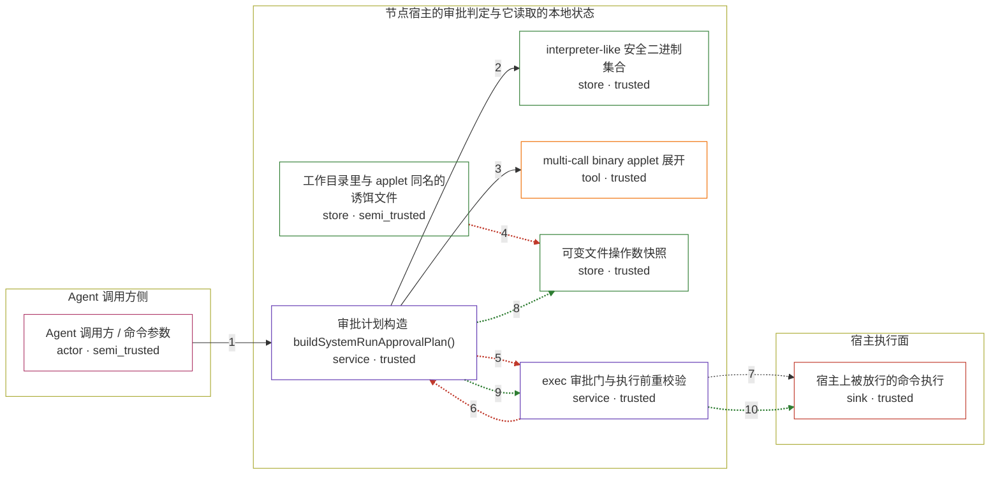

# openclaw / CVE-2026-43530

状态：草稿，未完成环境和复现。这个目录由模板生成，不构成漏洞确认。

图解的唯一来源是 `diagram.toml`：编辑后运行 `python3 -m runner diagram openclaw/CVE-2026-43530` 重新生成下方的图解区块。图解必须覆盖漏洞涉及的每个主体，并标出漏洞版/修复版的分歧步骤。

<!-- diagram:begin (generated from diagram.toml by `python3 -m runner diagram`; edit diagram.toml, not this block) -->
## 漏洞图解 — openclaw / CVE-2026-43530 busybox/toybox applet 执行削弱 exec 审批绑定

busybox/toybox 同时被登记为 interpreter-like 安全二进制，审批计划因而把它们当成通用解释器：只按 argv 顺序扫描唯一存在的文件并绑定其内容哈希。被批准的命令是 busybox awk 加内联程序文本，扫描命中的却是工作目录里恰好同名 awk 的诱饵文件，真正的 applet 与程序文本不进入绑定范围。捷径 shell 分支还让 busybox sh -c 完全不评估 multiplexer token。审批门据此放行，执行期重算同一逻辑仍然一致，于是授权判定落在错误对象上。

### 涉及主体

| 主体 | 类型 | 信任级别 | 在漏洞里的作用 | 来源 |
| --- | --- | --- | --- | --- |
| Agent 调用方 / 命令参数 (`caller`) | `actor` | `semi_trusted` | 按上游请求决定这次宿主命令的 argv 与工作目录：argv[0] 是 multi-call binary，argv[1] 是要跑的 applet，argv[2] 起是 applet 的程序文本或内联 payload。它没有宿主写权限，只是把参数带进审批流程的转发方。 | fixtures/attack.json |
| 审批计划构造 buildSystemRunApprovalPlan() (`approval_planner`) | `service` | `trusted` | 把待批准命令编译成审批计划，并决定是否附带可变文件操作数快照；这里是授权判定被绑到错误对象的缺陷点。 | src/node-host/invoke-system-run-plan.ts |
| interpreter-like 安全二进制集合 (`safe_bin_policy`) | `store` | `trusted` | 把 busybox 与 toybox 登记为 interpreter-like，使 isMutableScriptRunner() 为真；这一步是让 multi-call binary 走进通用解释器分支的漏洞前提。 | src/infra/exec-safe-bin-runtime-policy.ts |
| multi-call binary applet 展开 (`applet_resolver`) | `tool` | `trusted` | 识别 argv[0] 的 multiplexer wrapper 并展开 applet：applet 是 shell 时按 POSIX shell 处理，applet 不是 shell 时保留原 argv 且不展开。 | src/infra/shell-wrapper-resolution.ts |
| 可变文件操作数快照 (`mutable_binding`) | `store` | `trusted` | 当运行器的行为取决于某个脚本文件时记录 {argvIndex, realpath, sha256}；缺陷路径下它记录的是工作目录里的诱饵文件，而不是真正会被执行的 applet 程序文本。 | src/node-host/invoke-system-run-plan.ts |
| 工作目录里与 applet 同名的诱饵文件 (`decoy_file`) | `store` | `semi_trusted` | 工作目录里本来就存在的普通文件，名字恰好等于被调用的 applet；通用解释器扫描只按「argv 里唯一解析为已存在文件的操作数」命中它。 | fixtures/attack.json |
| exec 审批门与执行前重校验 (`exec_gate`) | `service` | `trusted` | 批准后执行前用同一函数重算快照并与已批准计划比对；因为重算走同一条缺陷路径，诱饵文件与计划一致，于是本应拦下不可安全绑定命令的检查被绕过。 | src/node-host/invoke-system-run.ts |
| 宿主上被放行的命令执行 (`host_effect`) | `sink` | `trusted` | 审批通过后由节点宿主执行的宿主命令；用户批准时看到的是绑定到一个稳定文件，实际执行的是 multi-call binary 的 applet 与内联程序文本。 | src/node-host/invoke-system-run.ts |

**信任边界**

- **Agent 调用方侧** (`caller_side`)：成员 `caller`。agent 只能控制这次 exec 请求的 argv 与工作目录，不能改动节点宿主的审批判定代码，也不能替用户按下批准。
- **节点宿主的审批判定与它读取的本地状态** (`product`)：成员 `approval_planner`、`safe_bin_policy`、`applet_resolver`、`mutable_binding`、`decoy_file`、`exec_gate`。这道边界要把「用户批准的到底是哪段行为」固定到稳定对象上；多调用二进制与同名诱饵文件让它固定到了与执行无关的对象。
- **宿主执行面** (`sink_side`)：成员 `host_effect`。只有审批判定通过之后命令才会落到这里；缺陷路径让它对一条本应失败关闭的命令放行。

### 触发过程

### 主体与信任边界

箭头上的数字是上面的步骤编号；方框只标主体和信任级别，具体动作见「触发过程」。

**分歧点**：第 4 步（`vulnerable_only`）通用解释器扫描把工作目录里同名的诱饵文件当作唯一脚本操作数并绑定其内容哈希。
**分歧点**：第 5 步（`vulnerable_only`）捷径 shell 分支对 busybox sh -c 内联 payload 先短路，multiplexer token 从未被评估。
**分歧点**：第 6 步（`vulnerable_only`）执行前重算同一逻辑得到与已批准计划一致的诱饵文件绑定，重校验通过。
**分歧点**：第 8 步（`patched_only`）可执行 token 命中 opaque 集合，或 multiplexer 展开时见过 opaque wrapper，绑定一律返回空。
**分歧点**：第 9 步（`patched_only`）把 opaque multiplexer 判定提到内联命令分支之前，一律要求稳定绑定并失败关闭。
**分歧点**：第 10 步（`patched_only`）审批门拿不到任何稳定绑定，宿主命令不执行。
<!-- diagram:end -->

## 公告与机制

TODO：官方公告、漏洞根因、Agent 信任边界、受影响范围和修复来源。

## 前提

TODO：认证要求、用户交互、已有批准、工具权限、攻击者能控制的内容。

## 版本与启动

TODO：补全 metadata、Dockerfile/镜像 digest 和 Compose，再写出精确启动命令。

Compose 中 `vulnerable` 与 `patched` profiles 分开使用；未指定 profile 不启动服务。镜像变量未配置时 Compose 会明确报错。此模板不暴露宿主端口，也不挂载主机数据。

## 机制复现

TODO：实现 `reproduce.py`，固定输入并执行真实漏洞路径，注明运行位置、参数和超时。

完成实现后使用 `python3 -m runner reproduce openclaw/CVE-2026-43530 --build --rounds 3`。
两脚本统一接受 `--context <context.json> --output <目录>`，详细字段见仓库 `docs/environment-contract.md`。
PoC 输出 `facts.json` 和效果文件；验证器只读证据，输出含 `target_ready` 及对应效果断言的 `verdict.json`。
镜像必须包含 Python 3 和 `/lab/` 下的脚本、fixtures；`runtime.mode` 选择 `oneshot` 或有 healthcheck 的 `service`。

## 端到端复现

TODO：实现 `end_to_end.py`；若不需要模型，明确写出不适用原因。真实模型的结果与机制复现分开统计。

## 验证与修复对照

TODO：实现 `verify.py`。记录漏洞版无害效果、修复版阻断和正常任务成功的证据，不能把服务启动失败当成阻断。

## 清理

默认运行器按每个测试的唯一 Compose project 清理容器、网络和 volume。
`--keep-on-failure` 保留失败项目，项目标识和 Compose 配置在结果目录中；仅清理该项目，不能使用全局 prune。

## 失败诊断

TODO：为本漏洞写出预期效果缺失、修复版仍有越界效果、正常任务失败及前提不满足时的具体排查路径。
启动失败、健康检查失败和超时都不能当作修复阻断。报告中应能定位到阶段、预期、实际和受控证据。

## 构建与输入

TODO：填写两版源码 archive、完整 commit，记录 `build.inputs` 中每个下载的 SHA-256；依赖安装必须支持禁网构建。
固定攻击和正常输入放入 `fixtures/` 并登记到 `fixtures/manifest.toml`。固定 seed、环境变量，说明无害效果与真实影响的关系。

## 隔离例外

默认无例外。确需例外时同时填写 `runtime.exceptions`、理由及最小范围，晋升由两位维护者审阅。

## 来源与许可

TODO：列出引用代码、fixtures 和镜像的来源及许可。
