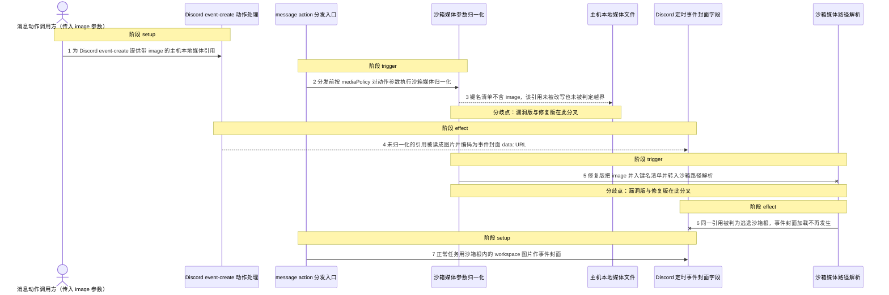
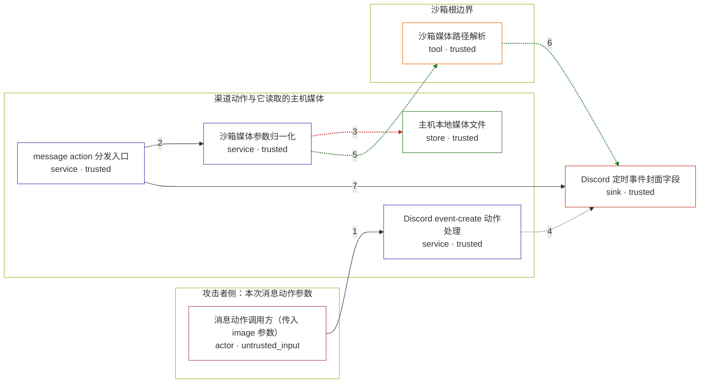

# openclaw / CVE-2026-43532

状态：草稿，未完成环境和复现。这个目录由模板生成，不构成漏洞确认。

图解的唯一来源是 `diagram.toml`：编辑后运行 `python3 -m runner diagram openclaw/CVE-2026-43532` 重新生成下方的图解区块。图解必须覆盖漏洞涉及的每个主体，并标出漏洞版/修复版的分歧步骤。

<!-- diagram:begin (generated from diagram.toml by `python3 -m runner diagram`; edit diagram.toml, not this block) -->
## 漏洞图解 — OpenClaw Discord 事件封面图绕过沙箱媒体归一化

message action 分发前会按一个硬编码的参数键名清单，把出站本地媒体引用相对沙箱根做归一化；该清单包含 media、path、filePath、mediaUrl、fileUrl，却不包含 Discord event-create 的 image 参数。事件封面的 image 因此整段跳过沙箱路径改写与逃逸检查，主机本地文件引用被事件封面加载路径直接读成 data: URL，落进 Discord 事件封面字段。修复把 image 并入该键名清单后，同一引用在归一化阶段被判为逃逸沙箱根而拒绝。

### 涉及主体

| 主体 | 类型 | 信任级别 | 在漏洞里的作用 | 来源 |
| --- | --- | --- | --- | --- |
| 消息动作调用方（传入 image 参数） (`action_caller`) | `actor` | `untrusted_input` | 通过 message action 通道为 Discord event-create 提供参数，其中的 image 是本次调用里唯一由它决定的字段，取值是它自己指定的主机本地媒体引用。 | fixtures/attack.json |
| Discord event-create 动作处理 (`event_create_action`) | `service` | `trusted` | 读取 actionParams 里的 image 字符串放进 eventCreate 请求，再交给事件封面解析；它假定到达的 image 已经过沙箱归一化。 | — |
| message action 分发入口 (`action_runner`) | `service` | `trusted` | 在把动作分发给渠道插件之前，按 mediaPolicy 对动作参数执行沙箱媒体归一化。 | — |
| 沙箱媒体参数归一化 (`normalize_param`) | `service` | `trusted` | 漏洞根因所在：它只遍历硬编码的沙箱媒体参数键名清单，image 不在清单里，于是 image 既不做 data: URL 拒绝也不做沙箱路径改写。 | — |
| 沙箱媒体路径解析 (`resolve_sandboxed_media`) | `tool` | `trusted` | 把 workspace 引用映射到沙箱根内，并对逃逸沙箱根的路径抛错；漏洞版流程根本没有调用它。 | — |
| 主机本地媒体文件 (`host_local_media`) | `store` | `trusted` | 位于主机允许的媒体根目录、但在沙箱根之外的图片；漏洞版把它读成事件封面数据，修复版够不到它。 | fixtures/attack.json |
| Discord 定时事件封面字段 (`discord_event`) | `sink` | `trusted` | 事件封面加载路径把读到的图片字节编码成 data: URL 并作为封面值送出，效果最终落到这里。 | — |

**信任边界**

- **攻击者侧：本次消息动作参数** (`attacker_side`)：成员 `action_caller`。攻击者只能决定这次 message action 的参数取值，例如 event-create 的 image 指向哪个本地媒体引用；它不能直接读写主机文件。
- **渠道动作与它读取的主机媒体** (`channel_side`)：成员 `event_create_action`、`action_runner`、`normalize_param`、`host_local_media`。出站媒体引用本应先在沙箱策略下改写并校验；沙箱模式启用时，事件封面加载只受主机允许媒体根约束，于是允许根内、沙箱根外的引用在这里被读到。
- **沙箱根边界** (`sandbox_enforcement`)：成员 `resolve_sandboxed_media`。把 workspace 引用限制在沙箱根内并拒绝逃逸路径的检查点；image 参数不在键名清单里，所以漏洞版流程跳过了这道检查。
- 未列入上述边界：`discord_event`。

### 触发过程

### 主体与信任边界

箭头上的数字是上面的步骤编号；方框只标主体和信任级别，具体动作见「触发过程」。

**分歧点**：第 3 步（`vulnerable_only`）键名清单不含 image，该引用未被改写也未被判定越界。
**分歧点**：第 5 步（`patched_only`）修复版把 image 并入键名清单并转入沙箱路径解析。
<!-- diagram:end -->

## 公告与机制

TODO：官方公告、漏洞根因、Agent 信任边界、受影响范围和修复来源。

## 前提

TODO：认证要求、用户交互、已有批准、工具权限、攻击者能控制的内容。

## 版本与启动

TODO：补全 metadata、Dockerfile/镜像 digest 和 Compose，再写出精确启动命令。

Compose 中 `vulnerable` 与 `patched` profiles 分开使用；未指定 profile 不启动服务。镜像变量未配置时 Compose 会明确报错。此模板不暴露宿主端口，也不挂载主机数据。

## 机制复现

TODO：实现 `reproduce.py`，固定输入并执行真实漏洞路径，注明运行位置、参数和超时。

完成实现后使用 `python3 -m runner reproduce openclaw/CVE-2026-43532 --build --rounds 3`。
两脚本统一接受 `--context <context.json> --output <目录>`，详细字段见仓库 `docs/environment-contract.md`。
PoC 输出 `facts.json` 和效果文件；验证器只读证据，输出含 `target_ready` 及对应效果断言的 `verdict.json`。
镜像必须包含 Python 3 和 `/lab/` 下的脚本、fixtures；`runtime.mode` 选择 `oneshot` 或有 healthcheck 的 `service`。

## 端到端复现

TODO：实现 `end_to_end.py`；若不需要模型，明确写出不适用原因。真实模型的结果与机制复现分开统计。

## 验证与修复对照

TODO：实现 `verify.py`。记录漏洞版无害效果、修复版阻断和正常任务成功的证据，不能把服务启动失败当成阻断。

## 清理

默认运行器按每个测试的唯一 Compose project 清理容器、网络和 volume。
`--keep-on-failure` 保留失败项目，项目标识和 Compose 配置在结果目录中；仅清理该项目，不能使用全局 prune。

## 失败诊断

TODO：为本漏洞写出预期效果缺失、修复版仍有越界效果、正常任务失败及前提不满足时的具体排查路径。
启动失败、健康检查失败和超时都不能当作修复阻断。报告中应能定位到阶段、预期、实际和受控证据。

## 构建与输入

TODO：填写两版源码 archive、完整 commit，记录 `build.inputs` 中每个下载的 SHA-256；依赖安装必须支持禁网构建。
固定攻击和正常输入放入 `fixtures/` 并登记到 `fixtures/manifest.toml`。固定 seed、环境变量，说明无害效果与真实影响的关系。

## 隔离例外

本环境声明一条例外，运行/晋升时必须传 `--allow-exceptions`：

- `network.lab.subnet`：宿主 Docker 守护进程的默认地址池（16 个 `/20`）已被其它长期项目网络占满，Compose 无法自行分配 `lab` 网络子网。`runtime.network_pool = "10.200.0.0/16"` 只为每个 project 的内部 `lab` 网络提供一个私有 `/24`；该网络仍为 `internal: true`，不发布端口、不挂载宿主目录、不加能力，因此不增加宿主可达性。

## 来源与许可

TODO：列出引用代码、fixtures 和镜像的来源及许可。
