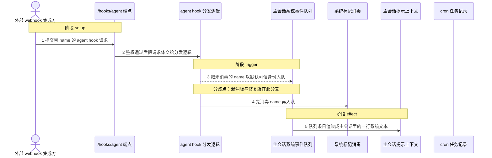
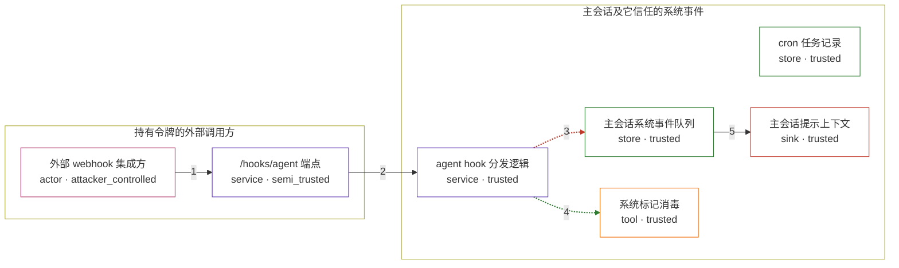

# openclaw / CVE-2026-43534

状态：草稿，未完成环境和复现。这个目录由模板生成，不构成漏洞确认。

图解的唯一来源是 `diagram.toml`：编辑后运行 `python3 -m runner diagram openclaw/CVE-2026-43534` 重新生成下方的图解区块。图解必须覆盖漏洞涉及的每个主体，并标出漏洞版/修复版的分歧步骤。

<!-- diagram:begin (generated from diagram.toml by `python3 -m runner diagram`; edit diagram.toml, not this block) -->
## 漏洞图解 — openclaw / CVE-2026-43534 漏洞图解

外部 /hooks/agent 提交的 hook 名称只做去空白处理，既不消毒系统标记，也没有在入队时声明不可信， 于是它被当作可信系统事件写进主会话的队列。主会话在渲染提示时按可信条目加 System: 前缀， 攻击者构造的元数据因此变成主会话上下文里的一行系统文本。修复版本在同一个分叉点消毒名称并把事件标记为不可信。

### 涉及主体

| 主体 | 类型 | 信任级别 | 在漏洞里的作用 | 来源 |
| --- | --- | --- | --- | --- |
| 外部 webhook 集成方 (`external_integration`) | `actor` | `attacker_controlled` | 持有 hooks 令牌的集成方，完全控制 /hooks/agent 请求体，尤其是其中的 name 字段。它想要的是让主会话把它的文本当成系统指令。 | — |
| /hooks/agent 端点 (`hooks_endpoint`) | `service` | `semi_trusted` | 带 Bearer 令牌鉴权的 hook 接收端点；它校验调用方身份，但把请求体里的 name 当作普通元数据交给下游，没有消毒系统标记。 | — |
| agent hook 分发逻辑 (`hook_dispatch`) | `service` | `trusted` | 把已规范化的 name 写进任务对象，并拼进 Hook name 前缀；这是漏洞版与修复版唯一的行为分叉点。 | — |
| 主会话系统事件队列 (`system_event_queue`) | `store` | `trusted` | 跨会话共享的队列；agent hook 入队时没有显式声明不可信，于是沿用默认可信身份。 | — |
| cron 任务记录 (`cron_job_store`) | `store` | `trusted` | 同一个未消毒的 name 也作为任务名称被持久化下来，是受影响代码的另一处落点。 | — |
| 主会话提示上下文 (`main_session_context`) | `sink` | `trusted` | 下一轮提示的渲染结果；队列条目在这里按可信或不可信决定前缀，这是攻击者真正想影响的目标。 | — |
| 系统标记消毒 (`sys_tag_sanitizer`) | `tool` | `trusted` | 修复版本引入的消毒步骤：把行首 System: 改写成 System (untrusted):，并只以不可信身份把事件写入队列。 | — |

**信任边界**

- **持有令牌的外部调用方** (`caller_side`)：成员 `external_integration`、`hooks_endpoint`。攻击者只能控制这一次 hook 请求的字段；它能通过令牌校验，但本来不应能决定事件的可信身份。
- **主会话及它信任的系统事件** (`main_session_side`)：成员 `hook_dispatch`、`system_event_queue`、`cron_job_store`、`main_session_context`、`sys_tag_sanitizer`。这道边界本应把 hook 元数据留在 hook 自己的会话里，或至少让它以不可信身份进入；漏洞让它以可信系统事件的身份写进主会话。

### 触发过程

### 主体与信任边界

箭头上的数字是上面的步骤编号；方框只标主体和信任级别，具体动作见「触发过程」。

**分歧点**：第 3 步（`vulnerable_only`）把未消毒的 name 以默认可信身份入队。
**分歧点**：第 4 步（`patched_only`）先消毒 name 再入队。
<!-- diagram:end -->

## 公告与机制

TODO：官方公告、漏洞根因、Agent 信任边界、受影响范围和修复来源。

## 前提

TODO：认证要求、用户交互、已有批准、工具权限、攻击者能控制的内容。

## 版本与启动

TODO：补全 metadata、Dockerfile/镜像 digest 和 Compose，再写出精确启动命令。

Compose 中 `vulnerable` 与 `patched` profiles 分开使用；未指定 profile 不启动服务。镜像变量未配置时 Compose 会明确报错。此模板不暴露宿主端口，也不挂载主机数据。

## 机制复现

TODO：实现 `reproduce.py`，固定输入并执行真实漏洞路径，注明运行位置、参数和超时。

完成实现后使用 `python3 -m runner reproduce openclaw/CVE-2026-43534 --build --rounds 3`。
两脚本统一接受 `--context <context.json> --output <目录>`，详细字段见仓库 `docs/environment-contract.md`。
PoC 输出 `facts.json` 和效果文件；验证器只读证据，输出含 `target_ready` 及对应效果断言的 `verdict.json`。
镜像必须包含 Python 3 和 `/lab/` 下的脚本、fixtures；`runtime.mode` 选择 `oneshot` 或有 healthcheck 的 `service`。

## 端到端复现

TODO：实现 `end_to_end.py`；若不需要模型，明确写出不适用原因。真实模型的结果与机制复现分开统计。

## 验证与修复对照

TODO：实现 `verify.py`。记录漏洞版无害效果、修复版阻断和正常任务成功的证据，不能把服务启动失败当成阻断。

## 清理

默认运行器按每个测试的唯一 Compose project 清理容器、网络和 volume。
`--keep-on-failure` 保留失败项目，项目标识和 Compose 配置在结果目录中；仅清理该项目，不能使用全局 prune。

## 失败诊断

TODO：为本漏洞写出预期效果缺失、修复版仍有越界效果、正常任务失败及前提不满足时的具体排查路径。
启动失败、健康检查失败和超时都不能当作修复阻断。报告中应能定位到阶段、预期、实际和受控证据。

## 构建与输入

TODO：填写两版源码 archive、完整 commit，记录 `build.inputs` 中每个下载的 SHA-256；依赖安装必须支持禁网构建。
固定攻击和正常输入放入 `fixtures/` 并登记到 `fixtures/manifest.toml`。固定 seed、环境变量，说明无害效果与真实影响的关系。

## 隔离例外

默认无例外。确需例外时同时填写 `runtime.exceptions`、理由及最小范围，晋升由两位维护者审阅。

## 来源与许可

TODO：列出引用代码、fixtures 和镜像的来源及许可。
