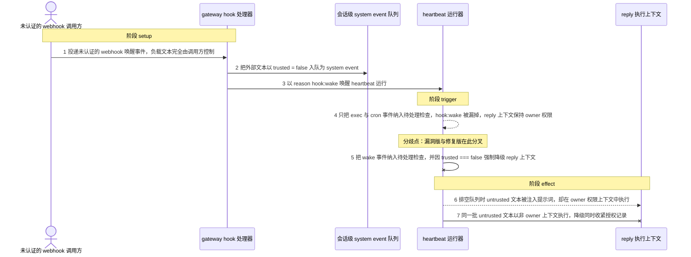
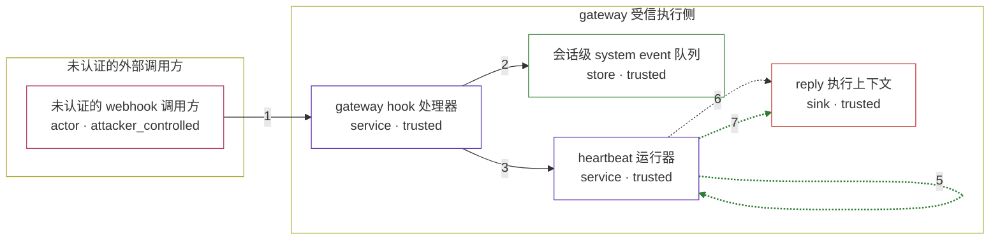

# openclaw / CVE-2026-43566

状态：草稿，未完成环境和复现。这个目录由模板生成，不构成漏洞确认。

图解的唯一来源是 `diagram.toml`：编辑后运行 `python3 -m runner diagram openclaw/CVE-2026-43566` 重新生成下方的图解区块。图解必须覆盖漏洞涉及的每个主体，并标出漏洞版/修复版的分歧步骤。

<!-- diagram:begin (generated from diagram.toml by `python3 -m runner diagram`; edit diagram.toml, not this block) -->
## 漏洞图解 — openclaw / CVE-2026-43566 漏洞图解

未认证的 webhook 唤醒事件把外部文本以 trusted: false 入队为 system event，但 heartbeat 运行器只对 exec 与 cron 类事件做待处理检查，hook:wake 被漏掉，reply 上下文因此保留 owner 权限；同一队列中的 untrusted 文本随后在 get-reply-run 排空时被注入提示词，使外部内容以 owner 身份执行。

### 涉及主体

| 主体 | 类型 | 信任级别 | 在漏洞里的作用 | 来源 |
| --- | --- | --- | --- | --- |
| 未认证的 webhook 调用方 (`webhook_caller`) | `actor` | `attacker_controlled` | 控制 webhook 唤醒事件的负载文本并决定触发时机；它本身拿不到 owner 权限，只能设法让受信侧替它执行。 | fixtures/attack.json |
| gateway hook 处理器 (`hook_handler`) | `service` | `trusted` | 接收入站 webhook，把文本包装成 session system event 并以 trusted: false 入队，再用 reason hook:wake 请求一次 heartbeat。 | — |
| 会话级 system event 队列 (`system_event_queue`) | `store` | `trusted` | 保存待注入下一次提示词的事件及其 trusted 标记；hook 处理器与 heartbeat 共享同一条队列。 | — |
| heartbeat 运行器 (`heartbeat_runner`) | `service` | `trusted` | 按唤醒原因决定是否检查待处理事件，并据此设置 reply 上下文的 ForceSenderIsOwnerFalse；漏洞版漏掉了 wake 原因。 | — |
| reply 执行上下文 (`reply_context`) | `sink` | `trusted` | 漏洞效果落点：排空队列后 untrusted 文本进入提示词，而该上下文仍然带着 owner 权限执行。 | — |

**信任边界**

- **未认证的外部调用方** (`external_side`)：成员 `webhook_caller`。webhook 端点对未认证调用方开放；调用方能控制的只有这次请求的负载文本与触发时机。
- **gateway 受信执行侧** (`gateway_side`)：成员 `hook_handler`、`system_event_queue`、`heartbeat_runner`、`reply_context`。受信侧本应根据事件的 trusted 标记把 reply 上下文降级为非 owner；漏洞让 hook:wake 路径跳过了这一步。

### 触发过程

### 主体与信任边界

箭头上的数字是上面的步骤编号；方框只标主体和信任级别，具体动作见「触发过程」。

**分歧点**：第 4 步（`vulnerable_only`）只把 exec 与 cron 事件纳入待处理检查，hook:wake 被漏掉，reply 上下文保持 owner 权限。
**分歧点**：第 5 步（`patched_only`）把 wake 事件纳入待处理检查，并因 trusted === false 强制降级 reply 上下文。
<!-- diagram:end -->

## 公告与机制

TODO：官方公告、漏洞根因、Agent 信任边界、受影响范围和修复来源。

## 前提

TODO：认证要求、用户交互、已有批准、工具权限、攻击者能控制的内容。

## 版本与启动

TODO：补全 metadata、Dockerfile/镜像 digest 和 Compose，再写出精确启动命令。

Compose 中 `vulnerable` 与 `patched` profiles 分开使用；未指定 profile 不启动服务。镜像变量未配置时 Compose 会明确报错。此模板不暴露宿主端口，也不挂载主机数据。

## 机制复现

TODO：实现 `reproduce.py`，固定输入并执行真实漏洞路径，注明运行位置、参数和超时。

完成实现后使用 `python3 -m runner reproduce openclaw/CVE-2026-43566 --build --rounds 3`。
两脚本统一接受 `--context <context.json> --output <目录>`，详细字段见仓库 `docs/environment-contract.md`。
PoC 输出 `facts.json` 和效果文件；验证器只读证据，输出含 `target_ready` 及对应效果断言的 `verdict.json`。
镜像必须包含 Python 3 和 `/lab/` 下的脚本、fixtures；`runtime.mode` 选择 `oneshot` 或有 healthcheck 的 `service`。

## 端到端复现

TODO：实现 `end_to_end.py`；若不需要模型，明确写出不适用原因。真实模型的结果与机制复现分开统计。

## 验证与修复对照

TODO：实现 `verify.py`。记录漏洞版无害效果、修复版阻断和正常任务成功的证据，不能把服务启动失败当成阻断。

## 清理

默认运行器按每个测试的唯一 Compose project 清理容器、网络和 volume。
`--keep-on-failure` 保留失败项目，项目标识和 Compose 配置在结果目录中；仅清理该项目，不能使用全局 prune。

## 失败诊断

TODO：为本漏洞写出预期效果缺失、修复版仍有越界效果、正常任务失败及前提不满足时的具体排查路径。
启动失败、健康检查失败和超时都不能当作修复阻断。报告中应能定位到阶段、预期、实际和受控证据。

## 构建与输入

TODO：填写两版源码 archive、完整 commit，记录 `build.inputs` 中每个下载的 SHA-256；依赖安装必须支持禁网构建。
固定攻击和正常输入放入 `fixtures/` 并登记到 `fixtures/manifest.toml`。固定 seed、环境变量，说明无害效果与真实影响的关系。

## 隔离例外

默认无例外。确需例外时同时填写 `runtime.exceptions`、理由及最小范围，晋升由两位维护者审阅。

## 来源与许可

TODO：列出引用代码、fixtures 和镜像的来源及许可。
