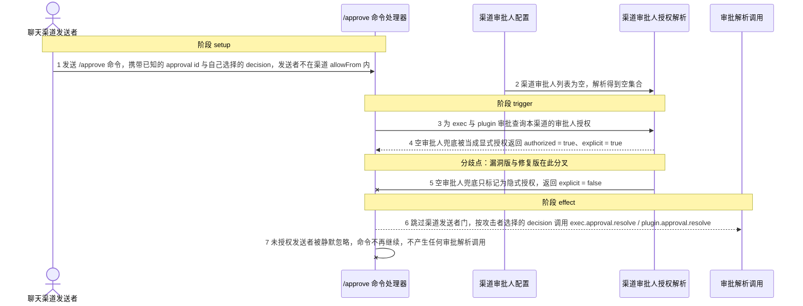
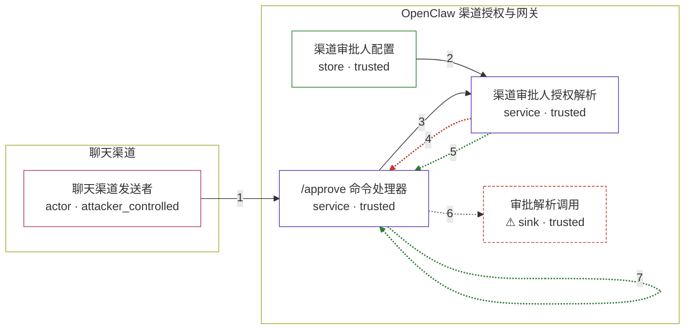

# openclaw / CVE-2026-43574

状态：草稿，未完成环境和复现。这个目录由模板生成，不构成漏洞确认。

图解的唯一来源是 `diagram.toml`：编辑后运行 `python3 -m runner diagram openclaw/CVE-2026-43574` 重新生成下方的图解区块。图解必须覆盖漏洞涉及的每个主体，并标出漏洞版/修复版的分歧步骤。

<!-- diagram:begin (generated from diagram.toml by `python3 -m runner diagram`; edit diagram.toml, not this block) -->
## 漏洞图解 — OpenClaw 空审批人列表授予显式审批授权

helper-backed 渠道把「解析出的审批人列表为空」这一兜底结果直接当成显式审批人授权：resolveApprovalCommandAuthorization 在渠道能力没有 availability 状态时算出 explicit = true，于是 /approve 处理器用 hasExplicitApprovalAuthorization 短路了渠道自身的 isAuthorizedSender 检查。任何能向该渠道发消息、并且知道一个 approval id 的发送者，因此可以自己选择 allow-once / allow-always / deny 去解析本该无权批准的待审批动作。修复后空列表兜底被标记为隐式授权，explicit 变为 false，未授权发送者重新落回渠道发送者门并被静默忽略。

### 涉及主体

| 主体 | 类型 | 信任级别 | 在漏洞里的作用 | 来源 |
| --- | --- | --- | --- | --- |
| 聊天渠道发送者 (`chat_sender`) | `actor` | `attacker_controlled` | 构造并发送 /approve 命令，自己选择 decision；它是渠道 allowFrom 之外的发送者，因此 isAuthorizedSender 为 false。前提是它已经知道某个待审批动作的 id。 | fixtures/attack.json |
| /approve 命令处理器 (`approve_handler`) | `service` | `trusted` | handleApproveCommand 先看渠道发送者门 isAuthorizedSender，再看审批人授权里的 explicit 标记；两者都不通过时才丢弃命令。 | src/auto-reply/reply/commands-approve.ts |
| 渠道审批人授权解析 (`approval_auth`) | `service` | `trusted` | resolveApprovalCommandAuthorization 调用渠道 approval capability，把空审批人兜底结果折算成 explicit；helper-backed 渠道没有 availability 状态，这一步决定了发送者门是否被短路。 | src/infra/channel-approval-auth.ts |
| 渠道审批人配置 (`approver_config`) | `store` | `trusted` | 漏洞前提：helper-backed 渠道没有配置审批人（allowFrom / explicit / defaultTo 全为空），审批人解析返回空列表。这是部署形态，不是攻击者的动作。 | src/plugin-sdk/approval-approvers.ts |
| ⚠ 审批解析调用 (`approval_resolution`) | `sink` | `trusted` | 漏洞版的越权效果落点：处理器按攻击者选择的 decision 调用 exec.approval.resolve / plugin.approval.resolve，让待审批动作被解析。复现中这条对外调用被替换成只记录请求的替身，因此图中标为合成载体。 | src/gateway/call.ts |

**信任边界**

- **聊天渠道** (`channel_side`)：成员 `chat_sender`。攻击者只能控制自己发出的渠道消息（命令文本、decision 和发送者身份），不能修改渠道审批人配置，也不能凭空知道 approval id。
- **OpenClaw 渠道授权与网关** (`openclaw_side`)：成员 `approve_handler`、`approval_auth`、`approver_config`、`approval_resolution`。这道边界本来保证只有渠道授权的发送者或显式配置的审批人才能解析待审批动作；空审批人兜底被误判为显式授权后，未授权发送者可以直接穿透到网关调用。

标 ⚠ 的主体是本仓库合成的替身或无害效果载体，不代表真实外部目标。

### 触发过程

### 主体与信任边界

箭头上的数字是上面的步骤编号；方框只标主体和信任级别，具体动作见「触发过程」。

**分歧点**：第 4 步（`vulnerable_only`）空审批人兜底被当成显式授权返回 authorized = true、explicit = true。
**分歧点**：第 5 步（`patched_only`）空审批人兜底只标记为隐式授权，返回 explicit = false。
<!-- diagram:end -->

## 公告与机制

TODO：官方公告、漏洞根因、Agent 信任边界、受影响范围和修复来源。

## 前提

TODO：认证要求、用户交互、已有批准、工具权限、攻击者能控制的内容。

## 版本与启动

TODO：补全 metadata、Dockerfile/镜像 digest 和 Compose，再写出精确启动命令。

Compose 中 `vulnerable` 与 `patched` profiles 分开使用；未指定 profile 不启动服务。镜像变量未配置时 Compose 会明确报错。此模板不暴露宿主端口，也不挂载主机数据。

## 机制复现

TODO：实现 `reproduce.py`，固定输入并执行真实漏洞路径，注明运行位置、参数和超时。

完成实现后使用 `python3 -m runner reproduce openclaw/CVE-2026-43574 --build --rounds 3`。
两脚本统一接受 `--context <context.json> --output <目录>`，详细字段见仓库 `docs/environment-contract.md`。
PoC 输出 `facts.json` 和效果文件；验证器只读证据，输出含 `target_ready` 及对应效果断言的 `verdict.json`。
镜像必须包含 Python 3 和 `/lab/` 下的脚本、fixtures；`runtime.mode` 选择 `oneshot` 或有 healthcheck 的 `service`。

## 端到端复现

TODO：实现 `end_to_end.py`；若不需要模型，明确写出不适用原因。真实模型的结果与机制复现分开统计。

## 验证与修复对照

TODO：实现 `verify.py`。记录漏洞版无害效果、修复版阻断和正常任务成功的证据，不能把服务启动失败当成阻断。

## 清理

默认运行器按每个测试的唯一 Compose project 清理容器、网络和 volume。
`--keep-on-failure` 保留失败项目，项目标识和 Compose 配置在结果目录中；仅清理该项目，不能使用全局 prune。

## 失败诊断

TODO：为本漏洞写出预期效果缺失、修复版仍有越界效果、正常任务失败及前提不满足时的具体排查路径。
启动失败、健康检查失败和超时都不能当作修复阻断。报告中应能定位到阶段、预期、实际和受控证据。

## 构建与输入

TODO：填写两版源码 archive、完整 commit，记录 `build.inputs` 中每个下载的 SHA-256；依赖安装必须支持禁网构建。
固定攻击和正常输入放入 `fixtures/` 并登记到 `fixtures/manifest.toml`。固定 seed、环境变量，说明无害效果与真实影响的关系。

## 隔离例外

默认无例外。确需例外时同时填写 `runtime.exceptions`、理由及最小范围，晋升由两位维护者审阅。

## 来源与许可

TODO：列出引用代码、fixtures 和镜像的来源及许可。
