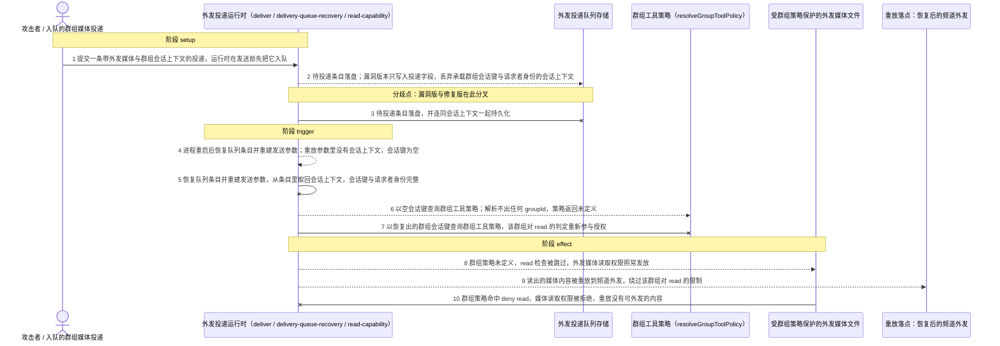
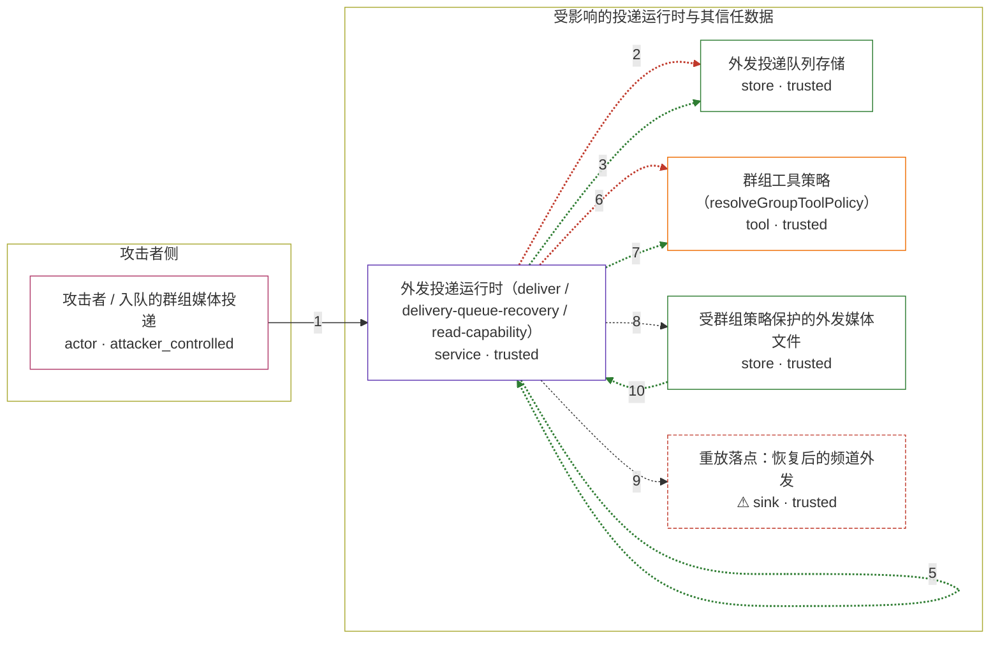

# openclaw / CVE-2026-43583

状态：草稿。图解、攻击与正常输入、机制复现脚本已写出；镜像配方、机制验收与
Agent-PoC 尚未执行，`verification.*` 保持 `not_run` / `not_applicable`，不构成漏洞确认。

图解的唯一来源是 `diagram.toml`：编辑后运行 `python3 -m runner diagram openclaw/CVE-2026-43583` 重新生成下方的图解区块。图解必须覆盖漏洞涉及的每个主体，并标出漏洞版/修复版的分歧步骤。

<!-- diagram:begin (generated from diagram.toml by `python3 -m runner diagram`; edit diagram.toml, not this block) -->
## 漏洞图解 — openclaw / CVE-2026-43583 漏洞图解

外发投递队列只持久化投递字段，不持久化承载群组会话键与请求者身份的会话上下文；恢复重放时上游据此重建发送参数，会话上下文为空，群组工具策略因解析不出群组会话而直接返回未定义，read 检查被整段跳过。于是恢复路径以“无群组上下文”重新获得媒体读取权限，本该被频道群组策略拦下的外发媒体仍可被读出并重放。

### 涉及主体

| 主体 | 类型 | 信任级别 | 在漏洞里的作用 | 来源 |
| --- | --- | --- | --- | --- |
| 攻击者 / 入队的群组媒体投递 (`attacker`) | `actor` | `attacker_controlled` | 构造一条带外发媒体、且带有群组会话键与请求者身份的投递，把它交给投递队列。攻击者只能控制这一次投递的内容与会话标识，不能控制队列的持久化实现，也不能直接读取受策略保护的媒体。 | fixtures/attack.json |
| 外发投递运行时（deliver / delivery-queue-recovery / read-capability） (`agent_runtime`) | `service` | `trusted` | 负责入队、崩溃后恢复重放与媒体访问授权。缺陷在于恢复重放从队列条目重建发送参数后，把会话上下文交给媒体访问解析之前就丢了群组会话键，使 groupIds 为空、群组工具策略不参与判定。 | — |
| 群组工具策略（resolveGroupToolPolicy） (`group_tool_policy`) | `tool` | `trusted` | 按群组会话键与请求者身份解析该群组对 read 的 allow/deny，是外发媒体读取的授权判定点；会话键缺失时它返回未定义而不是拒绝。 | — |
| 外发投递队列存储 (`delivery_queue`) | `store` | `trusted` | 以 write-ahead 方式在发送前落盘待投递条目；漏洞版本写入的条目没有会话上下文字段，重启恢复后重放路径因此拿不到群组会话键与请求者身份。 | — |
| 受群组策略保护的外发媒体文件 (`outbound_media`) | `store` | `trusted` | 攻击者想要但按群组工具策略拿不到的内容，存放在 agent 工作区内；策略 deny read 时它不应被外发路径读出。 | — |
| ⚠ 重放落点：恢复后的频道外发 (`replayed_channel`) | `sink` | `trusted` | 恢复重放把读出的媒体内容交给频道外发；这里只记录读出本身，不代表真实的外部群组或真实接收方。 | — |

**信任边界**

- **攻击者侧** (`attacker_side`)：成员 `attacker`。攻击者只能控制入队的投递内容、媒体路径与声明的群组会话标识；它也够不着外发媒体本身，所以那条路径必须由产品代码去读。
- **受影响的投递运行时与其信任数据** (`product`)：成员 `agent_runtime`、`delivery_queue`、`group_tool_policy`、`outbound_media`、`replayed_channel`。群组工具策略本来按队列条目里应保留的群组会话键与请求者身份决定 read 是否放行；恢复重放拿不到会话上下文，这道授权检查就被整段跳过。

标 ⚠ 的主体是本仓库合成的替身或无害效果载体，不代表真实外部目标。

### 触发过程

### 主体与信任边界

箭头上的数字是上面的步骤编号；方框只标主体和信任级别，具体动作见「触发过程」。

**分歧点**：第 2 步（`vulnerable_only`）待投递条目落盘；漏洞版本只写入投递字段，丢弃承载群组会话键与请求者身份的会话上下文。
**分歧点**：第 3 步（`patched_only`）待投递条目落盘，并连同会话上下文一起持久化。
**分歧点**：第 4 步（`vulnerable_only`）进程重启后恢复队列条目并重建发送参数；重放参数里没有会话上下文，会话键为空。
**分歧点**：第 5 步（`patched_only`）恢复队列条目并重建发送参数，从条目里取回会话上下文，会话键与请求者身份完整。
**分歧点**：第 6 步（`vulnerable_only`）以空会话键查询群组工具策略；解析不出任何 groupId，策略返回未定义。
**分歧点**：第 7 步（`patched_only`）以恢复出的群组会话键查询群组工具策略，该群组对 read 的判定重新参与授权。
<!-- diagram:end -->

## 公告与机制

- canonical identifier `CVE-2026-43583`（alias `GHSA-r77c-2cmr-7p47`），标题
  "OpenClaw: Delivery queue recovery could lose group tool-policy context for media replay"。
- 公告：<https://github.com/advisories/GHSA-r77c-2cmr-7p47>（OSV / NVD 记录见
  `research/public.md`）。CWE-862，GitHub 评级 `LOW`，NVD v3.1 `6.5 MEDIUM`。
- 根因：`deliverOutboundPayloads()` 在发送前用 `enqueueDelivery()` 落盘待投递条目，
  但受影响版本的 `QueuedDeliveryPayload` 没有 `session` 字段，恢复重放时
  `buildRecoveryDeliverParams()` 也就无从还原它。`deliverOutboundPayloadsCore()` 用
  `session` 派生外发媒体访问权限；`session` 为空时 `resolveGroupToolPolicy()` 解析不出
  任何 `groupId`（`groupIds.length === 0`）直接返回未定义，于是
  `isAgentScopedHostMediaReadAllowed()` 里的 `if (groupPolicy && ...)` 整段被跳过，
  `readFile` 照常发放。
- 信任边界：策略本应基于“发起来源的群组会话 + 请求者身份”判定，恢复路径丢弃了这些
  输入，等于以“无群组上下文”重新通过检查。这是缺失授权检查（CWE-862），不是媒体读取
  功能被整体关闭——正常任务的对照见「验证与修复对照」。
- 修复：PR #66025 / commit `48aae82bbc19ba8b0741e61a08063eb0d1df464e`，把 `session`
  从入队一路带到重放。修复没有新增独立判定分支，只是让既有群组策略重新拿到输入。

## 前提

- 存在一条会被恢复重放的队列条目：`enqueueDelivery()` 成功但尚未 `ackDelivery()`
  （例如进程在 ack 前崩溃）。这属于环境前提，不是攻击者动作。
- `resolveEffectiveToolFsRootExpansionAllowed()` 为真（允许 fs 根扩展）。该开关关闭时
  函数提前返回 `false`，媒体读取本就被拒绝，两版没有差异。
- 目标群组配置了会 deny `read` 的群组工具策略（`cfg.channels.<channel>.groups.<id>.tools`）。
- 攻击者能控制的只有这一次投递的内容、媒体路径与其声明的群组会话标识；它读不到工作区里
  的受保护媒体，所以必须借助恢复路径。

## 版本与启动

- vulnerable：`2026.4.10`，commit `44e5b62c27e088128e32e209c146de346c3ea7e6`（首个受影响稳定 tag `v2026.4.10`）。
- patched：`2026.4.14`，commit `323493fa1b6adc1e10b9954a68d5eaa5a6ef1170`（首个修复稳定 tag `v2026.4.14`）。
- 两版 npm 产物：`https://registry.npmjs.org/openclaw/-/openclaw-2026.4.10.tgz`
  （sha512 `sha512-fpPIZbG19xRIQJgxL2S6PZ+pvHZFR2uYJ+8KaVwrQbOioSWZ5BYbDcrOtTiqXrsJG5mDrVxMVBDeZ5gNHAmm1g==`）与
  `https://registry.npmjs.org/openclaw/-/openclaw-2026.4.14.tgz`
  （sha512 `sha512-g+uKkJnaSaSBrPO/1V8Sp9Cba5JMjcgpKBYAn7ll85rBxGEioQAA6RfmZiB06UyHmRCULLB3CaAwjZ+VTJ7UUQ==`）。
  也可以改用等价 commit 源码归档。`metadata.toml` 的 `vulnerable`/`patched` 与
  `build.inputs` 由 build 阶段按所选归档补全并固定 SHA-256。

Compose 中 `vulnerable` 与 `patched` profiles 分开使用；未指定 profile 不启动服务。镜像变量未配置时 Compose 会明确报错。此模板不暴露宿主端口，也不挂载主机数据。

## 机制复现

`reproduce.py` 读取 `context["scenario"]`，选择 `fixtures/attack.json` 或
`fixtures/benign.json`，在固定源码树上运行 `fixtures/mechanism.mjs`，把可观察效果写进
`--output` 目录。脚本结构：`parser(__doc__)` / `read_context(args.context)` /
`record(context, args.output, observation, effects)`，且 `observation` 显式带
`target_ready` 与 `execution_status`。

机制脚本调用的是上游代码本体（dist 里已打包的上游 chunk，不抽取、不重写漏洞函数）：

- `enqueueDelivery()`（`src/infra/outbound/delivery-queue-storage.ts`）落盘队列条目；
- `drainPendingDeliveries()`（`src/infra/outbound/delivery-queue-recovery.ts`）走真实恢复
  路径，捕获回调收到的参数，即上游 `buildRecoveryDeliverParams()` 的返回值；
- `resolveAgentScopedOutboundMediaAccess()`（`src/infra/outbound/deliver.ts`，内部调用
  `src/media/read-capability.ts` 与 `src/agents/pi-tools.policy.ts`）解析外发媒体访问权限。

chunk 文件名是内容哈希、导出别名被压缩，因此脚本按“导出函数仍保留的原名”定位
`delivery-queue-*` 与 `deliver-*` chunk；从重放参数到媒体访问参数的那段映射与
`deliverOutboundPayloadsCore()` 中的写法逐字对应（该内部函数未导出，脚本只复制参数映射，
不复制策略逻辑）。

效果文件：漏洞版攻击记录 `replayed-media.txt`（受保护媒体被读出），修复版攻击不产生该文件；
两版都记录 `queued-delivery.json`（落盘条目）与 `observation.json`。

本地核对（与镜像无关，非验收）：以 Node v24 对 2026.4.10 / 2026.4.14 的 npm 产物运行该
脚本，四场景分别为“漏洞版攻击读出 canary”“修复版攻击被拒”“两版正常任务均可行”。镜像内的
正式验收由 `python3 -m runner reproduce openclaw/CVE-2026-43583 --build --rounds 3` 执行，尚未运行。

## 端到端复现

不适用：该机制是确定性的 JSON 持久化字段与策略函数输入问题，不经过模型，也没有可被模型
误用的工具调用面。真实模型与机制复现分开统计；`end_to_end.py` 保持模板桩，
`verification.end_to_end.status = "not_applicable"`。

## 验证与修复对照

`verify.py` 只读 `facts.json`、`observation.json` 与效果文件，不重跑攻击：

- 漏洞版攻击 → `vulnerable_effect_observed`：重放参数没有 `session`，未解析出群组策略，
  `outbound_media_read_allowed` 为真，`replayed-media.txt` 含受保护媒体内容。
- 修复版攻击 → `patched_effect_blocked`：重放参数带 `session`，群组策略命中 deny `read`，
  `outbound_media_read_allowed` 为假且不产生 `replayed-media.txt`。
- 正常任务（两版）→ `benign_task_passed`：群组策略 allow `read`，媒体照常可重放，说明差异
  来自策略求值，而不是媒体读取被整体关闭。

`runner reproduce` 会无条件执行 `/lab/verify.py`；缺它或返回 `not_run`(2) 都算复现失败。

## 清理

默认运行器按每个测试的唯一 Compose project 清理容器、网络和 volume。
`--keep-on-failure` 保留失败项目，项目标识和 Compose 配置在结果目录中；仅清理该项目，不能使用全局 prune。

## 失败诊断

- 修复版仍出现 `replayed-media.txt`：检查镜像是否真的装了 patched 归档，以及
  `buildRecoveryDeliverParams()` 是否带 `session`。
- 漏洞版没有效果文件：检查前提是否满足——队列条目是否成功落盘、群组策略是否确实 deny
  `read`、`resolveEffectiveToolFsRootExpansionAllowed()` 是否为真。缺少 canary 只能说明前提
  不满足，不能据此说漏洞不存在。
- 正常任务失败：说明恢复路径整体不可用，整轮不通过，不能把失败当成修复阻断。
- `target_ready` 为假：机制脚本没能在源码树里定位到 `dist` 或所需的两个 chunk，先修构建输入，
  不要放宽断言。
- 启动失败、健康检查失败和超时都不能当作修复阻断。报告中应能定位到阶段、预期、实际和受控证据。

## 构建与输入

两版源码归档、完整 commit 与每个输入的 SHA-256 由 build 阶段写入 `metadata.toml` 的
`vulnerable`/`patched` 与 `build.inputs`（见「版本与启动」列出的 npm 产物及其 integrity）。
镜像需要 Node 22.14+（`engines.node >= 22.14.0`）与 Python 3：`reproduce.py` 用 Python 驱动，
机制脚本用 Node 运行上游 ESM。

为离线安装，镜像需要预先固定依赖输入：npm 产物自带的 70 个运行时依赖（含 `tslog`、`zod`、
`chalk`、`dotenv`、`ipaddr.js`、`jiti`、`json5` 等）必须随镜像缓存，`npm install --omit=dev`
在 `--network none` 下完成。上游仓库自带的 devDependency 存在 peer 冲突，无需安装。

固定攻击和正常输入放在 `fixtures/` 并登记到 `fixtures/manifest.toml`；固定值包括群组会话键、
请求者身份、群组策略与受保护媒体内容（`OPENCLAW-MEDIA-CANARY-43583`），全部为合成数据。
无害效果与真实影响的关系：脚本只把媒体内容读进运行目录并记录，不投递给任何真实频道或接收方。

## 隔离例外

默认无例外。确需例外时同时填写 `runtime.exceptions`、理由及最小范围，晋升由两位维护者审阅。

## 来源与许可

- 上游：OpenClaw（npm `openclaw`，MIT），<https://github.com/openclaw/openclaw>。
- 公告与修复：<https://github.com/advisories/GHSA-r77c-2cmr-7p47>、PR #66025、
  commit `48aae82bbc19ba8b0741e61a08063eb0d1df464e`。
- 版本对照、源码 URL 与核对命令见 `research/public.md` 与 `research/analyze-res.toml`。
- `fixtures/` 全部为合成输入；不含真实凭据、真实群组或真实用户数据。
