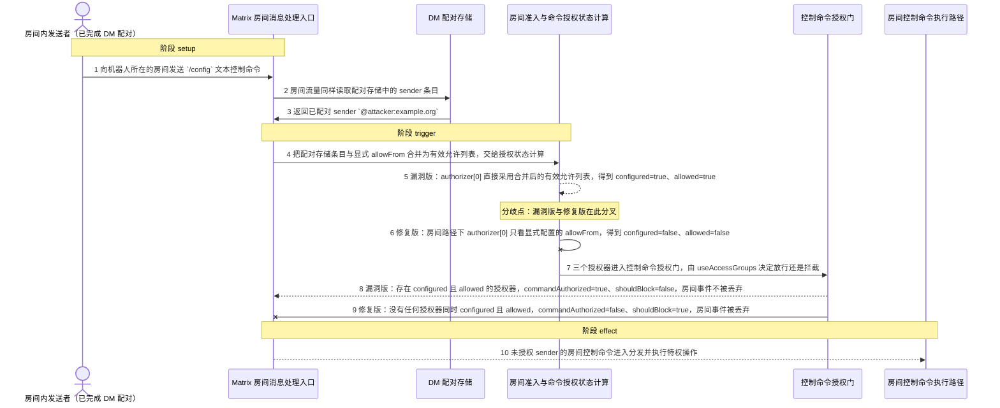
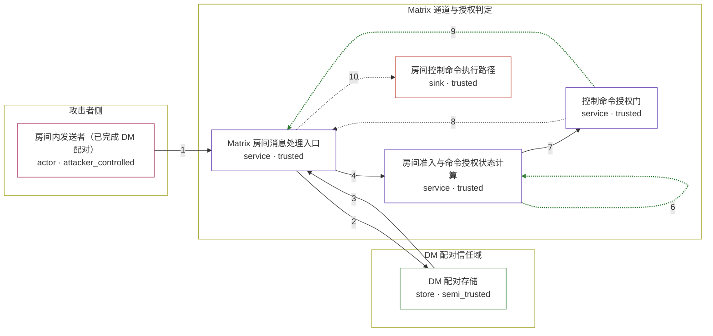

# openclaw / CVE-2026-44110

状态：草稿，未完成环境和复现。这个目录由模板生成，不构成漏洞确认。

图解的唯一来源是 `diagram.toml`：编辑后运行 `python3 -m runner diagram openclaw/CVE-2026-44110` 重新生成下方的图解区块。图解必须覆盖漏洞涉及的每个主体，并标出漏洞版/修复版的分歧步骤。

<!-- diagram:begin (generated from diagram.toml by `python3 -m runner diagram`; edit diagram.toml, not this block) -->
## 漏洞图解 — OpenClaw Matrix 房间控制命令授权绕过

Matrix 通道在处理房间文本控制命令时，把 DM 配对存储中的 sender 条目与显式 allowFrom 合并后作为命令授权依据，因此只要攻击者完成过 DM 配对，就会被判定为已授权的房间控制命令发送者。被绕过的信任边界是 DM 配对与房间授权之间的隔离：配对存储只记录 DM 准入，本不应让房间内的控制命令通过授权门。结果是未获房间授权的成员可以执行 `/config` 等特权控制命令，并凭同一判定绕过房间的 @ 提及要求。

### 涉及主体

| 主体 | 类型 | 信任级别 | 在漏洞里的作用 | 来源 |
| --- | --- | --- | --- | --- |
| 房间内发送者（已完成 DM 配对） (`attacker`) | `actor` | `attacker_controlled` | 已与机器人完成 DM 配对的 Matrix 用户，其 ID 因此留在配对存储中；它没有出现在任何显式房间允许列表里，却向机器人所在的房间投递 `/config` 文本控制命令。它只能控制自己的 sender ID 和这条消息的文本。 | fixtures/attack.json |
| DM 配对存储 (`pairing_store`) | `store` | `semi_trusted` | 保存经 DM 配对审批的 sender ID。它证明的只是完成过 DM 配对，本应只决定 DM 准入；漏洞路径却让房间流量一并读取它，并把其中的条目当作房间控制命令的授权依据。 | — |
| Matrix 房间消息处理入口 (`matrix_monitor`) | `service` | `trusted` | extensions/matrix 的房间消息处理器：读取配对存储、调用准入状态计算，并在控制命令门判定 shouldBlock 时丢弃房间事件。 | — |
| 房间准入与命令授权状态计算 (`access_state`) | `service` | `trusted` | resolveMatrixMonitorAccessState：把显式 allowFrom 与配对存储条目合并成有效允许列表，再派生三个命令授权器。缺陷在于房间路径下 authorizer[0] 直接采用了合并结果。 | — |
| 控制命令授权门 (`command_gate`) | `service` | `trusted` | resolveControlCommandGate：在 useAccessGroups 下根据授权器列表推出 commandAuthorized 与 shouldBlock，是房间控制命令放行或拦截的最终判定。 | — |
| 房间控制命令执行路径 (`command_executor`) | `sink` | `trusted` | 房间事件通过授权门后进入的分发与特权控制命令执行路径；漏洞版让未获房间授权的 sender 也抵达这里。 | — |

**信任边界**

- **攻击者侧** (`attacker_side`)：成员 `attacker`。攻击者只能控制自己的 Matrix sender ID 和发往房间的消息文本；它无法改写配对存储、房间配置或任何允许列表。
- **DM 配对信任域** (`dm_scope`)：成员 `pairing_store`。配对存储只覆盖 DM 准入，不能证明房间内的任何授权。漏洞恰好把这份 DM 信任外溢到了房间控制命令上。
- **Matrix 通道与授权判定** (`product`)：成员 `matrix_monitor`、`access_state`、`command_gate`、`command_executor`。这道边界本应保证只有房间允许列表或 room users 中显式授权的 sender 才能执行房间控制命令。

### 触发过程

### 主体与信任边界

箭头上的数字是上面的步骤编号；方框只标主体和信任级别，具体动作见「触发过程」。

**分歧点**：第 5 步（`vulnerable_only`）漏洞版：authorizer[0] 直接采用合并后的有效允许列表，得到 configured=true、allowed=true。
**分歧点**：第 6 步（`patched_only`）修复版：房间路径下 authorizer[0] 只看显式配置的 allowFrom，得到 configured=false、allowed=false。
<!-- diagram:end -->

## 公告与机制

TODO：官方公告、漏洞根因、Agent 信任边界、受影响范围和修复来源。

## 前提

TODO：认证要求、用户交互、已有批准、工具权限、攻击者能控制的内容。

## 版本与启动

TODO：补全 metadata、Dockerfile/镜像 digest 和 Compose，再写出精确启动命令。

Compose 中 `vulnerable` 与 `patched` profiles 分开使用；未指定 profile 不启动服务。镜像变量未配置时 Compose 会明确报错。此模板不暴露宿主端口，也不挂载主机数据。

## 机制复现

TODO：实现 `reproduce.py`，固定输入并执行真实漏洞路径，注明运行位置、参数和超时。

完成实现后使用 `python3 -m runner reproduce openclaw/CVE-2026-44110 --build --rounds 3`。
两脚本统一接受 `--context <context.json> --output <目录>`，详细字段见仓库 `docs/environment-contract.md`。
PoC 输出 `facts.json` 和效果文件；验证器只读证据，输出含 `target_ready` 及对应效果断言的 `verdict.json`。
镜像必须包含 Python 3 和 `/lab/` 下的脚本、fixtures；`runtime.mode` 选择 `oneshot` 或有 healthcheck 的 `service`。

## 端到端复现

TODO：实现 `end_to_end.py`；若不需要模型，明确写出不适用原因。真实模型的结果与机制复现分开统计。

## 验证与修复对照

TODO：实现 `verify.py`。记录漏洞版无害效果、修复版阻断和正常任务成功的证据，不能把服务启动失败当成阻断。

## 清理

默认运行器按每个测试的唯一 Compose project 清理容器、网络和 volume。
`--keep-on-failure` 保留失败项目，项目标识和 Compose 配置在结果目录中；仅清理该项目，不能使用全局 prune。

## 失败诊断

TODO：为本漏洞写出预期效果缺失、修复版仍有越界效果、正常任务失败及前提不满足时的具体排查路径。
启动失败、健康检查失败和超时都不能当作修复阻断。报告中应能定位到阶段、预期、实际和受控证据。

## 构建与输入

TODO：填写两版源码 archive、完整 commit，记录 `build.inputs` 中每个下载的 SHA-256；依赖安装必须支持禁网构建。
固定攻击和正常输入放入 `fixtures/` 并登记到 `fixtures/manifest.toml`。固定 seed、环境变量，说明无害效果与真实影响的关系。

## 隔离例外

默认无例外。确需例外时同时填写 `runtime.exceptions`、理由及最小范围，晋升由两位维护者审阅。

## 来源与许可

TODO：列出引用代码、fixtures 和镜像的来源及许可。
