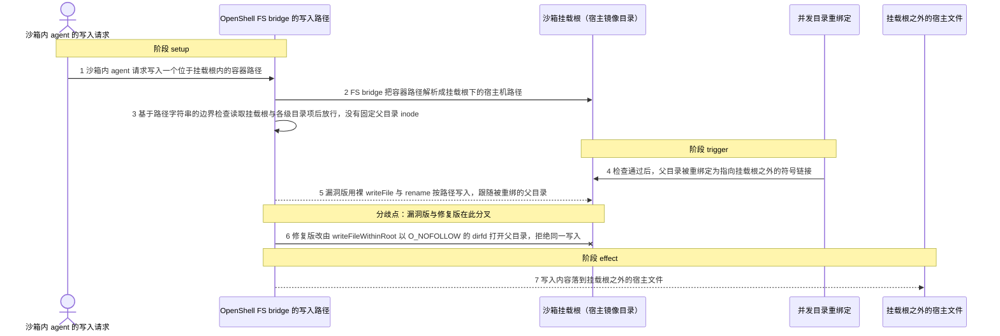
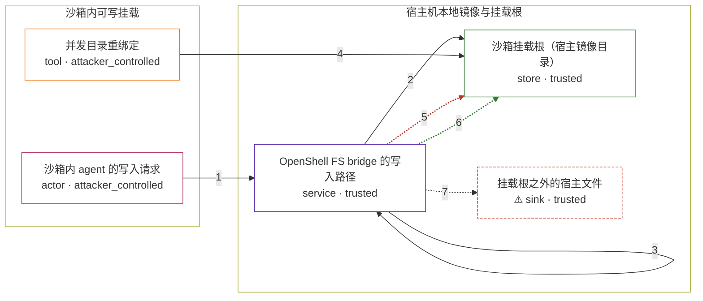

# openclaw / CVE-2026-44112

状态：草稿。generate 阶段已产出图解、固定输入与机制 PoC；`metadata.toml` 的版本/构建输入、`Dockerfile` 与 `verify.py` 仍待后续阶段落地，机制复现尚未在容器内验证。

图解的唯一来源是 `diagram.toml`：编辑后运行 `python3 -m runner diagram openclaw/CVE-2026-44112` 重新生成下方的图解区块。图解必须覆盖漏洞涉及的每个主体，并标出漏洞版/修复版的分歧步骤。

<!-- diagram:begin (generated from diagram.toml by `python3 -m runner diagram`; edit diagram.toml, not this block) -->
## 漏洞图解 — openclaw / CVE-2026-44112 漏洞图解

OpenShell FS bridge 收到沙箱内 agent 的写请求后，先用基于路径字符串的 assertLocalPathSafety 做一次边界检查，再用裸 writeFile 与 rename 按路径写入宿主机镜像目录。检查与写入之间没有把父目录 inode 固定住，攻击者在窗口内把父目录重绑定为指向挂载根之外的符号链接，后续按路径解析的写入就会跟随链接落到挂载根之外。修复版把写入改由 writeFileWithinRoot 完成：以 O_DIRECTORY|O_NOFOLLOW 的 dirfd 逐段打开父目录、相对 dirfd 原子替换，并在写入后复核 dev/ino，同一次重绑定被拒绝。

### 涉及主体

| 主体 | 类型 | 信任级别 | 在漏洞里的作用 | 来源 |
| --- | --- | --- | --- | --- |
| 沙箱内 agent 的写入请求 (`attacker`) | `actor` | `attacker_controlled` | 发起 writeFile 的沙箱内 agent。它只能控制写入请求里的容器路径，以及在可写挂载根内并发重绑目录项，无法直接访问挂载根之外的宿主文件系统。 | fixtures/attack.json |
| 并发目录重绑定 (`rebind`) | `tool` | `attacker_controlled` | 在边界检查通过之后，把目标父目录替换为指向挂载根之外的符号链接，用竞态窗口把 check 与 use 之间的路径解析结果换掉。 | — |
| OpenShell FS bridge 的写入路径 (`bridge`) | `service` | `trusted` | extensions/openshell/src/fs-bridge.ts 的 OpenShellFsBridge.writeFile：先做路径检查，再决定用裸路径 writeFile/rename 写宿主镜像，还是委托给 writeFileWithinRoot。 | extensions/openshell/src/fs-bridge.ts |
| 沙箱挂载根（宿主镜像目录） (`mount_root`) | `store` | `trusted` | agent 工作区对应的宿主机目录，是本应被守住的可写边界；父目录被重绑之后，按路径解析的写入会越过它落到别处。 | — |
| ⚠ 挂载根之外的宿主文件 (`outside`) | `sink` | `trusted` | 漏洞触发后内容实际落到的宿主位置，本来是 agent 够不着的文件系统。内容只是固定的无害标记，不是真实的外部目标，仅用于判定越界写入是否发生。 | — |

**信任边界**

- **沙箱内可写挂载** (`sandbox_side`)：成员 `attacker`、`rebind`。攻击者能控制容器路径参数，并能在挂载根里对目录项做重绑定；它不能直接读写挂载根之外的宿主文件系统。
- **宿主机本地镜像与挂载根** (`host_mirror`)：成员 `bridge`、`mount_root`、`outside`。挂载根之内是允许写入的镜像目录，之外是 agent 本应够不着的宿主文件系统。路径检查与写入之间缺少 inode 级固定，使这道边界在竞态窗口内失效。

标 ⚠ 的主体是本仓库合成的替身或无害效果载体，不代表真实外部目标。

### 触发过程

### 主体与信任边界

箭头上的数字是上面的步骤编号；方框只标主体和信任级别，具体动作见「触发过程」。

**分歧点**：第 5 步（`vulnerable_only`）漏洞版用裸 writeFile 与 rename 按路径写入，跟随被重绑的父目录。
**分歧点**：第 6 步（`patched_only`）修复版改由 writeFileWithinRoot 以 O_NOFOLLOW 的 dirfd 打开父目录，拒绝同一写入。
<!-- diagram:end -->

## 公告与机制

- canonical identifier：`CVE-2026-44112`；GitHub Advisory `GHSA-wppj-c6mr-83jj`（*OpenClaw: OpenShell FS bridge writes stay pinned to the sandbox mount root*，2026-05-04 发布）。
- 弱点 `CWE-367`（TOCTOU）；严重性 MODERATE，CVSS v3.1 `AV:N/AC:H/PR:L/UI:N/S:U/C:N/I:H/A:N`。
- 受影响上游：npm 包 `openclaw` 的 `extensions/openshell`，`<= 2026.4.21`；修复版本 `2026.4.22`。
- 根因：`extensions/openshell/src/fs-bridge.ts` 的 `OpenShellFsBridge.writeFile()` 用基于路径字符串的 `assertLocalPathSafety()` 做完边界检查后，直接拼 `.openclaw-openshell-write-*` 临时文件并调用 `fsPromises.writeFile` + `fsPromises.rename` 按路径写入宿主镜像目录。检查与写入之间没有内核级 inode 固定（没有 `O_NOFOLLOW`/`O_DIRECTORY` 打开的 dirfd），父目录在窗口内被重绑为符号链接后，按路径解析的写入会跟随链接落到挂载根之外。
- 修复提交 `7be82d4fd1193bcb7e44ee38838f00bf924ffa76`（*fix(openshell): pin host writes to sandbox root (#69797)*，父提交 `ae4c5cd460b4e2b0c9e67a956ded9bcdff01f632`）把写入改由 `writeFileWithinRoot()`（`src/infra/fs-safe.ts`，经 `src/infra/fs-pinned-write-helper.ts` 的 dirfd Python helper）完成，并在写后复核 `dev`/`ino`；`assertLocalPathSafety()` 仍然保留，但不再是唯一防线。`src/infra/fs-safe.ts` 在修复前后逐字节相同，说明 pinned 写入设施早就存在，缺陷在于 bridge 没有使用它。

## 前提

- POSIX 宿主文件系统，`openclaw` 为带缺陷的 `2026.4.21`（或受影响的 `<= 2026.4.21`）。
- 沙箱工作区以可写方式挂载到宿主机目录（`workspaceAccess = "rw"`），挂载根内已有可写目录。
- 攻击者能控制写请求里的容器路径，并能在挂载根内并发重绑目录项（把目标父目录换成指向挂载根之外的符号链接）；它无法直接读写挂载根之外的宿主文件系统。
- 触发依赖竞态：只有恰好落在 `assertLocalPathSafety()` 完成之后、`writeFile`/`rename` 解析路径之前的重绑定才会生效；静止状态下的符号链接父目录会被两版同样拒绝。
- 不需要模型 API（`requires_model = false`），也不需要认证、用户交互或已有批准。

## 版本与启动

构建阶段需要落地 `metadata.toml` 的 `[vulnerable]`/`[patched]`、`[build].base_image`（含 digest）与 `[build].inputs`，并替换 `Dockerfile` 模板桩。已核对的固定版本：

| variant | 发布标签 | commit |
| --- | --- | --- |
| vulnerable | `v2026.4.21` | `f788c88b4c508c335336fb292afed8c900656d6d`（缺陷父提交 `ae4c5cd460b4e2b0c9e67a956ded9bcdff01f632`） |
| patched | `v2026.4.22` | `00bd2cf7a376f1fba26291c6c4766f1f15cbdfa5`（含修复提交 `7be82d4f…`） |

Compose 中 `vulnerable` 与 `patched` profiles 分开使用；未指定 profile 不启动服务。镜像变量未配置时 Compose 会明确报错。模板不暴露宿主端口，也不挂载主机数据。

## 机制复现

`reproduce.py` 在容器内加载**被固定的上游源码本体**，不重写或抽取漏洞函数：

- 上游源码树由构建阶段放到 `/lab/upstream`（该 variant commit 的仓库根）。脚本用 `node --experimental-transform-types` 加一个解析钩子直接 import `extensions/openshell/src/fs-bridge.ts`，调用真实的 `createOpenShellFsBridge(...).writeFile(...)`。
- 解析钩子只替换与写入路径无关的叶子依赖：`../logger.js`（空 `logWarn`）、`openclaw/plugin-sdk/sandbox`（真实 `src/agents/sandbox/fs-bridge-rename-targets.ts`，只被 `rename` 使用）、`openclaw/plugin-sdk/text-runtime`（真实 `src/shared/string-coerce.ts`）；`openclaw/plugin-sdk/infra-runtime` 指向它的定义模块 `src/infra/fs-safe.ts`。上游树没有安装 `node_modules`，其余可达模块只用 Node 内建模块。
- 两个 scenario 都从 `/lab/fixtures/` 读取固定输入。`attack` 在边界检查通过后、写入路径对目标父目录的第一次宿主侧文件系统调用处把父目录重绑定为指向挂载根之外的符号链接（漏洞版的触发点是 `mkdir`，修复版是 pinned helper 之前的 `open`）；`benign` 用同一写入路径但不做重绑定。
- 可观察效果写入 `--output`：`bridge-report.json`（写入结果、错误码、`syncLocalPathToRemote` 是否被调用、挂载根内外是否出现文件），以及存在时的 `outside-write.txt` / `inside-write.txt`。
- `observation.json` 记录 `target_ready`（固定 bridge 模块是否成功加载并调用）、`execution_status`（漏洞版越界成功与修复版拒绝都算 `completed`）和 `escaped_outside_mount_root` 等判定字段。
- 需要 Node >= 22.14（与该包 `engines.node` 一致）与 Python 3；单次执行远低于 300s 默认超时。镜像必须包含 Python 3 和 `/lab/` 下的脚本与 fixtures；`runtime.mode = "oneshot"`。

完整命令：`python3 -m runner reproduce openclaw/CVE-2026-44112 --build --rounds 3`。两个脚本统一接受 `--context <context.json> --output <目录>`，字段见 `docs/environment-contract.md`。

## 端到端复现

不适用：该漏洞是宿主镜像写入的 TOCTOU 竞态，触发与利用都不经过模型推理；`metadata.toml` 已声明 `requires_model = false` 与 `[verification.end_to_end].status = "not_applicable"`。机制层对照足以说明漏洞版越界、修复版阻断与正常任务成功。

## 验证与修复对照

`verify.py` 只读 `facts.json`、`observation.json` 与效果文件，不重跑攻击：

- `vulnerable_effect_observed`：漏洞版 attack 中 `escaped_outside_mount_root = true`，且 `outside-write.txt` 内容等于固定标记。
- `patched_effect_blocked`：修复版 attack 中挂载根之外没有出现该文件（写入被 `SafeOpenError` 拒绝，或仍固定在挂载根内），且 `syncLocalPathToRemote` 未被调用。
- `benign_task_passed`：两个 variant 的 benign 任务都写入成功、文件落在挂载根内、`sync_called = true`。

不能把服务启动失败或超时当作修复阻断。

## 清理

默认运行器按每个测试的唯一 Compose project 清理容器、网络和 volume。
`--keep-on-failure` 保留失败项目，项目标识和 Compose 配置在结果目录中；仅清理该项目，不能使用全局 prune。

## 失败诊断

- 预期效果缺失（漏洞版没有越界）：先看 `observation.json` 的 `injected` / `injection_trigger` / `write_outcome`；`injected = false` 表示重绑定没有落在窗口内。再看 `node_stderr`，并用 `bridge-report.json` 的 `upstream_module` 确认加载到的是带缺陷的 `extensions/openshell/src/fs-bridge.ts`。
- 修复版仍有越界效果：说明加载到的不是修复版源码，或 `writeFileWithinRoot` 的 pinned helper 没有生效（helper 用 `spawn` 调 `/usr/bin/python3`，检查该解释器是否存在且可执行）。
- 正常任务失败：`write_outcome = "rejected"` 且错误与符号链接无关时，检查挂载根与 `notes/` 目录的权限以及 `workspaceAccess` 是否为 `rw`。
- 前提不满足：`target_ready = false` 时 `observation.json.reason` 会指出缺 node 还是缺 `/lab/upstream` 下的固定源码树；这两种都属于 not_run，不能当作修复阻断。
- 启动失败、健康检查失败和超时都不能当作修复阻断；报告中应能定位到阶段、预期、实际和受控证据。

## 构建与输入

- 采集阶段本地核对过的候选输入（构建阶段必须重新固定并把 SHA-256 登记进 `[build].inputs`）：
  - vulnerable 源码 archive：`https://codeload.github.com/openclaw/openclaw/tar.gz/ae4c5cd460b4e2b0c9e67a956ded9bcdff01f632`，SHA-256 `f5169734f1d3f8c0697608e9f6b755f757c8296899f41be9539b7d6c6f674e26`。
  - patched 源码 archive：`https://codeload.github.com/openclaw/openclaw/tar.gz/7be82d4fd1193bcb7e44ee38838f00bf924ffa76`，SHA-256 `4984931eb123ae10d6ea43d63cf8f547d87131ccd8ae1624e94b91219d95fbf6`。
  - 备选（不建议）：`https://registry.npmjs.org/openclaw/-/openclaw-2026.4.21.tgz` 与 `…-2026.4.22.tgz` 只含编译后的 `dist/`，导入它需要安装 42 个直接依赖及其传递依赖，禁网构建代价高；源码 archive 只依赖 Node 内建模块。
- 镜像需要在禁网构建下提供 Node >= 22.14 与 Python 3，并把对应 variant 的源码树解开到 `/lab/upstream`、`fixtures/` 复制到 `/lab/fixtures/`（与 `reproduce.py` 的文档字符串一致）。
- 固定输入：`fixtures/attack.json`（越界标记）与 `fixtures/benign.json`（正常任务标记），SHA-256 登记在 `fixtures/manifest.toml`。标记是无害字符串，只用于判定写入落点，不代表真实外部目标。
- 固定环境变量：`PYTHONHASHSEED=0`、`TZ=UTC`；`AVH_FIXTURES` / `AVH_UPSTREAM` 可选，用于覆盖默认的 `/lab/fixtures` 与 `/lab/upstream`。

## 隔离例外

默认无例外。确需例外时同时填写 `runtime.exceptions`、理由及最小范围，晋升由两位维护者审阅。

## 来源与许可

- 上游代码：`openclaw/openclaw`（MIT）。vulnerable `ae4c5cd460b4e2b0c9e67a956ded9bcdff01f632` / `v2026.4.21`；patched `7be82d4fd1193bcb7e44ee38838f00bf924ffa76` / `v2026.4.22`。
- 公告与元数据：<https://github.com/advisories/GHSA-wppj-c6mr-83jj>、<https://api.osv.dev/v1/vulns/GHSA-wppj-c6mr-83jj>、<https://nvd.nist.gov/vuln/detail/CVE-2026-44112>。
- 本环境的图解、固定输入与脚本为本仓库原创，用于机制对照；标记内容不含任何真实凭据或个人数据。
