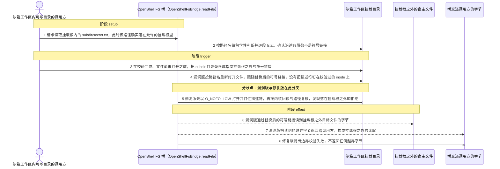
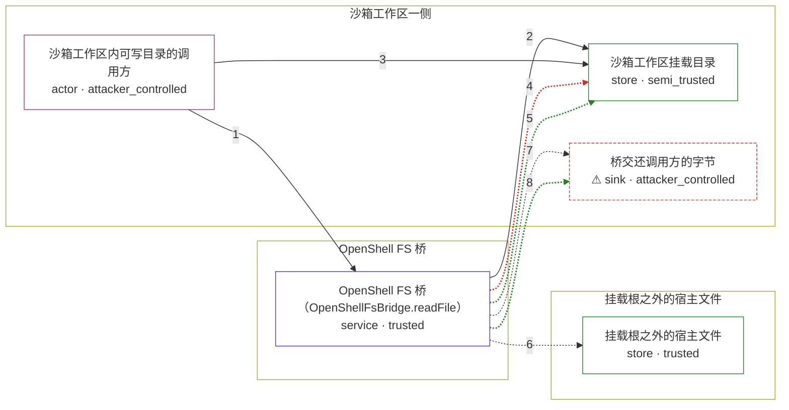

# openclaw / CVE-2026-44113

状态：草稿，未完成环境和复现。这个目录由模板生成，不构成漏洞确认。

图解的唯一来源是 `diagram.toml`：编辑后运行 `python3 -m runner diagram openclaw/CVE-2026-44113` 重新生成下方的图解区块。图解必须覆盖漏洞涉及的每个主体，并标出漏洞版/修复版的分歧步骤。

<!-- diagram:begin (generated from diagram.toml by `python3 -m runner diagram`; edit diagram.toml, not this block) -->
## 漏洞图解 — openclaw / CVE-2026-44113 漏洞图解

OpenClaw 的 OpenShell 文件系统桥在 readFile 里先按路径名逐段校验、再用同一个路径名重新打开文件，校验与打开之间没有任何被钉住的 inode。工作区可写方在校验完成之后把祖先目录替换成指向挂载根之外的符号链接，桥便跟随该链接返回宿主文件字节。被绕过的边界是挂载根 mountHostRoot 对沙箱工作区的读取限制，后果是挂载根之外文件的机密性泄露。

### 涉及主体

| 主体 | 类型 | 信任级别 | 在漏洞里的作用 | 来源 |
| --- | --- | --- | --- | --- |
| 沙箱工作区内可写目录的调用方 (`attacker`) | `actor` | `attacker_controlled` | 构造读取路径，并能在桥校验与打开之间改写工作区里的目录项；它读不到挂载根之外的宿主文件，那正是它要绕过边界拿到的东西。 | fixtures/attack.json |
| OpenShell FS 桥（OpenShellFsBridge.readFile） (`fs_bridge`) | `service` | `trusted` | 把读取限制在 mountHostRoot 之内：先按路径名做包含性判断并逐段 lstat，然后打开文件。缺陷在于校验结束后按名字重新打开，没有把描述符钉在校验过的 inode 上。 | — |
| 沙箱工作区挂载目录 (`workspace_mount`) | `store` | `semi_trusted` | 挂载根内被读取的目录树；其中的目录项可被工作区一侧的写入者替换成指向根外的符号链接。 | — |
| 挂载根之外的宿主文件 (`outside_file`) | `store` | `trusted` | openclaw 进程可读、但沙箱调用方本不该拿到的宿主文件；桥的路径校验负责把它挡在读取之外。 | — |
| ⚠ 桥交还调用方的字节 (`returned_bytes`) | `sink` | `attacker_controlled` | 漏洞触发后越界文件内容回到调用方；这里用无害标记字节表示泄露落点，不代表真实凭据。 | fixtures/attack.json |

**信任边界**

- **沙箱工作区一侧** (`sandbox_side`)：成员 `attacker`、`workspace_mount`、`returned_bytes`。调用方能改动挂载根内的目录项，越界读出的字节最终也回到这一侧；但它无法直接读取挂载根之外的宿主文件。
- **OpenShell FS 桥** (`bridge`)：成员 `fs_bridge`。桥是读取限制的执行点：它本应保证返回的每个字节都来自挂载根之内。
- **挂载根之外的宿主文件** (`protected_host`)：成员 `outside_file`。这道边界由 mountHostRoot 相关的路径校验维持；校验与打开分离，让它对并发目录替换失效。

标 ⚠ 的主体是本仓库合成的替身或无害效果载体，不代表真实外部目标。

### 触发过程

### 主体与信任边界

箭头上的数字是上面的步骤编号；方框只标主体和信任级别，具体动作见「触发过程」。

**分歧点**：第 4 步（`vulnerable_only`）漏洞版按路径名重新打开文件，跟随替换后的符号链接，没有把描述符钉在校验过的 inode 上。
**分歧点**：第 5 步（`patched_only`）修复版先以 O_NOFOLLOW 打开并钉住描述符，再按内核回读的路径复核，发现落在挂载根之外即拒绝。
<!-- diagram:end -->

## 公告与机制

TODO：官方公告、漏洞根因、Agent 信任边界、受影响范围和修复来源。

## 前提

TODO：认证要求、用户交互、已有批准、工具权限、攻击者能控制的内容。

## 版本与启动

TODO：补全 metadata、Dockerfile/镜像 digest 和 Compose，再写出精确启动命令。

Compose 中 `vulnerable` 与 `patched` profiles 分开使用；未指定 profile 不启动服务。镜像变量未配置时 Compose 会明确报错。此模板不暴露宿主端口，也不挂载主机数据。

## 机制复现

TODO：实现 `reproduce.py`，固定输入并执行真实漏洞路径，注明运行位置、参数和超时。

完成实现后使用 `python3 -m runner reproduce openclaw/CVE-2026-44113 --build --rounds 3`。
两脚本统一接受 `--context <context.json> --output <目录>`，详细字段见仓库 `docs/environment-contract.md`。
PoC 输出 `facts.json` 和效果文件；验证器只读证据，输出含 `target_ready` 及对应效果断言的 `verdict.json`。
镜像必须包含 Python 3 和 `/lab/` 下的脚本、fixtures；`runtime.mode` 选择 `oneshot` 或有 healthcheck 的 `service`。

## 端到端复现

TODO：实现 `end_to_end.py`；若不需要模型，明确写出不适用原因。真实模型的结果与机制复现分开统计。

## 验证与修复对照

TODO：实现 `verify.py`。记录漏洞版无害效果、修复版阻断和正常任务成功的证据，不能把服务启动失败当成阻断。

## 清理

默认运行器按每个测试的唯一 Compose project 清理容器、网络和 volume。
`--keep-on-failure` 保留失败项目，项目标识和 Compose 配置在结果目录中；仅清理该项目，不能使用全局 prune。

## 失败诊断

TODO：为本漏洞写出预期效果缺失、修复版仍有越界效果、正常任务失败及前提不满足时的具体排查路径。
启动失败、健康检查失败和超时都不能当作修复阻断。报告中应能定位到阶段、预期、实际和受控证据。

## 构建与输入

TODO：填写两版源码 archive、完整 commit，记录 `build.inputs` 中每个下载的 SHA-256；依赖安装必须支持禁网构建。
固定攻击和正常输入放入 `fixtures/` 并登记到 `fixtures/manifest.toml`。固定 seed、环境变量，说明无害效果与真实影响的关系。

## 隔离例外

默认无例外。确需例外时同时填写 `runtime.exceptions`、理由及最小范围，晋升由两位维护者审阅。

## 来源与许可

TODO：列出引用代码、fixtures 和镜像的来源及许可。
