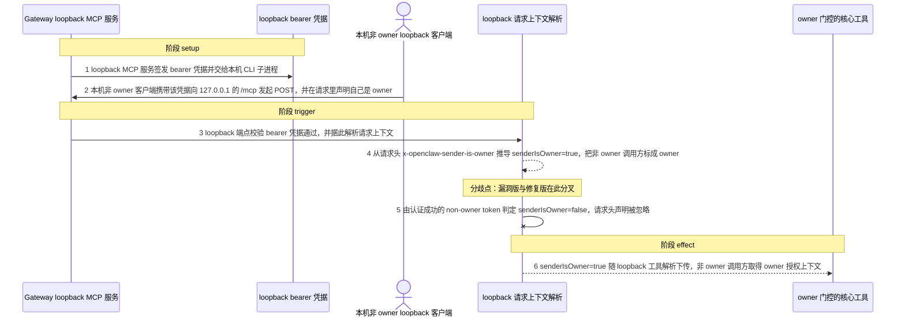
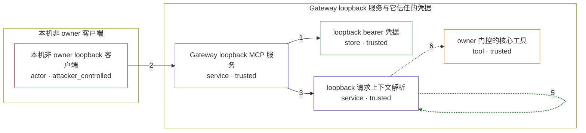

# openclaw / CVE-2026-44118

状态：草稿，未完成环境和复现。这个目录由模板生成，不构成漏洞确认。

图解的唯一来源是 `diagram.toml`：编辑后运行 `python3 -m runner diagram openclaw/CVE-2026-44118` 重新生成下方的图解区块。图解必须覆盖漏洞涉及的每个主体，并标出漏洞版/修复版的分歧步骤。

<!-- diagram:begin (generated from diagram.toml by `python3 -m runner diagram`; edit diagram.toml, not this block) -->
## 漏洞图解 — openclaw / CVE-2026-44118 漏洞图解

Gateway 在 127.0.0.1 上暴露的 loopback MCP 端点只用一个共享 bearer 凭据做认证，而「调用者是不是 owner」这一授权信号却取自请求头 x-openclaw-sender-is-owner。持有该凭据的本机非 owner 进程只要把该头写成 true，resolveMcpRequestContext 就会把 senderIsOwner 判成 true，越过 owner 信任边界。修复版改为分别签发 owner 与 non-owner 两个 token，senderIsOwner 只由哪一个 token 认证成功推导，请求头不再被读取。

### 涉及主体

| 主体 | 类型 | 信任级别 | 在漏洞里的作用 | 来源 |
| --- | --- | --- | --- | --- |
| 本机非 owner loopback 客户端 (`attacker`) | `actor` | `attacker_controlled` | 已能访问 loopback 端点并持有该 bearer 凭据的低权限本机进程；它能自行改写本次调用的请求头，把 owner 声明写成 true。 | — |
| Gateway loopback MCP 服务 (`gateway`) | `service` | `trusted` | 在 127.0.0.1 上监听 /mcp，校验 bearer 凭据、解析调用上下文，并把 senderIsOwner 交给 gateway 工具解析。 | src/gateway/mcp-http.ts |
| loopback bearer 凭据 (`loopback_bearer`) | `store` | `trusted` | Gateway 签发给本机 CLI 子进程的凭据。漏洞版只有一个共享 token，凭据本身不携带 owner 身份，owner 与否只能靠请求头区分。 | src/gateway/mcp-http.loopback-runtime.ts |
| loopback 请求上下文解析 (`request_context`) | `service` | `trusted` | 由 validateMcpLoopbackRequest 与 resolveMcpRequestContext 组成：前者只校验共享凭据，后者在漏洞版直接读取 x-openclaw-sender-is-owner 推导 senderIsOwner。 | src/gateway/mcp-http.request.ts |
| owner 门控的核心工具 (`owner_only_tools`) | `tool` | `trusted` | cron、gateway、nodes 等只应交给 owner 的工具面；漏洞版让 senderIsOwner=true 随 loopback 工具解析下传，非 owner 调用方因此取得 owner 授权上下文。 | src/agents/tools/owner-only-tools.ts |

**信任边界**

- **本机非 owner 客户端** (`attacker_side`)：成员 `attacker`。攻击者持有 loopback 凭据是前提条件而不是攻击动作；它能控制的只有本次调用的请求头和请求体，控制不了 Gateway 进程，也读不到 owner 专属数据。
- **Gateway loopback 服务与它信任的凭据** (`gateway_side`)：成员 `gateway`、`loopback_bearer`、`request_context`、`owner_only_tools`。这道边界要求 owner 身份只能由凭据本身推导；漏洞版把客户端可改的请求头当成授权信号，边界因此失效。

### 触发过程

### 主体与信任边界

箭头上的数字是上面的步骤编号；方框只标主体和信任级别，具体动作见「触发过程」。

**分歧点**：第 4 步（`vulnerable_only`）从请求头 x-openclaw-sender-is-owner 推导 senderIsOwner=true，把非 owner 调用方标成 owner。
**分歧点**：第 5 步（`patched_only`）由认证成功的 non-owner token 判定 senderIsOwner=false，请求头声明被忽略。
<!-- diagram:end -->

## 公告与机制

TODO：官方公告、漏洞根因、Agent 信任边界、受影响范围和修复来源。

## 前提

TODO：认证要求、用户交互、已有批准、工具权限、攻击者能控制的内容。

## 版本与启动

TODO：补全 metadata、Dockerfile/镜像 digest 和 Compose，再写出精确启动命令。

Compose 中 `vulnerable` 与 `patched` profiles 分开使用；未指定 profile 不启动服务。镜像变量未配置时 Compose 会明确报错。此模板不暴露宿主端口，也不挂载主机数据。

## 机制复现

TODO：实现 `reproduce.py`，固定输入并执行真实漏洞路径，注明运行位置、参数和超时。

完成实现后使用 `python3 -m runner reproduce openclaw/CVE-2026-44118 --build --rounds 3`。
两脚本统一接受 `--context <context.json> --output <目录>`，详细字段见仓库 `docs/environment-contract.md`。
PoC 输出 `facts.json` 和效果文件；验证器只读证据，输出含 `target_ready` 及对应效果断言的 `verdict.json`。
镜像必须包含 Python 3 和 `/lab/` 下的脚本、fixtures；`runtime.mode` 选择 `oneshot` 或有 healthcheck 的 `service`。

## 端到端复现

TODO：实现 `end_to_end.py`；若不需要模型，明确写出不适用原因。真实模型的结果与机制复现分开统计。

## 验证与修复对照

TODO：实现 `verify.py`。记录漏洞版无害效果、修复版阻断和正常任务成功的证据，不能把服务启动失败当成阻断。

## 清理

默认运行器按每个测试的唯一 Compose project 清理容器、网络和 volume。
`--keep-on-failure` 保留失败项目，项目标识和 Compose 配置在结果目录中；仅清理该项目，不能使用全局 prune。

## 失败诊断

TODO：为本漏洞写出预期效果缺失、修复版仍有越界效果、正常任务失败及前提不满足时的具体排查路径。
启动失败、健康检查失败和超时都不能当作修复阻断。报告中应能定位到阶段、预期、实际和受控证据。

## 构建与输入

TODO：填写两版源码 archive、完整 commit，记录 `build.inputs` 中每个下载的 SHA-256；依赖安装必须支持禁网构建。
固定攻击和正常输入放入 `fixtures/` 并登记到 `fixtures/manifest.toml`。固定 seed、环境变量，说明无害效果与真实影响的关系。

## 隔离例外

默认无例外。确需例外时同时填写 `runtime.exceptions`、理由及最小范围，晋升由两位维护者审阅。

## 来源与许可

TODO：列出引用代码、fixtures 和镜像的来源及许可。
