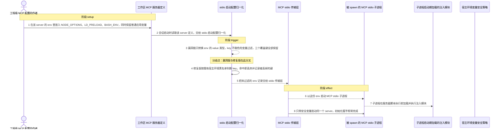
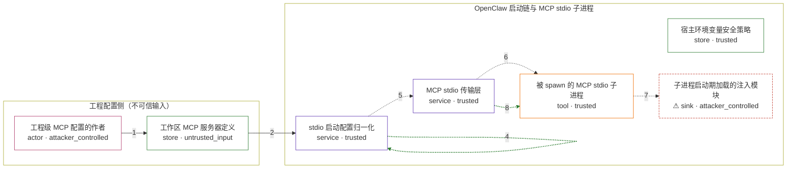

# openclaw / CVE-2026-44995

状态：草稿，未完成环境和复现。这个目录由模板生成，不构成漏洞确认。

图解的唯一来源是 `diagram.toml`：编辑后运行 `python3 -m runner diagram openclaw/CVE-2026-44995` 重新生成下方的图解区块。图解必须覆盖漏洞涉及的每个主体，并标出漏洞版/修复版的分歧步骤。

<!-- diagram:begin (generated from diagram.toml by `python3 -m runner diagram`; edit diagram.toml, not this block) -->
## 漏洞图解 — openclaw MCP stdio 环境变量注入

OpenClaw 的 MCP stdio 启动配置归一化只把 env 的 value 转成字符串，对 key 不做任何危险变量过滤，于是工程级 MCP 配置里的 NODE_OPTIONS、LD_PRELOAD、BASH_ENV 会原样进入被 spawn 的子进程环境。项目本来就有宿主环境变量安全策略，但这条 stdio env 路径从未调用它，不可信的工作区配置因此越过边界，让子进程在服务器脚本执行前加载攻击者的代码。修复版把同一份黑名单接到 stdio env 上，命中即丢弃。

### 涉及主体

| 主体 | 类型 | 信任级别 | 在漏洞里的作用 | 来源 |
| --- | --- | --- | --- | --- |
| 工程级 MCP 配置的作者 (`attacker`) | `actor` | `attacker_controlled` | 选择一个会被会话使用的 MCP server 名字，在该 server 的 env 里塞入启动期覆盖变量；命令与参数保持普通的 node 启动器，越界能力全部来自 env。 | — |
| 工作区 MCP 服务器定义 (`workspace_mcp_config`) | `store` | `untrusted_input` | 工程/工作区设置合并出的 mcp.servers 条目，其中的 env 映射是攻击者完全可控、而产品又当作启动参数使用的不可信输入。 | fixtures/mcp-stdio-attack.json |
| stdio 启动配置归一化 (`stdio_launch_config`) | `service` | `trusted` | resolveStdioMcpServerLaunchConfig 把 server 条目归一化成 command/args/env/cwd。漏洞版调用 toMcpStringRecord，只校验 value 类型、对 key 不做危险变量判断。 | src/agents/mcp-stdio.ts |
| 宿主环境变量安全策略 (`host_env_policy`) | `store` | `trusted` | 既有的危险环境变量黑名单：NODE_OPTIONS、BASH_ENV 等键与 LD_、DYLD_、BASH_FUNC_ 前缀。宿主执行路径一直用它，stdio env 路径却没有调用，属于遗漏调用而不是策略缺失。 | src/infra/host-env-security.ts |
| MCP stdio 传输层 (`stdio_transport`) | `service` | `trusted` | 把归一化结果里的 env 记录原样交给 StdioClientTransport，由它在 spawn 子进程时携带这些环境变量。 | src/agents/mcp-transport.ts |
| 被 spawn 的 MCP stdio 子进程 (`mcp_child`) | `tool` | `trusted` | 普通的 MCP stdio server 进程，本身不做任何特权操作；它的运行时行为完全取决于启动时拿到的环境变量。 | fixtures/mcp-stdio-server.mjs |
| ⚠ 子进程启动期加载的注入模块 (`injected_module`) | `sink` | `attacker_controlled` | 攻击者希望落到子进程里的启动期代码（NODE_OPTIONS 预加载模块、LD_PRELOAD 共享库、BASH_ENV 脚本）。固定复现里被加载的是一个只记录自身执行的无害标记模块，不代表真实攻击载荷。 | — |

**信任边界**

- **工程配置侧（不可信输入）** (`workspace_side`)：成员 `attacker`、`workspace_mcp_config`。攻击者只能提供工作区里的 MCP server 定义及其 env 映射；它拿不到宿主进程，也不能直接往子进程环境里写变量。
- **OpenClaw 启动链与 MCP stdio 子进程** (`runtime_side`)：成员 `stdio_launch_config`、`host_env_policy`、`stdio_transport`、`mcp_child`、`injected_module`。这道边界用宿主环境变量安全策略把危险键挡在受信执行环境之外。stdio env 路径漏掉了这次校验，于是不可信配置里的键原样进入子进程启动环境。

标 ⚠ 的主体是本仓库合成的替身或无害效果载体，不代表真实外部目标。

### 触发过程

### 主体与信任边界

箭头上的数字是上面的步骤编号；方框只标主体和信任级别，具体动作见「触发过程」。

**分歧点**：第 3 步（`vulnerable_only`）漏洞版只转换 env 的 value 类型，key 不做危险变量过滤，三个覆盖键全部保留。
**分歧点**：第 4 步（`patched_only`）修复版按既有宿主环境黑名单判断 key，命中即丢弃并记录被丢掉的键。
<!-- diagram:end -->

## 公告与机制

TODO：官方公告、漏洞根因、Agent 信任边界、受影响范围和修复来源。

## 前提

TODO：认证要求、用户交互、已有批准、工具权限、攻击者能控制的内容。

## 版本与启动

TODO：补全 metadata、Dockerfile/镜像 digest 和 Compose，再写出精确启动命令。

Compose 中 `vulnerable` 与 `patched` profiles 分开使用；未指定 profile 不启动服务。镜像变量未配置时 Compose 会明确报错。此模板不暴露宿主端口，也不挂载主机数据。

## 机制复现

TODO：实现 `reproduce.py`，固定输入并执行真实漏洞路径，注明运行位置、参数和超时。

完成实现后使用 `python3 -m runner reproduce openclaw/CVE-2026-44995 --build --rounds 3`。
两脚本统一接受 `--context <context.json> --output <目录>`，详细字段见仓库 `docs/environment-contract.md`。
PoC 输出 `facts.json` 和效果文件；验证器只读证据，输出含 `target_ready` 及对应效果断言的 `verdict.json`。
镜像必须包含 Python 3 和 `/lab/` 下的脚本、fixtures；`runtime.mode` 选择 `oneshot` 或有 healthcheck 的 `service`。

## 端到端复现

TODO：实现 `end_to_end.py`；若不需要模型，明确写出不适用原因。真实模型的结果与机制复现分开统计。

## 验证与修复对照

TODO：实现 `verify.py`。记录漏洞版无害效果、修复版阻断和正常任务成功的证据，不能把服务启动失败当成阻断。

## 清理

默认运行器按每个测试的唯一 Compose project 清理容器、网络和 volume。
`--keep-on-failure` 保留失败项目，项目标识和 Compose 配置在结果目录中；仅清理该项目，不能使用全局 prune。

## 失败诊断

TODO：为本漏洞写出预期效果缺失、修复版仍有越界效果、正常任务失败及前提不满足时的具体排查路径。
启动失败、健康检查失败和超时都不能当作修复阻断。报告中应能定位到阶段、预期、实际和受控证据。

## 构建与输入

TODO：填写两版源码 archive、完整 commit，记录 `build.inputs` 中每个下载的 SHA-256；依赖安装必须支持禁网构建。
固定攻击和正常输入放入 `fixtures/` 并登记到 `fixtures/manifest.toml`。固定 seed、环境变量，说明无害效果与真实影响的关系。

## 隔离例外

默认无例外。确需例外时同时填写 `runtime.exceptions`、理由及最小范围，晋升由两位维护者审阅。

## 来源与许可

TODO：列出引用代码、fixtures 和镜像的来源及许可。
