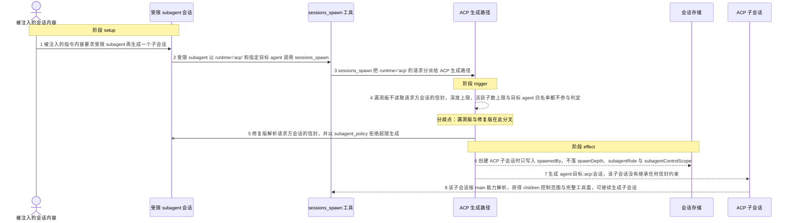
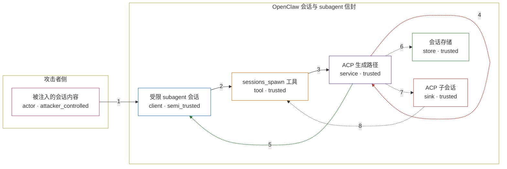

# openclaw / CVE-2026-44997

状态：草稿，未完成环境和复现。这个目录由模板生成，不构成漏洞确认。

图解的唯一来源是 `diagram.toml`：编辑后运行 `python3 -m runner diagram openclaw/CVE-2026-44997` 重新生成下方的图解区块。图解必须覆盖漏洞涉及的每个主体，并标出漏洞版/修复版的分歧步骤。

<!-- diagram:begin (generated from diagram.toml by `python3 -m runner diagram`; edit diagram.toml, not this block) -->
## 漏洞图解 — openclaw / CVE-2026-44997 ACP 子会话未继承 subagent 安全信封

OpenClaw 用 subagent 安全信封约束子会话：生成深度上限、活跃子数上限、控制范围与目标 agent 白名单。只有 runtime="subagent" 的生成路径执行这些检查，runtime="acp" 的生成路径既不读取信封，也不把 spawnDepth、subagentRole、subagentControlScope 写入会话存储。受限 subagent 越过信封生成出的 agent:<目标>:acp:<会话> 因此不再被识别为受约束会话，按 main 能力解析并获得 children 控制范围与完整工具面，可继续生成子会话，也能接触白名单外的目标 agent。

### 涉及主体

| 主体 | 类型 | 信任级别 | 在漏洞里的作用 | 来源 |
| --- | --- | --- | --- | --- |
| 被注入的会话内容 (`attacker`) | `actor` | `attacker_controlled` | 攻击者唯一能控制的是进入受限 subagent 上下文的指令内容；它诱导该 subagent 发出一次 runtime='acp' 的生成请求。 | fixtures/scenarios/attack.json |
| 受限 subagent 会话 (`restricted_subagent`) | `client` | `semi_trusted` | 带有生成深度、子数上限与目标 agent 白名单约束的 subagent 会话；它按收到的指令调用 sessions_spawn，是本次越界的发起方。 | src/agents/subagent-spawn.ts |
| sessions_spawn 工具 (`sessions_spawn_tool`) | `tool` | `trusted` | 接收生成请求并按 runtime 分派：runtime='subagent' 进入带信封检查的路径，runtime='acp' 进入 ACP 生成路径。 | src/agents/tools/sessions-spawn-tool.ts |
| ACP 生成路径 (`acp_spawn_path`) | `service` | `trusted` | 上游的 ACP 生成实现。漏洞版不解析请求方会话的信封，也不把信封字段落库；修复版在创建会话前解析并强制深度、活跃子数上限与目标 agent 白名单。 | src/agents/acp-spawn.ts |
| 会话存储 (`session_store`) | `store` | `trusted` | 保存每个会话的信封元数据（spawnDepth、subagentRole、subagentControlScope、spawnedBy）。ACP 子会话的条目缺少这些字段时，后续解析就不再把它当作受限会话。 | src/config/sessions/store.ts |
| ACP 子会话 (`acp_child_session`) | `sink` | `trusted` | 被生成的 agent:目标:acp:会话 会话。它没有继承任何信封约束，是攻击者想要的效果落点。 | src/agents/acp-spawn.ts |

**信任边界**

- **攻击者侧** (`attacker_side`)：成员 `attacker`。攻击者只能控制进入会话的指令内容，不能直接读写会话存储，也不能绕过工具入口调用生成实现。
- **OpenClaw 会话与 subagent 信封** (`product_runtime`)：成员 `restricted_subagent`、`sessions_spawn_tool`、`acp_spawn_path`、`session_store`、`acp_child_session`。信封本该把受限 subagent 的深度、子数与目标范围传递给它的每个子会话；ACP 路径没有读取信封，这道边界因此对 ACP 子会话失效。

### 触发过程

### 主体与信任边界

箭头上的数字是上面的步骤编号；方框只标主体和信任级别，具体动作见「触发过程」。

**分歧点**：第 4 步（`vulnerable_only`）漏洞版不读取请求方会话的信封，深度上限、活跃子数上限与目标 agent 白名单都不参与判定。
**分歧点**：第 5 步（`patched_only`）修复版解析请求方会话的信封，并以 subagent_policy 拒绝超限生成。
<!-- diagram:end -->

## 公告与机制

TODO：官方公告、漏洞根因、Agent 信任边界、受影响范围和修复来源。

## 前提

TODO：认证要求、用户交互、已有批准、工具权限、攻击者能控制的内容。

## 版本与启动

TODO：补全 metadata、Dockerfile/镜像 digest 和 Compose，再写出精确启动命令。

Compose 中 `vulnerable` 与 `patched` profiles 分开使用；未指定 profile 不启动服务。镜像变量未配置时 Compose 会明确报错。此模板不暴露宿主端口，也不挂载主机数据。

## 机制复现

TODO：实现 `reproduce.py`，固定输入并执行真实漏洞路径，注明运行位置、参数和超时。

完成实现后使用 `python3 -m runner reproduce openclaw/CVE-2026-44997 --build --rounds 3`。
两脚本统一接受 `--context <context.json> --output <目录>`，详细字段见仓库 `docs/environment-contract.md`。
PoC 输出 `facts.json` 和效果文件；验证器只读证据，输出含 `target_ready` 及对应效果断言的 `verdict.json`。
镜像必须包含 Python 3 和 `/lab/` 下的脚本、fixtures；`runtime.mode` 选择 `oneshot` 或有 healthcheck 的 `service`。

## 端到端复现

TODO：实现 `end_to_end.py`；若不需要模型，明确写出不适用原因。真实模型的结果与机制复现分开统计。

## 验证与修复对照

TODO：实现 `verify.py`。记录漏洞版无害效果、修复版阻断和正常任务成功的证据，不能把服务启动失败当成阻断。

## 清理

默认运行器按每个测试的唯一 Compose project 清理容器、网络和 volume。
`--keep-on-failure` 保留失败项目，项目标识和 Compose 配置在结果目录中；仅清理该项目，不能使用全局 prune。

## 失败诊断

TODO：为本漏洞写出预期效果缺失、修复版仍有越界效果、正常任务失败及前提不满足时的具体排查路径。
启动失败、健康检查失败和超时都不能当作修复阻断。报告中应能定位到阶段、预期、实际和受控证据。

## 构建与输入

TODO：填写两版源码 archive、完整 commit，记录 `build.inputs` 中每个下载的 SHA-256；依赖安装必须支持禁网构建。
固定攻击和正常输入放入 `fixtures/` 并登记到 `fixtures/manifest.toml`。固定 seed、环境变量，说明无害效果与真实影响的关系。

## 隔离例外

默认无例外。确需例外时同时填写 `runtime.exceptions`、理由及最小范围，晋升由两位维护者审阅。

## 来源与许可

TODO：列出引用代码、fixtures 和镜像的来源及许可。
