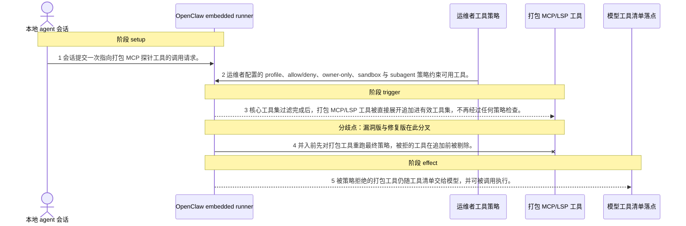
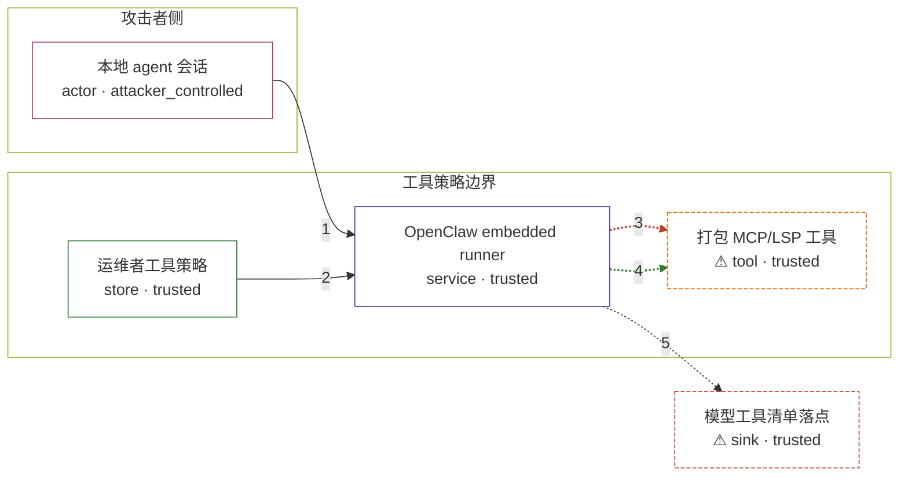

# openclaw / CVE-2026-44998

状态：草稿，未完成环境和复现。这个目录由模板生成，不构成漏洞确认。

图解的唯一来源是 `diagram.toml`：编辑后运行 `python3 -m runner diagram openclaw/CVE-2026-44998` 重新生成下方的图解区块。图解必须覆盖漏洞涉及的每个主体，并标出漏洞版/修复版的分歧步骤。

<!-- diagram:begin (generated from diagram.toml by `python3 -m runner diagram`; edit diagram.toml, not this block) -->
## 漏洞图解 — openclaw / CVE-2026-44998 漏洞图解

OpenClaw 的 embedded runner 先用 createOpenClawCodingTools() 把核心工具集过完 profile、allow/deny、owner-only、sandbox、subagent 各道工具策略，随后才把运维者配置的打包 MCP 与 LSP 工具直接展开追加到有效工具集，追加的这一步不再经过任何策略检查。被策略明确拒绝的打包工具因此仍留在 effectiveTools 中，随工具清单一起交给模型并可照常调用。修复版在并入打包工具之前先对它们重跑同一套最终策略，被拒的工具在追加前就被剔除。

### 涉及主体

| 主体 | 类型 | 信任级别 | 在漏洞里的作用 | 来源 |
| --- | --- | --- | --- | --- |
| 本地 agent 会话 (`agent_session`) | `actor` | `attacker_controlled` | 拥有本地 agent 访问权的一侧。它能构造会话内容，让模型去请求一个运维策略本应禁止的打包工具；它不能改写工具策略，也不能自行把工具塞进有效工具集，只能请求调用。 | fixtures/fixed-model-attack.json |
| 运维者工具策略 (`operator_policy`) | `store` | `trusted` | 运维者显式配置的工具边界：tool profile、allow/deny 列表、owner-only、sandbox tools、subagent tools。它是判定某个工具「应不应当可用」的唯一权威，也是被绕过的那道边界。 | fixtures/attack-config.json |
| OpenClaw embedded runner (`embedded_runner`) | `service` | `trusted` | 运行 src/agents/pi-embedded-runner/run/attempt.ts 里那次 attempt 的组件。它先由 createOpenClawCodingTools() 得到已过滤的核心工具集，再拼装 effectiveTools；缺陷就出在拼装顺序上。compress 路径 src/agents/pi-embedded-runner/compact.ts 有同一处拼装。 | src/agents/pi-embedded-runner/run/attempt.ts |
| ⚠ 打包 MCP/LSP 工具 (`bundled_mcp_tool`) | `tool` | `trusted` | 运维者在 MCP/LSP 来源里配置、由 bundleMcpRuntime / bundleLspRuntime 产出的工具。它本身是合法工具，问题在于它绕过策略后仍可被调用。此处用只返回固定标记的探针工具充当该角色，不连接任何外部服务。 | fixtures/bundled-mcp-tools.json |
| ⚠ 模型工具清单落点 (`model_endpoint`) | `sink` | `trusted` | 漏洞效果最终落到的地方：交给模型的工具清单，以及模型据此发起的工具调用。这里由固定模型输出来承载，它只回报自己收到了哪些工具、调用了哪个工具。 | fixtures/fixed-model-attack.json |

**信任边界**

- **攻击者侧** (`attacker_side`)：成员 `agent_session`。攻击者只能控制这次会话里要请求哪个工具，控制不了运维策略，也控制不了 runner 如何拼装工具集。
- **工具策略边界** (`policy_boundary`)：成员 `operator_policy`、`embedded_runner`、`bundled_mcp_tool`。这道边界要守住的不变量是：effectiveTools 里的任何工具都已经通过当前生效的工具策略。漏洞让打包工具在策略管线跑完之后才被追加，于是这道检查对它们从未生效。
- 未列入上述边界：`model_endpoint`。

标 ⚠ 的主体是本仓库合成的替身或无害效果载体，不代表真实外部目标。

### 触发过程

### 主体与信任边界

箭头上的数字是上面的步骤编号；方框只标主体和信任级别，具体动作见「触发过程」。

**分歧点**：第 3 步（`vulnerable_only`）核心工具集过滤完成后，打包 MCP/LSP 工具被直接展开追加进有效工具集，不再经过任何策略检查。。
**分歧点**：第 4 步（`patched_only`）并入前先对打包工具重跑最终策略，被拒的工具在追加前被剔除。。
<!-- diagram:end -->

## 公告与机制

TODO：官方公告、漏洞根因、Agent 信任边界、受影响范围和修复来源。

## 前提

TODO：认证要求、用户交互、已有批准、工具权限、攻击者能控制的内容。

## 版本与启动

TODO：补全 metadata、Dockerfile/镜像 digest 和 Compose，再写出精确启动命令。

Compose 中 `vulnerable` 与 `patched` profiles 分开使用；未指定 profile 不启动服务。镜像变量未配置时 Compose 会明确报错。此模板不暴露宿主端口，也不挂载主机数据。

## 机制复现

TODO：实现 `reproduce.py`，固定输入并执行真实漏洞路径，注明运行位置、参数和超时。

完成实现后使用 `python3 -m runner reproduce openclaw/CVE-2026-44998 --build --rounds 3`。
两脚本统一接受 `--context <context.json> --output <目录>`，详细字段见仓库 `docs/environment-contract.md`。
PoC 输出 `facts.json` 和效果文件；验证器只读证据，输出含 `target_ready` 及对应效果断言的 `verdict.json`。
镜像必须包含 Python 3 和 `/lab/` 下的脚本、fixtures；`runtime.mode` 选择 `oneshot` 或有 healthcheck 的 `service`。

## 端到端复现

TODO：实现 `end_to_end.py`；若不需要模型，明确写出不适用原因。真实模型的结果与机制复现分开统计。

## 验证与修复对照

TODO：实现 `verify.py`。记录漏洞版无害效果、修复版阻断和正常任务成功的证据，不能把服务启动失败当成阻断。

## 清理

默认运行器按每个测试的唯一 Compose project 清理容器、网络和 volume。
`--keep-on-failure` 保留失败项目，项目标识和 Compose 配置在结果目录中；仅清理该项目，不能使用全局 prune。

## 失败诊断

TODO：为本漏洞写出预期效果缺失、修复版仍有越界效果、正常任务失败及前提不满足时的具体排查路径。
启动失败、健康检查失败和超时都不能当作修复阻断。报告中应能定位到阶段、预期、实际和受控证据。

## 构建与输入

TODO：填写两版源码 archive、完整 commit，记录 `build.inputs` 中每个下载的 SHA-256；依赖安装必须支持禁网构建。
固定攻击和正常输入放入 `fixtures/` 并登记到 `fixtures/manifest.toml`。固定 seed、环境变量，说明无害效果与真实影响的关系。

## 隔离例外

默认无例外。确需例外时同时填写 `runtime.exceptions`、理由及最小范围，晋升由两位维护者审阅。

## 来源与许可

TODO：列出引用代码、fixtures 和镜像的来源及许可。
