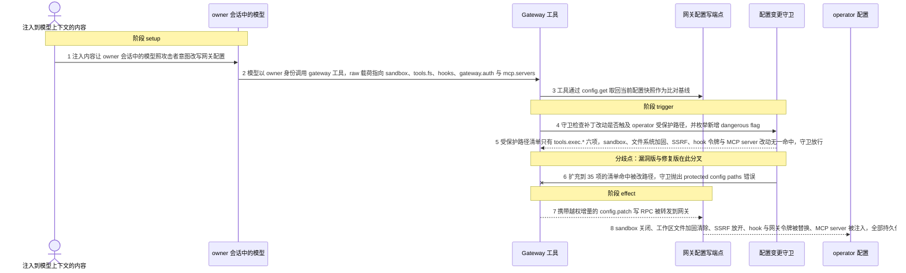
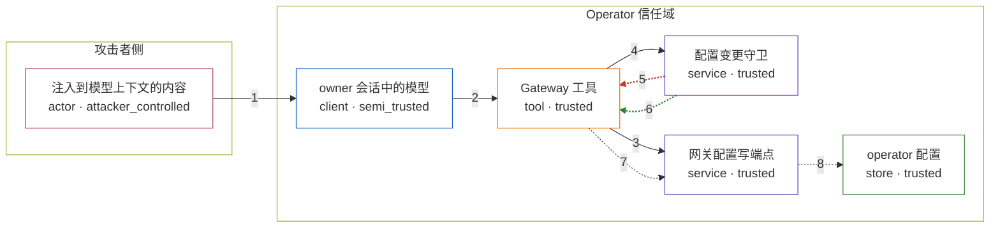

# openclaw / CVE-2026-45001

状态：草稿，未完成环境和复现。这个目录由模板生成，不构成漏洞确认。

图解的唯一来源是 `diagram.toml`：编辑后运行 `python3 -m runner diagram openclaw/CVE-2026-45001` 重新生成下方的图解区块。图解必须覆盖漏洞涉及的每个主体，并标出漏洞版/修复版的分歧步骤。

<!-- diagram:begin (generated from diagram.toml by `python3 -m runner diagram`; edit diagram.toml, not this block) -->
## 漏洞图解 — openclaw / CVE-2026-45001 gateway 配置变更守卫绕过

被 prompt injection 操纵的模型在 owner 会话里调用 owner-only 的 gateway 工具，通过 config.patch 改写 sandbox 隔离、工作区文件加固、浏览器 SSRF 策略、hook 与网关凭据、MCP server 等 operator 信任域配置。守卫的两层检查都没有覆盖这些路径：受保护路径清单只有 tools.exec.* 六项，dangerous flag 枚举也不含这些键，于是写 RPC 被转发并持久化；修复提交把清单扩到 35 项并新增按 id 投影的数组路径比对，同一载荷改由守卫抛错拒绝。

### 涉及主体

| 主体 | 类型 | 信任级别 | 在漏洞里的作用 | 来源 |
| --- | --- | --- | --- | --- |
| 注入到模型上下文的内容 (`injected_content`) | `actor` | `attacker_controlled` | 攻击者植入 owner 会话可读内容里的指令与配置增量，诱导模型以 owner 身份发出 gateway 工具调用。 | fixtures/attack/injected-instruction.txt |
| owner 会话中的模型 (`agent_session`) | `client` | `semi_trusted` | 按 SECURITY.md 的模型假设不是可信主体，却持有 owner 会话的 owner-only 工具；它把攻击者构造的 raw 载荷组装成 config.patch 调用。 | fixtures/attack/config-patch.json |
| Gateway 工具 (`gateway_tool`) | `tool` | `trusted` | owner-only 的 gateway 工具；config.patch 分支先取当前配置快照，再交给配置变更守卫，通过后把写 RPC 转发给网关。 | src/agents/tools/gateway-tool.ts |
| 配置变更守卫 (`config_guard`) | `service` | `trusted` | assertGatewayConfigMutationAllowed：受保护路径清单加 dangerous flag 枚举两层检查；漏洞版清单只有 tools.exec.* 六项，且枚举漏掉 sandbox、plugins、auth/TLS、hooks、SSRF 与 MCP。 | — |
| 网关配置写端点 (`gateway_rpc`) | `service` | `trusted` | 接收 config.patch 与 config.apply 写 RPC 并落盘；守卫放行后它照常收到并处理越权写请求。 | — |
| operator 配置 (`operator_config`) | `store` | `trusted` | sandbox 隔离、插件信任、网关 auth/TLS、hook 路由与令牌、SSRF 策略、MCP server 等 operator 信任域配置。 | fixtures/attack/config-patch.json |

**信任边界**

- **攻击者侧** (`attacker_side`)：成员 `injected_content`。攻击者只能控制注入内容与工具参数，够不到 operator 配置本身，因此必须借模型之手越界。
- **Operator 信任域** (`operator_domain`)：成员 `agent_session`、`gateway_tool`、`config_guard`、`gateway_rpc`、`operator_config`。这道边界本应阻止模型改写 operator 配置；模型虽在边界内并持有 owner-only 工具，却不属于可信主体，守卫的路径粒度不足使边界失效。

### 触发过程

### 主体与信任边界

箭头上的数字是上面的步骤编号；方框只标主体和信任级别，具体动作见「触发过程」。

**分歧点**：第 5 步（`vulnerable_only`）受保护路径清单只有 tools.exec.* 六项，sandbox、文件系统加固、SSRF、hook 令牌与 MCP server 改动无一命中，守卫放行。
**分歧点**：第 6 步（`patched_only`）扩充到 35 项的清单命中被改路径，守卫抛出 protected config paths 错误。
<!-- diagram:end -->

## 公告与机制

TODO：官方公告、漏洞根因、Agent 信任边界、受影响范围和修复来源。

## 前提

TODO：认证要求、用户交互、已有批准、工具权限、攻击者能控制的内容。

## 版本与启动

TODO：补全 metadata、Dockerfile/镜像 digest 和 Compose，再写出精确启动命令。

Compose 中 `vulnerable` 与 `patched` profiles 分开使用；未指定 profile 不启动服务。镜像变量未配置时 Compose 会明确报错。此模板不暴露宿主端口，也不挂载主机数据。

## 机制复现

TODO：实现 `reproduce.py`，固定输入并执行真实漏洞路径，注明运行位置、参数和超时。

完成实现后使用 `python3 -m runner reproduce openclaw/CVE-2026-45001 --build --rounds 3`。
两脚本统一接受 `--context <context.json> --output <目录>`，详细字段见仓库 `docs/environment-contract.md`。
PoC 输出 `facts.json` 和效果文件；验证器只读证据，输出含 `target_ready` 及对应效果断言的 `verdict.json`。
镜像必须包含 Python 3 和 `/lab/` 下的脚本、fixtures；`runtime.mode` 选择 `oneshot` 或有 healthcheck 的 `service`。

## 端到端复现

TODO：实现 `end_to_end.py`；若不需要模型，明确写出不适用原因。真实模型的结果与机制复现分开统计。

## 验证与修复对照

TODO：实现 `verify.py`。记录漏洞版无害效果、修复版阻断和正常任务成功的证据，不能把服务启动失败当成阻断。

## 清理

默认运行器按每个测试的唯一 Compose project 清理容器、网络和 volume。
`--keep-on-failure` 保留失败项目，项目标识和 Compose 配置在结果目录中；仅清理该项目，不能使用全局 prune。

## 失败诊断

TODO：为本漏洞写出预期效果缺失、修复版仍有越界效果、正常任务失败及前提不满足时的具体排查路径。
启动失败、健康检查失败和超时都不能当作修复阻断。报告中应能定位到阶段、预期、实际和受控证据。

## 构建与输入

TODO：填写两版源码 archive、完整 commit，记录 `build.inputs` 中每个下载的 SHA-256；依赖安装必须支持禁网构建。
固定攻击和正常输入放入 `fixtures/` 并登记到 `fixtures/manifest.toml`。固定 seed、环境变量，说明无害效果与真实影响的关系。

## 隔离例外

默认无例外。确需例外时同时填写 `runtime.exceptions`、理由及最小范围，晋升由两位维护者审阅。

## 来源与许可

TODO：列出引用代码、fixtures 和镜像的来源及许可。
