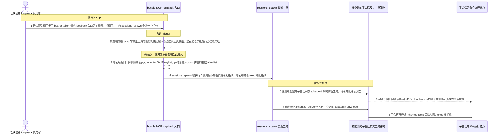
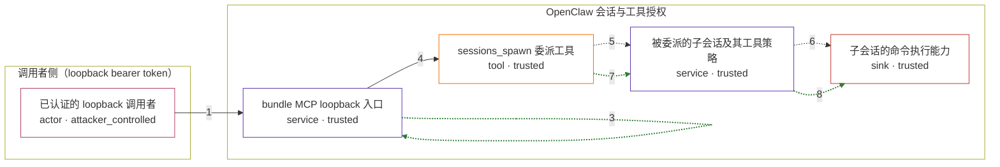

# openclaw / CVE-2026-53820

状态：草稿，未完成环境和复现。这个目录由模板生成，不构成漏洞确认。

图解的唯一来源是 `diagram.toml`：编辑后运行 `python3 -m runner diagram openclaw/CVE-2026-53820` 重新生成下方的图解区块。图解必须覆盖漏洞涉及的每个主体，并标出漏洞版/修复版的分歧步骤。

<!-- diagram:begin (generated from diagram.toml by `python3 -m runner diagram`; edit diagram.toml, not this block) -->
## 漏洞图解 — openclaw / CVE-2026-53820 漏洞图解

bundle MCP loopback 入口在解析自己暴露的工具时，会把 read、write、edit、apply_patch、exec、process 这些原生工具从返回数组里剔除；漏洞版只用这份列表过滤本次返回值，没有把它写进任何会话级策略。入口暴露的 sessions_spawn 因此可以在不带限制的情况下委派子会话，子会话重新按普通 subagent 策略获得 exec，loopback 入口原本的命令限制被绕过。修复版把同一份列表并入 inheritedToolDenylist 并写入子会话的 capability envelope，子会话再经过 inherited tools 策略步骤后 exec 被拒绝。

### 涉及主体

| 主体 | 类型 | 信任级别 | 在漏洞里的作用 | 来源 |
| --- | --- | --- | --- | --- |
| 已认证的 loopback 调用者 (`attacker`) | `actor` | `attacker_controlled` | 持有 loopback bearer token 的已认证调用者。它只能控制这一次 MCP 请求的内容：请求哪些工具、以及把 sessions_spawn 当作工具调用；它不能直接修改 gateway 策略或子会话记录。 | fixtures/attack_request.json |
| bundle MCP loopback 入口 (`loopback`) | `service` | `trusted` | 只监听 127.0.0.1、按 owner/non-owner token 判定调用者身份的 MCP 入口。它用 excludeToolNames 把原生命令工具从自己暴露的工具表里剔除，这就是本漏洞所说的 exec denylist。 | src/gateway/mcp-http.runtime.ts |
| sessions_spawn 委派工具 (`spawn`) | `tool` | `trusted` | loopback 入口暴露的委派工具，不在原生工具剔除列表里，因此仍可被调用。它负责把调用方的工具限制传给被 spawn 的子会话。 | src/agents/tools/sessions-spawn-tool.ts |
| 被委派的子会话及其工具策略 (`child`) | `service` | `trusted` | 由 sessions_spawn 创建的子会话。它的工具授权由 subagent 策略和（修复版新增的）inherited tools 策略共同决定；漏洞版缺少后者，因此继承不到调用方的限制。 | src/agents/pi-tools.policy.ts |
| 子会话的命令执行能力 (`exec`) | `sink` | `trusted` | 漏洞效果落点：被委派的会话实际获得的 exec 授权。攻击者想要的正是调用方自己够不到的命令执行能力，所以它属于产品内侧的受信能力，而不是攻击者可控的输入。 | src/agents/tool-policy.ts |

**信任边界**

- **调用者侧（loopback bearer token）** (`caller_side`)：成员 `attacker`。攻击者只能控制一次已认证 MCP 请求的参数：请求哪些工具、是否调用 sessions_spawn。token 只决定 owner/non-owner，不改变工具策略本身。
- **OpenClaw 会话与工具授权** (`product_side`)：成员 `loopback`、`spawn`、`child`、`exec`。这道边界本来保证 loopback 入口剔除的命令能力不会被它派生的会话重新拿到。漏洞版只过滤了入口自己的返回值，没有把剔除列表随 spawn 传递，边界因此在委派这一步失效。

### 触发过程

### 主体与信任边界

箭头上的数字是上面的步骤编号；方框只标主体和信任级别，具体动作见「触发过程」。

**分歧点**：第 2 步（`vulnerable_only`）漏洞版只用 exec 等原生工具的剔除列表过滤本次返回的工具数组，没有把它写进任何会话级策略。
**分歧点**：第 3 步（`patched_only`）修复版把同一份剔除列表并入 inheritedToolDenylist，并准备随 spawn 传递的有效 allowlist。
<!-- diagram:end -->

## 公告与机制

TODO：官方公告、漏洞根因、Agent 信任边界、受影响范围和修复来源。

## 前提

TODO：认证要求、用户交互、已有批准、工具权限、攻击者能控制的内容。

## 版本与启动

TODO：补全 metadata、Dockerfile/镜像 digest 和 Compose，再写出精确启动命令。

Compose 中 `vulnerable` 与 `patched` profiles 分开使用；未指定 profile 不启动服务。镜像变量未配置时 Compose 会明确报错。此模板不暴露宿主端口，也不挂载主机数据。

## 机制复现

TODO：实现 `reproduce.py`，固定输入并执行真实漏洞路径，注明运行位置、参数和超时。

完成实现后使用 `python3 -m runner reproduce openclaw/CVE-2026-53820 --build --rounds 3`。
两脚本统一接受 `--context <context.json> --output <目录>`，详细字段见仓库 `docs/environment-contract.md`。
PoC 输出 `facts.json` 和效果文件；验证器只读证据，输出含 `target_ready` 及对应效果断言的 `verdict.json`。
镜像必须包含 Python 3 和 `/lab/` 下的脚本、fixtures；`runtime.mode` 选择 `oneshot` 或有 healthcheck 的 `service`。

## 端到端复现

TODO：实现 `end_to_end.py`；若不需要模型，明确写出不适用原因。真实模型的结果与机制复现分开统计。

## 验证与修复对照

TODO：实现 `verify.py`。记录漏洞版无害效果、修复版阻断和正常任务成功的证据，不能把服务启动失败当成阻断。

## 清理

默认运行器按每个测试的唯一 Compose project 清理容器、网络和 volume。
`--keep-on-failure` 保留失败项目，项目标识和 Compose 配置在结果目录中；仅清理该项目，不能使用全局 prune。

## 失败诊断

TODO：为本漏洞写出预期效果缺失、修复版仍有越界效果、正常任务失败及前提不满足时的具体排查路径。
启动失败、健康检查失败和超时都不能当作修复阻断。报告中应能定位到阶段、预期、实际和受控证据。

## 构建与输入

TODO：填写两版源码 archive、完整 commit，记录 `build.inputs` 中每个下载的 SHA-256；依赖安装必须支持禁网构建。
固定攻击和正常输入放入 `fixtures/` 并登记到 `fixtures/manifest.toml`。固定 seed、环境变量，说明无害效果与真实影响的关系。

## 隔离例外

默认无例外。确需例外时同时填写 `runtime.exceptions`、理由及最小范围，晋升由两位维护者审阅。

## 来源与许可

TODO：列出引用代码、fixtures 和镜像的来源及许可。
