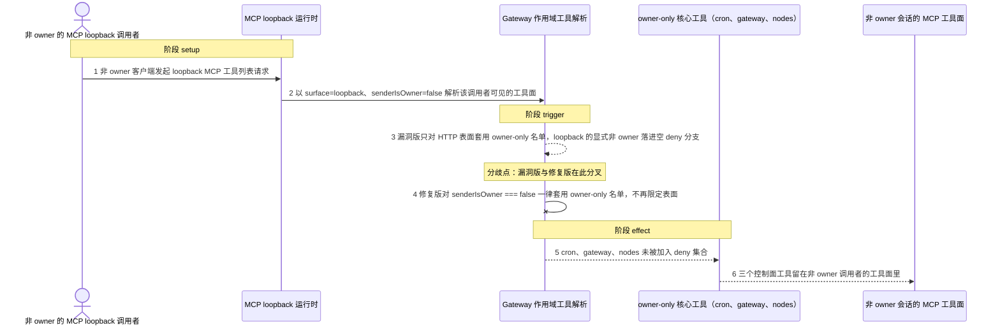
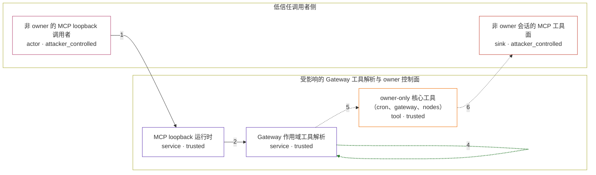

# openclaw / CVE-2026-62195

状态：草稿，未完成环境和复现。这个目录由模板生成，不构成漏洞确认。

图解的唯一来源是 `diagram.toml`：编辑后运行 `python3 -m runner diagram openclaw/CVE-2026-62195` 重新生成下方的图解区块。图解必须覆盖漏洞涉及的每个主体，并标出漏洞版/修复版的分歧步骤。

<!-- diagram:begin (generated from diagram.toml by `python3 -m runner diagram`; edit diagram.toml, not this block) -->
## 漏洞图解 — openclaw / CVE-2026-62195 MCP loopback 越权暴露 owner-only 工具

MCP loopback 运行时为调用者解析可见工具面时，只对 HTTP 表面套用 owner-only 核心工具名单，显式非 owner 的 loopback 调用者因此落进空 deny 分支。修复版把 senderIsOwner === false 从 HTTP 限定中拆出，使 loopback 上的显式非 owner 同样被拒绝 cron、gateway、nodes。效果是低信任调用者拿到本应只属于 owner 的控制面工具。

### 涉及主体

| 主体 | 类型 | 信任级别 | 在漏洞里的作用 | 来源 |
| --- | --- | --- | --- | --- |
| 非 owner 的 MCP loopback 调用者 (`non_owner_caller`) | `actor` | `attacker_controlled` | 持非 owner bearer 身份向 loopback MCP 表面请求工具列表。它只能控制这次请求的表面与会话上下文，改不了服务端对 owner 身份的判定，也改不了工具策略本身。 | — |
| MCP loopback 运行时 (`mcp_loopback`) | `service` | `trusted` | 为 loopback MCP 客户端解析可见工具面，把 surface=loopback 与 senderIsOwner 一并交给共享的 Gateway 工具解析。 | — |
| Gateway 作用域工具解析 (`tool_resolution`) | `service` | `trusted` | 计算最终 deny 集合并过滤工具面。漏洞版的 owner-only 收窄写成只对 HTTP 表面生效，loopback 的显式非 owner 落进 : [] 分支。 | — |
| owner-only 核心工具（cron、gateway、nodes） (`owner_only_tools`) | `tool` | `trusted` | 需要 owner 身份的控制面工具：定时任务编排、网关重配置与节点命令中继。它们本应只出现在 owner 调用者的工具面里。 | — |
| 非 owner 会话的 MCP 工具面 (`non_owner_tool_surface`) | `sink` | `attacker_controlled` | 漏洞效果落点：非 owner 调用者解析出的工具面里保留并可调用 owner-only 核心工具。 | — |

**信任边界**

- **低信任调用者侧** (`caller_side`)：成员 `non_owner_caller`、`non_owner_tool_surface`。调用者只能控制自己的 loopback 请求以及随之解析出的工具面，够不到服务端的 owner 身份判定和工具策略。
- **受影响的 Gateway 工具解析与 owner 控制面** (`gateway_side`)：成员 `mcp_loopback`、`tool_resolution`、`owner_only_tools`。这道边界本来只让 owner 调用者拿到 cron、gateway、nodes；漏洞让显式非 owner 的 loopback 调用穿过了它。

### 触发过程

### 主体与信任边界

箭头上的数字是上面的步骤编号；方框只标主体和信任级别，具体动作见「触发过程」。

**分歧点**：第 3 步（`vulnerable_only`）漏洞版只对 HTTP 表面套用 owner-only 名单，loopback 的显式非 owner 落进空 deny 分支。
**分歧点**：第 4 步（`patched_only`）修复版对 senderIsOwner === false 一律套用 owner-only 名单，不再限定表面。
<!-- diagram:end -->

## 公告与机制

TODO：官方公告、漏洞根因、Agent 信任边界、受影响范围和修复来源。

## 前提

TODO：认证要求、用户交互、已有批准、工具权限、攻击者能控制的内容。

## 版本与启动

TODO：补全 metadata、Dockerfile/镜像 digest 和 Compose，再写出精确启动命令。

Compose 中 `vulnerable` 与 `patched` profiles 分开使用；未指定 profile 不启动服务。镜像变量未配置时 Compose 会明确报错。此模板不暴露宿主端口，也不挂载主机数据。

## 机制复现

TODO：实现 `reproduce.py`，固定输入并执行真实漏洞路径，注明运行位置、参数和超时。

完成实现后使用 `python3 -m runner reproduce openclaw/CVE-2026-62195 --build --rounds 3`。
两脚本统一接受 `--context <context.json> --output <目录>`，详细字段见仓库 `docs/environment-contract.md`。
PoC 输出 `facts.json` 和效果文件；验证器只读证据，输出含 `target_ready` 及对应效果断言的 `verdict.json`。
镜像必须包含 Python 3 和 `/lab/` 下的脚本、fixtures；`runtime.mode` 选择 `oneshot` 或有 healthcheck 的 `service`。

## 端到端复现

TODO：实现 `end_to_end.py`；若不需要模型，明确写出不适用原因。真实模型的结果与机制复现分开统计。

## 验证与修复对照

TODO：实现 `verify.py`。记录漏洞版无害效果、修复版阻断和正常任务成功的证据，不能把服务启动失败当成阻断。

## 清理

默认运行器按每个测试的唯一 Compose project 清理容器、网络和 volume。
`--keep-on-failure` 保留失败项目，项目标识和 Compose 配置在结果目录中；仅清理该项目，不能使用全局 prune。

## 失败诊断

TODO：为本漏洞写出预期效果缺失、修复版仍有越界效果、正常任务失败及前提不满足时的具体排查路径。
启动失败、健康检查失败和超时都不能当作修复阻断。报告中应能定位到阶段、预期、实际和受控证据。

## 构建与输入

TODO：填写两版源码 archive、完整 commit，记录 `build.inputs` 中每个下载的 SHA-256；依赖安装必须支持禁网构建。
固定攻击和正常输入放入 `fixtures/` 并登记到 `fixtures/manifest.toml`。固定 seed、环境变量，说明无害效果与真实影响的关系。

## 隔离例外

默认无例外。确需例外时同时填写 `runtime.exceptions`、理由及最小范围，晋升由两位维护者审阅。

## 来源与许可

TODO：列出引用代码、fixtures 和镜像的来源及许可。
