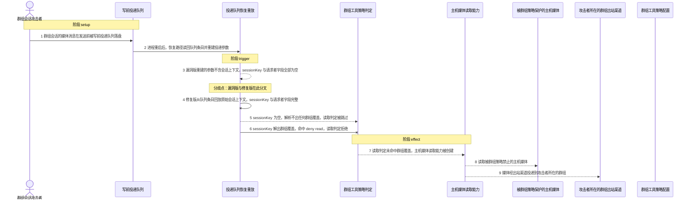
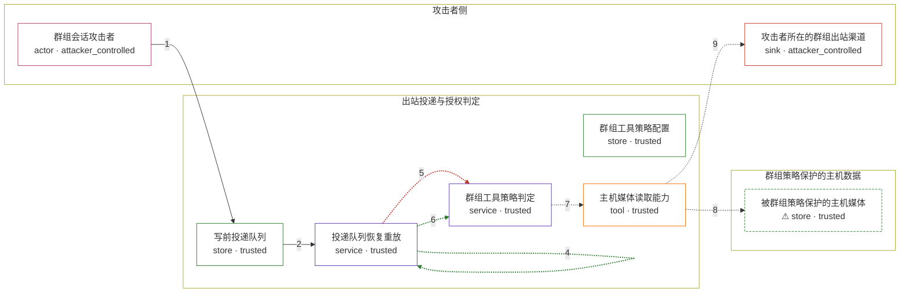

# openclaw / GHSA-82RM-QCFX-2V78

状态：草稿，未完成环境和复现。这个目录由模板生成，不构成漏洞确认。

图解的唯一来源是 `diagram.toml`：编辑后运行 `python3 -m runner diagram openclaw/GHSA-82RM-QCFX-2V78` 重新生成下方的图解区块。图解必须覆盖漏洞涉及的每个主体，并标出漏洞版/修复版的分歧步骤。

<!-- diagram:begin (generated from diagram.toml by `python3 -m runner diagram`; edit diagram.toml, not this block) -->
## 漏洞图解 — openclaw / GHSA-82RM-QCFX-2V78 漏洞图解

出站媒体消息在发送前写入投递队列，但漏洞版本没有把群组会话上下文一起落盘。进程重启后的恢复重放因此重建出 sessionKey 为空的投递参数，主机媒体读取前的群组工具策略判定解析不到任何群组覆盖而直接放行。结果是按群组策略本应被 deny read 的媒体读取仍被授予，被群组策略保护的主机媒体被读取并投递回攻击者所在的群组。修复版本把原始会话上下文落盘并在恢复时回放，让同一判定重新命中 deny read。

### 涉及主体

| 主体 | 类型 | 信任级别 | 在漏洞里的作用 | 来源 |
| --- | --- | --- | --- | --- |
| 群组会话攻击者 (`attacker`) | `actor` | `attacker_controlled` | 在群组会话里构造带媒体引用的出站消息；该消息在发送前入队，进程重启后进入投递队列的恢复重放。 | — |
| 写前投递队列 (`delivery_queue`) | `store` | `trusted` | 发送前落盘出站投递条目；漏洞版本只落盘渠道、收件人、负载与镜像字段，没有落盘群组会话上下文。 | — |
| 投递队列恢复重放 (`recovery`) | `service` | `trusted` | 重启后从队列条目重建投递参数并以 skipQueue 重放；漏洞版本重建出的参数不含会话上下文。 | — |
| 群组工具策略判定 (`group_policy`) | `service` | `trusted` | 先由 sessionKey 解析群组覆盖，再判定 read 是否被允许；解析不到群组覆盖时守卫整段被跳过。 | — |
| 群组工具策略配置 (`policy_config`) | `store` | `trusted` | 为攻击者所在群组配置的 deny read 工具策略。它是漏洞前提而不是攻击动作：恢复重放丢失会话上下文后，这份配置不再被解析到，于是本应生效的拒绝被跳过。 | fixtures/attack.json |
| 主机媒体读取能力 (`media_read`) | `tool` | `trusted` | 只有群组工具策略判定通过后才被创建的主机媒体读取能力。 | — |
| ⚠ 被群组策略保护的主机媒体 (`host_media`) | `store` | `trusted` | 该群组会话按工具策略不得读取的主机媒体，是攻击者想要但本来够不着的数据。 | fixtures/canary-media.txt |
| 攻击者所在的群组出站渠道 (`group_channel`) | `sink` | `attacker_controlled` | 被策略判定放行的媒体最终经出站渠道投递回攻击者所在的群组。 | — |

**信任边界**

- **攻击者侧** (`attacker_side`)：成员 `attacker`、`group_channel`。攻击者只能控制自己发出的群组消息和接收渠道，不能直接读写主机媒体，也不能改动群组工具策略配置。
- **出站投递与授权判定** (`outbound_stack`)：成员 `delivery_queue`、`recovery`、`group_policy`、`policy_config`、`media_read`。出站媒体读取必须经过群组工具策略判定；恢复重放丢失会话上下文后，这道判定退化成无群组覆盖而放行。
- **群组策略保护的主机数据** (`protected_host`)：成员 `host_media`。群组工具策略 deny read 时，该会话不应读取这里的主机媒体。

标 ⚠ 的主体是本仓库合成的替身或无害效果载体，不代表真实外部目标。

### 触发过程

### 主体与信任边界

箭头上的数字是上面的步骤编号；方框只标主体和信任级别，具体动作见「触发过程」。

**分歧点**：第 3 步（`vulnerable_only`）漏洞版重建的参数不含会话上下文，sessionKey 与请求者字段全部为空。
**分歧点**：第 4 步（`patched_only`）修复版从队列条目回放原始会话上下文，sessionKey 与请求者字段完整。
**分歧点**：第 5 步（`vulnerable_only`）sessionKey 为空，解析不出任何群组覆盖，读取判定被跳过。
**分歧点**：第 6 步（`patched_only`）sessionKey 解出群组覆盖，命中 deny read，读取判定拒绝。
<!-- diagram:end -->

## 公告与机制

TODO：官方公告、漏洞根因、Agent 信任边界、受影响范围和修复来源。

## 前提

TODO：认证要求、用户交互、已有批准、工具权限、攻击者能控制的内容。

## 版本与启动

TODO：补全 metadata、Dockerfile/镜像 digest 和 Compose，再写出精确启动命令。

Compose 中 `vulnerable` 与 `patched` profiles 分开使用；未指定 profile 不启动服务。镜像变量未配置时 Compose 会明确报错。此模板不暴露宿主端口，也不挂载主机数据。

## 机制复现

TODO：实现 `reproduce.py`，固定输入并执行真实漏洞路径，注明运行位置、参数和超时。

完成实现后使用 `python3 -m runner reproduce openclaw/GHSA-82RM-QCFX-2V78 --build --rounds 3`。
两脚本统一接受 `--context <context.json> --output <目录>`，详细字段见仓库 `docs/environment-contract.md`。
PoC 输出 `facts.json` 和效果文件；验证器只读证据，输出含 `target_ready` 及对应效果断言的 `verdict.json`。
镜像必须包含 Python 3 和 `/lab/` 下的脚本、fixtures；`runtime.mode` 选择 `oneshot` 或有 healthcheck 的 `service`。

## 端到端复现

TODO：实现 `end_to_end.py`；若不需要模型，明确写出不适用原因。真实模型的结果与机制复现分开统计。

## 验证与修复对照

TODO：实现 `verify.py`。记录漏洞版无害效果、修复版阻断和正常任务成功的证据，不能把服务启动失败当成阻断。

## 清理

默认运行器按每个测试的唯一 Compose project 清理容器、网络和 volume。
`--keep-on-failure` 保留失败项目，项目标识和 Compose 配置在结果目录中；仅清理该项目，不能使用全局 prune。

## 失败诊断

TODO：为本漏洞写出预期效果缺失、修复版仍有越界效果、正常任务失败及前提不满足时的具体排查路径。
启动失败、健康检查失败和超时都不能当作修复阻断。报告中应能定位到阶段、预期、实际和受控证据。

## 构建与输入

TODO：填写两版源码 archive、完整 commit，记录 `build.inputs` 中每个下载的 SHA-256；依赖安装必须支持禁网构建。
固定攻击和正常输入放入 `fixtures/` 并登记到 `fixtures/manifest.toml`。固定 seed、环境变量，说明无害效果与真实影响的关系。

## 隔离例外

默认无例外。确需例外时同时填写 `runtime.exceptions`、理由及最小范围，晋升由两位维护者审阅。

## 来源与许可

TODO：列出引用代码、fixtures 和镜像的来源及许可。
