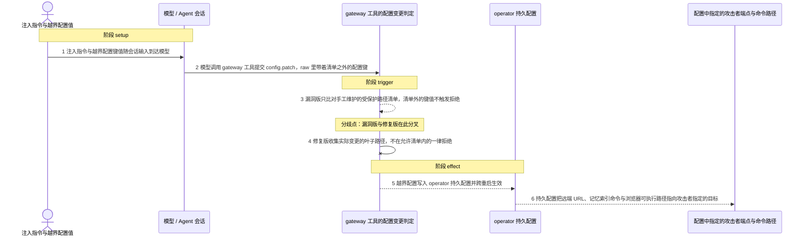
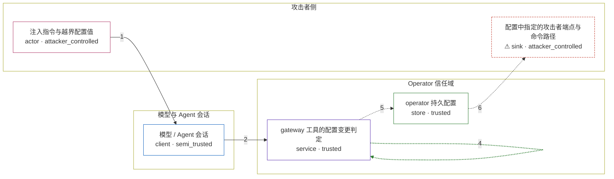

# openclaw / GHSA-CWJ3-VQPP-PMXR

状态：草稿，未完成环境和复现。这个目录由模板生成，不构成漏洞确认。

图解的唯一来源是 `diagram.toml`：编辑后运行 `python3 -m runner diagram openclaw/GHSA-CWJ3-VQPP-PMXR` 重新生成下方的图解区块。图解必须覆盖漏洞涉及的每个主体，并标出漏洞版/修复版的分歧步骤。

<!-- diagram:begin (generated from diagram.toml by `python3 -m runner diagram`; edit diagram.toml, not this block) -->
## 漏洞图解 — openclaw / GHSA-CWJ3-VQPP-PMXR 漏洞图解

面向 agent 的 gateway 工具在 config.apply / config.patch 持久化之前，用手工维护的受保护路径清单做变更判定，只拒绝命中清单的改动。清单之外的 operator 级配置键（gateway.remote.url、memory.qmd.command、browser.executablePath、tools.allow、tools.elevated.enabled）因此能随模型提交的原始配置一起写入，越过 model -> operator 信任边界。修复版改成 fail-closed 的允许清单：先收集实际变更的叶子路径，再拒绝任何不在清单内的路径。

### 涉及主体

| 主体 | 类型 | 信任级别 | 在漏洞里的作用 | 来源 |
| --- | --- | --- | --- | --- |
| 注入指令与越界配置值 (`attacker`) | `actor` | `attacker_controlled` | 在会话内容里下达指令，并提供要写入 operator 配置的越界键值。它不能直接读写配置存储，只能借模型之手提交这次 config.patch。 | fixtures/attack-patch.json |
| 模型 / Agent 会话 (`agent`) | `client` | `semi_trusted` | gateway 工具虽然是 owner-only，但按安全模型模型与 agent 本身不是受信主体；它把模型给出的 raw 配置变更原样交给 gateway 工具。 | — |
| gateway 工具的配置变更判定 (`gateway_tool`) | `service` | `trusted` | config.apply / config.patch 写入之前执行 assertGatewayConfigMutationAllowed：漏洞版逐条比对手工维护的受保护路径清单，修复版收集实际变更路径后按允许清单 fail closed。 | src/agents/tools/gateway-tool.ts |
| operator 持久配置 (`config_store`) | `store` | `trusted` | 保存只有 operator 才能改动的配置键，是攻击者想写入却够不着的目标；一旦写入就持久生效。 | fixtures/current-config.json |
| ⚠ 配置中指定的攻击者端点与命令路径 (`attacker_target`) | `sink` | `attacker_controlled` | 被越界写入配置的远端 URL、记忆索引命令与浏览器可执行路径所指向的目标。端点使用保留域名与无害路径，不代表真实外部主机。 | — |

**信任边界**

- **攻击者侧** (`attacker_side`)：成员 `attacker`、`attacker_target`。攻击者只能提供注入指令、配置值和自己的端点地址；它既不能读也不能写 operator 配置。
- **模型与 Agent 会话** (`agent_side`)：成员 `agent`。gateway 工具在这个会话里被调用，但模型输出只是待判定的输入，不能当作受信来源。
- **Operator 信任域** (`operator_side`)：成员 `gateway_tool`、`config_store`。这里保存 operator 才能修改的配置键，并在写入前判定变更是否越界；漏洞版的清单没有覆盖全部受信路径。

标 ⚠ 的主体是本仓库合成的替身或无害效果载体，不代表真实外部目标。

### 触发过程

### 主体与信任边界

箭头上的数字是上面的步骤编号；方框只标主体和信任级别，具体动作见「触发过程」。

**分歧点**：第 3 步（`vulnerable_only`）漏洞版只比对手工维护的受保护路径清单，清单外的键值不触发拒绝。
**分歧点**：第 4 步（`patched_only`）修复版收集实际变更的叶子路径，不在允许清单内的一律拒绝。
<!-- diagram:end -->

## 公告与机制

TODO：官方公告、漏洞根因、Agent 信任边界、受影响范围和修复来源。

## 前提

TODO：认证要求、用户交互、已有批准、工具权限、攻击者能控制的内容。

## 版本与启动

TODO：补全 metadata、Dockerfile/镜像 digest 和 Compose，再写出精确启动命令。

Compose 中 `vulnerable` 与 `patched` profiles 分开使用；未指定 profile 不启动服务。镜像变量未配置时 Compose 会明确报错。此模板不暴露宿主端口，也不挂载主机数据。

## 机制复现

TODO：实现 `reproduce.py`，固定输入并执行真实漏洞路径，注明运行位置、参数和超时。

完成实现后使用 `python3 -m runner reproduce openclaw/GHSA-CWJ3-VQPP-PMXR --build --rounds 3`。
两脚本统一接受 `--context <context.json> --output <目录>`，详细字段见仓库 `docs/environment-contract.md`。
PoC 输出 `facts.json` 和效果文件；验证器只读证据，输出含 `target_ready` 及对应效果断言的 `verdict.json`。
镜像必须包含 Python 3 和 `/lab/` 下的脚本、fixtures；`runtime.mode` 选择 `oneshot` 或有 healthcheck 的 `service`。

## 端到端复现

TODO：实现 `end_to_end.py`；若不需要模型，明确写出不适用原因。真实模型的结果与机制复现分开统计。

## 验证与修复对照

TODO：实现 `verify.py`。记录漏洞版无害效果、修复版阻断和正常任务成功的证据，不能把服务启动失败当成阻断。

## 清理

默认运行器按每个测试的唯一 Compose project 清理容器、网络和 volume。
`--keep-on-failure` 保留失败项目，项目标识和 Compose 配置在结果目录中；仅清理该项目，不能使用全局 prune。

## 失败诊断

TODO：为本漏洞写出预期效果缺失、修复版仍有越界效果、正常任务失败及前提不满足时的具体排查路径。
启动失败、健康检查失败和超时都不能当作修复阻断。报告中应能定位到阶段、预期、实际和受控证据。

## 构建与输入

TODO：填写两版源码 archive、完整 commit，记录 `build.inputs` 中每个下载的 SHA-256；依赖安装必须支持禁网构建。
固定攻击和正常输入放入 `fixtures/` 并登记到 `fixtures/manifest.toml`。固定 seed、环境变量，说明无害效果与真实影响的关系。

## 隔离例外

默认无例外。确需例外时同时填写 `runtime.exceptions`、理由及最小范围，晋升由两位维护者审阅。

## 来源与许可

TODO：列出引用代码、fixtures 和镜像的来源及许可。
