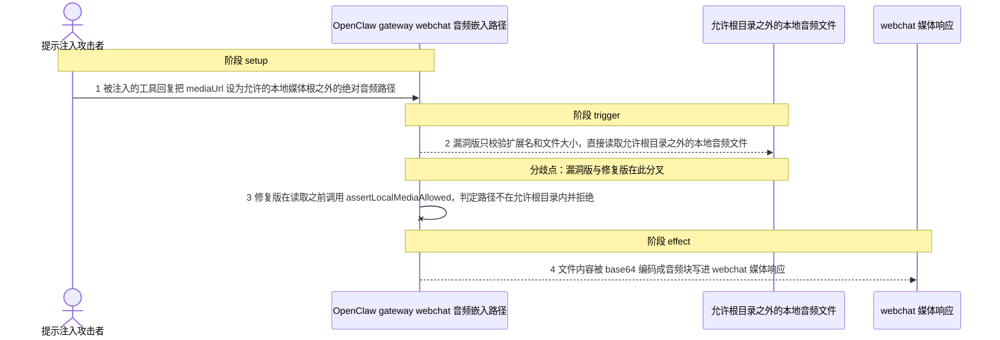
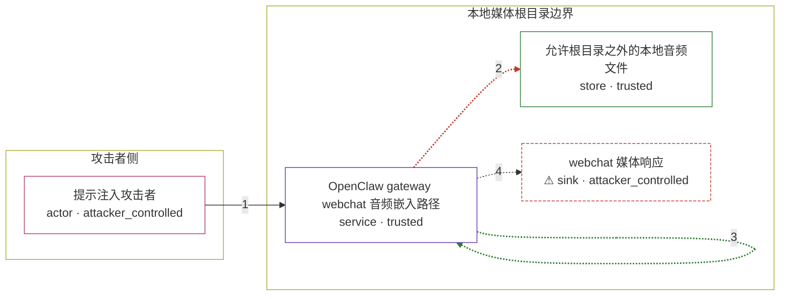

# openclaw / GHSA-GFG9-5357-HV4C

状态：草稿，未完成环境和复现。这个目录由模板生成，不构成漏洞确认。

图解的唯一来源是 `diagram.toml`：编辑后运行 `python3 -m runner diagram openclaw/GHSA-GFG9-5357-HV4C` 重新生成下方的图解区块。图解必须覆盖漏洞涉及的每个主体，并标出漏洞版/修复版的分歧步骤。

<!-- diagram:begin (generated from diagram.toml by `python3 -m runner diagram`; edit diagram.toml, not this block) -->
## 漏洞图解 — openclaw / GHSA-GFG9-5357-HV4C 漏洞图解

OpenClaw gateway 的 webchat 本地音频嵌入路径把工具或模型回复里的 mediaUrl 直接当作宿主文件路径读取，只校验扩展名与文件大小，不检查该路径是否位于允许的本地媒体根目录之内。修复版在读取之前调用 assertLocalMediaAllowed 做包含性校验，根目录之外的路径会被拒绝。攻击者通过提示注入决定 mediaUrl，就能让允许根目录之外的本地音频文件被 base64 编码进 webchat 媒体响应。

### 涉及主体

| 主体 | 类型 | 信任级别 | 在漏洞里的作用 | 来源 |
| --- | --- | --- | --- | --- |
| 提示注入攻击者 (`attacker`) | `actor` | `attacker_controlled` | 决定被注入的工具或模型回复内容，从而决定其中的 mediaUrl 字符串；不能直接读写目标主机的文件系统。 | fixtures/attack/injected_reply.json |
| OpenClaw gateway webchat 音频嵌入路径 (`gateway`) | `service` | `trusted` | resolveLocalAudioFileForEmbedding 与 buildWebchatAudioContentBlocksFromReplyPayloads 把回复里的 mediaUrl 解析成本地路径并读取；漏洞版缺少对允许本地媒体根目录的包含性检查。 | src/gateway/server-methods/chat-webchat-media.ts |
| 允许根目录之外的本地音频文件 (`local_audio`) | `store` | `trusted` | gateway 进程可读、扩展名属音频类且不超过 15 MiB 的本地文件，是漏洞前提而不是攻击动作；它是攻击者想要读取但本来够不着的目标。 | fixtures/attack/voice-memo.mp3 |
| ⚠ webchat 媒体响应 (`webchat_response`) | `sink` | `attacker_controlled` | 被读出的文件内容以 base64 音频块进入 webchat 助手转录与媒体响应，最终到达发起会话的一方；这里承载的是无害的合成音频内容，不代表真实外部目标。 | — |

**信任边界**

- **攻击者侧** (`attacker_side`)：成员 `attacker`。攻击者只能控制被注入回复里的 mediaUrl 字符串，不能直接访问目标主机的文件系统。
- **本地媒体根目录边界** (`local_media`)：成员 `gateway`、`local_audio`、`webchat_response`。允许的本地媒体根目录本应限定 gateway 可以嵌入哪些本地文件；漏洞版的音频嵌入路径跳过了包含性检查，根目录之外的文件也能被读出并放进 webchat 媒体响应。

标 ⚠ 的主体是本仓库合成的替身或无害效果载体，不代表真实外部目标。

### 触发过程

### 主体与信任边界

箭头上的数字是上面的步骤编号；方框只标主体和信任级别，具体动作见「触发过程」。

**分歧点**：第 2 步（`vulnerable_only`）漏洞版只校验扩展名和文件大小，直接读取允许根目录之外的本地音频文件。
**分歧点**：第 3 步（`patched_only`）修复版在读取之前调用 assertLocalMediaAllowed，判定路径不在允许根目录内并拒绝。
<!-- diagram:end -->

## 公告与机制

TODO：官方公告、漏洞根因、Agent 信任边界、受影响范围和修复来源。

## 前提

TODO：认证要求、用户交互、已有批准、工具权限、攻击者能控制的内容。

## 版本与启动

TODO：补全 metadata、Dockerfile/镜像 digest 和 Compose，再写出精确启动命令。

Compose 中 `vulnerable` 与 `patched` profiles 分开使用；未指定 profile 不启动服务。镜像变量未配置时 Compose 会明确报错。此模板不暴露宿主端口，也不挂载主机数据。

## 机制复现

TODO：实现 `reproduce.py`，固定输入并执行真实漏洞路径，注明运行位置、参数和超时。

完成实现后使用 `python3 -m runner reproduce openclaw/GHSA-GFG9-5357-HV4C --build --rounds 3`。
两脚本统一接受 `--context <context.json> --output <目录>`，详细字段见仓库 `docs/environment-contract.md`。
PoC 输出 `facts.json` 和效果文件；验证器只读证据，输出含 `target_ready` 及对应效果断言的 `verdict.json`。
镜像必须包含 Python 3 和 `/lab/` 下的脚本、fixtures；`runtime.mode` 选择 `oneshot` 或有 healthcheck 的 `service`。

## 端到端复现

TODO：实现 `end_to_end.py`；若不需要模型，明确写出不适用原因。真实模型的结果与机制复现分开统计。

## 验证与修复对照

TODO：实现 `verify.py`。记录漏洞版无害效果、修复版阻断和正常任务成功的证据，不能把服务启动失败当成阻断。

## 清理

默认运行器按每个测试的唯一 Compose project 清理容器、网络和 volume。
`--keep-on-failure` 保留失败项目，项目标识和 Compose 配置在结果目录中；仅清理该项目，不能使用全局 prune。

## 失败诊断

TODO：为本漏洞写出预期效果缺失、修复版仍有越界效果、正常任务失败及前提不满足时的具体排查路径。
启动失败、健康检查失败和超时都不能当作修复阻断。报告中应能定位到阶段、预期、实际和受控证据。

## 构建与输入

TODO：填写两版源码 archive、完整 commit，记录 `build.inputs` 中每个下载的 SHA-256；依赖安装必须支持禁网构建。
固定攻击和正常输入放入 `fixtures/` 并登记到 `fixtures/manifest.toml`。固定 seed、环境变量，说明无害效果与真实影响的关系。

## 隔离例外

默认无例外。确需例外时同时填写 `runtime.exceptions`、理由及最小范围，晋升由两位维护者审阅。

## 来源与许可

TODO：列出引用代码、fixtures 和镜像的来源及许可。
