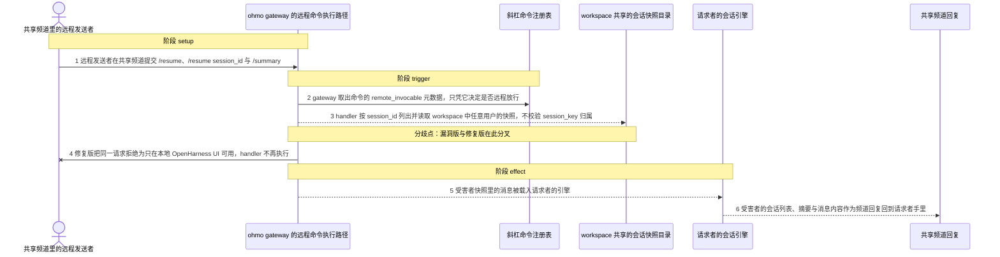
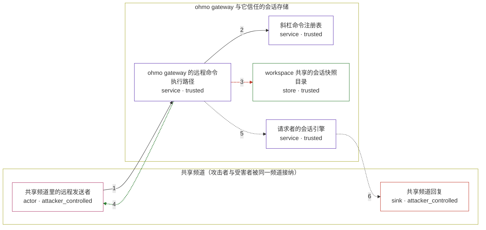

# openharness / CVE-2026-56695

状态：草稿，未完成环境和复现。这个目录由模板生成，不构成漏洞确认。

图解的唯一来源是 `diagram.toml`：编辑后运行 `python3 -m runner diagram openharness/CVE-2026-56695` 重新生成下方的图解区块。图解必须覆盖漏洞涉及的每个主体，并标出漏洞版/修复版的分歧步骤。

<!-- diagram:begin (generated from diagram.toml by `python3 -m runner diagram`; edit diagram.toml, not this block) -->
## 漏洞图解 — openharness / CVE-2026-56695 漏洞图解

ohmo gateway 注册 /resume 与 /summary 时沿用 SlashCommand.remote_invocable = True 的默认值，gateway 只凭这个元数据决定远程放行，handler 内部不做发送者归属校验。会话快照按 workspace 共享存放，列表与按 session_id 读取都不按 session_key 过滤，因此共享频道里的普通远程发送者能列出并加载他人的会话。受害者的私有提示、工具输出与文件路径随频道回复和会话摘要泄露给攻击者。

### 涉及主体

| 主体 | 类型 | 信任级别 | 在漏洞里的作用 | 来源 |
| --- | --- | --- | --- | --- |
| 共享频道里的远程发送者 (`attacker`) | `actor` | `attacker_controlled` | 只控制自己在共享频道里发出的命令文本与参数：先请求会话列表，再用列表里读到的 session_id 加载快照。它本来拿不到任何其他用户的会话内容。 | fixtures/attacker_commands.json |
| 共享频道回复 (`channel`) | `sink` | `attacker_controlled` | 受害者的会话列表、摘要与被载入的消息最终以频道回复的形式回到请求者手里。 | — |
| ohmo gateway 的远程命令执行路径 (`gateway`) | `service` | `trusted` | 只读取命令的 remote_invocable 元数据决定是否放行远程调用；flag 为真时无条件执行 handler，这条执行路径自身没有 sender 归属校验。 | — |
| 斜杠命令注册表 (`command_registry`) | `service` | `trusted` | 注册 /resume 与 /summary 时沿用 remote_invocable = True 的默认值，让这两个会话命令对远程发送者保持可见。 | — |
| workspace 共享的会话快照目录 (`session_store`) | `store` | `trusted` | 按 workspace 而非发送者共享，保存全部用户的 session-session_id.json；列目录与按 id 读取都不校验 session_key 归属。 | fixtures/alice_private_session.json |
| 请求者的会话引擎 (`session_engine`) | `service` | `trusted` | /resume 把受害者的快照消息直接载入请求者的引擎，/summary 再从同一个引擎里把内容摘要出去。 | — |

**信任边界**

- **共享频道（攻击者与受害者被同一频道接纳）** (`shared_channel`)：成员 `attacker`、`channel`。发送者只能在这里提交消息，频道本身不提供按身份隔离会话的能力。
- **ohmo gateway 与它信任的会话存储** (`product`)：成员 `gateway`、`command_registry`、`session_store`、`session_engine`。这道边界本应把每个发送者的会话隔离在各自的 session_key 下，但命令元数据的默认值与不过滤 session_key 的存储读取让 /resume 与 /summary 绕过了隔离。

### 触发过程

### 主体与信任边界

箭头上的数字是上面的步骤编号；方框只标主体和信任级别，具体动作见「触发过程」。

**分歧点**：第 3 步（`vulnerable_only`）handler 按 session_id 列出并读取 workspace 中任意用户的快照，不校验 session_key 归属。
**分歧点**：第 4 步（`patched_only`）修复版把同一请求拒绝为只在本地 OpenHarness UI 可用，handler 不再执行。
<!-- diagram:end -->

## 公告与机制

TODO：官方公告、漏洞根因、Agent 信任边界、受影响范围和修复来源。

## 前提

TODO：认证要求、用户交互、已有批准、工具权限、攻击者能控制的内容。

## 版本与启动

TODO：补全 metadata、Dockerfile/镜像 digest 和 Compose，再写出精确启动命令。

Compose 中 `vulnerable` 与 `patched` profiles 分开使用；未指定 profile 不启动服务。镜像变量未配置时 Compose 会明确报错。此模板不暴露宿主端口，也不挂载主机数据。

## 机制复现

TODO：实现 `reproduce.py`，固定输入并执行真实漏洞路径，注明运行位置、参数和超时。

完成实现后使用 `python3 -m runner reproduce openharness/CVE-2026-56695 --build --rounds 3`。
两脚本统一接受 `--context <context.json> --output <目录>`，详细字段见仓库 `docs/environment-contract.md`。
PoC 输出 `facts.json` 和效果文件；验证器只读证据，输出含 `target_ready` 及对应效果断言的 `verdict.json`。
镜像必须包含 Python 3 和 `/lab/` 下的脚本、fixtures；`runtime.mode` 选择 `oneshot` 或有 healthcheck 的 `service`。

## 端到端复现

TODO：实现 `end_to_end.py`；若不需要模型，明确写出不适用原因。真实模型的结果与机制复现分开统计。

## 验证与修复对照

TODO：实现 `verify.py`。记录漏洞版无害效果、修复版阻断和正常任务成功的证据，不能把服务启动失败当成阻断。

## 清理

默认运行器按每个测试的唯一 Compose project 清理容器、网络和 volume。
`--keep-on-failure` 保留失败项目，项目标识和 Compose 配置在结果目录中；仅清理该项目，不能使用全局 prune。

## 失败诊断

TODO：为本漏洞写出预期效果缺失、修复版仍有越界效果、正常任务失败及前提不满足时的具体排查路径。
启动失败、健康检查失败和超时都不能当作修复阻断。报告中应能定位到阶段、预期、实际和受控证据。

## 构建与输入

TODO：填写两版源码 archive、完整 commit，记录 `build.inputs` 中每个下载的 SHA-256；依赖安装必须支持禁网构建。
固定攻击和正常输入放入 `fixtures/` 并登记到 `fixtures/manifest.toml`。固定 seed、环境变量，说明无害效果与真实影响的关系。

## 隔离例外

默认无例外。确需例外时同时填写 `runtime.exceptions`、理由及最小范围，晋升由两位维护者审阅。

## 来源与许可

TODO：列出引用代码、fixtures 和镜像的来源及许可。
