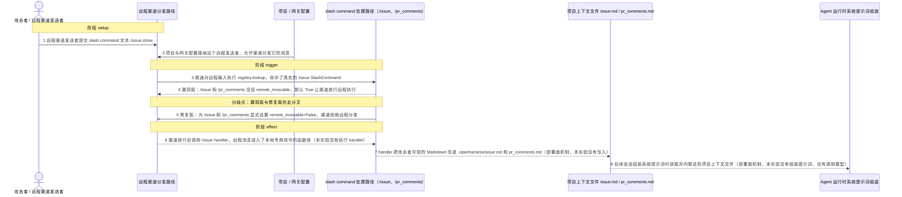
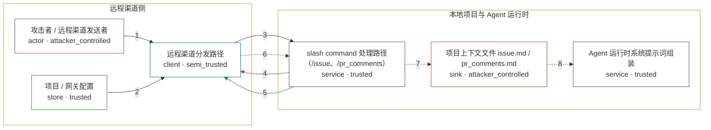

# openharness / CVE-2026-56696

状态：机制复现已完成，并通过四场景三轮容器验收；保持 `draft`，等待固定发布镜像和维护者审阅。

<!-- diagram:begin (generated from diagram.toml by `python3 -m runner diagram`; edit diagram.toml, not this block) -->
## 漏洞图解 — OpenHarness / CVE-2026-56696 远程项目上下文命令的持久提示注入

OpenHarness 0.1.9 注册 /issue 和 /pr_comments 时漏设了 remote_invocable，而 SlashCommand 这个字段默认是 True。于是被项目配置接纳的远程渠道发送者可以越过本地专用命令的边界，让命令 handler 把攻击者可控的 Markdown 写进项目的 .openharness/issue.md 和 pr_comments.md。之后每次会话的 build_runtime_system_prompt 都会把这些项目上下文文件内联进系统提示词，一次远程写入就跨会话反复生效，成了持久提示注入。本环境只观察到注册表里的 remote_invocable 标志这一个机制事实（漏洞版 True、修复版 False），没有真实的渠道投递、文件写入、提示词组装，也没有调用模型。

### 涉及主体

| 主体 | 类型 | 信任级别 | 在漏洞里的作用 | 来源 |
| --- | --- | --- | --- | --- |
| 攻击者 / 远程渠道发送者 (`attacker`) | `actor` | `attacker_controlled` | 在被项目配置接纳的远程渠道里发送 slash command 文本。本实验把这条输入固定成 /issue show，它只能证明 /issue 可以被远程触达；真正投毒用的是同一个命令的 /issue set 和 /pr_comments add 写子命令，把攻击者可控的 Markdown 写进项目上下文文件。 | fixtures/attack.json |
| 远程渠道分发路径 (`remote_channel`) | `client` | `semi_trusted` | 接收远程消息、去命令注册表里 lookup，再根据 SlashCommand.remote_invocable 决定要不要把本地专用命令交给 handler。漏洞版就是因为这个标志默认 True 才放行的。本实验只读了该标志的取值，没有真实的渠道投递。 | ohmo/gateway/runtime.py |
| slash command 处理路径（/issue、/pr_comments） (`command_registry`) | `service` | `trusted` | 上游 openharness/commands/registry.py 里 create_default_command_registry() 建出来的默认注册表。/issue 和 /pr_comments 的 handler 负责读写项目的 .openharness/issue.md 和 pr_comments.md。0.1.9 注册这两个本地专用命令时漏设 remote_invocable，让它落到默认的 True——这就是漏洞根因。 | src/openharness/commands/registry.py |
| 项目 / 网关配置 (`project_config`) | `store` | `trusted` | 漏洞前提。项目与网关配置决定哪个远程发送者能被接纳，以及是否允许远程管理命令（allow_remote_admin_commands、allowed_remote_admin_commands）。它把远程输入变成受信渠道消息，和命令自己的 remote_invocable 一起决定远程分发会不会发生。本实验没有加载真实配置，所以下面这一步只是声明的前提，不是已验证事实。 | ohmo/gateway/models.py |
| 项目上下文文件 issue.md / pr_comments.md (`context_file`) | `sink` | `attacker_controlled` | /issue set 和 /pr_comments add 写入的攻击者可控 Markdown 就落在这里。文件在项目的 .openharness 目录下，跨会话一直存在，是持久化注入的载体。这是部署面上的机制，本实验没有真的执行写入。 | src/openharness/config/paths.py |
| Agent 运行时系统提示词组装 (`prompt_runtime`) | `service` | `trusted` | 之后每次会话，build_runtime_system_prompt 都会把 Issue Context 和 Pull Request Comments 这两个文件的内容内联进系统提示词，于是一次远程写入在往后的会话里被反复带上——这是持久化注入的最后一环。属于部署面机制，本实验没有组装提示词、没有调用任何模型，因此不能据此断言真实模型被诱导。 | src/openharness/prompts/context.py |

**信任边界**

- **远程渠道侧** (`remote_boundary`)：成员 `attacker`、`remote_channel`、`project_config`。远程发送者经由被配置接纳的渠道进来。漏洞就在于这条边界没有按命令收紧，本地专用命令被当成了可以远程调用的普通命令。
- **本地项目与 Agent 运行时** (`local_boundary`)：成员 `command_registry`、`context_file`、`prompt_runtime`。本地专用命令、项目上下文文件和系统提示词组装，本来只该在本地 UI 里触达，却被远程渠道穿透了。写进去的上下文文件还会跨会话一直留着。

### 触发过程

### 主体与信任边界

箭头上的数字是上面的步骤编号；方框只标主体和信任级别，具体动作见「触发过程」。

**分歧点**：第 4 步（`vulnerable_only`）漏洞版：/issue 和 /pr_comments 没设 remote_invocable，默认 True 让渠道放行远程执行。
**分歧点**：第 5 步（`patched_only`）修复版：为 /issue 和 /pr_comments 显式设置 remote_invocable=False，渠道拒绝远程分发。
<!-- diagram:end -->

## 公告与机制

公告：GHSA-24cw-228q-3rx9，CVE-2026-56696。远程 channel 可以调用本应只在
本地使用的 /issue 和 /pr_comments 命令。命令把远程输入写入项目上下文，
之后运行时 prompt 会读到被污染内容。修复对这些命令设置
remote_invocable = false，而 /help 等无害命令仍保持可远程调用。

PoC 导入固定源码的完整 openharness.commands.registry，调用真实默认注册表
构造和 lookup。skill discovery 仅被置为空的可选协作者，以保证结果确定；没有
重写命令定义，也没有把字符串 canary 当成文件效果。

## 前提

需要项目配置允许一个远程 channel sender，并由 channel 分发 slash command。
攻击输入为 /issue show，正常控制为 /help。本环境检查的是 registry policy
机制，不连接真实远程 channel、GitHub 或模型。

## 版本与启动

漏洞版为 0.1.9；OSV 没有 fixed version，修复版使用固定修复 commit
27bb93b810e9ea8fa4832eab7152eeb3b4a6bffb。两个源码归档和 SHA-256 在
metadata.toml 中记录。运行：

    python3 -m runner reproduce openharness/CVE-2026-56696 --build --rounds 3

## 机制复现

漏洞版攻击要求 /issue 已注册且 remote_invocable 为 true；修复版要求同一
命令仍注册但该标志为 false。benign 要求 /help 可远程调用。验证器只读取
哈希校验后的 channel_effect.json，注册表导入不会发生在验证阶段。

## 端到端复现

不适用。真实 channel、项目 checkout 和 prompt 组装是机制之外的部署面，本环境
只对照远程可调用策略；end_to_end.py 返回 2，不把模型输出当作漏洞证据。

## 失败诊断

命令未注册时先检查上游 commit 和默认 registry 构造；攻击版标志为 false 说明
版本或命令名不匹配。真实 channel 启动失败、网络依赖缺失和超时不能说明修复
阻断。

## 输入与隔离

fixture 只包含 slash command 名称。为导入真实 `commands/registry.py`，
`reproduce.py` 对 auth、config、bridge、api、engine、plugins、services、
skills、memory、autopilot、tasks、output_styles、permissions、prompts 和
provider 等非目标协作者安装 `_Imported` 协议替身；随后把 skill registry 固定
为空。真实默认注册表构造、命令定义和 `remote_invocable` 字段仍来自上游源码，
但环境不覆盖完整认证、记忆、插件、provider、channel、项目 checkout 或 prompt
运行时。Compose 无端口、主机挂载、特权或隔离例外；来源和许可证见 metadata。
