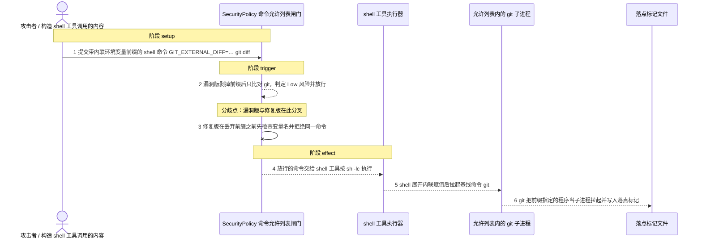
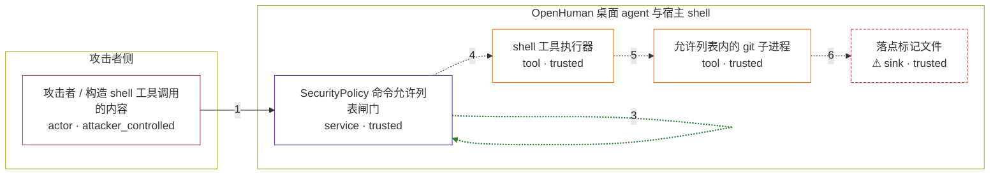

# openhuman / CVE-2026-55743

状态：草稿。图解、攻击输入与机制 PoC 已生成；镜像构建与四场景验收尚未执行，因此本文件不构成漏洞已复现的结论。

图解的唯一来源是 `diagram.toml`：编辑后运行 `python3 -m runner diagram openhuman/CVE-2026-55743` 重新生成下方的图解区块。图解必须覆盖漏洞涉及的每个主体，并标出漏洞版/修复版的分歧步骤。

<!-- diagram:begin (generated from diagram.toml by `python3 -m runner diagram`; edit diagram.toml, not this block) -->
## 漏洞图解 — openhuman / CVE-2026-55743 漏洞图解

OpenHuman 的 SecurityPolicy 是 shell 工具与宿主操作系统之间唯一的命令允许列表闸门。它先剥掉形如 NAME=value 的内联环境变量前缀，再用剩下的命令名比对允许列表，却不检查变量名本身，于是 GIT_EXTERNAL_DIFF=… git diff 只以基线命令 git 通过校验，风险等级仍为 Low。shell 执行时才展开该前缀，被放行的 git 随即把攻击者指定的程序当子进程拉起，以桌面用户权限在宿主上执行任意命令。

### 涉及主体

| 主体 | 类型 | 信任级别 | 在漏洞里的作用 | 来源 |
| --- | --- | --- | --- | --- |
| 攻击者 / 构造 shell 工具调用的内容 (`attacker`) | `actor` | `attacker_controlled` | 决定 agent 提交给 shell 工具的命令字符串；它只能影响这一次工具调用的参数，不能直接读写宿主文件。被利用的形状是把危险程序路径塞进内联环境变量前缀。 | fixtures/attack_env_prefix_command.txt |
| SecurityPolicy 命令允许列表闸门 (`policy_gate`) | `service` | `trusted` | 受影响的默认 Supervised 策略。is_command_allowed 先用 skip_env_assignments 丢弃前缀，再用剩余命令名比对 allowed_commands；前缀里的变量名从未被检查，所以危险前缀连同其命令一起通过。 | — |
| shell 工具执行器 (`shell_exec`) | `tool` | `trusted` | 闸门放行后按 NativeRuntime 的方式以 sh -lc 执行整条命令。内联赋值由这里在运行时展开，恶意取值从未出现在被允许列表比对的那个命令名上。 | — |
| 允许列表内的 git 子进程 (`git_process`) | `tool` | `trusted` | 基线命令命中允许列表，因此被真实拉起；它按环境变量取值再派生 GIT_EXTERNAL_DIFF 指定的外部程序，把执行权交给攻击者选定的可执行文件。 | — |
| ⚠ 落点标记文件 (`effect`) | `sink` | `trusted` | 漏洞触发后攻击者程序写入的无害标记，用来证明命令确实以桌面用户权限执行；它不是真实的外部目标，也不含真实凭据。 | — |

**信任边界**

- **攻击者侧** (`attacker_side`)：成员 `attacker`。攻击者只能控制这次 shell 工具调用的命令字符串，无法直接写入宿主文件系统，因此要把命令执行引到闸门内侧的组件上。
- **OpenHuman 桌面 agent 与宿主 shell** (`product`)：成员 `policy_gate`、`shell_exec`、`git_process`、`effect`。这道边界由允许列表加风险分级构成：只有列表内命令、且无危险参数或危险前缀时才能执行。漏洞让内联环境变量前缀整体绕过该判定，于是边界内的 git 成了任意命令的启动器。

标 ⚠ 的主体是本仓库合成的替身或无害效果载体，不代表真实外部目标。

### 触发过程

### 主体与信任边界

箭头上的数字是上面的步骤编号；方框只标主体和信任级别，具体动作见「触发过程」。

**分歧点**：第 2 步（`vulnerable_only`）漏洞版剥掉前缀后只比对 git，判定 Low 风险并放行。
**分歧点**：第 3 步（`patched_only`）修复版在丢弃前缀之前先检查变量名并拒绝同一命令。
<!-- diagram:end -->

## 公告与机制

- 公告：<https://nvd.nist.gov/vuln/detail/CVE-2026-55743>（CVSS 4.0 `9.4` CRITICAL，CWE-78 / CWE-184）。
- 上游：`tinyhumansai/openhuman`，受影响文件 `src/openhuman/security/policy.rs`，受影响例程 `is_args_safe`、`skip_env_assignments`。
- 根因：默认 `Supervised` 策略的 `is_command_allowed` 先调用 `skip_env_assignments` 丢掉形如 `NAME=value` 的前导词，再用剩下的命令名比对 `allowed_commands`，且从不检查变量名。`GIT_EXTERNAL_DIFF=<程序> git diff` 因此只以基线命令 `git` 通过校验，风险等级为 `Low`，`approved=false` 也放行。
- 落点：`shell.rs` 的 `validate_command_execution` 通过后，`NativeRuntime::build_shell_command` 以 `sh -lc` 执行整条命令；shell 展开前缀，被放行的 `git` 再把攻击者指定的程序当子进程拉起，以桌面用户权限执行任意命令。
- 修复：提交 `60050aa09a870f53ed7e4cd40ed41fd2860329e7` 在丢弃前缀之前先用 `has_dangerous_env_prefix` 检查赋值名（`GIT_EXTERNAL_DIFF`、`GIT_PAGER`、`LD_PRELOAD`、`PATH` 等），并给 `find` 补上 `-execdir` / `-okdir`。
- 修复提交同时更新 `policy_tests.rs`；其中 `dangerous_env_var_prefix_blocked` 与扩展后的 `command_argument_injection_blocked` 就是本环境两个攻击向量的上游回归断言。

## 前提

- agent 使用默认 `Supervised` 策略（`SecurityPolicy::default()`），`git` 在 `allowed_commands` 内且宿主机装有 `git`；本环境额外需要 `sh`。
- 攻击者能控制的只有这次 shell 工具调用的命令字符串，不能直接读写宿主文件系统。
- 触发不需要用户点击“同意”：该命令被分级为 `Low`，`require_approval_for_medium_risk` 与 `block_high_risk_commands` 都不生效。
- `GIT_EXTERNAL_DIFF` 只有在仓库确实有未提交改动、`git diff` 真的产生差异时才会被 git 拉起，所以 PoC 在临时工作区里固定一个已修改文件。
- 不涉及模型与网络；`UI:P` / `UI:R` 属于“agent 被诱导产生该 tool call”的上层链路，不在机制复现范围内。

## 版本与启动

- vulnerable：tag `v0.54.0`，commit `c25fc8e5fd3e7716f416571cd53b34247c94ddbe`，归档 `vulnerable-source.tar.gz`（SHA-256 `cdc0f4c802924165c96764a2f2dc4f3f3f8294bc39ebf72e7ccbaabf1b32151c`）。
- patched：commit `60050aa09a870f53ed7e4cd40ed41fd2860329e7`，归档 `patched-source.tar.gz`（SHA-256 `629fc21fc9b80c8fee2cd71f66384c275bfcabe4af2c1eba1c39cf3b63144de1`）。
- 工具链：上游 `rust-toolchain.toml` 固定 `channel = "1.93.0"`；工具链与 crates 必须作为 `build.inputs` 固定，构建全程 `--network none`。
- `metadata.toml` 的 `[build]`、`[vulnerable]`、`[patched]` 与两版镜像 digest 仍待 build 阶段补齐；本阶段未运行 Docker。

Compose 中 `vulnerable` 与 `patched` profiles 分开使用；未指定 profile 不启动服务。镜像变量未配置时 Compose 会明确报错。此模板不暴露宿主端口，也不挂载主机数据。

## 机制复现

`reproduce.py` 不重写允许列表逻辑。它在镜像内把该修订**逐字节的上游源文件**（`src/openhuman/security/policy.rs`、`config/schema/autonomy.rs`、`config/schema/defaults.rs`，以及 `util::floor_char_boundary`）按上游模块布局编成一个探针，调用上游 `SecurityPolicy::validate_command_execution`——`shell.rs` 用的同一个入口；放行后由探针按 `NativeRuntime` 的方式 `sh -lc` 执行命令，让真实 `git` 拉起载荷。

- 攻击场景跑两个向量：`fixtures/attack_env_prefix_command.txt`（本 CVE 的核心）与 `fixtures/attack_find_execdir_command.txt`（同一修复里的第二个缺口，作为交叉验证）。
- 正常场景跑 `fixtures/benign_command.txt`（`TZ=UTC git log --oneline -n 1`），修复前后都必须通过。
- 探针依赖 `parking_lot`、`schemars`、`serde`、`log` 四个 crate；镜像离线提供它们（vendor 目录或 `CARGO_HOME` 缓存），`tokio` / `dirs` 由探针内的最小 shim 顶替，因为它们只被本探针不会调用的异步路径校验函数使用。
- PoC 自行定位上游源码树（`AVH_UPSTREAM_SRC` 优先，否则在常见安装位置有界搜索），并核对 `policy.rs` 是否含 `has_dangerous_env_prefix`，与 `context["variant"]` 不符时拒绝运行，避免用错修订。
- 效果落点只有攻击者程序写入的标记文件；本脚本从不自己写标记，只在载荷确实运行后读取并作为效果文件记录。

完成实现后使用 `python3 -m runner reproduce openhuman/CVE-2026-55743 --build --rounds 3`。
两脚本统一接受 `--context <context.json> --output <目录>`，详细字段见仓库 `docs/environment-contract.md`。
PoC 输出 `facts.json` 和效果文件；验证器只读证据，输出含 `target_ready` 及对应效果断言的 `verdict.json`。
镜像必须包含 Python 3 和 `/lab/` 下的脚本、fixtures；`runtime.mode` 选择 `oneshot` 或有 healthcheck 的 `service`。

## 端到端复现

不适用：本漏洞的机制完全在策略判定与本地 shell 执行范围内，不需要真实模型参与。`metadata.toml` 的 `verification.end_to_end.status` 保持 `not_applicable`。

## 验证与修复对照

`verify.py` 由 validate 阶段实现，只读 `facts.json`、`observation.json` 与效果文件，不重跑攻击。

- 漏洞版攻击：`observation.vectors.env_prefix.allowed = true` 且 `marker_present = true`（`find -execdir` 向量同样如此），并要求 `env_prefix_marker.txt` 的内容是载荷写出的固定字符串。
- 修复版攻击：两个向量 `allowed = false`、`executed = false`、`marker_present = false`，且效果目录里没有标记文件。
- 正常任务：`observation.benign.allowed = true` 且 `task_marker_present = true`，两版都要通过。
- 正向对照：仅“没写标记”不足以证明修复，因此漏洞版必须同时有 `allowed = true` 与标记文件；修复版必须拒绝的是同一条命令字符串。

## 清理

默认运行器按每个测试的唯一 Compose project 清理容器、网络和 volume。
`--keep-on-failure` 保留失败项目，项目标识和 Compose 配置在结果目录中；仅清理该项目，不能使用全局 prune。

## 失败诊断

- 漏洞版没有标记：先看 `observation.vectors.*.allowed`。若为 `false`，说明闸门判定与预期不符，检查镜像里 `policy.rs` 是不是 `v0.54.0`；若为 `true` 而没有标记，检查 `git` 是否可用、临时仓库是否真的有未提交改动，以及 `stderr`。
- 修复版仍有标记：修复对照失败，检查 patched 镜像里的 `policy.rs` 是否确实含 `has_dangerous_env_prefix`。
- 正常任务失败：说明策略整体不可用或 `git`/`sh` 缺失，整轮不通过。
- `target_ready = false`：看 `probe_build.log`；常见原因是镜像缺少 Rust 工具链、四个 crate 未离线提供，或上游源码树不在镜像内。
- 启动失败、健康检查失败和超时都不能当作修复阻断。报告中应能定位到阶段、预期、实际和受控证据。

## 构建与输入

- 两版源码归档与完整 commit 见「版本与启动」；`build.inputs` 还须固定 Rust 1.93.0 工具链与全部 crates 依赖，构建全程 `--network none`。
- 攻击与正常输入都在 `fixtures/` 并登记到 `fixtures/manifest.toml`（`manifest.toml`、`README.md` 除外）。
- 固定项：`TZ=UTC` 正常命令、固定提交信息与文件内容、固定载荷文本；效果只是容器内临时工作区与结果目录中的标记文件，不触及真实数据或外部目标。

## 隔离例外

默认无例外：本环境只在容器内的临时工作区执行自身命令，不需要网络、宿主目录或额外 capability。

## 来源与许可

- 上游仓库：<https://github.com/tinyhumansai/openhuman>（按仓库自身许可）。
- 修复提交与补丁：<https://github.com/tinyhumansai/openhuman/commit/60050aa09a870f53ed7e4cd40ed41fd2860329e7>。
- 源码归档：codeload.github.com 的固定 tag / commit 归档，SHA-256 见「版本与启动」。
- 本环境新增内容：`diagram.toml`、`reproduce.py`、`fixtures/` 中的固定输入，以及探针内的 `tokio` / `dirs` 最小 shim。
