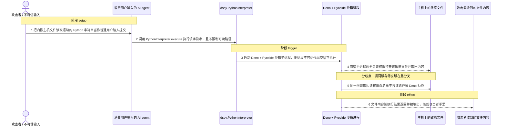
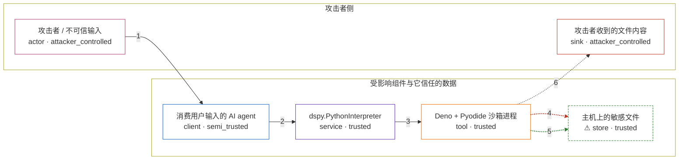

# overly-permissive-sandbox-configuration / CVE-2025-12695

状态：草稿，未完成环境和复现。这个目录由模板生成，不构成漏洞确认。

图解的唯一来源是 `diagram.toml`：编辑后运行 `python3 -m runner diagram overly-permissive-sandbox-configuration/CVE-2025-12695` 重新生成下方的图解区块。图解必须覆盖漏洞涉及的每个主体，并标出漏洞版/修复版的分歧步骤。

<!-- diagram:begin (generated from diagram.toml by `python3 -m runner diagram`; edit diagram.toml, not this block) -->
## 漏洞图解 — DSPy PythonInterpreter 沙箱读权限过宽导致任意主机文件读取

dspy.PythonInterpreter 默认构造时用不带路径的 --allow-read 启动 Deno 沙箱，等于把宿主文件系统的全部读权限交给沙箱内执行的不可信 Python 字符串；形参 enable_read_paths 只被用于把文件挂进 Pyodide 虚拟文件系统，从不参与读权限参数的构造，文档承诺的白名单语义与真实行为相反。于是一个消费用户输入的 AI agent 只要把这个字符串交给 PythonInterpreter.execute，沙箱里的代码就能读到该进程有权读取的任意主机文件，读到的内容还会随执行结果回到调用方手里。修复版把这一参数改为 --allow-read 的显式白名单，同一次读取被 Deno 的权限检查拒绝。

### 涉及主体

| 主体 | 类型 | 信任级别 | 在漏洞里的作用 | 来源 |
| --- | --- | --- | --- | --- |
| 攻击者 / 不可信输入 (`attacker`) | `actor` | `attacker_controlled` | 构造一段带有主机文件读取语句的 Python 字符串，把它当作普通用户输入提交给消费用户输入的 AI agent；攻击者自己并没有宿主机上的读取权限。 | — |
| 消费用户输入的 AI agent (`agent`) | `client` | `semi_trusted` | 按文档用法把用户提供的字符串转交 dspy.PythonInterpreter.execute 执行，是攻击者输入进入受信流程的入口。 | — |
| dspy.PythonInterpreter (`interpreter`) | `service` | `trusted` | 受影响的上游组件：默认构造时用裸 --allow-read 启动 Deno，虽接收 enable_read_paths 却只把它用于挂载文件、不写进读权限参数，沙箱因此拿到宿主全盘读权限。 | dspy/primitives/python_interpreter.py |
| Deno + Pyodide 沙箱进程 (`sandbox`) | `tool` | `trusted` | 在宿主文件系统上运行不可信 Python 代码的子进程；它从启动命令继承到的读权限，就是本应把不可信代码与宿主文件隔开的隔离边界。 | dspy/primitives/runner.js |
| ⚠ 主机上的敏感文件 (`secret_store`) | `store` | `trusted` | 攻击者想读而本来够不着的受保护数据；机制复现里用一个不含任何真实凭据的合成标记文件代替，它位于读白名单和 Deno 缓存目录之外。 | — |
| 攻击者收到的文件内容 (`leak_sink`) | `sink` | `attacker_controlled` | 受控效果落点：被读出的主机文件内容随解释器返回值输出，最终到达攻击者的通道。 | — |

**信任边界**

- **攻击者侧** (`attacker_side`)：成员 `attacker`、`leak_sink`。攻击者只能控制提交的那段字符串和它自己的接收通道；它想要的敏感文件不在这条边界内。
- **受影响组件与它信任的数据** (`product_side`)：成员 `agent`、`interpreter`、`sandbox`、`secret_store`。这道边界本应把沙箱内执行的不可信代码与宿主文件系统隔开；沙箱进程过宽的读权限让它失效。

标 ⚠ 的主体是本仓库合成的替身或无害效果载体，不代表真实外部目标。

### 触发过程

### 主体与信任边界

箭头上的数字是上面的步骤编号；方框只标主体和信任级别，具体动作见「触发过程」。

**分歧点**：第 4 步（`vulnerable_only`）用宿主进程的全盘读权限打开该敏感文件并取回内容。
**分歧点**：第 5 步（`patched_only`）同一次读取因读权限白名单不含该路径被 Deno 拒绝。
<!-- diagram:end -->

## 公告与机制

TODO：官方公告、漏洞根因、Agent 信任边界、受影响范围和修复来源。

## 前提

TODO：认证要求、用户交互、已有批准、工具权限、攻击者能控制的内容。

## 版本与启动

TODO：补全 metadata、Dockerfile/镜像 digest 和 Compose，再写出精确启动命令。

Compose 中 `vulnerable` 与 `patched` profiles 分开使用；未指定 profile 不启动服务。镜像变量未配置时 Compose 会明确报错。此模板不暴露宿主端口，也不挂载主机数据。

## 机制复现

TODO：实现 `reproduce.py`，固定输入并执行真实漏洞路径，注明运行位置、参数和超时。

完成实现后使用 `python3 -m runner reproduce overly-permissive-sandbox-configuration/CVE-2025-12695 --build --rounds 3`。
两脚本统一接受 `--context <context.json> --output <目录>`，详细字段见仓库 `docs/environment-contract.md`。
PoC 输出 `facts.json` 和效果文件；验证器只读证据，输出含 `target_ready` 及对应效果断言的 `verdict.json`。
镜像必须包含 Python 3 和 `/lab/` 下的脚本、fixtures；`runtime.mode` 选择 `oneshot` 或有 healthcheck 的 `service`。

## 端到端复现

TODO：实现 `end_to_end.py`；若不需要模型，明确写出不适用原因。真实模型的结果与机制复现分开统计。

## 验证与修复对照

TODO：实现 `verify.py`。记录漏洞版无害效果、修复版阻断和正常任务成功的证据，不能把服务启动失败当成阻断。

## 清理

默认运行器按每个测试的唯一 Compose project 清理容器、网络和 volume。
`--keep-on-failure` 保留失败项目，项目标识和 Compose 配置在结果目录中；仅清理该项目，不能使用全局 prune。

## 失败诊断

TODO：为本漏洞写出预期效果缺失、修复版仍有越界效果、正常任务失败及前提不满足时的具体排查路径。
启动失败、健康检查失败和超时都不能当作修复阻断。报告中应能定位到阶段、预期、实际和受控证据。

## 构建与输入

TODO：填写两版源码 archive、完整 commit，记录 `build.inputs` 中每个下载的 SHA-256；依赖安装必须支持禁网构建。
固定攻击和正常输入放入 `fixtures/` 并登记到 `fixtures/manifest.toml`。固定 seed、环境变量，说明无害效果与真实影响的关系。

## 隔离例外

默认无例外。确需例外时同时填写 `runtime.exceptions`、理由及最小范围，晋升由两位维护者审阅。

## 来源与许可

TODO：列出引用代码、fixtures 和镜像的来源及许可。
