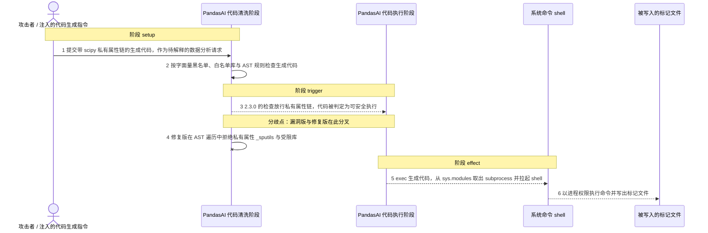
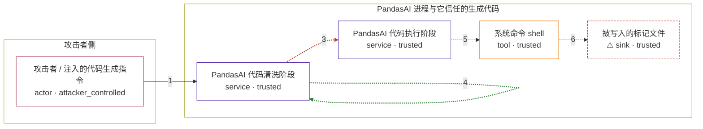

# pandasai-uses-an-interactive-prompt-function-tha / CVE-2024-12366

状态：草稿，未完成环境和复现。这个目录由模板生成，不构成漏洞确认。

图解的唯一来源是 `diagram.toml`：编辑后运行 `python3 -m runner diagram pandasai-uses-an-interactive-prompt-function-tha/CVE-2024-12366` 重新生成下方的图解区块。图解必须覆盖漏洞涉及的每个主体，并标出漏洞版/修复版的分歧步骤。

<!-- diagram:begin (generated from diagram.toml by `python3 -m runner diagram`; edit diagram.toml, not this block) -->
## 漏洞图解 — PandasAI 生成代码清洗绕过导致任意命令执行

PandasAI 2.x 把模型生成的 Python 隐式当作可信代码，只用字面量黑名单、白名单库和少量 AST 字符串做检查。攻击者左右模型输出，让生成代码带上 scipy 私有属性链，从 sys.modules 取出 subprocess 执行系统命令。修复版改为遍历 AST，遇到私有属性或受限库立即拒绝，同一段代码被挡在 exec 之前。

### 涉及主体

| 主体 | 类型 | 信任级别 | 在漏洞里的作用 | 来源 |
| --- | --- | --- | --- | --- |
| 攻击者 / 注入的代码生成指令 (`attacker`) | `actor` | `attacker_controlled` | 用自然语言问题左右模型输出，使待清洗的生成代码带上 scipy 私有属性链。攻击者能控制的只有这次生成的内容，不能直接读文件或执行命令。 | fixtures/attack_generated_code.py |
| PandasAI 代码清洗阶段 (`code_cleaning`) | `service` | `trusted` | 对生成代码做字面量黑名单、白名单库与 AST 检查。2.3.0 只匹配 os/io/chr/b64decode 字面量，不检查第三方模块属性链，也不拦 sys，因此放行了这段代码。 | pandasai/pipelines/chat/code_cleaning.py |
| PandasAI 代码执行阶段 (`code_execution`) | `service` | `trusted` | 用白名单 builtins 与白名单库构造命名空间，然后直接 exec 清洗后的代码。清洗一旦放行，就等于以 PandasAI 进程的权限执行任意 Python。 | — |
| 系统命令 shell (`shell`) | `tool` | `trusted` | 被生成代码通过 sys.modules 取到的 subprocess 拉起，命令以 PandasAI 进程的身份运行。 | — |
| ⚠ 被写入的标记文件 (`marker`) | `sink` | `trusted` | 命令执行后写出的无害标记，用来证明代码确实越过了清洗阶段并落地执行；它代表 RCE 效果的落点，不是真实外部目标。 | — |

**信任边界**

- **攻击者侧** (`attacker_side`)：成员 `attacker`。攻击者只能决定送进模型的自然语言问题，不能直接执行命令或读写进程内的文件；真正的执行发生在受信侧。
- **PandasAI 进程与它信任的生成代码** (`product`)：成员 `code_cleaning`、`code_execution`、`shell`、`marker`。清洗阶段本应把不可信的模型输出挡在 exec 之外；2.3.0 的黑名单与白名单库放行了 scipy 私有属性链，这道边界因此失效。

标 ⚠ 的主体是本仓库合成的替身或无害效果载体，不代表真实外部目标。

### 触发过程

### 主体与信任边界

箭头上的数字是上面的步骤编号；方框只标主体和信任级别，具体动作见「触发过程」。

**分歧点**：第 3 步（`vulnerable_only`）2.3.0 的检查放行私有属性链，代码被判定为可安全执行。
**分歧点**：第 4 步（`patched_only`）修复版在 AST 遍历中拒绝私有属性 _sputils 与受限库。
<!-- diagram:end -->

## 公告与机制

TODO：官方公告、漏洞根因、Agent 信任边界、受影响范围和修复来源。

## 前提

TODO：认证要求、用户交互、已有批准、工具权限、攻击者能控制的内容。

## 版本与启动

TODO：补全 metadata、Dockerfile/镜像 digest 和 Compose，再写出精确启动命令。

Compose 中 `vulnerable` 与 `patched` profiles 分开使用；未指定 profile 不启动服务。镜像变量未配置时 Compose 会明确报错。此模板不暴露宿主端口，也不挂载主机数据。

## 机制复现

TODO：实现 `reproduce.py`，固定输入并执行真实漏洞路径，注明运行位置、参数和超时。

完成实现后使用 `python3 -m runner reproduce pandasai-uses-an-interactive-prompt-function-tha/CVE-2024-12366 --build --rounds 3`。
两脚本统一接受 `--context <context.json> --output <目录>`，详细字段见仓库 `docs/environment-contract.md`。
PoC 输出 `facts.json` 和效果文件；验证器只读证据，输出含 `target_ready` 及对应效果断言的 `verdict.json`。
镜像必须包含 Python 3 和 `/lab/` 下的脚本、fixtures；`runtime.mode` 选择 `oneshot` 或有 healthcheck 的 `service`。

## 端到端复现

TODO：实现 `end_to_end.py`；若不需要模型，明确写出不适用原因。真实模型的结果与机制复现分开统计。

## 验证与修复对照

TODO：实现 `verify.py`。记录漏洞版无害效果、修复版阻断和正常任务成功的证据，不能把服务启动失败当成阻断。

## 清理

默认运行器按每个测试的唯一 Compose project 清理容器、网络和 volume。
`--keep-on-failure` 保留失败项目，项目标识和 Compose 配置在结果目录中；仅清理该项目，不能使用全局 prune。

## 失败诊断

TODO：为本漏洞写出预期效果缺失、修复版仍有越界效果、正常任务失败及前提不满足时的具体排查路径。
启动失败、健康检查失败和超时都不能当作修复阻断。报告中应能定位到阶段、预期、实际和受控证据。

## 构建与输入

TODO：填写两版源码 archive、完整 commit，记录 `build.inputs` 中每个下载的 SHA-256；依赖安装必须支持禁网构建。
固定攻击和正常输入放入 `fixtures/` 并登记到 `fixtures/manifest.toml`。固定 seed、环境变量，说明无害效果与真实影响的关系。

## 隔离例外

默认无例外。确需例外时同时填写 `runtime.exceptions`、理由及最小范围，晋升由两位维护者审阅。

## 来源与许可

TODO：列出引用代码、fixtures 和镜像的来源及许可。
