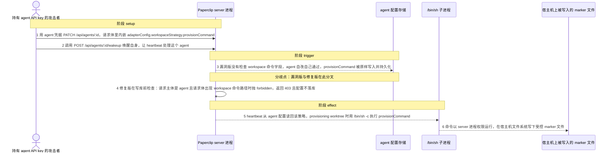
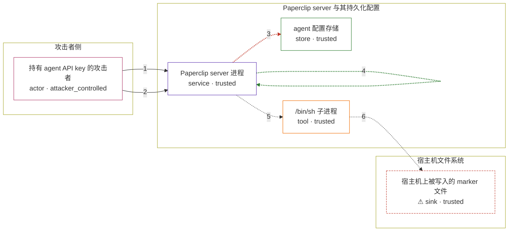

# paperclip / CVE-2026-41208

状态：草稿，未完成环境和复现。这个目录由模板生成，不构成漏洞确认。

图解的唯一来源是 `diagram.toml`：编辑后运行 `python3 -m runner diagram paperclip/CVE-2026-41208` 重新生成下方的图解区块。图解必须覆盖漏洞涉及的每个主体，并标出漏洞版/修复版的分歧步骤。

<!-- diagram:begin (generated from diagram.toml by `python3 -m runner diagram`; edit diagram.toml, not this block) -->
## 漏洞图解 — paperclip / CVE-2026-41208：agent 写入 host 执行命令导致 OS 命令执行

持有普通 agent API key 的攻击者可以 PATCH 自己 agent 的 adapterConfig，把 workspaceStrategy.provisionCommand 设成任意 shell 命令：请求体只校验 env 字段，agent 又能改自己，服务端于是把该字段原样持久化。heartbeat 在 provisioning 执行工作区时读回这份配置，用 /bin/sh -c 直接执行，命令以 server 进程权限在宿主机运行。修复提交新增授权检查：只要请求主体是 agent 且请求体含 workspaceStrategy.provisionCommand 或 teardownCommand，就在写库前返回 403。

### 涉及主体

| 主体 | 类型 | 信任级别 | 在漏洞里的作用 | 来源 |
| --- | --- | --- | --- | --- |
| 持有 agent API key 的攻击者 (`attacker`) | `actor` | `attacker_controlled` | 凭一个普通 agent 的 API key 提交 PATCH /api/agents/:id 并唤醒自己；能控制的只有这一次请求体，不能以 board 身份调用管理接口，也不能直接读写宿主机文件。 | fixtures/attack/agent_workspace_command.json |
| Paperclip server 进程 (`paperclip_server`) | `service` | `trusted` | agent 路由、heartbeat 和 workspace-runtime 都在这个进程里；它把 agent 自己写回的 adapterConfig 当成可信 provisioning 配置读回，并用 /bin/sh -c 执行其中的 provisionCommand。 | — |
| agent 配置存储 (`agent_config`) | `store` | `trusted` | 保存 agent 的 adapterConfig.workspaceStrategy；漏洞版接受 agent 主体写入，heartbeat 之后从这里读回 provisioning 策略。 | — |
| /bin/sh 子进程 (`shell`) | `tool` | `trusted` | server 进程为 provisionCommand 派生的 shell；命令既没有转义，也没有 allowlist 或 shell 元字符过滤。 | — |
| ⚠ 宿主机上被写入的 marker 文件 (`host_marker`) | `sink` | `trusted` | 漏洞版执行 provisionCommand 后落在宿主机文件系统上的受控效果载体；它记录命令确实以 server 进程权限运行过，不代表任何真实外部目标。 | — |

**信任边界**

- **攻击者侧** (`attacker_side`)：成员 `attacker`。攻击者只有一个 agent API key，只能控制自己的 PATCH 与 wakeup 请求；它拿不到宿主机文件，也不是 board 主体。
- **Paperclip server 与其持久化配置** (`product`)：成员 `paperclip_server`、`agent_config`、`shell`。服务端进程、它写回的 agent 配置和它派生的 shell。边界本来依赖配置写入权限与宿主命令执行权限的分离，漏洞版让同一个 agent 凭据同时拿到了两者。
- **宿主机文件系统** (`host`)：成员 `host_marker`。server 进程运行所在的宿主机；漏洞效果最终落到这里的受控 marker 文件。

标 ⚠ 的主体是本仓库合成的替身或无害效果载体，不代表真实外部目标。

### 触发过程

### 主体与信任边界

箭头上的数字是上面的步骤编号；方框只标主体和信任级别，具体动作见「触发过程」。

**分歧点**：第 3 步（`vulnerable_only`）漏洞版没有检查 workspace 命令字段，agent 自改自己通过，provisionCommand 被原样写入并持久化。
**分歧点**：第 4 步（`patched_only`）修复版在写库前检查：请求主体是 agent 且请求体出现 workspace 命令路径时抛 forbidden，返回 403 且配置不落库。
<!-- diagram:end -->

## 公告与机制

TODO：官方公告、漏洞根因、Agent 信任边界、受影响范围和修复来源。

## 前提

TODO：认证要求、用户交互、已有批准、工具权限、攻击者能控制的内容。

## 版本与启动

TODO：补全 metadata、Dockerfile/镜像 digest 和 Compose，再写出精确启动命令。

Compose 中 `vulnerable` 与 `patched` profiles 分开使用；未指定 profile 不启动服务。镜像变量未配置时 Compose 会明确报错。此模板不暴露宿主端口，也不挂载主机数据。

## 机制复现

TODO：实现 `reproduce.py`，固定输入并执行真实漏洞路径，注明运行位置、参数和超时。

完成实现后使用 `python3 -m runner reproduce paperclip/CVE-2026-41208 --build --rounds 3`。
两脚本统一接受 `--context <context.json> --output <目录>`，详细字段见仓库 `docs/environment-contract.md`。
PoC 输出 `facts.json` 和效果文件；验证器只读证据，输出含 `target_ready` 及对应效果断言的 `verdict.json`。
镜像必须包含 Python 3 和 `/lab/` 下的脚本、fixtures；`runtime.mode` 选择 `oneshot` 或有 healthcheck 的 `service`。

## 端到端复现

TODO：实现 `end_to_end.py`；若不需要模型，明确写出不适用原因。真实模型的结果与机制复现分开统计。

## 验证与修复对照

TODO：实现 `verify.py`。记录漏洞版无害效果、修复版阻断和正常任务成功的证据，不能把服务启动失败当成阻断。

## 清理

默认运行器按每个测试的唯一 Compose project 清理容器、网络和 volume。
`--keep-on-failure` 保留失败项目，项目标识和 Compose 配置在结果目录中；仅清理该项目，不能使用全局 prune。

## 失败诊断

TODO：为本漏洞写出预期效果缺失、修复版仍有越界效果、正常任务失败及前提不满足时的具体排查路径。
启动失败、健康检查失败和超时都不能当作修复阻断。报告中应能定位到阶段、预期、实际和受控证据。

## 构建与输入

TODO：填写两版源码 archive、完整 commit，记录 `build.inputs` 中每个下载的 SHA-256；依赖安装必须支持禁网构建。
固定攻击和正常输入放入 `fixtures/` 并登记到 `fixtures/manifest.toml`。固定 seed、环境变量，说明无害效果与真实影响的关系。

## 隔离例外

默认无例外。确需例外时同时填写 `runtime.exceptions`、理由及最小范围，晋升由两位维护者审阅。

## 来源与许可

TODO：列出引用代码、fixtures 和镜像的来源及许可。
