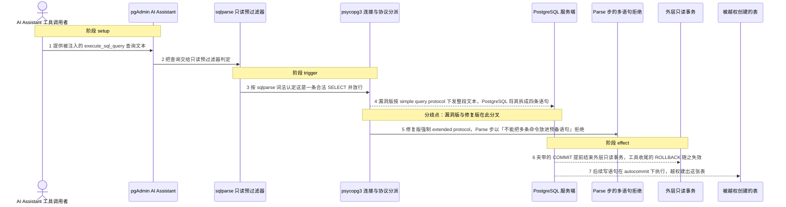
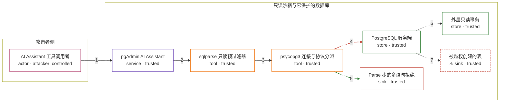

# pgadmin4 / CVE-2026-17351

状态：草稿，未完成环境和复现。这个目录由模板生成，不构成漏洞确认。

图解的唯一来源是 `diagram.toml`：编辑后运行 `python3 -m runner diagram pgadmin4/CVE-2026-17351` 重新生成下方的图解区块。图解必须覆盖漏洞涉及的每个主体，并标出漏洞版/修复版的分歧步骤。

<!-- diagram:begin (generated from diagram.toml by `python3 -m runner diagram`; edit diagram.toml, not this block) -->
## 漏洞图解 — pgadmin4 / CVE-2026-17351 漏洞图解

AI Assistant 把 sqlparse 的语句边界判定当成只读安全边界。在 standard_conforming_strings = on 下，反斜杠对 sqlparse 是转义、对 PostgreSQL 只是普通字符，于是同一段文本在客户端是「一条 SELECT」、在服务端是「四条语句」，夹带的 COMMIT 提前结束只读事务、随后的写语句在 autocommit 下执行。修复版在该一次性连接上强制 prepare_threshold = 0 并以 prepare=True 执行，让 PostgreSQL 的 Parse 步拒绝多语句文本。

### 涉及主体

| 主体 | 类型 | 信任级别 | 在漏洞里的作用 | 来源 |
| --- | --- | --- | --- | --- |
| AI Assistant 工具调用者 (`attacker`) | `actor` | `attacker_controlled` | 经间接提示注入决定 execute_sql_query 的查询文本；攻击者能完全控制这段 SQL，但控制不了数据库权限、也控制不了服务端词法。 | — |
| pgAdmin AI Assistant (`ai_assistant`) | `service` | `trusted` | execute_sql_query 工具的宿主。它把 LLM 生成的查询当作必须约束为只读的不可信输入，但约束手段只在客户端进行。 | — |
| sqlparse 只读预过滤器 (`query_validator`) | `tool` | `trusted` | 要求恰好一条非空语句且首关键字在白名单内。它按 sqlparse 的词法判定语句边界，因此与 PostgreSQL 的词法分歧时给出的结论是错的。 | fixtures/upstream/vulnerable/web/pgadmin/llm/tools/database.py |
| psycopg3 连接与协议分派 (`driver`) | `tool` | `trusted` | 决定把查询按 simple query protocol 还是 extended query protocol 发给 PostgreSQL；这个选择就是漏洞版与修复版的分叉点。 | fixtures/upstream/vulnerable/web/pgadmin/utils/driver/psycopg3/connection.py |
| PostgreSQL 服务端 (`postgresql`) | `store` | `trusted` | 按自身词法拆分语句、并在 extended protocol 的 Parse 步只接受单条语句；它才是语句边界的权威，但漏洞版根本没让它行使这道判定。 | — |
| 外层只读事务 (`transaction`) | `store` | `trusted` | 由 BEGIN TRANSACTION READ ONLY 建立，用来兜住查询里的写操作；被夹带的 COMMIT 提前结束它之后，后续语句就在 autocommit 下执行。 | — |
| ⚠ 被越权创建的表 (`marker_table`) | `sink` | `trusted` | 漏洞版下夹带的 DDL 真正落库的位置。这里用一张合成标记表承载「越权写」效果，不触发 COPY … TO PROGRAM 那条 RCE 链。 | — |
| Parse 步的多语句拒绝 (`parse_rejection`) | `sink` | `trusted` | 修复版下同一条文本被 PostgreSQL 的 Parse 步直接拒绝，夹带的语句没有机会执行。 | — |

**信任边界**

- **攻击者侧** (`attacker_side`)：成员 `attacker`。攻击者只能决定这次工具调用的查询文本，够不到数据库权限、pgAdmin 配置与服务端词法规则。
- **只读沙箱与它保护的数据库** (`product`)：成员 `ai_assistant`、`query_validator`、`driver`、`postgresql`、`transaction`、`marker_table`、`parse_rejection`。这道边界本来保证 LLM 的查询只能是单条只读语句：客户端预过滤加上服务端只读事务双重约束。漏洞让客户端判定与服务端词法不一致，两边同时失效。

标 ⚠ 的主体是本仓库合成的替身或无害效果载体，不代表真实外部目标。

### 触发过程

### 主体与信任边界

箭头上的数字是上面的步骤编号；方框只标主体和信任级别，具体动作见「触发过程」。

**分歧点**：第 4 步（`vulnerable_only`）漏洞版按 simple query protocol 下发整段文本，PostgreSQL 将其拆成四条语句。
**分歧点**：第 5 步（`patched_only`）修复版强制 extended protocol，Parse 步以「不能把多条命令放进预备语句」拒绝。
<!-- diagram:end -->

## 公告与机制

TODO：官方公告、漏洞根因、Agent 信任边界、受影响范围和修复来源。

## 前提

TODO：认证要求、用户交互、已有批准、工具权限、攻击者能控制的内容。

## 版本与启动

TODO：补全 metadata、Dockerfile/镜像 digest 和 Compose，再写出精确启动命令。

Compose 中 `vulnerable` 与 `patched` profiles 分开使用；未指定 profile 不启动服务。镜像变量未配置时 Compose 会明确报错。此模板不暴露宿主端口，也不挂载主机数据。

## 机制复现

TODO：实现 `reproduce.py`，固定输入并执行真实漏洞路径，注明运行位置、参数和超时。

完成实现后使用 `python3 -m runner reproduce pgadmin4/CVE-2026-17351 --build --rounds 3`。
两脚本统一接受 `--context <context.json> --output <目录>`，详细字段见仓库 `docs/environment-contract.md`。
PoC 输出 `facts.json` 和效果文件；验证器只读证据，输出含 `target_ready` 及对应效果断言的 `verdict.json`。
镜像必须包含 Python 3 和 `/lab/` 下的脚本、fixtures；`runtime.mode` 选择 `oneshot` 或有 healthcheck 的 `service`。

## 端到端复现

TODO：实现 `end_to_end.py`；若不需要模型，明确写出不适用原因。真实模型的结果与机制复现分开统计。

## 验证与修复对照

TODO：实现 `verify.py`。记录漏洞版无害效果、修复版阻断和正常任务成功的证据，不能把服务启动失败当成阻断。

## 清理

默认运行器按每个测试的唯一 Compose project 清理容器、网络和 volume。
`--keep-on-failure` 保留失败项目，项目标识和 Compose 配置在结果目录中；仅清理该项目，不能使用全局 prune。

## 失败诊断

TODO：为本漏洞写出预期效果缺失、修复版仍有越界效果、正常任务失败及前提不满足时的具体排查路径。
启动失败、健康检查失败和超时都不能当作修复阻断。报告中应能定位到阶段、预期、实际和受控证据。

## 构建与输入

TODO：填写两版源码 archive、完整 commit，记录 `build.inputs` 中每个下载的 SHA-256；依赖安装必须支持禁网构建。
固定攻击和正常输入放入 `fixtures/` 并登记到 `fixtures/manifest.toml`。固定 seed、环境变量，说明无害效果与真实影响的关系。

## 隔离例外

默认无例外。确需例外时同时填写 `runtime.exceptions`、理由及最小范围，晋升由两位维护者审阅。

## 来源与许可

TODO：列出引用代码、fixtures 和镜像的来源及许可。
