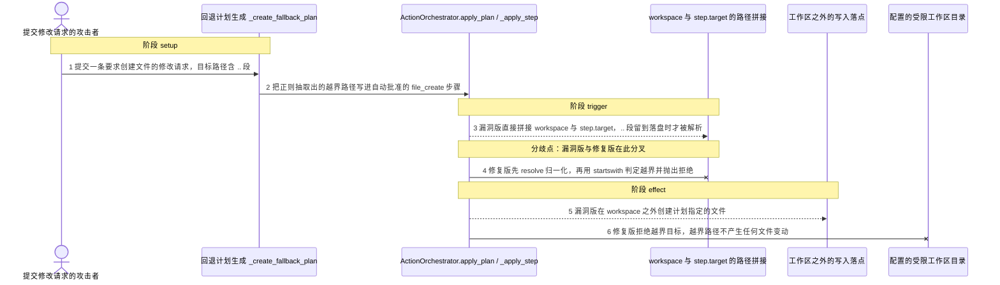
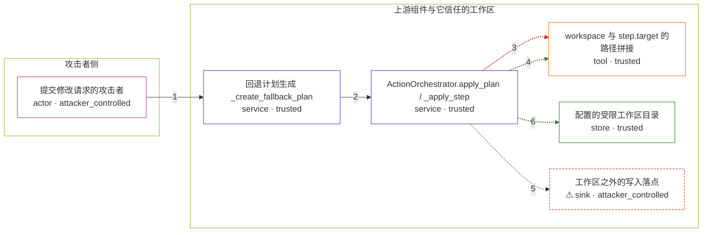

# praisonai / CVE-2026-39305

状态：草稿，未完成环境和复现。这个目录由模板生成，不构成漏洞确认。

图解的唯一来源是 `diagram.toml`：编辑后运行 `python3 -m runner diagram praisonai/CVE-2026-39305` 重新生成下方的图解区块。图解必须覆盖漏洞涉及的每个主体，并标出漏洞版/修复版的分歧步骤。

<!-- diagram:begin (generated from diagram.toml by `python3 -m runner diagram`; edit diagram.toml, not this block) -->
## 漏洞图解 — praisonai / CVE-2026-39305 Action Orchestrator 路径穿越写文件

Action Orchestrator 的 _apply_step() 把计划里的 step.target 直接与配置的 workspace 拼接后落盘，既不 resolve() 归一化，也不校验结果是否仍在 workspace 之内；step.target 由提示词正则抽取而来，属于不可信数据，因此其中的 .. 段会把文件创建、覆盖、删除和移动带出工作区。工作区本应把 Agent 的修改限制在自己的项目目录内，越界后攻击者可以覆盖 ~/.ssh/authorized_keys、~/.bashrc 这类文件，取得代码执行或破坏系统。4.5.113 在 FILE_CREATE、FILE_EDIT、FILE_DELETE 与 FILE_RENAME 四个分支上补上 resolve() 后的 startswith 包含性检查，越界目标在落盘前被 ValueError 拒绝。

### 涉及主体

| 主体 | 类型 | 信任级别 | 在漏洞里的作用 | 来源 |
| --- | --- | --- | --- | --- |
| 提交修改请求的攻击者 (`attacker`) | `actor` | `attacker_controlled` | 控制修改请求的文本，也就能决定被抽取出的目标路径；它拿不到宿主文件，只能借受害者自己的 orchestrator 会话发起这次文件操作。 | — |
| 回退计划生成 _create_fallback_plan (`planner`) | `service` | `trusted` | 用正则从提示词里抽取目标路径：前缀匹配 create 或 new，随后抓取 ([^\s]+\.\w+)，再生成状态为 APPROVED 的 file_create 步骤；该模式原样保留 .. 段，计划数据因此携带了不可信路径。 | src/praisonai/praisonai/cli/features/action_orchestrator.py |
| ActionOrchestrator.apply_plan / _apply_step (`orchestrator`) | `service` | `trusted` | 在 apply_plan() 里执行状态为 APPROVED 或 PENDING 的步骤；_apply_step() 用 Path(workspace) / step.target 拼出落盘路径后直接 write_text、unlink、rename，是缺少包含性校验的根因所在。 | src/praisonai/praisonai/cli/features/action_orchestrator.py |
| workspace 与 step.target 的路径拼接 (`path_join`) | `tool` | `trusted` | pathlib 的 / 只做字符串拼接、不归约 .. 段，所以拼接结果看起来仍在 workspace 下，直到操作系统按真实路径解析才发生越界；修复版在这里先 resolve() 再用 startswith 判断结果是否仍以 workspace 为前缀。 | — |
| 配置的受限工作区目录 (`workspace`) | `store` | `trusted` | runtime.config.workspace 指向的项目目录，本来应该把计划里的文件操作全部限制在它之内；正常任务在这里写入，漏洞版则越过它。 | — |
| ⚠ 工作区之外的写入落点 (`outside_target`) | `sink` | `attacker_controlled` | 由 .. 段选中的工作区外路径，越界创建的文件落在那里；演示中只写入一个无害标记文件来观察效果，它不代表真实被覆盖的 authorized_keys 或 .bashrc。 | — |

**信任边界**

- **攻击者侧** (`attacker_side`)：成员 `attacker`。攻击者只能控制这次修改请求的文本；workspace 配置、read_only 取值与批准状态都是运行环境的前提，不是攻击动作。
- **上游组件与它信任的工作区** (`product`)：成员 `planner`、`orchestrator`、`path_join`、`workspace`、`outside_target`。这道边界把文件操作限制在配置的 workspace 之内；计划数据被当成可信路径，拼接出的越界路径没有在落盘前被拦下，修复版才补上 resolve() 与包含性检查。

标 ⚠ 的主体是本仓库合成的替身或无害效果载体，不代表真实外部目标。

### 触发过程

### 主体与信任边界

箭头上的数字是上面的步骤编号；方框只标主体和信任级别，具体动作见「触发过程」。

**分歧点**：第 3 步（`vulnerable_only`）漏洞版直接拼接 workspace 与 step.target，.. 段留到落盘时才被解析。
**分歧点**：第 4 步（`patched_only`）修复版先 resolve 归一化，再用 startswith 判定越界并抛出拒绝。
<!-- diagram:end -->

## 公告与机制

TODO：官方公告、漏洞根因、Agent 信任边界、受影响范围和修复来源。

## 前提

TODO：认证要求、用户交互、已有批准、工具权限、攻击者能控制的内容。

## 版本与启动

TODO：补全 metadata、Dockerfile/镜像 digest 和 Compose，再写出精确启动命令。

Compose 中 `vulnerable` 与 `patched` profiles 分开使用；未指定 profile 不启动服务。镜像变量未配置时 Compose 会明确报错。此模板不暴露宿主端口，也不挂载主机数据。

## 机制复现

TODO：实现 `reproduce.py`，固定输入并执行真实漏洞路径，注明运行位置、参数和超时。

完成实现后使用 `python3 -m runner reproduce praisonai/CVE-2026-39305 --build --rounds 3`。
两脚本统一接受 `--context <context.json> --output <目录>`，详细字段见仓库 `docs/environment-contract.md`。
PoC 输出 `facts.json` 和效果文件；验证器只读证据，输出含 `target_ready` 及对应效果断言的 `verdict.json`。
镜像必须包含 Python 3 和 `/lab/` 下的脚本、fixtures；`runtime.mode` 选择 `oneshot` 或有 healthcheck 的 `service`。

## 端到端复现

TODO：实现 `end_to_end.py`；若不需要模型，明确写出不适用原因。真实模型的结果与机制复现分开统计。

## 验证与修复对照

TODO：实现 `verify.py`。记录漏洞版无害效果、修复版阻断和正常任务成功的证据，不能把服务启动失败当成阻断。

## 清理

默认运行器按每个测试的唯一 Compose project 清理容器、网络和 volume。
`--keep-on-failure` 保留失败项目，项目标识和 Compose 配置在结果目录中；仅清理该项目，不能使用全局 prune。

## 失败诊断

TODO：为本漏洞写出预期效果缺失、修复版仍有越界效果、正常任务失败及前提不满足时的具体排查路径。
启动失败、健康检查失败和超时都不能当作修复阻断。报告中应能定位到阶段、预期、实际和受控证据。

## 构建与输入

TODO：填写两版源码 archive、完整 commit，记录 `build.inputs` 中每个下载的 SHA-256；依赖安装必须支持禁网构建。
固定攻击和正常输入放入 `fixtures/` 并登记到 `fixtures/manifest.toml`。固定 seed、环境变量，说明无害效果与真实影响的关系。

## 隔离例外

默认无例外。确需例外时同时填写 `runtime.exceptions`、理由及最小范围，晋升由两位维护者审阅。

## 来源与许可

TODO：列出引用代码、fixtures 和镜像的来源及许可。
