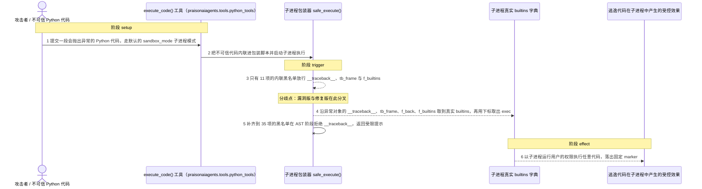
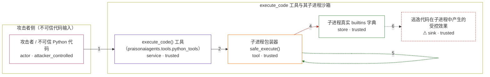

# praisonai / CVE-2026-39888

状态：草稿，未完成环境和复现。这个目录由模板生成，不构成漏洞确认。

图解的唯一来源是 `diagram.toml`：编辑后运行 `python3 -m runner diagram praisonai/CVE-2026-39888` 重新生成下方的图解区块。图解必须覆盖漏洞涉及的每个主体，并标出漏洞版/修复版的分歧步骤。

<!-- diagram:begin (generated from diagram.toml by `python3 -m runner diagram`; edit diagram.toml, not this block) -->
## 漏洞图解 — praisonai / CVE-2026-39888 漏洞图解

execute_code() 默认以 sandbox_mode="sandbox" 把不可信 Python 代码交给子进程包装器执行，而包装器内联的 blocked_attrs 只有 11 项，缺少 __traceback__、tb_frame、f_builtins 等 frame 链属性。漏洞版代码在子进程内故意抛出异常，沿异常对象的 frame 链取到包装器自己的真实 builtins 字典，再用 dict 下标取出 exec，按名调用黑名单因此失效。修复版把 blocked_attrs 补齐到 35 项，__traceback__ 在 AST 阶段即被拒绝，frame 链无法起步；逃逸后的代码以子进程运行用户的权限执行任意代码。

### 涉及主体

| 主体 | 类型 | 信任级别 | 在漏洞里的作用 | 来源 |
| --- | --- | --- | --- | --- |
| 攻击者 / 不可信 Python 代码 (`attacker`) | `actor` | `attacker_controlled` | 控制提交给 execute_code() 的代码字符串，构造一段先抛异常、再沿属性链回溯的载荷；它只能控制这一次工具调用的输入，无法预先改动工具源码或宿主文件。 | fixtures/attack_escape_payload.py |
| execute_code() 工具（praisonaiagents.tools.python_tools） (`execute_code_tool`) | `service` | `trusted` | 受影响的上游组件：签名默认 sandbox_mode='sandbox'，把不可信代码转交子进程包装器，并让包装器内联的 AST 黑名单成为属性访问的唯一屏障。 | src/praisonai-agents/praisonaiagents/tools/python_tools.py |
| 子进程包装器 safe_execute() (`sandbox_wrapper`) | `tool` | `trusted` | 在清空环境变量的普通子进程里 exec 不可信代码，把 getattr 换成 _safe_getattr，并用内联 blocked_attrs 做 AST 检查；但点号访问不经过 _safe_getattr，黑名单又只列了 11 项。 | src/praisonai-agents/praisonaiagents/tools/python_tools.py |
| 子进程真实 builtins 字典 (`real_builtins`) | `store` | `trusted` | 包装器帧的 f_builtins 指向的真实 builtins；用 dict 下标 ['exec'] 取名既不触发属性检查，也不匹配按名调用黑名单，因此提供了不受限的 exec。 | src/praisonai-agents/praisonaiagents/tools/python_tools.py |
| ⚠ 逃逸代码在子进程中产生的受控效果 (`escape_effect`) | `sink` | `trusted` | 逃逸后的 exec 以子进程运行用户的权限执行任意代码，落出一个固定 marker（写入 /tmp 并打印），用于证明不可信代码已在真实 builtins 下运行；它是无害效果载体，不是真实外部目标。 | — |

**信任边界**

- **攻击者侧（不可信代码输入）** (`attacker_side`)：成员 `attacker`。攻击者只能控制这一次工具调用的代码字符串，不能读写宿主文件、不能改工具源码，也不能预先布置 frame 链。
- **execute_code 工具与其子进程沙箱** (`sandbox_boundary`)：成员 `execute_code_tool`、`sandbox_wrapper`、`real_builtins`、`escape_effect`。这道边界声称用受限 __builtins__ 加 AST 黑名单把不可信代码关在子进程内；漏洞版的属性黑名单缺少 frame 链属性，边界因此失效。

标 ⚠ 的主体是本仓库合成的替身或无害效果载体，不代表真实外部目标。

### 触发过程

### 主体与信任边界

箭头上的数字是上面的步骤编号；方框只标主体和信任级别，具体动作见「触发过程」。

**分歧点**：第 3 步（`vulnerable_only`）只有 11 项的内联黑名单放行 __traceback__、tb_frame 与 f_builtins。
**分歧点**：第 4 步（`vulnerable_only`）沿异常对象的 __traceback__、tb_frame、f_back、f_builtins 取到真实 builtins，再用下标取出 exec。
**分歧点**：第 5 步（`patched_only`）补齐到 35 项的黑名单在 AST 阶段拒绝 __traceback__，返回受限提示。
<!-- diagram:end -->

## 公告与机制

TODO：官方公告、漏洞根因、Agent 信任边界、受影响范围和修复来源。

## 前提

TODO：认证要求、用户交互、已有批准、工具权限、攻击者能控制的内容。

## 版本与启动

TODO：补全 metadata、Dockerfile/镜像 digest 和 Compose，再写出精确启动命令。

Compose 中 `vulnerable` 与 `patched` profiles 分开使用；未指定 profile 不启动服务。镜像变量未配置时 Compose 会明确报错。此模板不暴露宿主端口，也不挂载主机数据。

## 机制复现

TODO：实现 `reproduce.py`，固定输入并执行真实漏洞路径，注明运行位置、参数和超时。

完成实现后使用 `python3 -m runner reproduce praisonai/CVE-2026-39888 --build --rounds 3`。
两脚本统一接受 `--context <context.json> --output <目录>`，详细字段见仓库 `docs/environment-contract.md`。
PoC 输出 `facts.json` 和效果文件；验证器只读证据，输出含 `target_ready` 及对应效果断言的 `verdict.json`。
镜像必须包含 Python 3 和 `/lab/` 下的脚本、fixtures；`runtime.mode` 选择 `oneshot` 或有 healthcheck 的 `service`。

## 端到端复现

TODO：实现 `end_to_end.py`；若不需要模型，明确写出不适用原因。真实模型的结果与机制复现分开统计。

## 验证与修复对照

TODO：实现 `verify.py`。记录漏洞版无害效果、修复版阻断和正常任务成功的证据，不能把服务启动失败当成阻断。

## 清理

默认运行器按每个测试的唯一 Compose project 清理容器、网络和 volume。
`--keep-on-failure` 保留失败项目，项目标识和 Compose 配置在结果目录中；仅清理该项目，不能使用全局 prune。

## 失败诊断

TODO：为本漏洞写出预期效果缺失、修复版仍有越界效果、正常任务失败及前提不满足时的具体排查路径。
启动失败、健康检查失败和超时都不能当作修复阻断。报告中应能定位到阶段、预期、实际和受控证据。

## 构建与输入

TODO：填写两版源码 archive、完整 commit，记录 `build.inputs` 中每个下载的 SHA-256；依赖安装必须支持禁网构建。
固定攻击和正常输入放入 `fixtures/` 并登记到 `fixtures/manifest.toml`。固定 seed、环境变量，说明无害效果与真实影响的关系。

## 隔离例外

默认无例外。确需例外时同时填写 `runtime.exceptions`、理由及最小范围，晋升由两位维护者审阅。

## 来源与许可

TODO：列出引用代码、fixtures 和镜像的来源及许可。
