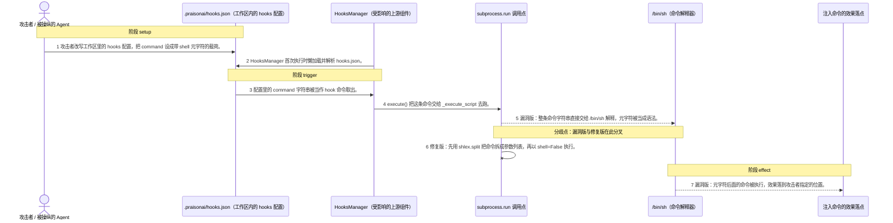
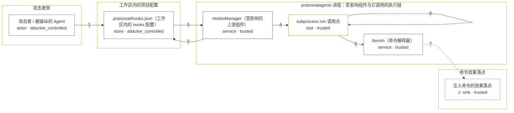

# praisonai / CVE-2026-40111

状态：草稿，未完成环境和复现。这个目录由模板生成，不构成漏洞确认。

图解的唯一来源是 `diagram.toml`：编辑后运行 `python3 -m runner diagram praisonai/CVE-2026-40111` 重新生成下方的图解区块。图解必须覆盖漏洞涉及的每个主体，并标出漏洞版/修复版的分歧步骤。

<!-- diagram:begin (generated from diagram.toml by `python3 -m runner diagram`; edit diagram.toml, not this block) -->
## 漏洞图解 — PraisonAI memory hooks 命令注入

praisonaiagents 的 HooksManager 把 .praisonai/hooks.json 里的 command 字符串整条交给 subprocess.run(shell=True)。这份配置在工作区内，能写工作区的攻击者就能改它。命令里的分号、管道、反引号因此被 /bin/sh 当成语法解释，配置值升级成任意命令执行：元字符后面的那条命令会以产品进程的身份跑起来。修复版先用 shlex.split 把命令拆成参数列表，再以 shell=False 执行，元字符退回普通参数字符。

### 涉及主体

| 主体 | 类型 | 信任级别 | 在漏洞里的作用 | 来源 |
| --- | --- | --- | --- | --- |
| 攻击者 / 被操纵的 Agent (`attacker`) | `actor` | `attacker_controlled` | 攻击者。它通过提示注入拿到工作区写权限，能改的就是工作区里的 hooks 配置。它想让产品进程替它执行命令，因为命令要在产品身份下运行才有意义。 | fixtures/attack.json |
| .praisonai/hooks.json（工作区内的 hooks 配置） (`hooks_config`) | `store` | `attacker_controlled` | 工作区里的生命周期配置，command 字段就是攻击载荷。它本是「指定要跑哪个脚本」的数据，却因为被当成整条 shell 命令行而变成代码。 | fixtures/attack.json |
| HooksManager（受影响的上游组件） (`hooks_manager`) | `service` | `trusted` | 出问题的上游组件。它从工作区读 hooks.json，把每个事件映射到一条 command，并在 execute() 时派发。它本该只负责调度，却把命令的解析权交给了 shell。 | src/praisonai-agents/praisonaiagents/memory/hooks.py |
| subprocess.run 调用点 (`subprocess_runner`) | `tool` | `trusted` | 真正执行命令的工具。_execute_script() 在这里调用 subprocess.run：漏洞版传字符串并开 shell=True，修复版传 shlex.split 后的参数列表并关掉 shell。漏洞版与修复版都要经过它。 | src/praisonai-agents/praisonaiagents/memory/hooks.py |
| /bin/sh（命令解释器） (`posix_shell`) | `service` | `trusted` | 把整条命令字符串当成 shell 语法解释的解释器。分号、管道、反引号、命令替换都由它处理，攻击者注入的第二条命令正是从这里被放行。修复版不再经过它。 | — |
| ⚠ 注入命令的效果落点 (`command_sink`) | `sink` | `trusted` | 被注入命令实际作用的位置。攻击者想让它落在哪里就落在哪里；本环境里它是受控的无害标记文件，不是真实的外部目标。 | — |

**信任边界**

- **攻击者侧** (`attacker_side`)：成员 `attacker`。攻击者能控制的只有工作区里的那份配置。它自己不能直接在产品进程里执行命令——能执行就不用绕这一圈了。
- **工作区内的项目配置** (`project_config`)：成员 `hooks_config`。这是产品信任的工作区数据。它能被写工作区的人改写，却没有被当成不可信输入对待。
- **praisonaiagents 进程：受影响组件与它调用的执行链** (`praisonaiagents`)：成员 `hooks_manager`、`subprocess_runner`、`posix_shell`。这道边界本来把「配置数据」和「以产品身份执行的命令」隔开。漏洞让配置里的字符串穿过它变成命令。
- **命令效果落点** (`effect_side`)：成员 `command_sink`。注入命令真正生效的地方。漏洞版能把效果落到这里，修复版到不了。

标 ⚠ 的主体是本仓库合成的替身或无害效果载体，不代表真实外部目标。

### 触发过程

### 主体与信任边界

箭头上的数字是上面的步骤编号；方框只标主体和信任级别，具体动作见「触发过程」。

**分歧点**：第 5 步（`vulnerable_only`）漏洞版：整条命令字符串直接交给 /bin/sh 解释，元字符被当成语法。。
**分歧点**：第 6 步（`patched_only`）修复版：先用 shlex.split 把命令拆成参数列表，再以 shell=False 执行。。
<!-- diagram:end -->

## 公告与机制

TODO：官方公告、漏洞根因、Agent 信任边界、受影响范围和修复来源。

## 前提

TODO：认证要求、用户交互、已有批准、工具权限、攻击者能控制的内容。

## 版本与启动

TODO：补全 metadata、Dockerfile/镜像 digest 和 Compose，再写出精确启动命令。

Compose 中 `vulnerable` 与 `patched` profiles 分开使用；未指定 profile 不启动服务。镜像变量未配置时 Compose 会明确报错。此模板不暴露宿主端口，也不挂载主机数据。

## 机制复现

TODO：实现 `reproduce.py`，固定输入并执行真实漏洞路径，注明运行位置、参数和超时。

完成实现后使用 `python3 -m runner reproduce praisonai/CVE-2026-40111 --build --rounds 3`。
两脚本统一接受 `--context <context.json> --output <目录>`，详细字段见仓库 `docs/environment-contract.md`。
PoC 输出 `facts.json` 和效果文件；验证器只读证据，输出含 `target_ready` 及对应效果断言的 `verdict.json`。
镜像必须包含 Python 3 和 `/lab/` 下的脚本、fixtures；`runtime.mode` 选择 `oneshot` 或有 healthcheck 的 `service`。

## 端到端复现

TODO：实现 `end_to_end.py`；若不需要模型，明确写出不适用原因。真实模型的结果与机制复现分开统计。

## 验证与修复对照

TODO：实现 `verify.py`。记录漏洞版无害效果、修复版阻断和正常任务成功的证据，不能把服务启动失败当成阻断。

## 清理

默认运行器按每个测试的唯一 Compose project 清理容器、网络和 volume。
`--keep-on-failure` 保留失败项目，项目标识和 Compose 配置在结果目录中；仅清理该项目，不能使用全局 prune。

## 失败诊断

TODO：为本漏洞写出预期效果缺失、修复版仍有越界效果、正常任务失败及前提不满足时的具体排查路径。
启动失败、健康检查失败和超时都不能当作修复阻断。报告中应能定位到阶段、预期、实际和受控证据。

## 构建与输入

TODO：填写两版源码 archive、完整 commit，记录 `build.inputs` 中每个下载的 SHA-256；依赖安装必须支持禁网构建。
固定攻击和正常输入放入 `fixtures/` 并登记到 `fixtures/manifest.toml`。固定 seed、环境变量，说明无害效果与真实影响的关系。

## 隔离例外

默认无例外。确需例外时同时填写 `runtime.exceptions`、理由及最小范围，晋升由两位维护者审阅。

## 来源与许可

TODO：列出引用代码、fixtures 和镜像的来源及许可。
