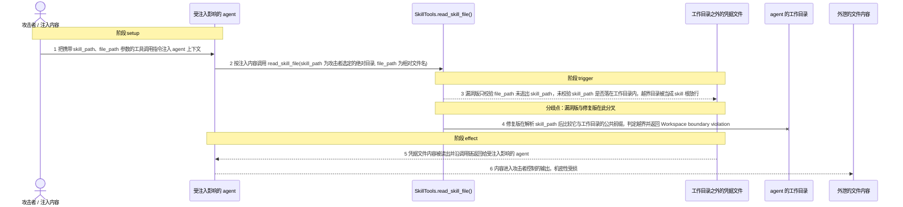
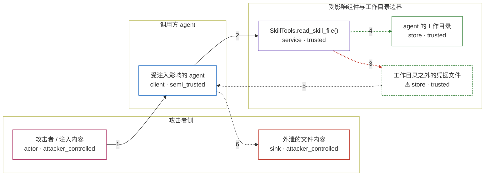

# praisonai / CVE-2026-40117

状态：草稿，未完成环境和复现。这个目录由模板生成，不构成漏洞确认。

图解的唯一来源是 `diagram.toml`：编辑后运行 `python3 -m runner diagram praisonai/CVE-2026-40117` 重新生成下方的图解区块。图解必须覆盖漏洞涉及的每个主体，并标出漏洞版/修复版的分歧步骤。

<!-- diagram:begin (generated from diagram.toml by `python3 -m runner diagram`; edit diagram.toml, not this block) -->
## 漏洞图解 — praisonai / CVE-2026-40117 漏洞图解

SkillTools.read_skill_file() 只校验 file_path 没有逃出调用方给出的 skill_path，却不校验 skill_path 本身是否位于 agent 的工作目录内，因此 skill_path 可以被指定为任意绝对目录。受不可信内容影响的 agent 只要把 /etc 一类目录当作 skill 根，就能读到进程可读、但本应在工作目录之外的任意文件，无需审批也无需认证。修复版在解析 skill_path 之后比较它与工作目录的公共前缀，越界即返回 Workspace boundary violation，并为该调用补上审批要求，同一输入不再返回文件内容。

### 涉及主体

| 主体 | 类型 | 信任级别 | 在漏洞里的作用 | 来源 |
| --- | --- | --- | --- | --- |
| 攻击者 / 注入内容 (`attacker`) | `actor` | `attacker_controlled` | 只控制进入 agent 上下文的不可信内容，以及其中携带的 skill_path、file_path 参数；它本身没有目标文件系统的读权限。 | fixtures/attack/tool_call.json |
| 受注入影响的 agent (`agent`) | `client` | `semi_trusted` | 按上下文里的指令发起工具调用，把攻击者选定的 skill_path 与 file_path 原样转交给 skill 工具，并在返回值里接收文件内容。 | — |
| SkillTools.read_skill_file() (`skill_tools`) | `service` | `trusted` | 受影响的上游组件：把 skill_path 解析为绝对路径后只检查 file_path 未逃出 skill_path，缺少工作目录边界校验，也不在审批清单里。 | src/praisonai-agents/praisonaiagents/tools/skill_tools.py |
| agent 的工作目录 (`workspace`) | `store` | `trusted` | agent 声明的工作目录，本应是 skill 读取的唯一边界；修复版正是用它来判定 skill_path 是否越界。 | — |
| ⚠ 工作目录之外的凭据文件 (`outside_file`) | `store` | `trusted` | 位于工作目录之外、攻击者自己读不到的凭据文件，是这次越界读取的目标；其中是无害的合成 marker。 | fixtures/attack/secret.txt |
| 外泄的文件内容 (`leaked_content`) | `sink` | `attacker_controlled` | 被读出的文件内容沿调用链回到受注入影响的 agent，最终进入攻击者控制的输出。 | — |

**信任边界**

- **攻击者侧** (`attacker_side`)：成员 `attacker`、`leaked_content`。攻击者只能提供不可信内容及其中的工具调用参数，并接收最终回传的内容；它无法直接读取目标文件。
- **调用方 agent** (`agent_side`)：成员 `agent`。agent 把不可信内容转成受信的工具调用，是半可信的转发点：它有权调用工具，却按注入的参数调用。
- **受影响组件与工作目录边界** (`product`)：成员 `skill_tools`、`workspace`、`outside_file`。这道边界本应把 skill 读取限制在 agent 的工作目录内；漏洞版把 file_path 相对 skill_path 的前缀检查当成了完整边界，skill_path 自身不受约束。

标 ⚠ 的主体是本仓库合成的替身或无害效果载体，不代表真实外部目标。

### 触发过程

### 主体与信任边界

箭头上的数字是上面的步骤编号；方框只标主体和信任级别，具体动作见「触发过程」。

**分歧点**：第 3 步（`vulnerable_only`）漏洞版只校验 file_path 未逃出 skill_path，未校验 skill_path 是否落在工作目录内，越界目录被当成 skill 根放行。
**分歧点**：第 4 步（`patched_only`）修复版在解析 skill_path 后比较它与工作目录的公共前缀，判定越界并返回 Workspace boundary violation。
<!-- diagram:end -->

## 公告与机制

TODO：官方公告、漏洞根因、Agent 信任边界、受影响范围和修复来源。

## 前提

TODO：认证要求、用户交互、已有批准、工具权限、攻击者能控制的内容。

## 版本与启动

TODO：补全 metadata、Dockerfile/镜像 digest 和 Compose，再写出精确启动命令。

Compose 中 `vulnerable` 与 `patched` profiles 分开使用；未指定 profile 不启动服务。镜像变量未配置时 Compose 会明确报错。此模板不暴露宿主端口，也不挂载主机数据。

## 机制复现

TODO：实现 `reproduce.py`，固定输入并执行真实漏洞路径，注明运行位置、参数和超时。

完成实现后使用 `python3 -m runner reproduce praisonai/CVE-2026-40117 --build --rounds 3`。
两脚本统一接受 `--context <context.json> --output <目录>`，详细字段见仓库 `docs/environment-contract.md`。
PoC 输出 `facts.json` 和效果文件；验证器只读证据，输出含 `target_ready` 及对应效果断言的 `verdict.json`。
镜像必须包含 Python 3 和 `/lab/` 下的脚本、fixtures；`runtime.mode` 选择 `oneshot` 或有 healthcheck 的 `service`。

## 端到端复现

TODO：实现 `end_to_end.py`；若不需要模型，明确写出不适用原因。真实模型的结果与机制复现分开统计。

## 验证与修复对照

TODO：实现 `verify.py`。记录漏洞版无害效果、修复版阻断和正常任务成功的证据，不能把服务启动失败当成阻断。

## 清理

默认运行器按每个测试的唯一 Compose project 清理容器、网络和 volume。
`--keep-on-failure` 保留失败项目，项目标识和 Compose 配置在结果目录中；仅清理该项目，不能使用全局 prune。

## 失败诊断

TODO：为本漏洞写出预期效果缺失、修复版仍有越界效果、正常任务失败及前提不满足时的具体排查路径。
启动失败、健康检查失败和超时都不能当作修复阻断。报告中应能定位到阶段、预期、实际和受控证据。

## 构建与输入

TODO：填写两版源码 archive、完整 commit，记录 `build.inputs` 中每个下载的 SHA-256；依赖安装必须支持禁网构建。
固定攻击和正常输入放入 `fixtures/` 并登记到 `fixtures/manifest.toml`。固定 seed、环境变量，说明无害效果与真实影响的关系。

## 隔离例外

默认无例外。确需例外时同时填写 `runtime.exceptions`、理由及最小范围，晋升由两位维护者审阅。

## 来源与许可

TODO：列出引用代码、fixtures 和镜像的来源及许可。
