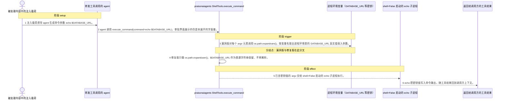
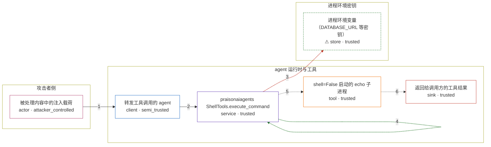

# praisonai / CVE-2026-40153

状态：草稿，未完成环境和复现。这个目录由模板生成，不构成漏洞确认。

图解的唯一来源是 `diagram.toml`：编辑后运行 `python3 -m runner diagram praisonai/CVE-2026-40153` 重新生成下方的图解区块。图解必须覆盖漏洞涉及的每个主体，并标出漏洞版/修复版的分歧步骤。

<!-- diagram:begin (generated from diagram.toml by `python3 -m runner diagram`; edit diagram.toml, not this block) -->
## 漏洞图解 — praisonaiagents ShellTools.execute_command 用 os.path.expandvars 展开命令参数

ShellTools.execute_command() 以 shlex.split() 加 subprocess.Popen(shell=False) 执行命令，本意是不经过 shell，因此不解释 $VAR；但它在 split 之后又对每个 argv 元素调用 os.path.expandvars()，把进程环境里的变量值填回参数。被处理内容中的注入载荷因此可以用 echo $DATABASE_URL 这样的普通参数，让只对进程可见的密钥随命令输出进入工具返回值。修复提交只保留 os.path.expanduser()，删除了命令参数和 cwd 两处 expandvars。

### 涉及主体

| 主体 | 类型 | 信任级别 | 在漏洞里的作用 | 来源 |
| --- | --- | --- | --- | --- |
| 被处理内容中的注入载荷 (`injection`) | `actor` | `attacker_controlled` | 攻击者控制 agent 会读取的文档、网页或邮件正文，在其中把 `echo $DATABASE_URL` 伪装成应当执行的命令参数。$ 不是 shell 元字符，因此这串参数不会触发任何过滤。 | fixtures/attack-command.json |
| 转发工具调用的 agent (`agent`) | `client` | `semi_trusted` | 读取攻击者可控的内容，把其中的命令参数原样交给 ShellTools.execute_command()；审批界面拿到的也是未展开的原始参数字符串。 | — |
| praisonaiagents ShellTools.execute_command (`shell_tools`) | `service` | `trusted` | 受影响的上游组件。它在 shlex.split() 之后对每个 argv 元素调用 os.path.expandvars()，手工补上了 shell=False 本应放弃的变量展开语义，且对所有变量名生效、没有 allowlist。 | src/praisonai-agents/praisonaiagents/tools/shell_tools.py |
| ⚠ 进程环境变量（DATABASE_URL 等密钥） (`process_env`) | `store` | `trusted` | 只应被进程自身读取的密钥来源，存放固定的合成标记值。expandvars 按变量名取出其中的真实值，攻击者自己无法直接读到。 | — |
| shell=False 启动的 echo 子进程 (`subprocess`) | `tool` | `trusted` | 接收已经展开的 argv，把参数原样写到标准输出；它本身不解释 $VAR。 | — |
| 返回给调用方的工具结果 (`tool_result`) | `sink` | `trusted` | 命令输出随工具结果回到 agent 上下文，密钥值由此离开进程环境的可见范围。 | — |

**信任边界**

- **攻击者侧** (`attacker_side`)：成员 `injection`。攻击者只能控制被处理内容里的文字，不能直接读写进程环境，也不能决定命令以 shell 方式执行。
- **agent 运行时与工具** (`agent_runtime`)：成员 `agent`、`shell_tools`、`subprocess`、`tool_result`。这道边界把不可信内容与命令执行隔开：shell=False 原本保证参数不经 shell 展开，只做路径层面处理。
- **进程环境密钥** (`secret_store`)：成员 `process_env`。进程环境只对进程自身可见；expandvars 把它按变量名暴露给了命令参数。

标 ⚠ 的主体是本仓库合成的替身或无害效果载体，不代表真实外部目标。

### 触发过程

### 主体与信任边界

箭头上的数字是上面的步骤编号；方框只标主体和信任级别，具体动作见「触发过程」。

**分歧点**：第 3 步（`vulnerable_only`）漏洞版对每个 argv 元素调用 os.path.expandvars()，按变量名取出进程环境里的 DATABASE_URL 真实值填入参数。。
**分歧点**：第 4 步（`patched_only`）修复版只做 os.path.expanduser()，$DATABASE_URL 作为普通字符串保留、不再解析。。
<!-- diagram:end -->

## 公告与机制

TODO：官方公告、漏洞根因、Agent 信任边界、受影响范围和修复来源。

## 前提

TODO：认证要求、用户交互、已有批准、工具权限、攻击者能控制的内容。

## 版本与启动

TODO：补全 metadata、Dockerfile/镜像 digest 和 Compose，再写出精确启动命令。

Compose 中 `vulnerable` 与 `patched` profiles 分开使用；未指定 profile 不启动服务。镜像变量未配置时 Compose 会明确报错。此模板不暴露宿主端口，也不挂载主机数据。

## 机制复现

TODO：实现 `reproduce.py`，固定输入并执行真实漏洞路径，注明运行位置、参数和超时。

完成实现后使用 `python3 -m runner reproduce praisonai/CVE-2026-40153 --build --rounds 3`。
两脚本统一接受 `--context <context.json> --output <目录>`，详细字段见仓库 `docs/environment-contract.md`。
PoC 输出 `facts.json` 和效果文件；验证器只读证据，输出含 `target_ready` 及对应效果断言的 `verdict.json`。
镜像必须包含 Python 3 和 `/lab/` 下的脚本、fixtures；`runtime.mode` 选择 `oneshot` 或有 healthcheck 的 `service`。

## 端到端复现

TODO：实现 `end_to_end.py`；若不需要模型，明确写出不适用原因。真实模型的结果与机制复现分开统计。

## 验证与修复对照

TODO：实现 `verify.py`。记录漏洞版无害效果、修复版阻断和正常任务成功的证据，不能把服务启动失败当成阻断。

## 清理

默认运行器按每个测试的唯一 Compose project 清理容器、网络和 volume。
`--keep-on-failure` 保留失败项目，项目标识和 Compose 配置在结果目录中；仅清理该项目，不能使用全局 prune。

## 失败诊断

TODO：为本漏洞写出预期效果缺失、修复版仍有越界效果、正常任务失败及前提不满足时的具体排查路径。
启动失败、健康检查失败和超时都不能当作修复阻断。报告中应能定位到阶段、预期、实际和受控证据。

## 构建与输入

TODO：填写两版源码 archive、完整 commit，记录 `build.inputs` 中每个下载的 SHA-256；依赖安装必须支持禁网构建。
固定攻击和正常输入放入 `fixtures/` 并登记到 `fixtures/manifest.toml`。固定 seed、环境变量，说明无害效果与真实影响的关系。

## 隔离例外

默认无例外。确需例外时同时填写 `runtime.exceptions`、理由及最小范围，晋升由两位维护者审阅。

## 来源与许可

TODO：列出引用代码、fixtures 和镜像的来源及许可。
