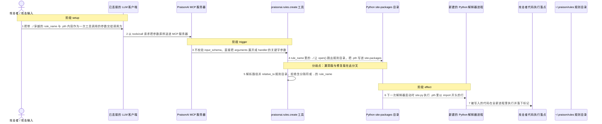

# praisonai / CVE-2026-44336

状态：草稿，未完成环境和复现。这个目录由模板生成，不构成漏洞确认。

图解的唯一来源是 `diagram.toml`：编辑后运行 `python3 -m runner diagram praisonai/CVE-2026-44336` 重新生成下方的图解区块。图解必须覆盖漏洞涉及的每个主体，并标出漏洞版/修复版的分歧步骤。

<!-- diagram:begin (generated from diagram.toml by `python3 -m runner diagram`; edit diagram.toml, not this block) -->
## 漏洞图解 — praisonai / CVE-2026-44336 漏洞图解

PraisonAI 的 MCP 分发器不校验工具参数（input_schema 只用于展示），praisonai.rules.create 又把 rule_name 直接拼接到 ~/.praison/rules 之后写入，二者叠加使 ../../ 目录穿越绕过规则目录这道包含边界。攻击者因此能把以 import 开头的 .pth 写进 Python 的 site-packages；此后任意一个解释器启动都会执行该文件中的代码，把一次越界写放大为跨进程的持久任意代码执行。

### 涉及主体

| 主体 | 类型 | 信任级别 | 在漏洞里的作用 | 来源 |
| --- | --- | --- | --- | --- |
| 攻击者 / 攻击输入 (`attacker`) | `actor` | `attacker_controlled` | 构造带 ../ 目录穿越的 rule_name 和以 import 开头的 .pth 内容，作为一次 tools/call 的 arguments。它自己够不着规则目录之外的文件系统，只能控制这次调用的参数。 | — |
| 已连接的 LLM 客户端 (`mcp_client`) | `client` | `semi_trusted` | 把提示注入带进来的内容转发成 MCP tools/call 请求。它会把不可信参数送进受信流程，但不按 input_schema 校验参数形状。 | — |
| PraisonAI MCP 服务器 (`mcp_server`) | `service` | `trusted` | MCPServer._handle_tools_call 取下 params['arguments'] 后直接以 tool.handler(**arguments) 调用；input_schema 只在 tools/list 里展示，调用前从不校验。 | — |
| praisonai.rules.create 工具 (`rules_tool`) | `tool` | `trusted` | 把 rule_name 直接 os.path.join 到 ~/.praison/rules 之后 open(..., 'w') 写入，拼接前后都不检查目标是否仍在规则目录内。 | — |
| ~/.praison/rules 规则目录 (`rules_store`) | `store` | `trusted` | 设计上唯一允许写入规则的目录，也是本次被 ../../ 绕过的包含边界。攻击链路不写这里，但边界本身是漏洞成立的前提。 | — |
| Python site-packages 目录 (`site_packages`) | `store` | `trusted` | 解释器启动时按 site.py 语义扫描 .pth 的目录，位于规则目录之外，本不应收到来自规则工具的任何写入。 | — |
| 新建的 Python 解释器进程 (`python_interpreter`) | `tool` | `trusted` | 任意一次后续解释器启动都会执行 site-packages 下 .pth 里以 import 开头的行，使一次越界写变成与当前 MCP 进程无关的代码执行。 | — |
| ⚠ 攻击者代码执行落点 (`rce_marker`) | `sink` | `trusted` | 漏洞效果落点：由新进程中被执行的攻击者代码写下的标记，用于确认代码执行发生在一个全新进程而不是当前进程。它是无害的效果载体，不代表真实外部目标。 | — |

**信任边界**

- **攻击者侧** (`attacker_side`)：成员 `attacker`。攻击者只能控制一次 tools/call 的 arguments，拿不到规则目录之外的文件系统写权限，所以它需要一个把不可信参数带进受信流程的通道。
- **调用方侧** (`caller_side`)：成员 `mcp_client`。LLM 客户端把外部内容带进受信流程：它转发工具参数，但不生成也不校验参数形状，边界检查只能由服务端与工具自己负责。
- **PraisonAI MCP 服务与规则目录** (`mcp_product`)：成员 `mcp_server`、`rules_tool`、`rules_store`。规则目录本应把写入限制在 ~/.praison/rules 内。分发器缺少 schema 校验、工具又缺少目录包含检查，这道边界因此被 ../../ 穿透。
- **解释器启动与 site-packages** (`startup_side`)：成员 `site_packages`、`python_interpreter`、`rce_marker`。site-packages 是攻击者要落脚的位置；解释器每次启动都会执行其中的 .pth，效果因此跨进程持久化，并落在攻击者代码自己写下的标记上。

标 ⚠ 的主体是本仓库合成的替身或无害效果载体，不代表真实外部目标。

### 触发过程

### 主体与信任边界

箭头上的数字是上面的步骤编号；方框只标主体和信任级别，具体动作见「触发过程」。

```mermaid
%% praisonai / CVE-2026-44336 漏洞图解 — generated from diagram.toml
flowchart LR
  subgraph attacker_side["攻击者侧"]
    attacker["攻击者 / 攻击输入<br/>actor · attacker_controlled"]
  end
  subgraph caller_side["调用方侧"]
    mcp_client["已连接的 LLM 客户端<br/>client · semi_trusted"]
  end
  subgraph mcp_product["PraisonAI MCP 服务与规则目录"]
    mcp_server["PraisonAI MCP 服务器<br/>service · trusted"]
    rules_tool["praisonai.rules.create 工具<br/>tool · trusted"]
    rules_store["~/.praison/rules 规则目录<br/>store · trusted"]
  end
  subgraph startup_side["解释器启动与 site-packages"]
    site_packages["Python site-packages 目录<br/>store · trusted"]
    python_interpreter["新建的 Python 解释器进程<br/>tool · trusted"]
    rce_marker["攻击者代码执行落点<br/>⚠ sink · trusted"]
  end
  attacker -->|"1"| mcp_client
  mcp_client -->|"2"| mcp_server
  mcp_server -->|"3"| rules_tool
  rules_tool -.->|"4"| site_packages
  rules_tool -.->|"5"| rules_tool
  site_packages -.->|"6"| python_interpreter
  python_interpreter -.->|"7"| rce_marker
  classDef actor fill:transparent,stroke:#b03a6a
  classDef client fill:transparent,stroke:#1565c0
  classDef service fill:transparent,stroke:#5e35b1
  classDef tool fill:transparent,stroke:#ef6c00
  classDef sink fill:transparent,stroke:#c0392b
  classDef store fill:transparent,stroke:#2e7d32
  classDef synthetic stroke-dasharray: 4 2
  class attacker actor
  class mcp_client client
  class mcp_server service
  class rules_tool tool
  class rules_store store
  class site_packages store
  class python_interpreter tool
  class rce_marker sink
  class rce_marker synthetic
  style attacker_side fill:transparent
  style caller_side fill:transparent
  style mcp_product fill:transparent
  style startup_side fill:transparent
  linkStyle 3 stroke:#c0392b,stroke-width:2px
  linkStyle 4 stroke:#2e7d32,stroke-width:2px
```

**分歧点**：第 4 步（`vulnerable_only`）rule_name 里的 ../ 让 open() 跳出规则目录，把 .pth 写进 site-packages。
**分歧点**：第 5 步（`patched_only`）解析路径并 relative_to 规则目录，拒绝含分隔符或 .. 的 rule_name。
<!-- diagram:end -->

## 公告与机制

TODO：官方公告、漏洞根因、Agent 信任边界、受影响范围和修复来源。

## 前提

TODO：认证要求、用户交互、已有批准、工具权限、攻击者能控制的内容。

## 版本与启动

TODO：补全 metadata、Dockerfile/镜像 digest 和 Compose，再写出精确启动命令。

Compose 中 `vulnerable` 与 `patched` profiles 分开使用；未指定 profile 不启动服务。镜像变量未配置时 Compose 会明确报错。此模板不暴露宿主端口，也不挂载主机数据。

## 机制复现

TODO：实现 `reproduce.py`，固定输入并执行真实漏洞路径，注明运行位置、参数和超时。

完成实现后使用 `python3 -m runner reproduce praisonai/CVE-2026-44336 --build --rounds 3`。
两脚本统一接受 `--context <context.json> --output <目录>`，详细字段见仓库 `docs/environment-contract.md`。
PoC 输出 `facts.json` 和效果文件；验证器只读证据，输出含 `target_ready` 及对应效果断言的 `verdict.json`。
镜像必须包含 Python 3 和 `/lab/` 下的脚本、fixtures；`runtime.mode` 选择 `oneshot` 或有 healthcheck 的 `service`。

## 端到端复现

TODO：实现 `end_to_end.py`；若不需要模型，明确写出不适用原因。真实模型的结果与机制复现分开统计。

## 验证与修复对照

TODO：实现 `verify.py`。记录漏洞版无害效果、修复版阻断和正常任务成功的证据，不能把服务启动失败当成阻断。

## 清理

默认运行器按每个测试的唯一 Compose project 清理容器、网络和 volume。
`--keep-on-failure` 保留失败项目，项目标识和 Compose 配置在结果目录中；仅清理该项目，不能使用全局 prune。

## 失败诊断

TODO：为本漏洞写出预期效果缺失、修复版仍有越界效果、正常任务失败及前提不满足时的具体排查路径。
启动失败、健康检查失败和超时都不能当作修复阻断。报告中应能定位到阶段、预期、实际和受控证据。

## 构建与输入

TODO：填写两版源码 archive、完整 commit，记录 `build.inputs` 中每个下载的 SHA-256；依赖安装必须支持禁网构建。
固定攻击和正常输入放入 `fixtures/` 并登记到 `fixtures/manifest.toml`。固定 seed、环境变量，说明无害效果与真实影响的关系。

## 隔离例外

默认无例外。确需例外时同时填写 `runtime.exceptions`、理由及最小范围，晋升由两位维护者审阅。

## 来源与许可

TODO：列出引用代码、fixtures 和镜像的来源及许可。
