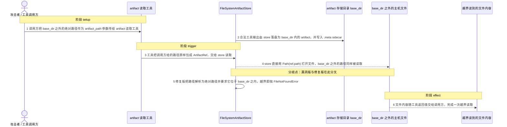
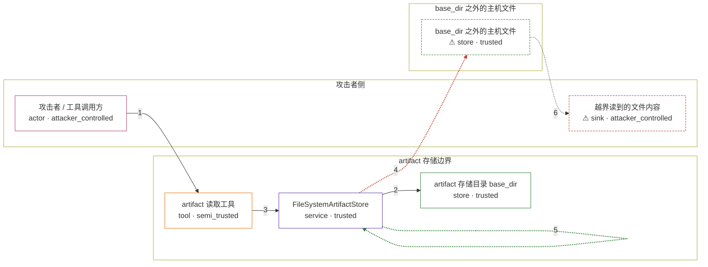

# praisonai / CVE-2026-56834

状态：草稿，未完成环境和复现。这个目录由模板生成，不构成漏洞确认。

图解的唯一来源是 `diagram.toml`：编辑后运行 `python3 -m runner diagram praisonai/CVE-2026-56834` 重新生成下方的图解区块。图解必须覆盖漏洞涉及的每个主体，并标出漏洞版/修复版的分歧步骤。

<!-- diagram:begin (generated from diagram.toml by `python3 -m runner diagram`; edit diagram.toml, not this block) -->
## 漏洞图解 — praisonai / CVE-2026-56834 漏洞图解

PraisonAI 的 Dynamic Context Discovery 把过大的工具输出落盘成 artifact，再让 agent 通过 artifact 工具按需读取。工具函数把调用方传入的 artifact_path 原样包成 ArtifactRef，FileSystemArtifactStore 又直接用它打开文件，从不检查路径是否落在 base_dir 之内。于是能影响工具参数的调用方可以读到 artifact 存储之外的任意主机文件；修复版改为解析路径并要求它位于 base_dir 之内，越界访问被拒绝。影响面仅为机密性泄露。

### 涉及主体

| 主体 | 类型 | 信任级别 | 在漏洞里的作用 | 来源 |
| --- | --- | --- | --- | --- |
| 攻击者 / 工具调用方 (`attacker`) | `actor` | `attacker_controlled` | 决定 artifact 工具的 artifact_path 参数，把它指向 artifact 存储之外的主机文件；它只能控制这次调用的参数，对主机文件系统没有写权限。 | — |
| artifact 读取工具 (`artifact_tools`) | `tool` | `semi_trusted` | create_artifact_tools() 返回 artifact_head / artifact_tail / artifact_grep / artifact_chunk，它们把调用方给的路径原样包成 ArtifactRef 后交给 store，自身不做任何归属校验。 | — |
| FileSystemArtifactStore (`artifact_store`) | `service` | `trusted` | 负责 artifact 的落盘与读取。漏洞版直接用 Path(ref.path) 打开文件，缺少 base_dir containment 检查；修复版新增 _resolve_artifact_path() 并在 load/tail/head/grep/chunk/delete 中统一调用。 | — |
| artifact 存储目录 base_dir (`artifact_base`) | `store` | `trusted` | 设计上唯一允许被 artifact 工具读取的产物范围；由 store 落盘并维护 .meta sidecar，合法产物都在这里。 | — |
| ⚠ base_dir 之外的主机文件 (`host_file`) | `store` | `trusted` | 攻击者真正想读的目标：进程有读权限、但不属于 artifact 存储，也不会出现在 artifact 列表里。这里用无害的合成标记代替真实的主机机密。 | fixtures/attack/outside.env |
| ⚠ 越界读到的文件内容 (`leak`) | `sink` | `attacker_controlled` | 被读出的文件内容随工具返回值到达调用方，形成机密性泄露；载体是无害的合成标记。 | — |

**信任边界**

- **攻击者侧** (`attacker_side`)：成员 `attacker`、`leak`。调用方能控制工具参数并拿到工具返回值，但它不能直接读取 base_dir 之外的主机文件，也不能直接操作 store。
- **artifact 存储边界** (`artifact_boundary`)：成员 `artifact_tools`、`artifact_store`、`artifact_base`。设计上只允许读取 base_dir 内由 store 管理的产物；漏洞版没有把路径解析后与 base_dir 比较，这道边界因此失效。
- **base_dir 之外的主机文件** (`host_boundary`)：成员 `host_file`。本应被 artifact 存储边界挡住的目标，进程能读但没有合法的 artifact 入口。

标 ⚠ 的主体是本仓库合成的替身或无害效果载体，不代表真实外部目标。

### 触发过程

### 主体与信任边界

箭头上的数字是上面的步骤编号；方框只标主体和信任级别，具体动作见「触发过程」。

**分歧点**：第 4 步（`vulnerable_only`）store 直接用 Path(ref.path) 打开文件，base_dir 之外的路径同样被读取。
**分歧点**：第 5 步（`patched_only`）修复版把路径解析为绝对路径并要求它位于 base_dir 之内，越界即抛 FileNotFoundError。
<!-- diagram:end -->

## 公告与机制

TODO：官方公告、漏洞根因、Agent 信任边界、受影响范围和修复来源。

## 前提

TODO：认证要求、用户交互、已有批准、工具权限、攻击者能控制的内容。

## 版本与启动

TODO：补全 metadata、Dockerfile/镜像 digest 和 Compose，再写出精确启动命令。

Compose 中 `vulnerable` 与 `patched` profiles 分开使用；未指定 profile 不启动服务。镜像变量未配置时 Compose 会明确报错。此模板不暴露宿主端口，也不挂载主机数据。

## 机制复现

TODO：实现 `reproduce.py`，固定输入并执行真实漏洞路径，注明运行位置、参数和超时。

完成实现后使用 `python3 -m runner reproduce praisonai/CVE-2026-56834 --build --rounds 3`。
两脚本统一接受 `--context <context.json> --output <目录>`，详细字段见仓库 `docs/environment-contract.md`。
PoC 输出 `facts.json` 和效果文件；验证器只读证据，输出含 `target_ready` 及对应效果断言的 `verdict.json`。
镜像必须包含 Python 3 和 `/lab/` 下的脚本、fixtures；`runtime.mode` 选择 `oneshot` 或有 healthcheck 的 `service`。

## 端到端复现

TODO：实现 `end_to_end.py`；若不需要模型，明确写出不适用原因。真实模型的结果与机制复现分开统计。

## 验证与修复对照

TODO：实现 `verify.py`。记录漏洞版无害效果、修复版阻断和正常任务成功的证据，不能把服务启动失败当成阻断。

## 清理

默认运行器按每个测试的唯一 Compose project 清理容器、网络和 volume。
`--keep-on-failure` 保留失败项目，项目标识和 Compose 配置在结果目录中；仅清理该项目，不能使用全局 prune。

## 失败诊断

TODO：为本漏洞写出预期效果缺失、修复版仍有越界效果、正常任务失败及前提不满足时的具体排查路径。
启动失败、健康检查失败和超时都不能当作修复阻断。报告中应能定位到阶段、预期、实际和受控证据。

## 构建与输入

TODO：填写两版源码 archive、完整 commit，记录 `build.inputs` 中每个下载的 SHA-256；依赖安装必须支持禁网构建。
固定攻击和正常输入放入 `fixtures/` 并登记到 `fixtures/manifest.toml`。固定 seed、环境变量，说明无害效果与真实影响的关系。

## 隔离例外

默认无例外。确需例外时同时填写 `runtime.exceptions`、理由及最小范围，晋升由两位维护者审阅。

## 来源与许可

TODO：列出引用代码、fixtures 和镜像的来源及许可。
