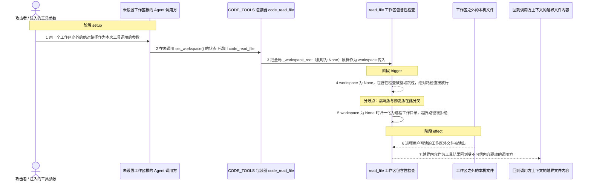
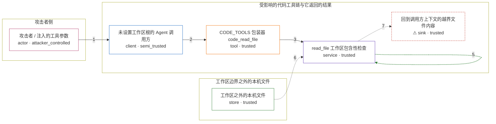

# praisonai / CVE-2026-56839

状态：草稿，未完成环境和复现。这个目录由模板生成，不构成漏洞确认。

图解的唯一来源是 `diagram.toml`：编辑后运行 `python3 -m runner diagram praisonai/CVE-2026-56839` 重新生成下方的图解区块。图解必须覆盖漏洞涉及的每个主体，并标出漏洞版/修复版的分歧步骤。

<!-- diagram:begin (generated from diagram.toml by `python3 -m runner diagram`; edit diagram.toml, not this block) -->
## 漏洞图解 — praisonai / CVE-2026-56839 漏洞图解

PraisonAI 的 CODE_TOOLS 包装器把全局 _workspace_root 原样作为 workspace 传给 read_file，未设置时该值为 None。read_file 只在 workspace 为真值时才调用 is_path_within_directory，于是工作区之外的绝对路径既不参与拼接也不触发包含性检查，被直接放行；修复版把 None 归一化为进程工作目录并无条件检查包含性，同一路径被拒绝。受不可信内容影响的模型因此可以借 code_read_file 读出工作区之外的文件，并把内容带回自己的上下文。

### 涉及主体

| 主体 | 类型 | 信任级别 | 在漏洞里的作用 | 来源 |
| --- | --- | --- | --- | --- |
| 攻击者 / 注入的工具参数 (`attacker`) | `actor` | `attacker_controlled` | 受不可信内容影响的模型把攻击者选定的绝对路径交给代码工具；攻击者只能控制这次工具调用的参数，不能直接读写目标主机上的文件。 | fixtures/attack.json |
| 未设置工作区根的 Agent 调用方 (`code_agent`) | `client` | `semi_trusted` | 把模型选定的工具调用转发给 CODE_TOOLS，并且在调用 set_workspace() 之前就暴露了这些工具，因此包装器读到的工作区根是 None。 | — |
| CODE_TOOLS 包装器 code_read_file (`code_tools`) | `tool` | `trusted` | 把全局 _workspace_root 原样作为 workspace 参数传给 read_file，未设置时该参数为 None；包装器自身不做任何路径校验。 | — |
| read_file 工作区包含性检查 (`read_file`) | `service` | `trusted` | 解析目标路径，并只在 workspace 为真值时才调用 is_path_within_directory；workspace 为 None 时整段包含性检查被跳过，绝对路径被放行。 | — |
| 工作区之外的本机文件 (`outside_file`) | `store` | `trusted` | 攻击者想要但按工作区规则无权读取的文件；它位于进程工作目录之外，只有包含性检查生效时才被挡住。 | fixtures/outside/credentials.txt |
| ⚠ 回到调用方上下文的越界文件内容 (`leaked_content`) | `sink` | `trusted` | 漏洞版把越界读到的内容作为工具结果返回给受不可信内容驱动的调用方；这里是固定的无害 marker 文件，用来证明内容确实跨过了工作区边界。 | — |

**信任边界**

- **攻击者侧** (`attacker_side`)：成员 `attacker`。攻击者只能控制这次工具调用的参数；它不能直接访问主机文件，所以越界内容必须经由工具结果回到它手里。
- **受影响的代码工具链与它返回的结果** (`agent_side`)：成员 `code_agent`、`code_tools`、`read_file`、`leaked_content`。这道边界把不可信内容驱动的模型调用与本地文件系统隔开；工作区根缺失时包含性检查被跳过，边界随之失效。
- **工作区边界之外的本机文件** (`host_side`)：成员 `outside_file`。这些文件本应只在工作区根被显式设置并生效时才处于边界之内；默认的 fail-open 让它们对代码工具可读。

标 ⚠ 的主体是本仓库合成的替身或无害效果载体，不代表真实外部目标。

### 触发过程

### 主体与信任边界

箭头上的数字是上面的步骤编号；方框只标主体和信任级别，具体动作见「触发过程」。

**分歧点**：第 4 步（`vulnerable_only`）workspace 为 None，包含性检查被整段跳过，绝对路径直接放行。
**分歧点**：第 5 步（`patched_only`）workspace 为 None 时归一化为进程工作目录，越界路径被拒绝。
<!-- diagram:end -->

## 公告与机制

TODO：官方公告、漏洞根因、Agent 信任边界、受影响范围和修复来源。

## 前提

TODO：认证要求、用户交互、已有批准、工具权限、攻击者能控制的内容。

## 版本与启动

TODO：补全 metadata、Dockerfile/镜像 digest 和 Compose，再写出精确启动命令。

Compose 中 `vulnerable` 与 `patched` profiles 分开使用；未指定 profile 不启动服务。镜像变量未配置时 Compose 会明确报错。此模板不暴露宿主端口，也不挂载主机数据。

## 机制复现

TODO：实现 `reproduce.py`，固定输入并执行真实漏洞路径，注明运行位置、参数和超时。

完成实现后使用 `python3 -m runner reproduce praisonai/CVE-2026-56839 --build --rounds 3`。
两脚本统一接受 `--context <context.json> --output <目录>`，详细字段见仓库 `docs/environment-contract.md`。
PoC 输出 `facts.json` 和效果文件；验证器只读证据，输出含 `target_ready` 及对应效果断言的 `verdict.json`。
镜像必须包含 Python 3 和 `/lab/` 下的脚本、fixtures；`runtime.mode` 选择 `oneshot` 或有 healthcheck 的 `service`。

## 端到端复现

TODO：实现 `end_to_end.py`；若不需要模型，明确写出不适用原因。真实模型的结果与机制复现分开统计。

## 验证与修复对照

TODO：实现 `verify.py`。记录漏洞版无害效果、修复版阻断和正常任务成功的证据，不能把服务启动失败当成阻断。

## 清理

默认运行器按每个测试的唯一 Compose project 清理容器、网络和 volume。
`--keep-on-failure` 保留失败项目，项目标识和 Compose 配置在结果目录中；仅清理该项目，不能使用全局 prune。

## 失败诊断

TODO：为本漏洞写出预期效果缺失、修复版仍有越界效果、正常任务失败及前提不满足时的具体排查路径。
启动失败、健康检查失败和超时都不能当作修复阻断。报告中应能定位到阶段、预期、实际和受控证据。

## 构建与输入

TODO：填写两版源码 archive、完整 commit，记录 `build.inputs` 中每个下载的 SHA-256；依赖安装必须支持禁网构建。
固定攻击和正常输入放入 `fixtures/` 并登记到 `fixtures/manifest.toml`。固定 seed、环境变量，说明无害效果与真实影响的关系。

## 隔离例外

默认无例外。确需例外时同时填写 `runtime.exceptions`、理由及最小范围，晋升由两位维护者审阅。

## 来源与许可

TODO：列出引用代码、fixtures 和镜像的来源及许可。
