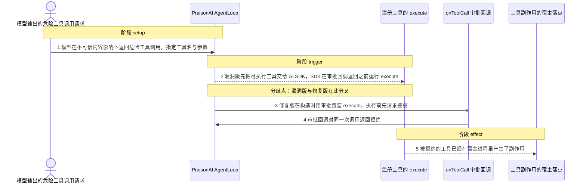
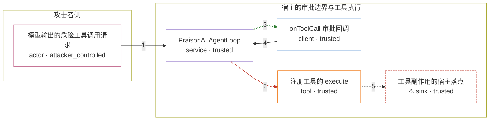

# praisonai / CVE-2026-57137

状态：草稿，未完成环境和复现。这个目录由模板生成，不构成漏洞确认。

图解的唯一来源是 `diagram.toml`：编辑后运行 `python3 -m runner diagram praisonai/CVE-2026-57137` 重新生成下方的图解区块。图解必须覆盖漏洞涉及的每个主体，并标出漏洞版/修复版的分歧步骤。

<!-- diagram:begin (generated from diagram.toml by `python3 -m runner diagram`; edit diagram.toml, not this block) -->
## 漏洞图解 — praisonai / CVE-2026-57137 漏洞图解

PraisonAI 的 AgentLoop 把 onToolCall 文档化为审批钩子，但 step() 先把带 execute 的工具交给 AI SDK 执行，之后才调用审批回调。审批回调返回拒绝时工具副作用已经产生，finishReason 却仍被置为 tool_rejected，形成虚假的安全信号。修复版在构造时用审批包装每个工具的 execute，拒绝会在执行前抛出。图跟踪不可信工具调用从模型输出到宿主副作用的路径，以及审批边界在漏洞版与修复版中的先后顺序。

### 涉及主体

| 主体 | 类型 | 信任级别 | 在漏洞里的作用 | 来源 |
| --- | --- | --- | --- | --- |
| 模型输出的危险工具调用请求 (`model_output`) | `actor` | `attacker_controlled` | 在不可信内容影响下决定工具名与参数；这是攻击者唯一能控制的东西，它并不能自己读写宿主文件。 | fixtures/attack-tool-call.json |
| PraisonAI AgentLoop (`agent_loop`) | `service` | `trusted` | 受影响的上游组件。step() 把带 execute 的工具交给 generateText 执行，审批回调在工具结果之后才被调用，漏洞版的拒绝因此迟到。 | — |
| onToolCall 审批回调 (`approval_gate`) | `client` | `trusted` | 宿主应用提供的 onToolCall 策略回调，被公开文档和示例当作人在环审批边界；回调本身可信，问题在于它被调用的时机。 | — |
| 注册工具的 execute (`tool_execute`) | `tool` | `trusted` | 注册工具自带的 execute，会把调用参数落到文件、命令或外部调用上；审批本应在它之前完成。 | — |
| ⚠ 工具副作用的宿主落点 (`host_effect`) | `sink` | `trusted` | 工具副作用在宿主进程权限内的落点。机制复现里用无害的标记文件代表这个落点，它不是真实的外部目标，也不含真实凭据。 | — |

**信任边界**

- **攻击者侧** (`attacker_side`)：成员 `model_output`。攻击者只能决定这一次工具调用的名字与参数，够不到宿主文件；拒绝与否由宿主自己的策略决定。
- **宿主的审批边界与工具执行** (`host_boundary`)：成员 `agent_loop`、`approval_gate`、`tool_execute`、`host_effect`。这道边界要求工具执行前完成授权。漏洞版把授权排到了执行之后，边界退化成事后审计；修复版把授权移回 execute 之前。

标 ⚠ 的主体是本仓库合成的替身或无害效果载体，不代表真实外部目标。

### 触发过程

### 主体与信任边界

箭头上的数字是上面的步骤编号；方框只标主体和信任级别，具体动作见「触发过程」。

**分歧点**：第 2 步（`vulnerable_only`）漏洞版先把可执行工具交给 AI SDK，SDK 在审批回调返回之前运行 execute。
**分歧点**：第 3 步（`patched_only`）修复版在构造时用审批包装 execute，执行前先请求授权。
<!-- diagram:end -->

## 公告与机制

TODO：官方公告、漏洞根因、Agent 信任边界、受影响范围和修复来源。

## 前提

TODO：认证要求、用户交互、已有批准、工具权限、攻击者能控制的内容。

## 版本与启动

TODO：补全 metadata、Dockerfile/镜像 digest 和 Compose，再写出精确启动命令。

Compose 中 `vulnerable` 与 `patched` profiles 分开使用；未指定 profile 不启动服务。镜像变量未配置时 Compose 会明确报错。此模板不暴露宿主端口，也不挂载主机数据。

## 机制复现

TODO：实现 `reproduce.py`，固定输入并执行真实漏洞路径，注明运行位置、参数和超时。

完成实现后使用 `python3 -m runner reproduce praisonai/CVE-2026-57137 --build --rounds 3`。
两脚本统一接受 `--context <context.json> --output <目录>`，详细字段见仓库 `docs/environment-contract.md`。
PoC 输出 `facts.json` 和效果文件；验证器只读证据，输出含 `target_ready` 及对应效果断言的 `verdict.json`。
镜像必须包含 Python 3 和 `/lab/` 下的脚本、fixtures；`runtime.mode` 选择 `oneshot` 或有 healthcheck 的 `service`。

## 端到端复现

TODO：实现 `end_to_end.py`；若不需要模型，明确写出不适用原因。真实模型的结果与机制复现分开统计。

## 验证与修复对照

TODO：实现 `verify.py`。记录漏洞版无害效果、修复版阻断和正常任务成功的证据，不能把服务启动失败当成阻断。

## 清理

默认运行器按每个测试的唯一 Compose project 清理容器、网络和 volume。
`--keep-on-failure` 保留失败项目，项目标识和 Compose 配置在结果目录中；仅清理该项目，不能使用全局 prune。

## 失败诊断

TODO：为本漏洞写出预期效果缺失、修复版仍有越界效果、正常任务失败及前提不满足时的具体排查路径。
启动失败、健康检查失败和超时都不能当作修复阻断。报告中应能定位到阶段、预期、实际和受控证据。

## 构建与输入

TODO：填写两版源码 archive、完整 commit，记录 `build.inputs` 中每个下载的 SHA-256；依赖安装必须支持禁网构建。
固定攻击和正常输入放入 `fixtures/` 并登记到 `fixtures/manifest.toml`。固定 seed、环境变量，说明无害效果与真实影响的关系。

## 隔离例外

默认无例外。确需例外时同时填写 `runtime.exceptions`、理由及最小范围，晋升由两位维护者审阅。

## 来源与许可

TODO：列出引用代码、fixtures 和镜像的来源及许可。
