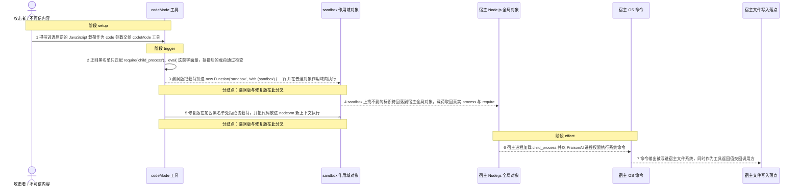
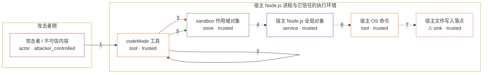

# praisonai / CVE-2026-57141

状态：草稿，未完成环境和复现。这个目录由模板生成，不构成漏洞确认。

图解的唯一来源是 `diagram.toml`：编辑后运行 `python3 -m runner diagram praisonai/CVE-2026-57141` 重新生成下方的图解区块。图解必须覆盖漏洞涉及的每个主体，并标出漏洞版/修复版的分歧步骤。

<!-- diagram:begin (generated from diagram.toml by `python3 -m runner diagram`; edit diagram.toml, not this block) -->
## 漏洞图解 — praisonai codeMode 沙箱逃逸导致宿主命令执行

codeMode 工具把调用方可控的 code 参数拼进 new Function('sandbox', 'with (sandbox) { ... }') 在宿主进程内执行，而 sandbox 只是插进作用域链的普通对象，不是隔离上下文。sandbox 上找不到的标识符会回落到真实全局对象，载荷因此能用 Function('return process')() 取回宿主 process 与 require，再用字符串拼接绕开只匹配字面量的正则黑名单。逃逸后的代码以 PraisonAI 进程权限执行系统命令并读写宿主文件；修复版改用 node:vm 新上下文执行同一载荷。

### 涉及主体

| 主体 | 类型 | 信任级别 | 在漏洞里的作用 | 来源 |
| --- | --- | --- | --- | --- |
| 攻击者 / 不可信内容 (`attacker`) | `actor` | `attacker_controlled` | 决定 codeMode 工具 code 参数的内容，构造能通过字面量黑名单并回落到宿主全局对象的 JavaScript 载荷。 | — |
| codeMode 工具 (`code_mode_tool`) | `tool` | `trusted` | 先对 code 做正则黑名单检查，再用 new Function 加 with (sandbox) 在宿主进程内执行；漏洞版与修复版的差异就在这一步。 | src/praisonai-ts/src/tools/builtins/code-mode.ts |
| sandbox 作用域对象 (`sandbox_scope`) | `store` | `trusted` | 作为 with 的作用域插入执行上下文，只提供 console、env、files，并把 process 与 require 覆盖为 undefined；它没有切断作用域链。 | — |
| 宿主 Node.js 全局对象 (`host_globals`) | `service` | `trusted` | 作用域链的末端，含有真实的 process 与模块加载能力；逃逸原语 Function('return process')() 与 mainModule.require 都从这里取得。 | — |
| 宿主 OS 命令 (`host_exec`) | `tool` | `trusted` | 逃逸后的载荷用它执行系统命令，命令以 PraisonAI 进程的权限和文件访问范围运行。 | — |
| ⚠ 宿主文件写入落点 (`effect_marker`) | `sink` | `trusted` | 逃逸命令把系统命令输出写到这里；这是一个无害的标记文件，用来证明写入发生在沙箱之外的宿主文件系统上，不是真实的外部目标。 | — |

**信任边界**

- **攻击者侧** (`attacker_side`)：成员 `attacker`。攻击者只能决定这一次工具调用的 code 文本，不能直接读写宿主文件或启动进程。
- **宿主 Node.js 进程与它信任的执行环境** (`host_process`)：成员 `code_mode_tool`、`sandbox_scope`、`host_globals`、`host_exec`、`effect_marker`。黑名单和 sandbox 对象本应把模型生成的代码限制在没有宿主机能力的范围内，但 with 作用域链没有隔离全局对象，逃逸后的代码直接落到宿主进程权限。

标 ⚠ 的主体是本仓库合成的替身或无害效果载体，不代表真实外部目标。

### 触发过程

### 主体与信任边界

箭头上的数字是上面的步骤编号；方框只标主体和信任级别，具体动作见「触发过程」。

**分歧点**：第 3 步（`vulnerable_only`）漏洞版把载荷拼进 new Function('sandbox', 'with (sandbox) { ... }') 并在普通对象作用域内执行。
**分歧点**：第 5 步（`patched_only`）修复版在加固黑名单处拒绝该载荷，并把代码放进 node:vm 新上下文执行。
<!-- diagram:end -->

## 公告与机制

TODO：官方公告、漏洞根因、Agent 信任边界、受影响范围和修复来源。

## 前提

TODO：认证要求、用户交互、已有批准、工具权限、攻击者能控制的内容。

## 版本与启动

TODO：补全 metadata、Dockerfile/镜像 digest 和 Compose，再写出精确启动命令。

Compose 中 `vulnerable` 与 `patched` profiles 分开使用；未指定 profile 不启动服务。镜像变量未配置时 Compose 会明确报错。此模板不暴露宿主端口，也不挂载主机数据。

## 机制复现

TODO：实现 `reproduce.py`，固定输入并执行真实漏洞路径，注明运行位置、参数和超时。

完成实现后使用 `python3 -m runner reproduce praisonai/CVE-2026-57141 --build --rounds 3`。
两脚本统一接受 `--context <context.json> --output <目录>`，详细字段见仓库 `docs/environment-contract.md`。
PoC 输出 `facts.json` 和效果文件；验证器只读证据，输出含 `target_ready` 及对应效果断言的 `verdict.json`。
镜像必须包含 Python 3 和 `/lab/` 下的脚本、fixtures；`runtime.mode` 选择 `oneshot` 或有 healthcheck 的 `service`。

## 端到端复现

TODO：实现 `end_to_end.py`；若不需要模型，明确写出不适用原因。真实模型的结果与机制复现分开统计。

## 验证与修复对照

TODO：实现 `verify.py`。记录漏洞版无害效果、修复版阻断和正常任务成功的证据，不能把服务启动失败当成阻断。

## 清理

默认运行器按每个测试的唯一 Compose project 清理容器、网络和 volume。
`--keep-on-failure` 保留失败项目，项目标识和 Compose 配置在结果目录中；仅清理该项目，不能使用全局 prune。

## 失败诊断

TODO：为本漏洞写出预期效果缺失、修复版仍有越界效果、正常任务失败及前提不满足时的具体排查路径。
启动失败、健康检查失败和超时都不能当作修复阻断。报告中应能定位到阶段、预期、实际和受控证据。

## 构建与输入

TODO：填写两版源码 archive、完整 commit，记录 `build.inputs` 中每个下载的 SHA-256；依赖安装必须支持禁网构建。
固定攻击和正常输入放入 `fixtures/` 并登记到 `fixtures/manifest.toml`。固定 seed、环境变量，说明无害效果与真实影响的关系。

## 隔离例外

默认无例外。确需例外时同时填写 `runtime.exceptions`、理由及最小范围，晋升由两位维护者审阅。

## 来源与许可

TODO：列出引用代码、fixtures 和镜像的来源及许可。
