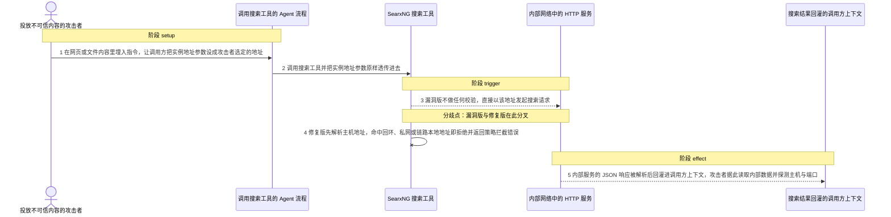
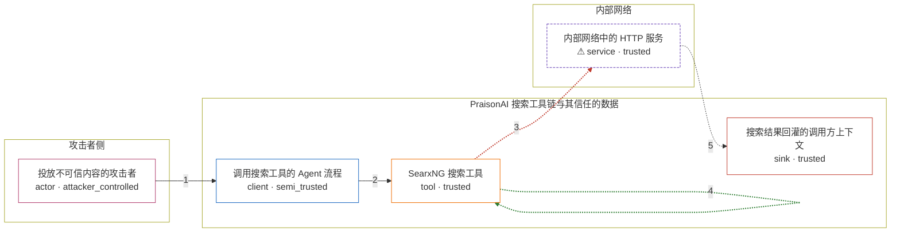

# praisonai / CVE-2026-57143

状态：草稿，未完成环境和复现。这个目录由模板生成，不构成漏洞确认。

图解的唯一来源是 `diagram.toml`：编辑后运行 `python3 -m runner diagram praisonai/CVE-2026-57143` 重新生成下方的图解区块。图解必须覆盖漏洞涉及的每个主体，并标出漏洞版/修复版的分歧步骤。

<!-- diagram:begin (generated from diagram.toml by `python3 -m runner diagram`; edit diagram.toml, not this block) -->
## 漏洞图解 — praisonai / CVE-2026-57143 漏洞图解

PraisonAI 的 SearxNG 搜索工具把调用方传入的实例地址原样交给 requests.get，发请求前既不校验 scheme 与主机，也不检查解析出的目标 IP 是否属于内网或链路本地地址。该参数可以经模型上下文里的不可信内容被设成任意地址，于是绕过了“只访问本地默认实例”这道信任边界，让服务器替攻击者发出请求。攻击者据此读取内部可返回 JSON 的接口，并借连接成败探测内网主机与端口。

### 涉及主体

| 主体 | 类型 | 信任级别 | 在漏洞里的作用 | 来源 |
| --- | --- | --- | --- | --- |
| 投放不可信内容的攻击者 (`attacker`) | `actor` | `attacker_controlled` | 在网页或文件内容里埋入指令，诱导调用方把搜索工具的实例地址参数设成自己选定的目标；攻击者只控制这一个参数，并不直接持有产品所在主机的内部网络访问权限。 | fixtures/attack.json |
| 调用搜索工具的 Agent 流程 (`search_caller`) | `client` | `semi_trusted` | 把从不可信内容里读到的实例地址原样透传给搜索工具，自身不做地址校验，是攻击者参数进入产品内部的通道。 | src/praisonai-agents/praisonaiagents/tools/web_search.py |
| SearxNG 搜索工具 (`searxng_tool`) | `tool` | `trusted` | 拼出搜索请求并把实例地址交给 requests.get；漏洞版在这次调用之前没有任何 scheme、主机或目标 IP 校验。 | src/praisonai-agents/praisonaiagents/tools/searxng_tools.py |
| ⚠ 内部网络中的 HTTP 服务 (`intranet_service`) | `service` | `trusted` | 监听非公开地址并返回 JSON，是攻击者本来够不着、希望通过服务器代发请求读取的目标。 | — |
| 搜索结果回灌的调用方上下文 (`agent_context`) | `sink` | `trusted` | 内部服务响应里的 results 字段被解析后写回调用方上下文，攻击者由此间接读到内部数据，并可依据请求成功或失败判断主机与端口是否存在。 | — |

**信任边界**

- **攻击者侧** (`attacker_side`)：成员 `attacker`。攻击者只控制进入工具调用的实例地址参数，不掌握产品主机的文件系统或网络权限。
- **PraisonAI 搜索工具链与其信任的数据** (`product`)：成员 `search_caller`、`searxng_tool`、`agent_context`。这里原本只允许把搜索请求发往调用方自己配置的本地实例，漏洞让同一个参数可以指向任意地址。
- **内部网络** (`intranet`)：成员 `intranet_service`。内部服务只对产品所在主机可见，攻击者无法直接访问，只能借服务器的请求触达。

标 ⚠ 的主体是本仓库合成的替身或无害效果载体，不代表真实外部目标。

### 触发过程

### 主体与信任边界

箭头上的数字是上面的步骤编号；方框只标主体和信任级别，具体动作见「触发过程」。

**分歧点**：第 3 步（`vulnerable_only`）漏洞版不做任何校验，直接以该地址发起搜索请求。
**分歧点**：第 4 步（`patched_only`）修复版先解析主机地址，命中回环、私网或链路本地地址即拒绝并返回策略拦截错误。
<!-- diagram:end -->

## 公告与机制

TODO：官方公告、漏洞根因、Agent 信任边界、受影响范围和修复来源。

## 前提

TODO：认证要求、用户交互、已有批准、工具权限、攻击者能控制的内容。

## 版本与启动

TODO：补全 metadata、Dockerfile/镜像 digest 和 Compose，再写出精确启动命令。

Compose 中 `vulnerable` 与 `patched` profiles 分开使用；未指定 profile 不启动服务。镜像变量未配置时 Compose 会明确报错。此模板不暴露宿主端口，也不挂载主机数据。

## 机制复现

TODO：实现 `reproduce.py`，固定输入并执行真实漏洞路径，注明运行位置、参数和超时。

完成实现后使用 `python3 -m runner reproduce praisonai/CVE-2026-57143 --build --rounds 3`。
两脚本统一接受 `--context <context.json> --output <目录>`，详细字段见仓库 `docs/environment-contract.md`。
PoC 输出 `facts.json` 和效果文件；验证器只读证据，输出含 `target_ready` 及对应效果断言的 `verdict.json`。
镜像必须包含 Python 3 和 `/lab/` 下的脚本、fixtures；`runtime.mode` 选择 `oneshot` 或有 healthcheck 的 `service`。

## 端到端复现

TODO：实现 `end_to_end.py`；若不需要模型，明确写出不适用原因。真实模型的结果与机制复现分开统计。

## 验证与修复对照

TODO：实现 `verify.py`。记录漏洞版无害效果、修复版阻断和正常任务成功的证据，不能把服务启动失败当成阻断。

## 清理

默认运行器按每个测试的唯一 Compose project 清理容器、网络和 volume。
`--keep-on-failure` 保留失败项目，项目标识和 Compose 配置在结果目录中；仅清理该项目，不能使用全局 prune。

## 失败诊断

TODO：为本漏洞写出预期效果缺失、修复版仍有越界效果、正常任务失败及前提不满足时的具体排查路径。
启动失败、健康检查失败和超时都不能当作修复阻断。报告中应能定位到阶段、预期、实际和受控证据。

## 构建与输入

TODO：填写两版源码 archive、完整 commit，记录 `build.inputs` 中每个下载的 SHA-256；依赖安装必须支持禁网构建。
固定攻击和正常输入放入 `fixtures/` 并登记到 `fixtures/manifest.toml`。固定 seed、环境变量，说明无害效果与真实影响的关系。

## 隔离例外

默认无例外。确需例外时同时填写 `runtime.exceptions`、理由及最小范围，晋升由两位维护者审阅。

## 来源与许可

TODO：列出引用代码、fixtures 和镜像的来源及许可。
