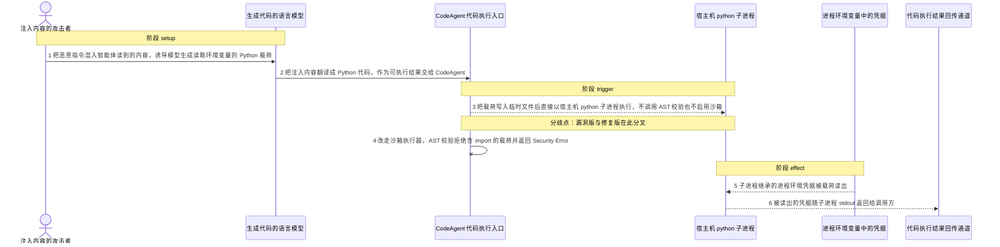
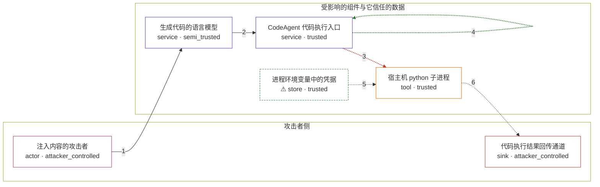

# praisonai / CVE-2026-61447

状态：草稿，未完成环境和复现。这个目录由模板生成，不构成漏洞确认。

图解的唯一来源是 `diagram.toml`：编辑后运行 `python3 -m runner diagram praisonai/CVE-2026-61447` 重新生成下方的图解区块。图解必须覆盖漏洞涉及的每个主体，并标出漏洞版/修复版的分歧步骤。

<!-- diagram:begin (generated from diagram.toml by `python3 -m runner diagram`; edit diagram.toml, not this block) -->
## 漏洞图解 — praisonai / CVE-2026-61447 漏洞图解

CodeAgent._execute_python() 把模型生成的 Python 代码当作可信代码：它把代码写入临时文件后直接以宿主机 python 子进程执行，既不调用同一发布里已有的 AST 校验器，也不启用沙箱，并把父进程的完整环境变量复制给子进程。可被 prompt injection 影响的模型输出因此越过“LLM 输出不可信”这道边界，获得任意代码执行能力。载荷读出的 API key、令牌等凭据随子进程 stdout 返回给调用方，也就是攻击者注入内容的同一侧。修复版改走沙箱执行器，先做 AST 校验并以空环境启动子进程，同一载荷被拒绝。

### 涉及主体

| 主体 | 类型 | 信任级别 | 在漏洞里的作用 | 来源 |
| --- | --- | --- | --- | --- |
| 注入内容的攻击者 (`attacker`) | `actor` | `attacker_controlled` | 构造混入智能体输入的指令内容，诱导模型生成读取进程环境变量并回显的 Python 载荷。 | — |
| 生成代码的语言模型 (`model`) | `service` | `semi_trusted` | 把注入内容翻译成 Python 源代码；它的输出被下游直接当作可执行代码，没有任何可信性检查。 | — |
| CodeAgent 代码执行入口 (`code_agent`) | `service` | `trusted` | 受影响组件：_execute_python() 把模型给出的代码写入临时文件后直接以子进程执行，既不调用 _validate_code_ast()，也不读取 CodeConfig.sandbox，因此 sandbox=True 形同虚设。 | — |
| 宿主机 python 子进程 (`python_subprocess`) | `tool` | `trusted` | 被启动的宿主机进程：继承父进程的完整环境变量，因此载荷可以 import os 并读取全部凭据。 | — |
| ⚠ 进程环境变量中的凭据 (`process_environment`) | `store` | `trusted` | 智能体进程的环境变量，存放 API key、数据库连接串等凭据，是攻击者够不着的目标；这里被读出的值是无害的合成标记，不是真实凭据。 | fixtures/synthetic_env.json |
| 代码执行结果回传通道 (`execution_output`) | `sink` | `attacker_controlled` | 子进程 stdout 与返回值：被读出的凭据随它回到调用方，攻击者从自己注入内容的同一条链路读到结果。 | — |

**信任边界**

- **攻击者侧** (`attacker_side`)：成员 `attacker`、`execution_output`。攻击者控制注入内容，也从同一条调用链路取回执行结果；它够不着的是运行环境的凭据本身。
- **受影响的组件与它信任的数据** (`product`)：成员 `model`、`code_agent`、`python_subprocess`、`process_environment`。模型输出本来必须经过校验才能进入执行路径，而这道边界在漏洞版里被完全跳过。

标 ⚠ 的主体是本仓库合成的替身或无害效果载体，不代表真实外部目标。

### 触发过程

### 主体与信任边界

箭头上的数字是上面的步骤编号；方框只标主体和信任级别，具体动作见「触发过程」。

**分歧点**：第 3 步（`vulnerable_only`）把载荷写入临时文件后直接以宿主机 python 子进程执行，不调用 AST 校验也不启用沙箱。
**分歧点**：第 4 步（`patched_only`）改走沙箱执行器，AST 校验拒绝含 import 的载荷并返回 Security Error。
<!-- diagram:end -->

## 公告与机制

TODO：官方公告、漏洞根因、Agent 信任边界、受影响范围和修复来源。

## 前提

TODO：认证要求、用户交互、已有批准、工具权限、攻击者能控制的内容。

## 版本与启动

TODO：补全 metadata、Dockerfile/镜像 digest 和 Compose，再写出精确启动命令。

Compose 中 `vulnerable` 与 `patched` profiles 分开使用；未指定 profile 不启动服务。镜像变量未配置时 Compose 会明确报错。此模板不暴露宿主端口，也不挂载主机数据。

## 机制复现

TODO：实现 `reproduce.py`，固定输入并执行真实漏洞路径，注明运行位置、参数和超时。

完成实现后使用 `python3 -m runner reproduce praisonai/CVE-2026-61447 --build --rounds 3`。
两脚本统一接受 `--context <context.json> --output <目录>`，详细字段见仓库 `docs/environment-contract.md`。
PoC 输出 `facts.json` 和效果文件；验证器只读证据，输出含 `target_ready` 及对应效果断言的 `verdict.json`。
镜像必须包含 Python 3 和 `/lab/` 下的脚本、fixtures；`runtime.mode` 选择 `oneshot` 或有 healthcheck 的 `service`。

## 端到端复现

TODO：实现 `end_to_end.py`；若不需要模型，明确写出不适用原因。真实模型的结果与机制复现分开统计。

## 验证与修复对照

TODO：实现 `verify.py`。记录漏洞版无害效果、修复版阻断和正常任务成功的证据，不能把服务启动失败当成阻断。

## 清理

默认运行器按每个测试的唯一 Compose project 清理容器、网络和 volume。
`--keep-on-failure` 保留失败项目，项目标识和 Compose 配置在结果目录中；仅清理该项目，不能使用全局 prune。

## 失败诊断

TODO：为本漏洞写出预期效果缺失、修复版仍有越界效果、正常任务失败及前提不满足时的具体排查路径。
启动失败、健康检查失败和超时都不能当作修复阻断。报告中应能定位到阶段、预期、实际和受控证据。

## 构建与输入

TODO：填写两版源码 archive、完整 commit，记录 `build.inputs` 中每个下载的 SHA-256；依赖安装必须支持禁网构建。
固定攻击和正常输入放入 `fixtures/` 并登记到 `fixtures/manifest.toml`。固定 seed、环境变量，说明无害效果与真实影响的关系。

## 隔离例外

默认无例外。确需例外时同时填写 `runtime.exceptions`、理由及最小范围，晋升由两位维护者审阅。

## 来源与许可

TODO：列出引用代码、fixtures 和镜像的来源及许可。
