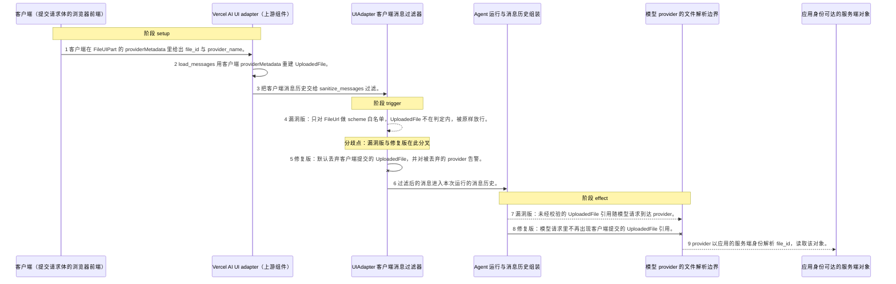
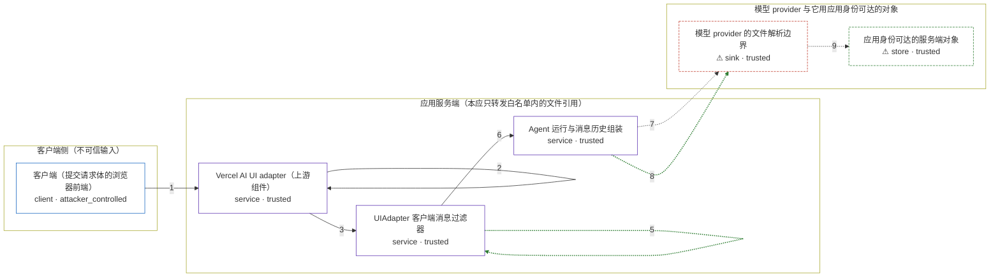

# pydantic-ai / CVE-2026-54249

状态：草稿，未完成环境和复现。这个目录由模板生成，不构成漏洞确认。

图解的唯一来源是 `diagram.toml`：编辑后运行 `python3 -m runner diagram pydantic-ai/CVE-2026-54249` 重新生成下方的图解区块。图解必须覆盖漏洞涉及的每个主体，并标出漏洞版/修复版的分歧步骤。

<!-- diagram:begin (generated from diagram.toml by `python3 -m runner diagram`; edit diagram.toml, not this block) -->
## 漏洞图解 — pydantic-ai / CVE-2026-54249 漏洞图解

Pydantic AI 的 UI adapter 把客户端提交的消息历史转成模型消息时，只对 FileUrl 做了 scheme 白名单过滤，遗漏了同样是「用服务端凭据取文件」语义的 UploadedFile。Vercel AI adapter 会从客户端完全可控的 providerMetadata 里的 file_id 与 provider_name 直接重建 UploadedFile，而基类 sanitize_messages 没有对应分支，于是这个引用被原样放行，随消息历史进入交给模型 provider 的请求。provider 随后用应用配置的 IAM role、service account 或 API key 解析该 file_id（例如 s3://、gs://），攻击者便能借服务端身份读取自己本来够不着的对象。1.106.0 起默认丢弃客户端提交的 UploadedFile 并告警，只有显式 preserve_file_data=True 才会保留。

### 涉及主体

| 主体 | 类型 | 信任级别 | 在漏洞里的作用 | 来源 |
| --- | --- | --- | --- | --- |
| 客户端（提交请求体的浏览器前端） (`client`) | `client` | `attacker_controlled` | 攻击者侧。它完全控制提交的请求体：FileUIPart 的 url、mediaType，以及 providerMetadata.pydantic_ai.file_id 与 provider_name。这两个字段就是它塞进去的越权文件引用，它自己无法读取该对象。 | fixtures/attack_vercel_request.json |
| Vercel AI UI adapter（上游组件） (`vercel_adapter`) | `service` | `trusted` | 客户端输入的入口。load_messages 对 FileUIPart 先尝试 data URI 解析，失败后读取客户端 providerMetadata，file_id 与 provider_name 齐备时直接构造 UploadedFile(file_id='s3://…', provider_name='bedrock')。 | pydantic_ai_slim/pydantic_ai/ui/vercel_ai/_adapter.py |
| UIAdapter 客户端消息过滤器 (`sanitizer`) | `service` | `trusted` | 漏洞所在的上游组件。sanitize_messages 是客户端消息进入 agent 前唯一的过滤点：1.105.0 的 _filter_user_content 与 _sanitize_tool_return_content 只有 isinstance(item, FileUrl) 分支，其它类型一律放行；1.106.0 新增 preserve_file_data 默认值与 UploadedFile 分支，默认丢弃并告警。 | pydantic_ai_slim/pydantic_ai/ui/_adapter.py |
| Agent 运行与消息历史组装 (`agent`) | `service` | `trusted` | 过滤后的消息被追加进本次运行的消息历史，再由 agent 转成对模型 provider 的请求。它不重新判断文件引用是否可信，只负责转发。 | — |
| ⚠ 模型 provider 的文件解析边界 (`provider`) | `sink` | `trusted` | 漏洞效果的落点。provider 收到消息后，会用应用配置的服务端身份（IAM role、service account 或 provider API key）解析 UploadedFile 的 file_id 并取回对象；真实取文件发生在 provider 侧，本次机制复现只观察到该引用抵达这一边界。 | — |
| ⚠ 应用身份可达的服务端对象 (`server_object`) | `store` | `trusted` | 攻击者想要却拿不到的对象：应用云账号或 provider 账号里的文件（例如 s3://agent-vulhub-canary/private/payroll.pdf）。只有 provider 用应用的服务端身份解析引用时它才会被读取。图中用的是示例标识，不代表某个真实外部目标。 | — |

**信任边界**

- **客户端侧（不可信输入）** (`client_side`)：成员 `client`。客户端能完全控制请求体内容，包括 providerMetadata 里的 file_id 与 provider_name。它读不到下面那个服务端对象——读得到就不必绕这一圈。
- **应用服务端（本应只转发白名单内的文件引用）** (`server_side`)：成员 `vercel_adapter`、`sanitizer`、`agent`。客户端消息只有经过 sanitize_messages 才能进入 agent。这道检查本应像拦非 HTTP 的 FileUrl 一样拦住 UploadedFile，但漏洞版没有 UploadedFile 这个概念。
- **模型 provider 与它用应用身份可达的对象** (`provider_side`)：成员 `provider`、`server_object`。provider 用应用的身份解析 file_id，因此客户端给出的引用等价于让服务端替它取文件。修复版在进入 agent 前就把客户端 UploadedFile 丢掉，provider 再也看不到该引用。

标 ⚠ 的主体是本仓库合成的替身或无害效果载体，不代表真实外部目标。

### 触发过程

### 主体与信任边界

箭头上的数字是上面的步骤编号；方框只标主体和信任级别，具体动作见「触发过程」。

**分歧点**：第 4 步（`vulnerable_only`）漏洞版：只对 FileUrl 做 scheme 白名单，UploadedFile 不在判定内，被原样放行。。
**分歧点**：第 5 步（`patched_only`）修复版：默认丢弃客户端提交的 UploadedFile，并对被丢弃的 provider 告警。。
<!-- diagram:end -->

## 公告与机制

TODO：官方公告、漏洞根因、Agent 信任边界、受影响范围和修复来源。

## 前提

TODO：认证要求、用户交互、已有批准、工具权限、攻击者能控制的内容。

## 版本与启动

TODO：补全 metadata、Dockerfile/镜像 digest 和 Compose，再写出精确启动命令。

Compose 中 `vulnerable` 与 `patched` profiles 分开使用；未指定 profile 不启动服务。镜像变量未配置时 Compose 会明确报错。此模板不暴露宿主端口，也不挂载主机数据。

## 机制复现

TODO：实现 `reproduce.py`，固定输入并执行真实漏洞路径，注明运行位置、参数和超时。

完成实现后使用 `python3 -m runner reproduce pydantic-ai/CVE-2026-54249 --build --rounds 3`。
两脚本统一接受 `--context <context.json> --output <目录>`，详细字段见仓库 `docs/environment-contract.md`。
PoC 输出 `facts.json` 和效果文件；验证器只读证据，输出含 `target_ready` 及对应效果断言的 `verdict.json`。
镜像必须包含 Python 3 和 `/lab/` 下的脚本、fixtures；`runtime.mode` 选择 `oneshot` 或有 healthcheck 的 `service`。

## 端到端复现

TODO：实现 `end_to_end.py`；若不需要模型，明确写出不适用原因。真实模型的结果与机制复现分开统计。

## 验证与修复对照

TODO：实现 `verify.py`。记录漏洞版无害效果、修复版阻断和正常任务成功的证据，不能把服务启动失败当成阻断。

## 清理

默认运行器按每个测试的唯一 Compose project 清理容器、网络和 volume。
`--keep-on-failure` 保留失败项目，项目标识和 Compose 配置在结果目录中；仅清理该项目，不能使用全局 prune。

## 失败诊断

TODO：为本漏洞写出预期效果缺失、修复版仍有越界效果、正常任务失败及前提不满足时的具体排查路径。
启动失败、健康检查失败和超时都不能当作修复阻断。报告中应能定位到阶段、预期、实际和受控证据。

## 构建与输入

TODO：填写两版源码 archive、完整 commit，记录 `build.inputs` 中每个下载的 SHA-256；依赖安装必须支持禁网构建。
固定攻击和正常输入放入 `fixtures/` 并登记到 `fixtures/manifest.toml`。固定 seed、环境变量，说明无害效果与真实影响的关系。

## 隔离例外

默认无例外。确需例外时同时填写 `runtime.exceptions`、理由及最小范围，晋升由两位维护者审阅。

## 来源与许可

TODO：列出引用代码、fixtures 和镜像的来源及许可。
