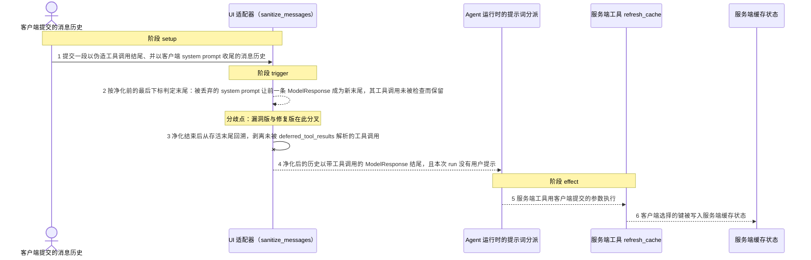
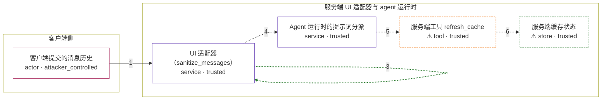

# pydantic-ai / CVE-2026-65975

状态：草稿，未完成环境和复现。这个目录由模板生成，不构成漏洞确认。

图解的唯一来源是 `diagram.toml`：编辑后运行 `python3 -m runner diagram pydantic-ai/CVE-2026-65975` 重新生成下方的图解区块。图解必须覆盖漏洞涉及的每个主体，并标出漏洞版/修复版的分歧步骤。

<!-- diagram:begin (generated from diagram.toml by `python3 -m runner diagram`; edit diagram.toml, not this block) -->
## 漏洞图解 — pydantic-ai / CVE-2026-65975 漏洞图解

UI 适配器把客户端提交的整段消息历史当作不可信输入，用 sanitize_messages 剥离历史末尾未解析的 ToolCallPart。该判定锚定在净化之前的最后一个下标上；当末尾的客户端 system prompt 在 manage_system_prompt='server' 下被剥离成空而整条丢弃后，前一条 ModelResponse 成为净化后历史的新末尾，它的工具调用从未被检查。于是净化后的历史以带工具调用的 ModelResponse 结尾，无 user_prompt 的 agent run 直接跳到 CallToolsNode，一个已注册且无需审批的服务端工具便用客户端提供的参数执行。

### 涉及主体

| 主体 | 类型 | 信任级别 | 在漏洞里的作用 | 来源 |
| --- | --- | --- | --- | --- |
| 客户端提交的消息历史 (`client`) | `actor` | `attacker_controlled` | 客户端完全控制这段历史：它伪造一条带 ToolCallPart 的 ModelResponse，并在末尾追加一条只含 SystemPromptPart 的 ModelRequest，用来制造净化后尾部的位移。 | fixtures/attack_history.json |
| UI 适配器（sanitize_messages） (`ui_adapter`) | `service` | `trusted` | 在把客户端历史交给 agent 之前剥离末尾悬空的工具调用。它按净化前的最后下标判断末尾，锚点被那条净化成空的尾消息绕过。 | — |
| Agent 运行时的提示词分派 (`agent_graph`) | `service` | `trusted` | 当历史以带工具调用的 ModelResponse 结尾、且本次 run 没有用户提示时直接进入 CallToolsNode，跳过模型回合以及挂在模型回合上的门禁钩子。 | — |
| ⚠ 服务端工具 refresh_cache (`server_tool`) | `tool` | `trusted` | 已注册、无需审批的服务端工具。它按客户端提交的工具调用参数执行，调用参数来自客户端历史而不是模型。 | — |
| ⚠ 服务端缓存状态 (`cache_state`) | `store` | `trusted` | 被刷新的服务端缓存条目，键取自客户端提交的工具调用参数；攻击者够不着这份状态，只能借越界的工具调用来改它。 | — |

**信任边界**

- **客户端侧** (`client_side`)：成员 `client`。客户端能提交任意消息历史，但控制不了服务端注册了哪些工具，也拿不到服务端缓存本身；它只能通过历史里的工具调用来影响工具参数。
- **服务端 UI 适配器与 agent 运行时** (`server_side`)：成员 `ui_adapter`、`agent_graph`、`server_tool`、`cache_state`。这道边界假设末尾的工具调用只可能由服务端模型产生。sanitize_messages 的锚点错误让被丢弃的尾消息把客户端伪造的调用重新暴露为净化后的末尾，边界因此失效。

标 ⚠ 的主体是本仓库合成的替身或无害效果载体，不代表真实外部目标。

### 触发过程

### 主体与信任边界

箭头上的数字是上面的步骤编号；方框只标主体和信任级别，具体动作见「触发过程」。

**分歧点**：第 2 步（`vulnerable_only`）按净化前的最后下标判定末尾：被丢弃的 system prompt 让前一条 ModelResponse 成为新末尾，其工具调用未被检查而保留。
**分歧点**：第 3 步（`patched_only`）净化结束后从存活末尾回溯，剥离未被 deferred_tool_results 解析的工具调用。
<!-- diagram:end -->

## 公告与机制

TODO：官方公告、漏洞根因、Agent 信任边界、受影响范围和修复来源。

## 前提

TODO：认证要求、用户交互、已有批准、工具权限、攻击者能控制的内容。

## 版本与启动

TODO：补全 metadata、Dockerfile/镜像 digest 和 Compose，再写出精确启动命令。

Compose 中 `vulnerable` 与 `patched` profiles 分开使用；未指定 profile 不启动服务。镜像变量未配置时 Compose 会明确报错。此模板不暴露宿主端口，也不挂载主机数据。

## 机制复现

TODO：实现 `reproduce.py`，固定输入并执行真实漏洞路径，注明运行位置、参数和超时。

完成实现后使用 `python3 -m runner reproduce pydantic-ai/CVE-2026-65975 --build --rounds 3`。
两脚本统一接受 `--context <context.json> --output <目录>`，详细字段见仓库 `docs/environment-contract.md`。
PoC 输出 `facts.json` 和效果文件；验证器只读证据，输出含 `target_ready` 及对应效果断言的 `verdict.json`。
镜像必须包含 Python 3 和 `/lab/` 下的脚本、fixtures；`runtime.mode` 选择 `oneshot` 或有 healthcheck 的 `service`。

## 端到端复现

TODO：实现 `end_to_end.py`；若不需要模型，明确写出不适用原因。真实模型的结果与机制复现分开统计。

## 验证与修复对照

TODO：实现 `verify.py`。记录漏洞版无害效果、修复版阻断和正常任务成功的证据，不能把服务启动失败当成阻断。

## 清理

默认运行器按每个测试的唯一 Compose project 清理容器、网络和 volume。
`--keep-on-failure` 保留失败项目，项目标识和 Compose 配置在结果目录中；仅清理该项目，不能使用全局 prune。

## 失败诊断

TODO：为本漏洞写出预期效果缺失、修复版仍有越界效果、正常任务失败及前提不满足时的具体排查路径。
启动失败、健康检查失败和超时都不能当作修复阻断。报告中应能定位到阶段、预期、实际和受控证据。

## 构建与输入

TODO：填写两版源码 archive、完整 commit，记录 `build.inputs` 中每个下载的 SHA-256；依赖安装必须支持禁网构建。
固定攻击和正常输入放入 `fixtures/` 并登记到 `fixtures/manifest.toml`。固定 seed、环境变量，说明无害效果与真实影响的关系。

## 隔离例外

默认无例外。确需例外时同时填写 `runtime.exceptions`、理由及最小范围，晋升由两位维护者审阅。

## 来源与许可

TODO：列出引用代码、fixtures 和镜像的来源及许可。
