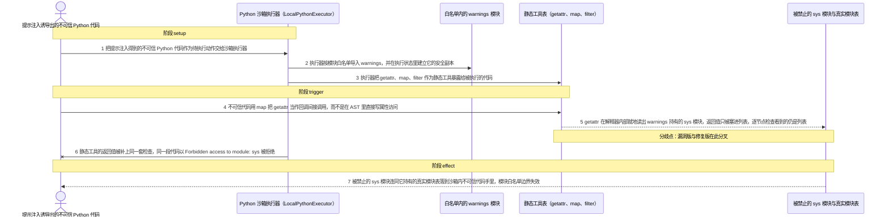
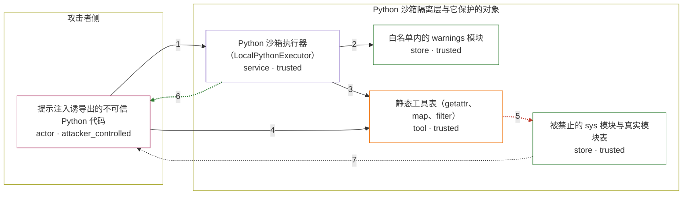

# python-sandbox-escape-leading-to-remote-code-exe / CVE-2025-5120

状态：草稿，未完成环境和复现。这个目录由模板生成，不构成漏洞确认。

图解的唯一来源是 `diagram.toml`：编辑后运行 `python3 -m runner diagram python-sandbox-escape-leading-to-remote-code-exe/CVE-2025-5120` 重新生成下方的图解区块。图解必须覆盖漏洞涉及的每个主体，并标出漏洞版/修复版的分歧步骤。

<!-- diagram:begin (generated from diagram.toml by `python3 -m runner diagram`; edit diagram.toml, not this block) -->
## 漏洞图解 — smolagents 本地 Python 沙箱的间接属性访问逃逸

smolagents 的 LocalPythonExecutor 只在每个 AST 节点的求值结果上做安全检查，却不检查静态工具被间接调用时的返回值。不可信代码因此把白名单里的 getattr 交给 map 当回调，让 CPython 在内部就地取出被禁止的 sys 模块并只把列表交回求值器，模块白名单这道唯一隔离层随之失效。修复版给静态工具的返回值补上同一套检查，同一段代码会被以 Forbidden access to module: sys 拒绝。

### 涉及主体

| 主体 | 类型 | 信任级别 | 在漏洞里的作用 | 来源 |
| --- | --- | --- | --- | --- |
| 提示注入诱导出的不可信 Python 代码 (`attacker`) | `actor` | `attacker_controlled` | 攻击者唯一能控制的东西：一段被当作待执行动作交给沙箱的代码文本。它不能直接读写宿主文件，只能使用执行器暴露出来的名字和工具。 | fixtures/attack.json |
| Python 沙箱执行器（LocalPythonExecutor） (`executor`) | `service` | `trusted` | 受影响的上游组件。它按模块白名单导入、按名字解析静态工具，并用 safer_eval 检查每个 AST 节点的直接求值结果；缺陷在于检查不覆盖静态工具被间接调用时的返回值。 | src/smolagents/local_python_executor.py |
| 白名单内的 warnings 模块 (`warnings_module`) | `store` | `trusted` | 被授权导入的普通模块，但它的命名空间里保存着指向被禁止的 sys 模块的引用，因此成为从白名单内部够到隔离层之外的跳板。 | — |
| 静态工具表（getattr、map、filter） (`static_tools`) | `tool` | `trusted` | 执行器暴露给沙箱代码的内置函数表。getattr 被换成禁止 dunder 的版本，但它仍能读出任意非 dunder 属性；map、filter 会以 C 层循环调用传进来的回调。 | src/smolagents/local_python_executor.py |
| 被禁止的 sys 模块与真实模块表 (`host_sys`) | `store` | `trusted` | 隔离层之外的宿主解释器运行时对象：sys 模块本身以及它持有的真实模块表。沙箱代码本不该接触到它，一旦拿到就可以继续触达已加载的任意模块。 | — |

**信任边界**

- **攻击者侧** (`attacker_side`)：成员 `attacker`。这里只有一段不可信代码文本。它不能直接调用宿主 API，只能通过沙箱执行器允许的名字和工具间接发挥作用。
- **Python 沙箱隔离层与它保护的对象** (`sandbox`)：成员 `executor`、`warnings_module`、`static_tools`、`host_sys`。执行器是唯一隔离层：它用模块白名单、dunder 属性和危险函数检查把不可信代码挡在宿主解释器之外。漏洞在于这些检查只看 AST 节点的直接返回值，而间接调用产生的对象被就地消费、只以容器元素的形式出现。

### 触发过程

### 主体与信任边界

箭头上的数字是上面的步骤编号；方框只标主体和信任级别，具体动作见「触发过程」。

**分歧点**：第 5 步（`vulnerable_only`）getattr 在解释器内部就地读出 warnings 持有的 sys 模块，返回值只被塞进列表，逐节点检查看到的仍是列表。
**分歧点**：第 6 步（`patched_only`）静态工具的返回值被补上同一套检查，同一段代码以 Forbidden access to module: sys 被拒绝。
<!-- diagram:end -->

## 公告与机制

TODO：官方公告、漏洞根因、Agent 信任边界、受影响范围和修复来源。

## 前提

TODO：认证要求、用户交互、已有批准、工具权限、攻击者能控制的内容。

## 版本与启动

TODO：补全 metadata、Dockerfile/镜像 digest 和 Compose，再写出精确启动命令。

Compose 中 `vulnerable` 与 `patched` profiles 分开使用；未指定 profile 不启动服务。镜像变量未配置时 Compose 会明确报错。此模板不暴露宿主端口，也不挂载主机数据。

## 机制复现

TODO：实现 `reproduce.py`，固定输入并执行真实漏洞路径，注明运行位置、参数和超时。

完成实现后使用 `python3 -m runner reproduce python-sandbox-escape-leading-to-remote-code-exe/CVE-2025-5120 --build --rounds 3`。
两脚本统一接受 `--context <context.json> --output <目录>`，详细字段见仓库 `docs/environment-contract.md`。
PoC 输出 `facts.json` 和效果文件；验证器只读证据，输出含 `target_ready` 及对应效果断言的 `verdict.json`。
镜像必须包含 Python 3 和 `/lab/` 下的脚本、fixtures；`runtime.mode` 选择 `oneshot` 或有 healthcheck 的 `service`。

## 端到端复现

TODO：实现 `end_to_end.py`；若不需要模型，明确写出不适用原因。真实模型的结果与机制复现分开统计。

## 验证与修复对照

TODO：实现 `verify.py`。记录漏洞版无害效果、修复版阻断和正常任务成功的证据，不能把服务启动失败当成阻断。

## 清理

默认运行器按每个测试的唯一 Compose project 清理容器、网络和 volume。
`--keep-on-failure` 保留失败项目，项目标识和 Compose 配置在结果目录中；仅清理该项目，不能使用全局 prune。

## 失败诊断

TODO：为本漏洞写出预期效果缺失、修复版仍有越界效果、正常任务失败及前提不满足时的具体排查路径。
启动失败、健康检查失败和超时都不能当作修复阻断。报告中应能定位到阶段、预期、实际和受控证据。

## 构建与输入

TODO：填写两版源码 archive、完整 commit，记录 `build.inputs` 中每个下载的 SHA-256；依赖安装必须支持禁网构建。
固定攻击和正常输入放入 `fixtures/` 并登记到 `fixtures/manifest.toml`。固定 seed、环境变量，说明无害效果与真实影响的关系。

## 隔离例外

默认无例外。确需例外时同时填写 `runtime.exceptions`、理由及最小范围，晋升由两位维护者审阅。

## 来源与许可

TODO：列出引用代码、fixtures 和镜像的来源及许可。
